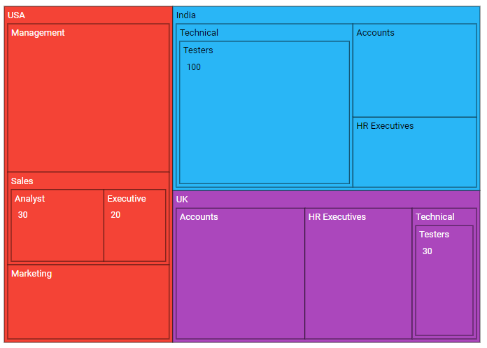
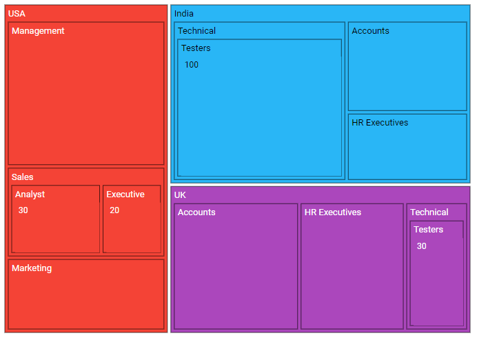
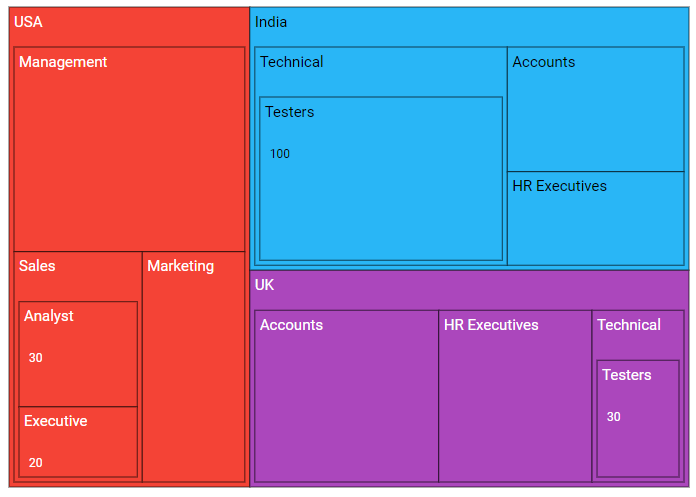
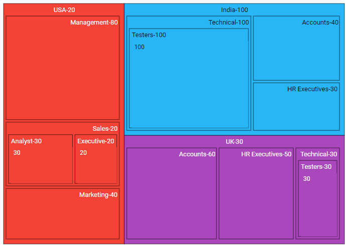

# Levels in Blazor TreeMap Component

TreeMap supports multiple hierarchical levels. Each level is defined using the [GroupPath](https://help.syncfusion.com/cr/blazor/Syncfusion.Blazor.TreeMap.TreeMapLevel.html#Syncfusion_Blazor_TreeMap_TreeMapLevel_GroupPath) property.

## Group path

Use the [GroupPath](https://help.syncfusion.com/cr/blazor/Syncfusion.Blazor.TreeMap.TreeMapLevel.html#Syncfusion_Blazor_TreeMap_TreeMapLevel_GroupPath) property to define each TreeMap level by specifying a field from the data source.

In the following example, three levels are configured using the [GroupPath](https://help.syncfusion.com/cr/blazor/Syncfusion.Blazor.TreeMap.TreeMapLevel.html#Syncfusion_Blazor_TreeMap_TreeMapLevel_GroupPath) property.

```cshtml

@using Syncfusion.Blazor.TreeMap

<SfTreeMap WeightValuePath="EmployeeCount" TValue="Employee" DataSource="Employees" Palette='new string[] {"#f44336", "#29b6f6", "#ab47bc", "#ffc107", "#5c6bc0", "#009688"}'>
    <TreeMapLevels>
        <TreeMapLevel GroupPath="Country">
            <TreeMapLevelBorder Color="black" Width="0.5">
            </TreeMapLevelBorder>
        </TreeMapLevel>
        <TreeMapLevel GroupPath="JobDescription">
            <TreeMapLevelBorder Color="black" Width="0.5">
            </TreeMapLevelBorder>
        </TreeMapLevel>
        <TreeMapLevel GroupPath="JobGroup">
            <TreeMapLevelBorder Color="black" Width="0.5">
            </TreeMapLevelBorder>
        </TreeMapLevel>
    </TreeMapLevels>
</SfTreeMap>

@code {
    public class Employee
    {
        public string Country { get; set; }
        public string JobDescription { get; set; }
        public string JobGroup { get; set; }
        public int EmployeeCount { get; set; }
    };

    public List<Employee> Employees = new List<Employee> {
        new Employee { Country = "USA", JobDescription = "Sales", JobGroup = "Executive", EmployeeCount = 20 },
        new Employee { Country = "USA", JobDescription = "Sales", JobGroup = "Analyst", EmployeeCount = 30 },
        new Employee { Country = "USA", JobDescription = "Marketing", EmployeeCount = 40 },
        new Employee { Country = "USA", JobDescription = "Management", EmployeeCount = 80 },
        new Employee { Country = "India", JobDescription = "Technical", JobGroup = "Testers", EmployeeCount = 100 },
        new Employee { Country = "India", JobDescription = "HR Executives", EmployeeCount = 30 },
        new Employee { Country = "India", JobDescription = "Accounts", EmployeeCount = 40 },
        new Employee { Country = "UK", JobDescription = "Technical", JobGroup = "Testers", EmployeeCount = 30 },
        new Employee { Country = "UK", JobDescription = "HR Executives", EmployeeCount = 50 },
        new Employee { Country = "UK", JobDescription = "Accounts", EmployeeCount = 60 }
    };
}

```



## Gap between groups

The [GroupGap](https://help.syncfusion.com/cr/blazor/Syncfusion.Blazor.TreeMap.TreeMapLevel.html#Syncfusion_Blazor_TreeMap_TreeMapLevel_GroupGap) property adds spacing between groups or items to visually distinguish TreeMap levels.

```cshtml

@using Syncfusion.Blazor.TreeMap

<SfTreeMap WeightValuePath="EmployeeCount" TValue="Employee" DataSource="Employees" Palette='new string[] {"#f44336", "#29b6f6", "#ab47bc", "#ffc107", "#5c6bc0", "#009688"}'>
    <TreeMapLevels>
        <TreeMapLevel GroupPath="Country" GroupGap="10">
            <TreeMapLevelBorder Color="black" Width="0.5">
            </TreeMapLevelBorder>
        </TreeMapLevel>
        <TreeMapLevel GroupPath="JobDescription" GroupGap="10">
            <TreeMapLevelBorder Color="black" Width="0.5">
            </TreeMapLevelBorder>
        </TreeMapLevel>
        <TreeMapLevel GroupPath="JobGroup" GroupGap="10">
            <TreeMapLevelBorder Color="black" Width="0.5">
            </TreeMapLevelBorder>
        </TreeMapLevel>
    </TreeMapLevels>
</SfTreeMap>

```

N> For the **Employees** data model and sample values, see the [code block](#group-path) in the Group path section.



## Header height and style

Customize header font color, family, weight, opacity, and size using [TreeMapHeaderStyle](https://help.syncfusion.com/cr/blazor/Syncfusion.Blazor.TreeMap.TreeMapHeaderStyle.html). Adjust header height using the [HeaderHeight](https://help.syncfusion.com/cr/blazor/Syncfusion.Blazor.TreeMap.TreeMapLevel.html#Syncfusion_Blazor_TreeMap_TreeMapLevel_HeaderHeight) property in [TreeMapLevel](https://help.syncfusion.com/cr/blazor/Syncfusion.Blazor.TreeMap.TreeMapLevel.html).

```cshtml

@using Syncfusion.Blazor.TreeMap

<SfTreeMap WeightValuePath="EmployeeCount" TValue="Employee" DataSource="Employees" Palette='new string[] {"#f44336", "#29b6f6", "#ab47bc", "#ffc107", "#5c6bc0", "#009688"}'>
    <TreeMapLevels>
        <TreeMapLevel GroupPath="Country" HeaderHeight="35">
            <TreeMapHeaderStyle Size="15px"></TreeMapHeaderStyle>
            <TreeMapLevelBorder Color="black" Width="0.5">
            </TreeMapLevelBorder>
        </TreeMapLevel>
        <TreeMapLevel GroupPath="JobDescription" HeaderHeight="45">
            <TreeMapHeaderStyle Size="15px"></TreeMapHeaderStyle>
            <TreeMapLevelBorder Color="black" Width="0.5">
            </TreeMapLevelBorder>
        </TreeMapLevel>
        <TreeMapLevel GroupPath="JobGroup" HeaderHeight="40">
            <TreeMapHeaderStyle Size="15px"></TreeMapHeaderStyle>
            <TreeMapLevelBorder Color="black" Width="0.5">
            </TreeMapLevelBorder>
        </TreeMapLevel>
    </TreeMapLevels>
</SfTreeMap>

```

N> For the **Employees** data model and sample values, see the [code block](#group-path) in the Group path section.



## Customization

The following properties are available to customize header content in [TreeMapLevel](https://help.syncfusion.com/cr/blazor/Syncfusion.Blazor.TreeMap.TreeMapLevel.html).

* [HeaderFormat](https://help.syncfusion.com/cr/blazor/Syncfusion.Blazor.TreeMap.TreeMapLevel.html#Syncfusion_Blazor_TreeMap_TreeMapLevel_HeaderFormat) - Represents the header text using values from the data source.
* [ShowHeader](https://help.syncfusion.com/cr/blazor/Syncfusion.Blazor.TreeMap.TreeMapLevel.html#Syncfusion_Blazor_TreeMap_TreeMapLevel_ShowHeader) - Specifies the visibility of the header.
* [HeaderTemplate](https://help.syncfusion.com/cr/blazor/Syncfusion.Blazor.TreeMap.TreeMapLevel.html#Syncfusion_Blazor_TreeMap_TreeMapLevel_HeaderTemplate) - Defines the header template; the template position is customized using [TemplatePosition](https://help.syncfusion.com/cr/blazor/Syncfusion.Blazor.TreeMap.TreeMapLevel.html#Syncfusion_Blazor_TreeMap_TreeMapLevel_TemplatePosition).
* [TreeMapLevelBorder](https://help.syncfusion.com/cr/blazor/Syncfusion.Blazor.TreeMap.TreeMapLevelBorder.html) - Configures the TreeMap level border color and width.
* [HeaderAlignment](https://help.syncfusion.com/cr/blazor/Syncfusion.Blazor.TreeMap.TreeMapLevel.html#Syncfusion_Blazor_TreeMap_TreeMapLevel_HeaderAlignment) - Aligns the header to [Near](https://help.syncfusion.com/cr/blazor/Syncfusion.Blazor.TreeMap.Alignment.html#Syncfusion_Blazor_TreeMap_Alignment_Near), [Center](https://help.syncfusion.com/cr/blazor/Syncfusion.Blazor.TreeMap.Alignment.html#Syncfusion_Blazor_TreeMap_Alignment_Center), or [Far](https://help.syncfusion.com/cr/blazor/Syncfusion.Blazor.TreeMap.Alignment.html#Syncfusion_Blazor_TreeMap_Alignment_Far).

```cshtml

@using Syncfusion.Blazor.TreeMap

<SfTreeMap WeightValuePath="EmployeeCount" TValue="Employee" DataSource="Employees" Palette='new string[] {"#f44336", "#29b6f6", "#ab47bc", "#ffc107", "#5c6bc0", "#009688"}'>
    <TreeMapLevels>
        <TreeMapLevel GroupPath="Country" HeaderFormat="${Country}-${EmployeeCount}" HeaderAlignment="Alignment.Center">
            <TreeMapLevelBorder Color="black" Width="0.5">
            </TreeMapLevelBorder>
        </TreeMapLevel>
        <TreeMapLevel GroupPath="JobDescription" GroupGap="10" HeaderFormat="${JobDescription}-${EmployeeCount}" HeaderAlignment="Alignment.Far">
            <TreeMapLevelBorder Color="black" Width="0.5">
            </TreeMapLevelBorder>
        </TreeMapLevel>
        <TreeMapLevel GroupPath="JobGroup" GroupGap="10" HeaderFormat="${JobGroup}-${EmployeeCount}" HeaderAlignment="Alignment.Near">
            <TreeMapLevelBorder Color="black" Width="0.5">
            </TreeMapLevelBorder>
        </TreeMapLevel>
    </TreeMapLevels>
</SfTreeMap>

```

N> For the **Employees** data model and sample values, see the [code block](#group-path) in the Group path section.


