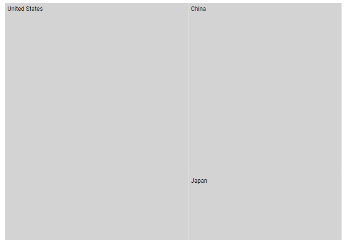

# Print and Export in Blazor TreeMap Component

## Print

Use the `PrintAsync` method to print a rendered TreeMap directly from the browser. Enable printing by setting the [AllowPrint](https://help.syncfusion.com/cr/blazor/Syncfusion.Blazor.TreeMap.SfTreeMap-1.html#Syncfusion_Blazor_TreeMap_SfTreeMap_1_AllowPrint) property to **true**.

```cshtml

@using Syncfusion.Blazor.TreeMap;

<button @onclick="PrintMap">Print Treemap</button>
<SfTreeMap @ref="Treemap" DataSource="@GrowthReport" WeightValuePath="GDP" TValue="Country" AllowPrint="true">
    <TreeMapLeafItemSettings LabelPath="Name" Fill="lightgray">
    </TreeMapLeafItemSettings>
</SfTreeMap>

@code {
    public SfTreeMap<Country> Treemap { get; set; }

    public async Task PrintMap()
    {
        await Treemap.PrintAsync();
    }

    public class Country
    {
        public string Name { get; set; }
        public double GDP { get; set; }
    }

    public List<Country> GrowthReport = new List<Country> {
        new Country  {Name="United States", GDP=17946 },
        new Country  {Name="China", GDP=10866 },
        new Country  {Name="Japan", GDP=4123 },
    };
}

```



## Export

### Image Export

Enable image export by setting the [AllowImageExport](https://help.syncfusion.com/cr/blazor/Syncfusion.Blazor.TreeMap.SfTreeMap-1.html#Syncfusion_Blazor_TreeMap_SfTreeMap_1_AllowImageExport) property to **true**. Export the rendered TreeMap using the `ExportAsync` method. The method requires the image type and file name; the orientation setting is optional.

The TreeMap can be exported as an image in the following formats.

* [JPEG](https://help.syncfusion.com/cr/blazor/Syncfusion.Blazor.TreeMap.ExportType.html#Syncfusion_Blazor_TreeMap_ExportType_JPEG)
* [PNG](https://help.syncfusion.com/cr/blazor/Syncfusion.Blazor.TreeMap.ExportType.html#Syncfusion_Blazor_TreeMap_ExportType_PNG)
* [SVG](https://help.syncfusion.com/cr/blazor/Syncfusion.Blazor.TreeMap.ExportType.html#Syncfusion_Blazor_TreeMap_ExportType_SVG)

The following code example shows how to export the TreeMap in [PNG](https://help.syncfusion.com/cr/blazor/Syncfusion.Blazor.TreeMap.ExportType.html#Syncfusion_Blazor_TreeMap_ExportType_PNG) format.

```cshtml

@using Syncfusion.Blazor.TreeMap;

<button @onclick="ExportMap">Export Treemap</button>
<SfTreeMap @ref="Treemap" DataSource="@GrowthReport" WeightValuePath="GDP" TValue="Country" AllowImageExport="true" AllowPdfExport="true">
    <TreeMapLeafItemSettings LabelPath="Name" Fill="lightgray">
    </TreeMapLeafItemSettings>
</SfTreeMap>

@code {
    public SfTreeMap<Country> Treemap { get; set; }

    public async Task ExportMap()
    {
        await Treemap.ExportAsync(ExportType.PNG, "Export", Syncfusion.PdfExport.PdfPageOrientation.Portrait, true);
    }
}

```

N> See the [Print](#print) section for the **GrowthReport** sample data.

### PDF Export

Enable PDF export by setting the [AllowPdfExport](https://help.syncfusion.com/cr/blazor/Syncfusion.Blazor.TreeMap.SfTreeMap-1.html#Syncfusion_Blazor_TreeMap_SfTreeMap_1_AllowPdfExport) property to **true**. Export the rendered TreeMap as a [PDF](https://help.syncfusion.com/cr/blazor/Syncfusion.Blazor.TreeMap.ExportType.html#Syncfusion_Blazor_TreeMap_ExportType_PDF) using the `ExportAsync` method. The method requires the file type and file name; the orientation setting is optional.

```cshtml

@using Syncfusion.Blazor.TreeMap;

<button @onclick="ExportMap">Export Treemap</button>
<SfTreeMap @ref="Treemap" DataSource="@GrowthReport" WeightValuePath="GDP" TValue="Country" AllowImageExport="true" AllowPdfExport="true">
    <TreeMapLeafItemSettings LabelPath="Name" Fill="lightgray">
    </TreeMapLeafItemSettings>
</SfTreeMap>

@code {
    public SfTreeMap<Country> Treemap { get; set; }

    public async Task ExportMap()
    {
        await Treemap.ExportAsync(ExportType.PDF, "Export", Syncfusion.PdfExport.PdfPageOrientation.Portrait);
    }
}

```

N> See the [Print](#print) section for the **GrowthReport** sample data.
