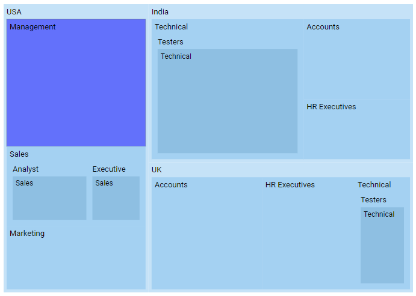

# Selection and Highlight in Blazor TreeMap Component

## Selection

Selection highlights a specific item or group to distinguish it from other items. Items and groups can be selected or deselected during interaction. Selecting a legend item also selects the corresponding TreeMap items, and the reverse applies.

The [Fill](https://help.syncfusion.com/cr/blazor/Syncfusion.Blazor.TreeMap.TreeMapSelectionSettings.html#Syncfusion_Blazor_TreeMap_TreeMapSelectionSettings_Fill) property sets the color of selected items. The border [Color](https://help.syncfusion.com/cr/aspnetcore-blazor/Syncfusion.Blazor.TreeMap.TreeMapSelectionBorder.html) and [Width](https://help.syncfusion.com/cr/aspnetcore-blazor/Syncfusion.Blazor.TreeMap.TreeMapSelectionBorder.html) can be customized, and selection is enabled by setting [Enable](https://help.syncfusion.com/cr/blazor/Syncfusion.Blazor.TreeMap.TreeMapSelectionSettings.html#Syncfusion_Blazor_TreeMap_TreeMapSelectionSettings_Enable) to **true** in [TreeMapSelectionSettings](https://help.syncfusion.com/cr/aspnetcore-blazor/Syncfusion.Blazor.TreeMap.TreeMapSelectionSettings.html).

```cshtml

@using Syncfusion.Blazor.TreeMap

<SfTreeMap WeightValuePath="EmployeeCount" TValue="Employee" DataSource="Employees">
    <TreeMapLeafItemSettings LabelPath="JobDescription" Fill="#8ebfe2">
    </TreeMapLeafItemSettings>
    <TreeMapLevels>
        <TreeMapLevel GroupPath="Country" Fill="#c5e2f7">
        </TreeMapLevel>
        <TreeMapLevel GroupPath="JobDescription" Fill="#a4d1f2">
        </TreeMapLevel>
        <TreeMapLevel GroupPath="JobGroup" Fill="#a4d1f2">
        </TreeMapLevel>
    </TreeMapLevels>
    <TreeMapSelectionSettings Enable="true" Fill="blue">
        <TreeMapSelectionBorder Color="black" Width="0.5"></TreeMapSelectionBorder>
    </TreeMapSelectionSettings>
</SfTreeMap>

@code {
    public class Employee
    {
        public string Country { get; set; }
        public string JobDescription { get; set; }
        public string JobGroup { get; set; }
        public int EmployeeCount { get; set; }
    };

    public List<Employee> Employees = new List<Employee> {
        new Employee { Country = "USA", JobDescription = "Sales", JobGroup = "Executive", EmployeeCount = 20 },
        new Employee { Country = "USA", JobDescription = "Sales", JobGroup = "Analyst", EmployeeCount = 30 },
        new Employee { Country = "USA", JobDescription = "Marketing", EmployeeCount = 40 },
        new Employee { Country = "USA", JobDescription = "Management", EmployeeCount = 80 },
        new Employee { Country = "India", JobDescription = "Technical", JobGroup = "Testers", EmployeeCount = 100 },
        new Employee { Country = "India", JobDescription = "HR Executives", EmployeeCount = 30 },
        new Employee { Country = "India", JobDescription = "Accounts", EmployeeCount = 40 },
        new Employee { Country = "UK", JobDescription = "Technical", JobGroup = "Testers", EmployeeCount = 30 },
        new Employee { Country = "UK", JobDescription = "HR Executives", EmployeeCount = 50 },
        new Employee { Country = "UK", JobDescription = "Accounts", EmployeeCount = 60 }
    };
}

```


## Highlight

Highlight emphasizes an item or group to distinguish it from the rest. Items and groups can be highlighted by hovering over them. Hovering over a legend item also highlights the corresponding TreeMap items, and the reverse applies.

The [Fill](https://help.syncfusion.com/cr/blazor/Syncfusion.Blazor.TreeMap.TreeMapHighlightSettings.html#Syncfusion_Blazor_TreeMap_TreeMapHighlightSettings_Fill) property sets the color of highlighted items. The border [Color](https://help.syncfusion.com/cr/blazor/Syncfusion.Blazor.TreeMap.TreeMapHighlightBorder.html#Syncfusion_Blazor_TreeMap_TreeMapHighlightBorder__ctor) and [Width](https://help.syncfusion.com/cr/blazor/Syncfusion.Blazor.TreeMap.TreeMapHighlightBorder.html#Syncfusion_Blazor_TreeMap_TreeMapHighlightBorder__ctor) can be customized, and highlighting is enabled by setting [Enable](https://help.syncfusion.com/cr/blazor/Syncfusion.Blazor.TreeMap.TreeMapHighlightSettings.html#Syncfusion_Blazor_TreeMap_TreeMapHighlightSettings_Enable) to **true** in [TreeMapHighlightSettings](https://help.syncfusion.com/cr/aspnetcore-blazor/Syncfusion.Blazor.TreeMap.TreeMapHighlightSettings.html).

```cshtml

@using Syncfusion.Blazor.TreeMap

<SfTreeMap WeightValuePath="EmployeeCount" TValue="Employee" DataSource="Employees">
    <TreeMapLeafItemSettings LabelPath="JobDescription" Fill="#8ebfe2">
    </TreeMapLeafItemSettings>
    <TreeMapLevels>
        <TreeMapLevel GroupPath="Country" Fill="#c5e2f7">
        </TreeMapLevel>
        <TreeMapLevel GroupPath="JobDescription" Fill="#a4d1f2">
        </TreeMapLevel>
        <TreeMapLevel GroupPath="JobGroup" Fill="#a4d1f2">
        </TreeMapLevel>
    </TreeMapLevels>
    <TreeMapHighlightSettings Enable=true Fill="blue">
        <TreeMapHighlightBorder Color="black" Width="0.3">
        </TreeMapHighlightBorder>
    </TreeMapHighlightSettings>
</SfTreeMap>

```

N> Refer to the code block in the [Selection](#selection) section for the **Employees** data.


