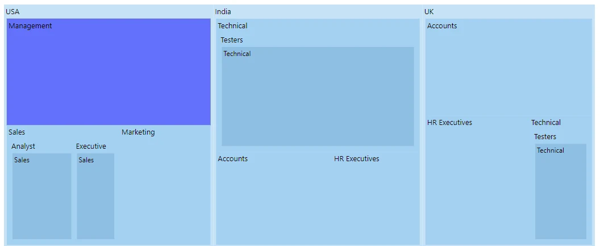
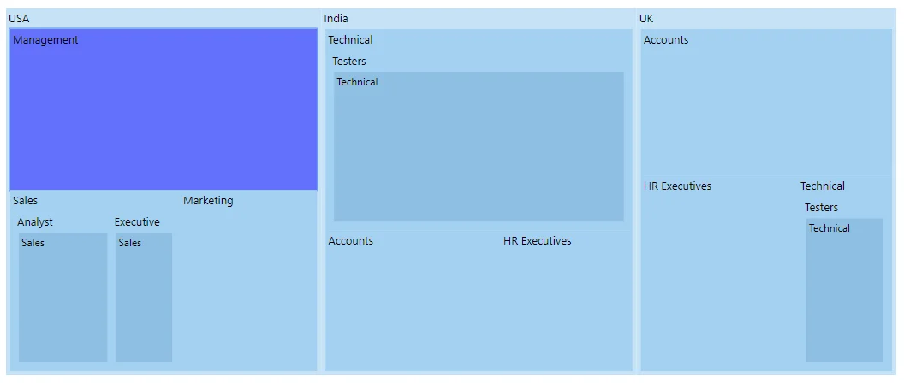

# Blazor TreeMap Selection and Highlight

## Selection

Selection is used to select a particular group or item to differentiate from other items. Each item or each group can be selected and deselected while interacting with the items. The corresponding Treemap items are also selected while tapping a specific legend item, and vice versa.

The [Fill](https://help.syncfusion.com/cr/blazor/Syncfusion.Blazor.TreeMap.TreeMapSelectionSettings.html#Syncfusion_Blazor_TreeMap_TreeMapSelectionSettings_Fill) property is used to change the selected item color. The [Color](https://help.syncfusion.com/cr/blazor/Syncfusion.Blazor.TreeMap.TreeMapBorderSettings.html#Syncfusion_Blazor_TreeMap_TreeMapBorderSettings_Color) and the [Width](https://help.syncfusion.com/cr/blazor/Syncfusion.Blazor.TreeMap.TreeMapBorderSettings.html#Syncfusion_Blazor_TreeMap_TreeMapBorderSettings_Width) properties are used to customize the selected item border, and the selection is enabled by setting the [Enable](https://help.syncfusion.com/cr/blazor/Syncfusion.Blazor.TreeMap.TreeMapSelectionSettings.html#Syncfusion_Blazor_TreeMap_TreeMapSelectionSettings_Enable) property to **true** in the [TreeMapSelectionSettings](https://help.syncfusion.com/cr/blazor/Syncfusion.Blazor.TreeMap.TreeMapSelectionSettings.html). Use the [Mode](https://help.syncfusion.com/cr/blazor/Syncfusion.Blazor.TreeMap.TreeMapSelectionSettings.html#Syncfusion_Blazor_TreeMap_TreeMapSelectionSettings_Mode) property ([SelectionMode](https://help.syncfusion.com/cr/blazor/Syncfusion.Blazor.TreeMap.SelectionMode.html)) to choose the element to be selected, and the [Opacity](https://help.syncfusion.com/cr/blazor/Syncfusion.Blazor.TreeMap.TreeMapSelectionSettings.html#Syncfusion_Blazor_TreeMap_TreeMapSelectionSettings_Opacity) property to control the transparency of the selected item.

```cshtml
@using Syncfusion.Blazor.TreeMap

<SfTreeMap WeightValuePath="EmployeeCount" TValue="Employee" DataSource="Employees">
    <TreeMapLeafItemSettings LabelPath="JobDescription" Fill="#8ebfe2">
    </TreeMapLeafItemSettings>
    <TreeMapLevels>
        <TreeMapLevel GroupPath="Country" Fill="#c5e2f7">
        </TreeMapLevel>
        <TreeMapLevel GroupPath="JobDescription" Fill="#a4d1f2">
        </TreeMapLevel>
        <TreeMapLevel GroupPath="JobGroup" Fill="#a4d1f2">
        </TreeMapLevel>
    </TreeMapLevels>
    <TreeMapSelectionSettings Enable="true" Fill="blue">
        <TreeMapSelectionBorder Color="black" Width="0.5"></TreeMapSelectionBorder>
    </TreeMapSelectionSettings>
</SfTreeMap>

@code {
    public class Employee
    {
        public string Country { get; set; }
        public string JobDescription { get; set; }
        public string JobGroup { get; set; }
        public int EmployeeCount { get; set; }
    };
    public List<Employee> Employees = new List<Employee> {
        new Employee { Country= "USA", JobDescription= "Sales", JobGroup= "Executive", EmployeeCount= 20 },
        new Employee { Country= "USA", JobDescription= "Sales", JobGroup= "Analyst", EmployeeCount= 30 },
        new Employee { Country= "USA", JobDescription= "Marketing", EmployeeCount= 40 },
        new Employee { Country= "USA", JobDescription= "Management", EmployeeCount= 80 },
        new Employee { Country= "India", JobDescription= "Technical", JobGroup= "Testers", EmployeeCount= 100 },
        new Employee { Country= "India", JobDescription= "HR Executives", EmployeeCount= 30 },
        new Employee { Country= "India", JobDescription= "Accounts", EmployeeCount= 40 },
        new Employee { Country= "UK", JobDescription= "Technical", JobGroup= "Testers", EmployeeCount= 30 },
        new Employee { Country= "UK", JobDescription= "HR Executives", EmployeeCount= 50 },
        new Employee { Country= "UK", JobDescription= "Accounts", EmployeeCount= 60 }
    };
}
```



## Highlight

Highlight is used to highlight an item or group from other items or groups. Each item or each group can be highlighted by hovering the mouse over the items. The corresponding Treemap items are also highlighted while hovering over a specific legend item, and vice versa.

The [Fill](https://help.syncfusion.com/cr/blazor/Syncfusion.Blazor.TreeMap.TreeMapHighlightSettings.html#Syncfusion_Blazor_TreeMap_TreeMapHighlightSettings_Fill) property is used to change the highlighted item color. The [Color](https://help.syncfusion.com/cr/blazor/Syncfusion.Blazor.TreeMap.TreeMapBorderSettings.html#Syncfusion_Blazor_TreeMap_TreeMapBorderSettings_Color) and the [Width](https://help.syncfusion.com/cr/blazor/Syncfusion.Blazor.TreeMap.TreeMapBorderSettings.html#Syncfusion_Blazor_TreeMap_TreeMapBorderSettings_Width) properties are used to customize the highlighted item border, and the highlight is enabled by setting the [Enable](https://help.syncfusion.com/cr/blazor/Syncfusion.Blazor.TreeMap.TreeMapHighlightSettings.html#Syncfusion_Blazor_TreeMap_TreeMapHighlightSettings_Enable) property to **true** in the [TreeMapHighlightSettings](https://help.syncfusion.com/cr/blazor/Syncfusion.Blazor.TreeMap.TreeMapHighlightSettings.html). Use the [Mode](https://help.syncfusion.com/cr/blazor/Syncfusion.Blazor.TreeMap.TreeMapHighlightSettings.html#Syncfusion_Blazor_TreeMap_TreeMapHighlightSettings_Mode) property ([HighLightMode](https://help.syncfusion.com/cr/blazor/Syncfusion.Blazor.TreeMap.HighLightMode.html)) to choose the element to be highlighted, and the [Opacity](https://help.syncfusion.com/cr/blazor/Syncfusion.Blazor.TreeMap.TreeMapHighlightSettings.html#Syncfusion_Blazor_TreeMap_TreeMapHighlightSettings_Opacity) property to control the transparency of the highlighted item.

```cshtml
@using Syncfusion.Blazor.TreeMap

<SfTreeMap WeightValuePath="EmployeeCount" TValue="Employee" DataSource="Employees">
    <TreeMapLeafItemSettings LabelPath="JobDescription" Fill="#8ebfe2">
    </TreeMapLeafItemSettings>
    <TreeMapLevels>
        <TreeMapLevel GroupPath="Country" Fill="#c5e2f7">
        </TreeMapLevel>
        <TreeMapLevel GroupPath="JobDescription" Fill="#a4d1f2">
        </TreeMapLevel>
        <TreeMapLevel GroupPath="JobGroup" Fill="#a4d1f2">
        </TreeMapLevel>
    </TreeMapLevels>
    <TreeMapHighlightSettings Enable=true Fill="blue">
        <TreeMapHighlightBorder Color="black" Width="0.3">
        </TreeMapHighlightBorder>
    </TreeMapHighlightSettings>
</SfTreeMap>
```

N> Refer to the [code block](#selection) to know about the property value of **Employees**.


