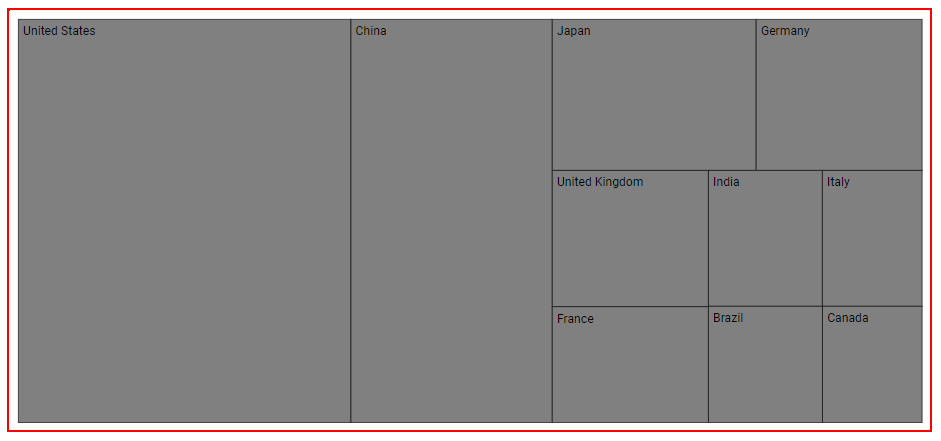
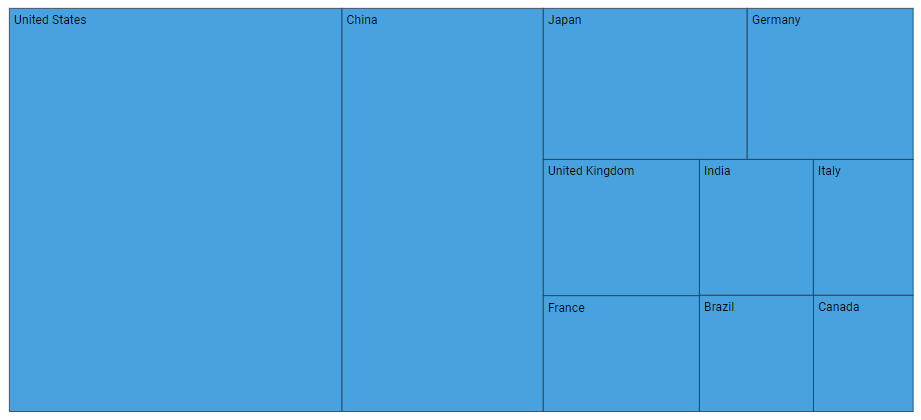
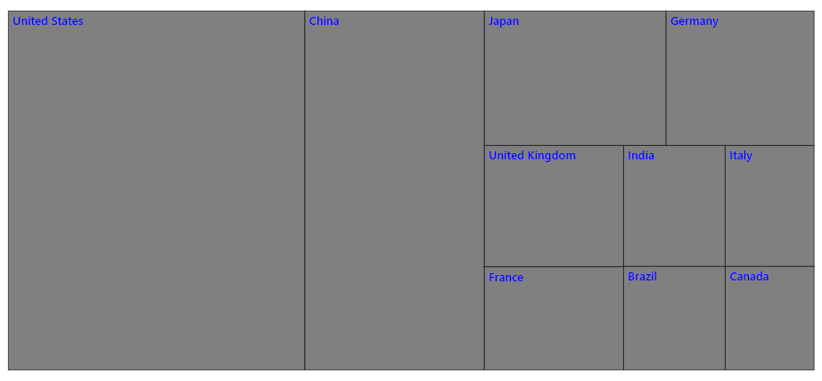
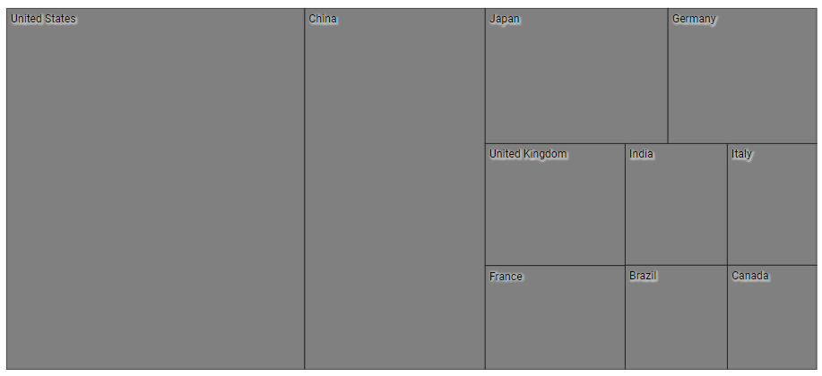
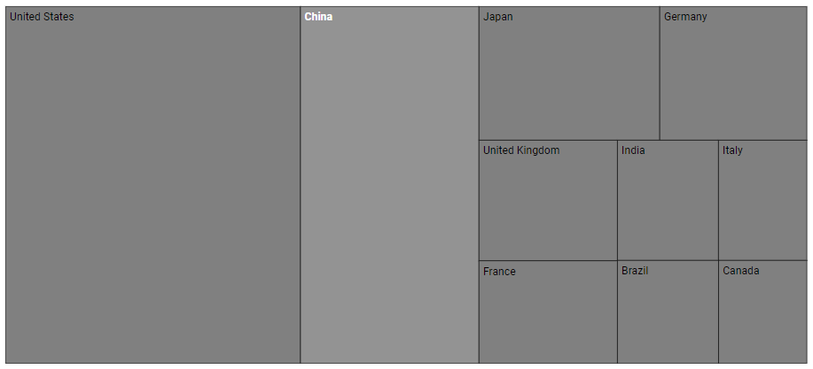

# Style and Appearance in Blazor TreeMap Component

Style and Appearance provide options to customize the visual design of the **Syncfusion Blazor TreeMap** component, ensuring consistency with your application’s branding and theme.

By using CSS selectors and ID-based styling, you can customize colors, typography, spacing, borders, and other visual properties of TreeMap items, labels, and SVG elements.

**Basic TreeMap Setup**

```cshtml
@using Syncfusion.Blazor.TreeMap

<SfTreeMap DataSource="GrowthReports"
           TValue="GDPReport"
           WeightValuePath="GDP">
    <TreeMapLeafItemSettings LabelPath="CountryName">
        <TreeMapLeafLabelStyle Color="#000000" />
        <TreeMapLeafBorder Color="#000000" Width="0.5" />
    </TreeMapLeafItemSettings>
</SfTreeMap>

@code {
    public class GDPReport
    {
        public string CountryName { get; set; }
        public double GDP { get; set; }
        public double Percentage { get; set; }
        public int Rank { get; set; }
    }

    public List<GDPReport> GrowthReports = new()
    {
        new GDPReport { CountryName = "United States", GDP = 17946, Percentage = 11.08, Rank = 1 },
        new GDPReport { CountryName = "China", GDP = 10866, Percentage = 28.42, Rank = 2 },
        new GDPReport { CountryName = "Japan", GDP = 4123, Percentage = -30.78, Rank = 3 },
        new GDPReport { CountryName = "Germany", GDP = 3355, Percentage = -5.19, Rank = 4 },
        new GDPReport { CountryName = "United Kingdom", GDP = 2848, Percentage = 8.28, Rank = 5 },
        new GDPReport { CountryName = "France", GDP = 2421, Percentage = -9.69, Rank = 6 },
        new GDPReport { CountryName = "India", GDP = 2073, Percentage = 13.65, Rank = 7 },
        new GDPReport { CountryName = "Italy", GDP = 1814, Percentage = -12.45, Rank = 8 },
        new GDPReport { CountryName = "Brazil", GDP = 1774, Percentage = -27.88, Rank = 9 },
        new GDPReport { CountryName = "Canada", GDP = 1550, Percentage = -15.02, Rank = 10 }
    };
}
```

## Customize TreeMap Root Element

You can apply global styles such as borders, padding, and background color to the TreeMap container:

```css
[id] {
    border: 2px solid red;
}
```



## Customize TreeMap Item Rectangles (RectPath)

Each TreeMap item rectangle is rendered as an SVG path element. These elements contain RectPath in their ID, allowing targeted customization.

### Item Rectangle Styling

```css
[id*="RectPath"] {
    fill: #3498db;
    stroke: #2c3e50;
    stroke-width: 1;
    opacity: 0.9;
}
```



### Level-Based Rectangle Styling

```css
/* Level 0 items */
[id*="_Level_Index_0_"] [id*="RectPath"] {
    fill: #e74c3c;
    opacity: 0.85;
}

/* Level 1 items */
[id*="_Level_Index_1_"] [id*="RectPath"] {
    fill: #3498db;
    opacity: 0.8;
}

/* Level 2 items */
[id*="_Level_Index_2_"] [id*="RectPath"] {
    fill: #2ecc71;
    opacity: 0.75;
}
```

### Item Index-Based Rectangle Styling

```css
/* First item in each level */
[id*="_Item_Index_0_RectPath"] {
    fill: #f39c12;
}

/* Second item in each level */
[id*="_Item_Index_1_RectPath"] {
    fill: #9b59b6;
}

/* Third item in each level */
[id*="_Item_Index_2_RectPath"] {
    fill: #1abc9c;
}
```

### Combined Level and Item Styling

Apply styles to specific combinations of level and item indices:

```css
/* Level 0, Item 0 - Featured item */
[id*="_Level_Index_0_Item_Index_0_RectPath"] {
    fill: #f39c12;
    stroke: #d68910;
    stroke-width: 3;
    filter: drop-shadow(0 4px 8px rgba(0,0,0,0.3));
}

/* Level 1, Item 1 - Secondary featured */
[id*="_Level_Index_1_Item_Index_1_RectPath"] {
    fill: #e74c3c;
    stroke: #c0392b;
    stroke-width: 2;
}
```

## Customize TreeMap Item Text

TreeMap text elements contain Text in their IDs and can be styled independently.

### Item Text Styling

```css
[id*="Text"] {
    fill: #2c3e50;
    font-size: 14px;
    font-weight: 500;
    font-family: "Segoe UI", Arial, sans-serif;
}
```



### Level-Based Text Styling

```css
/* Level 0 text */
[id*="_Level_Index_0_"] [id*="Text"] {
    fill: #ffffff;
    font-size: 16px;
    font-weight: 700;
}

/* Level 1 text */
[id*="_Level_Index_1_"] [id*="Text"] {
    fill: #2c3e50;
    font-size: 13px;
    font-weight: 600;
}

/* Level 2 text */
[id*="_Level_Index_2_"] [id*="Text"] {
    fill: #34495e;
    font-size: 11px;
    font-weight: 400;
}
```

### Item Index-Based Text Styling

```css
/* First item text in each level */
[id*="_Item_Index_0_Text"] {
    fill: #ffffff;
    font-weight: 700;
}

/* Second item text in each level */
[id*="_Item_Index_1_Text"] {
    fill: #ecf0f1;
    font-weight: 600;
}

/* Third item text in each level */
[id*="_Item_Index_2_Text"] {
    fill: #95a5a6;
    font-weight: 500;
}
```

### Text Contrast Enhancement

```css
[id*="Text"] {
    text-shadow: 1px 1px 2px rgba(255, 255, 255, 0.5);
    paint-order: stroke;
    stroke: rgba(0, 0, 0, 0.1);
    stroke-width: 3px;
}
```



## Hover and Interactive States

You can improve interactivity by styling hover states:

```css
/* Hover effect on rectangles */
[id*="RectPath"]:hover {
    opacity: 1;
    filter: brightness(1.15);
    transition: all 0.3s ease;
}

/* Text visibility on hover */
[id*="RectPath"]:hover ~ [id*="Text"] {
    font-weight: 700;
    fill: #ffffff;
}
```



N> SVG presentation attributes such as fill, stroke, and font-size may require **!important** when overridden by inline SVG styles.
