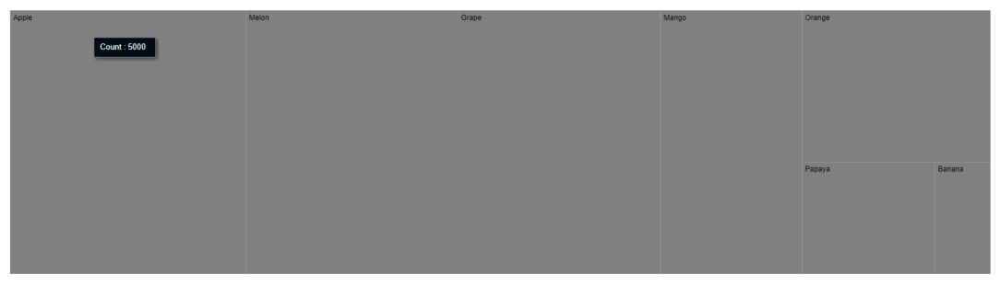
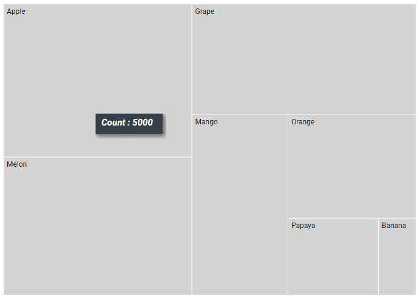
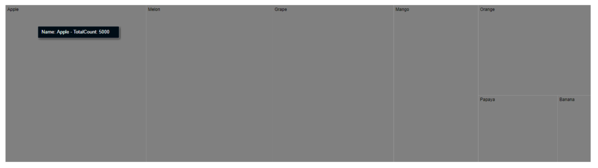
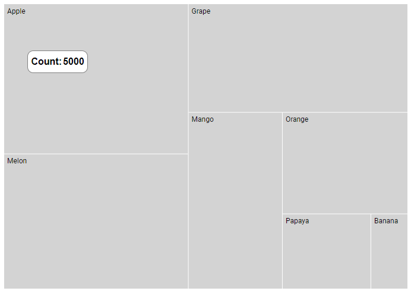

# Tooltip in Blazor TreeMap Component

Tooltip is used to display details about the items in the TreeMap. When space constraints prevents from displaying the information using Data Labels, the tooltip comes in handy.

## Default tooltip

The tooltip is not visible by default, to make it visible, set the [Visible](https://help.syncfusion.com/cr/blazor/Syncfusion.Blazor.TreeMap.TreeMapTooltipSettings.html#Syncfusion_Blazor_TreeMap_TreeMapTooltipSettings_Visible) property in the [TreeMapTooltipSettings](https://help.syncfusion.com/cr/aspnetcore-blazor/Syncfusion.Blazor.TreeMap.TreeMapTooltipSettings.html) to **true**.

```cshtml
@using Syncfusion.Blazor.TreeMap

<SfTreeMap WeightValuePath="Count" TValue="Fruit" DataSource="Fruits">
    <TreeMapLeafItemSettings LabelPath="Name"></TreeMapLeafItemSettings>
    <TreeMapTooltipSettings Visible=true></TreeMapTooltipSettings>
</SfTreeMap>

@code {
    public class Fruit
    {
        public string Name { get; set; }
        public int Count { get; set; }
    };
    public List<Fruit> Fruits = new List<Fruit> {
        new Fruit { Name="Apple", Count=5000 },
        new Fruit { Name="Mango", Count=3000 },
        new Fruit { Name="Orange", Count=2300 },
        new Fruit { Name="Banana", Count=500 },
        new Fruit { Name="Grape", Count=4300 },
        new Fruit { Name="Papaya", Count=1200 },
        new Fruit { Name="Melon", Count=4500 }
    };
}
```



## Customization

Customize the TreeMap tooltip using the following properties.

* [Fill](https://help.syncfusion.com/cr/blazor/Syncfusion.Blazor.TreeMap.TreeMapTooltipSettings.html#Syncfusion_Blazor_TreeMap_TreeMapTooltipSettings_Fill) - Specifies the color of the tooltip.
* [Opacity](https://help.syncfusion.com/cr/blazor/Syncfusion.Blazor.TreeMap.TreeMapTooltipSettings.html#Syncfusion_Blazor_TreeMap_TreeMapTooltipSettings_Opacity) - Specifies the opacity of the tooltip.
* [TreeMapTooltipBorder](https://help.syncfusion.com/cr/blazor/Syncfusion.Blazor.TreeMap.TreeMapTooltipBorder.html) - Specifies the tooltip border color and width.
* [TreeMapTooltipTextStyle](https://help.syncfusion.com/cr/blazor/Syncfusion.Blazor.TreeMap.TreeMapTooltipTextStyle.html) - Specifies the tooltip font family, style, weight, color and size.

```cshtml
@using Syncfusion.Blazor.TreeMap

<SfTreeMap WeightValuePath="Count" TValue="Fruit" DataSource="Fruits">
    <TreeMapLeafItemSettings LabelPath="Name" Fill="lightgray" Gap="2"></TreeMapLeafItemSettings>
    <TreeMapTooltipSettings Visible=true>
        <TreeMapTooltipTextStyle FontStyle="italic" FontWeight="bold" Size="15">
        </TreeMapTooltipTextStyle>
    </TreeMapTooltipSettings>
</SfTreeMap>
```

N> Refer to the [code block](#default-tooltip) to know about the property value of **Fruits**.



## Formatting tooltip content

The tooltip content is displayed by default based on the [WeightValuePath](https://help.syncfusion.com/cr/blazor/Syncfusion.Blazor.TreeMap.SfTreeMap-1.html#Syncfusion_Blazor_TreeMap_SfTreeMap_1_WeightValuePath). In addition, to show more information in the tooltip, use the [Format](https://help.syncfusion.com/cr/blazor/Syncfusion.Blazor.TreeMap.TreeMapTooltipSettings.html#Syncfusion_Blazor_TreeMap_TreeMapTooltipSettings_Format) property and define properties from the data source as following.

```cshtml
@using Syncfusion.Blazor.TreeMap

<SfTreeMap WeightValuePath="Count" TValue="Fruit" DataSource="Fruits">
    <TreeMapLeafItemSettings LabelPath="Name"></TreeMapLeafItemSettings>
    <TreeMapTooltipSettings Visible=true Format="Name: ${Name} - TotalCount: ${Count}"></TreeMapTooltipSettings>
</SfTreeMap>
```

N> Refer to the [code block](#default-tooltip) to know about the property value of **Fruits**.



## Tooltip template

Tooltip can be rendered as a custom component using the [TooltipTemplate](https://help.syncfusion.com/cr/blazor/Syncfusion.Blazor.TreeMap.TreeMapTooltipSettings.html#Syncfusion_Blazor_TreeMap_TreeMapTooltipSettings_TooltipTemplate) property in the [TreeMapTooltipSettings](https://help.syncfusion.com/cr/aspnetcore-blazor/Syncfusion.Blazor.TreeMap.TreeMapTooltipSettings.html) which accepts one or more UI elements as an input, that can be rendered as a part of the tooltip rendering.

```cshtml
@using Syncfusion.Blazor.TreeMap

<SfTreeMap WeightValuePath="Count" TValue="Fruit" DataSource="Fruits">
    <TreeMapLeafItemSettings LabelPath="Name" Fill="lightgray" Gap="2"></TreeMapLeafItemSettings>
    <TreeMapTooltipSettings Visible=true Opacity="0.8">
        <TooltipTemplate>
            @{
                var data = (context as Fruit);
                <table style="width:100%; background-color: #ffffff; border-spacing: 0px; border-collapse:separate; border: 1px solid grey; border-radius:10px; padding-top: 5px; padding-bottom:5px">
                    <tr>
                        <td style="font-weight:bold; color:black; padding-left: 5px;">Count:</td>
                        <td style="font-weight:bold; color:black; padding-right: 5px;">@data.Count</td>
                    </tr>
                </table>
            }
        </TooltipTemplate>
    </TreeMapTooltipSettings>
</SfTreeMap>
```

N> Refer to the [code block](#default-tooltip) to know about the property value of **Fruits**.

