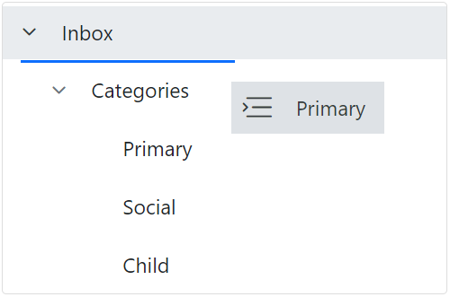
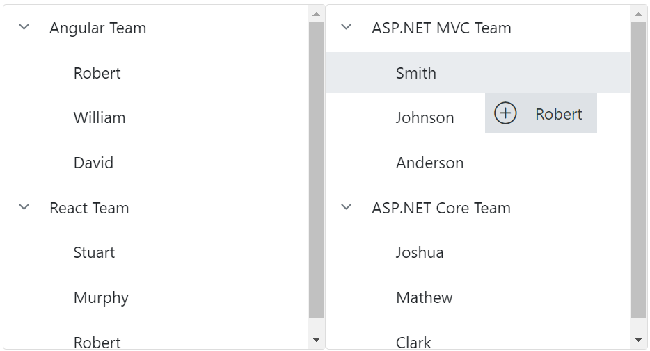

# Drag and Drop in Blazor TreeView Component

The Blazor TreeView component allows to drag and drop any node by setting [`AllowDragAndDrop`](https://help.syncfusion.com/cr/blazor/Syncfusion.Blazor.Navigations.SfTreeView-1.html#Syncfusion_Blazor_Navigations_SfTreeView_1_AllowDragAndDrop) property to **true**. Nodes can be dragged and dropped at all levels of the same TreeView.

The dragged nodes can be dropped at any level by indicator lines with **line**, **plus/minus**, and **restrict** icons. It represents the exact position where the node is to be dropped as sibling or child.

The following table explains the usage of indicator icons.

| Icons | Description |
|------|-------------|
| Plus icon | Indicates that the dragged node is to be added as a child of target node. |
| Minus or restrict icon |Indicates that the dragged node is not to be dropped at the hovered region. |
| In between icon | Indicates that the dragged node is to be added as siblings of hovered region. |

* In order to prevent dragging action for a particular node, the [`OnNodeDragStart`](https://help.syncfusion.com/cr/blazor/Syncfusion.Blazor.Navigations.TreeViewEvents-1.html#Syncfusion_Blazor_Navigations_TreeViewEvents_1_OnNodeDragStart) event can be used which is triggered when the node drag is started. The [`OnNodeDragged`](https://help.syncfusion.com/cr/blazor/Syncfusion.Blazor.Navigations.TreeViewEvents-1.html#Syncfusion_Blazor_Navigations_TreeViewEvents_1_OnNodeDragged) event is triggered when a node is being dragged.

* The [`NodeDropped`](https://help.syncfusion.com/cr/blazor/Syncfusion.Blazor.Navigations.TreeViewEvents-1.html#Syncfusion_Blazor_Navigations_TreeViewEvents_1_NodeDropped) event is triggered when the TreeView node is dropped on the target element successfully.

N> In the [**OnNodeDragged**](https://help.syncfusion.com/cr/blazor/Syncfusion.Blazor.Navigations.TreeViewEvents-1.html#Syncfusion_Blazor_Navigations_TreeViewEvents_1_OnNodeDragged) event currently there is no option to cancel the event. However the other event arguments could be accessed.

```cshtml
@using Syncfusion.Blazor.Navigations
<SfTreeView TValue="TeamDetails" AllowDragAndDrop="true">
    <TreeViewFieldsSettings TValue="TeamDetails" Id="Id" Text="Name" Child="Children" DataSource="@Team" Expanded="Expanded"></TreeViewFieldsSettings>
</SfTreeView>

@code{
    public class TeamDetails
    {
        public string? Id { get; set; }
        public string? Name { get; set; }
        public bool Expanded { get; set; }
        public bool Selected { get; set; }
        public List<TeamDetails> Children;
    }
    List<TeamDetails> Team = new List<TeamDetails>();

    protected override void OnInitialized()
    {
        base.OnInitialized();
        List<TeamDetails> EmployeeDetails = new List<TeamDetails>();
        Team.Add(new TeamDetails
        {
            Id = "01",
            Name = "ASP.NET MVC Team",
            Expanded = true,
            Children = EmployeeDetails,
        });
        EmployeeDetails.Add(new TeamDetails
        {
            Id = "01-01",
            Name = "Smith",
        });
        EmployeeDetails.Add(new TeamDetails
        {
            Id = "01-02",
            Name = "Johnson",
        });
        EmployeeDetails.Add(new TeamDetails
        {
            Id = "01-03",
            Name = "Anderson"
        });

        List<TeamDetails> EmployeeDetails1 = new List<TeamDetails>();

        Team.Add(new TeamDetails
        {
            Id = "02",
            Name = "Windows Team",
            Children = EmployeeDetails1,
        });
        EmployeeDetails1.Add(new TeamDetails
        {
            Id = "02-01",
            Name = "Clark"
        });
        EmployeeDetails1.Add(new TeamDetails
        {
            Id = "02-02",
            Name = "Wright"
        });

        List<TeamDetails> EmployeeDetails2 = new List<TeamDetails>();

        Team.Add(new TeamDetails
        {
            Id = "03",
            Name = "Web Team",
            Children = EmployeeDetails2,
        });
        EmployeeDetails2.Add(new TeamDetails
        {
            Id = "03-01",
            Name = "Joshua"
        });
        EmployeeDetails2.Add(new TeamDetails
        {
            Id = "03-02",
            Name = "Matthew"
        });
    }
}

 ```


## Multiple-node drag and drop

To drag and drop more than one node, enable the [AllowMultiSelection](https://help.syncfusion.com/cr/blazor/Syncfusion.Blazor.Navigations.SfTreeView-1.html#Syncfusion_Blazor_Navigations_SfTreeView_1_AllowMultiSelection) property along with the [AllowDragAndDrop](https://help.syncfusion.com/cr/blazor/Syncfusion.Blazor.Navigations.SfTreeView-1.html#Syncfusion_Blazor_Navigations_SfTreeView_1_AllowDragAndDrop) property. To perform multi-selection, press and hold **CTRL** key and click the desired nodes. To select range of nodes, press and hold the **SHIFT** key and click the nodes.

```cshtml
@using Syncfusion.Blazor.Navigations
<SfTreeView TValue="TeamDetails" AllowDragAndDrop="true" AllowMultiSelection="true">
    <TreeViewFieldsSettings TValue="TeamDetails" Id="Id" Text="Name" Selected="Selected" Child="Children" DataSource="@Team" Expanded="Expanded"></TreeViewFieldsSettings>
</SfTreeView>

@code{
    public class TeamDetails
    {
        public string? Id { get; set; }
        public string? Name { get; set; }
        public bool Expanded { get; set; }
        public bool Selected { get; set; }
        public List<TeamDetails> Children;
    }

    List<TeamDetails> Team = new List<TeamDetails>();

    protected override void OnInitialized()
    {
        base.OnInitialized();
        List<TeamDetails> EmployeeDetails = new List<TeamDetails>();
        Team.Add(new TeamDetails
        {
            Id = "01",
            Name = "ASP.NET MVC Team",
            Expanded = true,
            Children = EmployeeDetails,
        });
        EmployeeDetails.Add(new TeamDetails
        {
            Id = "01-01",
            Name = "Smith",
            Selected = true
        });
        EmployeeDetails.Add(new TeamDetails
        {
            Id = "01-02",
            Name = "Johnson",
            Selected = true
        });
        EmployeeDetails.Add(new TeamDetails
        {
            Id = "01-03",
            Name = "Anderson"
        });

        List<TeamDetails> EmployeeDetails1 = new List<TeamDetails>();

        Team.Add(new TeamDetails
        {
            Id = "02",
            Name = "Windows Team",
            Children = EmployeeDetails1,
        });
        EmployeeDetails1.Add(new TeamDetails
        {
            Id = "02-01",
            Name = "Clark"
        });
        EmployeeDetails1.Add(new TeamDetails
        {
            Id = "02-02",
            Name = "Wright"
        });

        List<TeamDetails> EmployeeDetails2 = new List<TeamDetails>();

        Team.Add(new TeamDetails
        {
            Id = "03",
            Name = "Web Team",
            Children = EmployeeDetails2,
        });
        EmployeeDetails2.Add(new TeamDetails
        {
            Id = "03-01",
            Name = "Joshua"
        });
        EmployeeDetails2.Add(new TeamDetails
        {
            Id = "03-02",
            Name = "Matthew"
        });
    }
}

```


## Drag and drop within a TreeView

The Blazor TreeView component has built-in support for drag and drop functionality. The [AllowDragAndDrop](https://help.syncfusion.com/cr/blazor/Syncfusion.Blazor.Navigations.SfTreeView-1.html#Syncfusion_Blazor_Navigations_SfTreeView_1_AllowDragAndDrop) property determines whether the TreeView allows for the drag and drop reordering of nodes. 

The default value of `AllowDragAndDrop` property is false.

```cshtml
@using Syncfusion.Blazor.Navigations

<SfTreeView TValue="MailItem" AllowDragAndDrop=true>
    <TreeViewFieldsSettings TValue="MailItem" Id="ID" DataSource="@MyFolder" Text="FolderName" ParentID="ParentId" HasChildren="HasSubFolders" Expanded="Expanded"></TreeViewFieldsSettings>
</SfTreeView>

@code {
    public class MailItem
    {
        public string? ID { get; set; }
        public string? ParentId { get; set; }
        public string? FolderName { get; set; }
        public bool Expanded { get; set; }
        public bool HasSubFolders { get; set; }
    }
    List<MailItem> MyFolder = new List<MailItem>();
    protected override void OnInitialized()
    {
        base.OnInitialized();
        MyFolder.Add(new MailItem
            {
                ID = "1",
                FolderName = "Inbox",
                HasSubFolders = true,
                Expanded = true
            });
        MyFolder.Add(new MailItem
            {
                ID = "2",
                ParentId = "1",
                FolderName = "Categories",
                Expanded = true,
                HasSubFolders = true
            });
        MyFolder.Add(new MailItem
            {
                ID = "3",
                ParentId = "2",
                FolderName = "Primary"
            });
        MyFolder.Add(new MailItem
            {
                ID = "4",
                ParentId = "2",
                FolderName = "Social"
            });
        MyFolder.Add(new MailItem
            {
                ID = "5",
                ParentId = "2",
                FolderName = "Child"
            });

    }
}

```



## Drag and drop between TreeViews

The Blazor TreeView component has built-in support for drag and drop functionality, allowing for nodes to be dragged and dropped on other nodes within the same or different trees using the [AllowDragAndDrop](https://help.syncfusion.com/cr/blazor/Syncfusion.Blazor.Navigations.SfTreeView-1.html#Syncfusion_Blazor_Navigations_SfTreeView_1_AllowDragAndDrop) property. 

```cshtml
@using Syncfusion.Blazor.Navigations

<div class="col-lg-12 control-section custom-tree">
    <div class="control-wrapper">
        <div class="col-lg-4 tree-data">
            <h4>Front End Teams</h4>
            <div class="content">
                <div class="tree-list">

                    <SfTreeView ID="tree2" TValue="TeamDetails" AllowDragAndDrop="true">
                        <TreeViewFieldsSettings TValue="TeamDetails" Id="Id" Text="Name" Child="Children" DataSource="@JSTeam" Expanded="Expanded"></TreeViewFieldsSettings>
                    </SfTreeView>
                </div>
            </div>
        </div>
        <div class="col-lg-4 tree-data">
            <h4>Back End Teams</h4>
            <div class="content">
                <div class="tree-list">

                    <SfTreeView ID="tree1" TValue="TeamDetails" AllowDragAndDrop="true">
                        <TreeViewFieldsSettings TValue="TeamDetails" Id="Id" Text="Name" Child="Children" DataSource="@ASPTeam" Expanded="Expanded"></TreeViewFieldsSettings>
                    </SfTreeView>
                </div>
            </div>
        </div>
    </div>
</div>
@code {
    public class TeamDetails
    {
        public string? Id { get; set; }
        public string? Name { get; set; }
        public string? Text { get; set; }
        public bool Expanded { get; set; }
        public bool Selected { get; set; }
        public List<TeamDetails> Children;
    }
    // Specifies the DataSource value for Front End Teams TreeView component.
    List<TeamDetails> ASPTeam = new List<TeamDetails>();
    // Specifies the DataSource value for Back End Teams TreeView component.
    List<TeamDetails> JSTeam = new List<TeamDetails>();
    protected override void OnInitialized()
    {
        base.OnInitialized();
        List<TeamDetails> ASP_EmployeeDetails1 = new List<TeamDetails>();
        List<TeamDetails> ASP_EmployeeDetails2 = new List<TeamDetails>();
        List<TeamDetails> JS_EmployeeDetails1 = new List<TeamDetails>();
        List<TeamDetails> JS_EmployeeDetails2 = new List<TeamDetails>();
        ASPTeam.Add(new TeamDetails
            {
                Id = "01",
                Name = "ASP.NET MVC Team",
                Expanded = true,
                Children = ASP_EmployeeDetails1,
            });
        ASP_EmployeeDetails1.Add(new TeamDetails
            {
                Id = "01-01",
                Name = "Smith"
            });
        ASP_EmployeeDetails1.Add(new TeamDetails
            {
                Id = "01-02",
                Name = "Johnson"
            });
        ASP_EmployeeDetails1.Add(new TeamDetails
            {
                Id = "01-03",
                Name = "Anderson"
            });
        ASPTeam.Add(new TeamDetails
            {
                Id = "02",
                Name = "ASP.NET Core Team",
                Children = ASP_EmployeeDetails2,
                Expanded = true
            });
        ASP_EmployeeDetails2.Add(new TeamDetails
            {
                Id = "02-01",
                Name = "Joshua"
            });
        ASP_EmployeeDetails2.Add(new TeamDetails
            {
                Id = "02-02",
                Name = "Mathew"
            });
        ASP_EmployeeDetails2.Add(new TeamDetails
            {
                Id = "02-03",
                Name = "Clark"
            });
        JSTeam.Add(new TeamDetails
            {
                Id = "011",
                Name = "Angular Team",
                Children = JS_EmployeeDetails1,
                Expanded = true
            });
        JS_EmployeeDetails1.Add(new TeamDetails
            {
                Id = "011-01",
                Name = "Robert"
            });
        JS_EmployeeDetails1.Add(new TeamDetails
            {
                Id = "011-02",
                Name = "William"
            });
        JS_EmployeeDetails1.Add(new TeamDetails
            {
                Id = "011-03",
                Name = "David"
            });
        JSTeam.Add(new TeamDetails
            {
                Id = "022",
                Name = "React Team",
                Children = JS_EmployeeDetails2,
                Expanded = true
            });
        JS_EmployeeDetails2.Add(new TeamDetails
            {
                Id = "022-01",
                Name = "Stuart"
            });
        JS_EmployeeDetails2.Add(new TeamDetails
            {
                Id = "022-02",
                Name = "Murphy"
            });
        JS_EmployeeDetails2.Add(new TeamDetails
            {
                Id = "022-03",
                Name = "Robert"
            });
    }
}

<style>
    /* Sample specific styles */
    .custom-tree {
        overflow: auto;
    }

    .custom-tree .control-wrapper {
        position: relative;
        min-width: 700px;
        min-height: 400px;
        overflow: auto;
    }

    #list {
        min-height: 288px;
        border: 0;
    }

    .tree1-data, .tree2-data, .tree3-data {
        padding: 15px;
        margin-bottom: 25px;
    }

    #tree1, #tree2, #list {
        height: 300px;
        overflow: auto;
    }

    .tree-list {
        margin: 0 auto;
        border: 1px solid #dddddd;
        border-radius: 3px;
        min-height: 288px;
    }

    .custom-delete::before {
        content: "\e700";
        cursor: pointer;
        color: rgba(0, 0, 0, 0.54);
        font-size: 15px;
        vertical-align: sub;
        float: right;
    }

    .custom-delete {
        float: right;
        font-family: 'cross-circle';
    }

    @@media (max-width: 1200px) {
        .tree-data {
            width: 33.33333333%;
            float: left;
        }
    }
    @@font-face {
        font-family: 'cross-circle';
        src: url(data:application/x-font-ttf;charset=utf-8;base64,AAEAAAAKAIAAAwAgT1MvMj0gSRsAAAEoAAAAVmNtYXDnEOdVAAABiAAAADZnbHlmKuKzFgAAAcgAAABkaGVhZBRzllcAAADQAAAANmhoZWEHmQNrAAAArAAAACRobXR4B+gAAAAAAYAAAAAIbG9jYQAyAAAAAAHAAAAABm1heHABDgAkAAABCAAAACBuYW1lyFBwKAAAAiwAAAJhcG9zdJx8QW4AAASQAAAAOwABAAADUv9qAFoEAAAA//4D6gABAAAAAAAAAAAAAAAAAAAAAgABAAAAAQAA8246G18PPPUACwPoAAAAANi1qMQAAAAA2LWoxAAAAAAD6gPqAAAACAACAAAAAAAAAAEAAAACABgAAgAAAAAAAgAAAAoACgAAAP8AAAAAAAAAAQP0AZAABQAAAnoCvAAAAIwCegK8AAAB4AAxAQIAAAIABQMAAAAAAAAAAAAAAAAAAAAAAAAAAAAAUGZFZABA5wDnAANS/2oAWgPqAJYAAAABAAAAAAAABAAAAAPoAAAAAAACAAAAAwAAABQAAwABAAAAFAAEACIAAAAEAAQAAQAA5wD//wAA5wD//wAAAAEABAAAAAEAAAAAAAAAMgAAAAIAAAAAA+oD6gALABcAAAEHFwcnByc3JzcXNwUWABc2ADcmACcGAALkg4NqhINqg4Nqg4T9iAYBG9PUARsFBf7l1NP+5QJ6hIZqg4Nqg4RqgIPu0/7lBgYBG9PUARsFBf7lAAAAABIA3gABAAAAAAAAAAEAAAABAAAAAAABAAwAAQABAAAAAAACAAcADQABAAAAAAADAAwAFAABAAAAAAAEAAwAIAABAAAAAAAFAAsALAABAAAAAAAGAAwANwABAAAAAAAKACwAQwABAAAAAAALABIAbwADAAEECQAAAAIAgQADAAEECQABABgAgwADAAEECQACAA4AmwADAAEECQADABgAqQADAAEECQAEABgAwQADAAEECQAFABYA2QADAAEECQAGABgA7wADAAEECQAKAFgBBwADAAEECQALACQBXyBjcm9zcy1jaXJjbGVSZWd1bGFyY3Jvc3MtY2lyY2xlY3Jvc3MtY2lyY2xlVmVyc2lvbiAxLjBjcm9zcy1jaXJjbGVGb250IGdlbmVyYXRlZCB1c2luZyBTeW5jZnVzaW9uIE1ldHJvIFN0dWRpb3d3dy5zeW5jZnVzaW9uLmNvbQAgAGMAcgBvAHMAcwAtAGMAaQByAGMAbABlAFIAZQBnAHUAbABhAHIAYwByAG8AcwBzAC0AYwBpAHIAYwBsAGUAYwByAG8AcwBzAC0AYwBpAHIAYwBsAGUAVgBlAHIAcwBpAG8AbgAgADEALgAwAGMAcgBvAHMAcwAtAGMAaQByAGMAbABlAEYAbwBuAHQAIABnAGUAbgBlAHIAYQB0AGUAZAAgAHUAcwBpAG4AZwAgAFMAeQBuAGMAZgB1AHMAaQBvAG4AIABNAGUAdAByAG8AIABTAHQAdQBkAGkAbwB3AHcAdwAuAHMAeQBuAGMAZgB1AHMAaQBvAG4ALgBjAG8AbQAAAAACAAAAAAAAAAoAAAAAAAAAAAAAAAAAAAAAAAAAAAAAAAIBAgEDABFjaXJjbGUtY2xvc2UtLS0wMgAAAA==) format('truetype');
        font-weight: normal;
        font-style: normal;
    }
    .col-lg-4.tree-data {
        float: left;
    }
</style>

```



## Restrict drag and drop to individual node

In the Blazor TreeView component, it is possible to restrict the drag and drop functionality for a specific node by setting the arguments [Cancel](https://help.syncfusion.com/cr/blazor/Syncfusion.Blazor.Navigations.DragAndDropEventArgs.html#Syncfusion_Blazor_Navigations_DragAndDropEventArgs_Cancel) value to true in the [OnNodeDragStart](https://help.syncfusion.com/cr/blazor/Syncfusion.Blazor.Navigations.TreeViewEvents-1.html#Syncfusion_Blazor_Navigations_TreeViewEvents_1_OnNodeDragStart) event. 

For example, in the following code snippet, the drag and drop is prevented for the **Inbox** TreeView node.

```cshtml
@using Syncfusion.Blazor.Navigations

<SfTreeView TValue="MailItem" AllowDragAndDrop=true>
    <TreeViewFieldsSettings TValue="MailItem" Id="ID" DataSource="@MyFolder" Text="FolderName" ParentID="ParentId" HasChildren="HasSubFolders" Expanded="Expanded"></TreeViewFieldsSettings>
    <TreeViewEvents TValue="MailItem" OnNodeDragStart="OnNodeDragStart"></TreeViewEvents>
</SfTreeView>

@code {
    public class MailItem
    {
        public string? ID { get; set; }
        public string? ParentId { get; set; }
        public string? FolderName { get; set; }
        public bool Expanded { get; set; }
        public bool HasSubFolders { get; set; }
    }
    public void OnNodeDragStart(DragAndDropEventArgs args)
    {
        if (args.DraggedNodeData.Id == "1")
        {
            args.Cancel = true;
        }
    }
    List<MailItem> MyFolder = new List<MailItem>();
    protected override void OnInitialized()
    {
        base.OnInitialized();
        MyFolder.Add(new MailItem
            {
                ID = "1",
                FolderName = "Inbox",
                HasSubFolders = true,
                Expanded = true
            });
        MyFolder.Add(new MailItem
            {
                ID = "2",
                ParentId = "1",
                FolderName = "Categories",
                Expanded = true,
                HasSubFolders = true
            });
        MyFolder.Add(new MailItem
            {
                ID = "3",
                ParentId = "2",
                FolderName = "Primary"
            });
        MyFolder.Add(new MailItem
            {
                ID = "4",
                ParentId = "2",
                FolderName = "Social"
            });
        MyFolder.Add(new MailItem
            {
                ID = "5",
                ParentId = "2",
                FolderName = "Child"
            });

    }
}

```

## Retrieve index of drop node 

In the Blazor TreeView component, the index of the dropped node can be retrieved from the [DropIndex](https://help.syncfusion.com/cr/blazor/Syncfusion.Blazor.Navigations.DragAndDropEventArgs.html#Syncfusion_Blazor_Navigations_DragAndDropEventArgs_DropIndex) argument in the [OnNodeDragStop](https://help.syncfusion.com/cr/blazor/Syncfusion.Blazor.Navigations.TreeViewEvents-1.html#Syncfusion_Blazor_Navigations_TreeViewEvents_1_OnNodeDragStop) event. 

In the example shown, the value of the `DropIndex` is displayed in the Syncfusion<sup style="font-size:70%">&reg;</sup> TextBox component based on the node that was dropped.

```cshtml

@using Syncfusion.Blazor.Navigations
@using Syncfusion.Blazor.Inputs

<SfTextBox Value=@dropIndexValue></SfTextBox>
<SfTreeView TValue="TeamDetails" AllowDragAndDrop="true">
    <TreeViewFieldsSettings TValue="TeamDetails" Id="Id" Text="Name" Child="Children" DataSource="@Team" Expanded="Expanded"></TreeViewFieldsSettings>
    <TreeViewEvents TValue="TeamDetails" OnNodeDragStop="nodeDragStop"></TreeViewEvents>
</SfTreeView>

@code{
    public class TeamDetails
    {
        public string? Id { get; set; }
        public string? Name { get; set; }
        public bool Expanded { get; set; }
        public bool Selected { get; set; }
        public List<TeamDetails> Children;
    }
    public string? dropIndexValue { get; set; }

    public void nodeDragStop(DragAndDropEventArgs args)
    {
        dropIndexValue = args.DropIndex.ToString();
    }
    List<TeamDetails> Team = new List<TeamDetails>();
    protected override void OnInitialized()
    {
        base.OnInitialized();
        List<TeamDetails> EmployeeDetails = new List<TeamDetails>();
        Team.Add(new TeamDetails
        {
            Id = "01",
            Name = "ASP.NET MVC Team",
            Expanded = true,
            Children = EmployeeDetails,
        });
        EmployeeDetails.Add(new TeamDetails
        {
            Id = "01-01",
            Name = "Smith",
        });
        EmployeeDetails.Add(new TeamDetails
        {
            Id = "01-02",
            Name = "Johnson",
        });
        EmployeeDetails.Add(new TeamDetails
        {
            Id = "01-03",
            Name = "Anderson"
        });

        List<TeamDetails> EmployeeDetails1 = new List<TeamDetails>();

        Team.Add(new TeamDetails
        {
            Id = "02",
            Name = "Windows Team",
            Children = EmployeeDetails1,
        });
        EmployeeDetails1.Add(new TeamDetails
        {
            Id = "02-01",
            Name = "Clark"
        });
        EmployeeDetails1.Add(new TeamDetails
        {
            Id = "02-02",
            Name = "Wright"
        });

        List<TeamDetails> EmployeeDetails2 = new List<TeamDetails>();

        Team.Add(new TeamDetails
        {
            Id = "03",
            Name = "Web Team",
            Children = EmployeeDetails2,
        });
        EmployeeDetails2.Add(new TeamDetails
        {
            Id = "03-01",
            Name = "Joshua"
        });
        EmployeeDetails2.Add(new TeamDetails
        {
            Id = "03-02",
            Name = "Matthew"
        });
    }
}

```