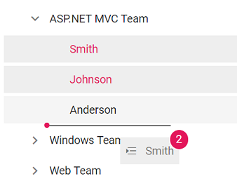

# Drag and Drop in Blazor TreeView Component

The Blazor TreeView component allows you to drag and drop any node by setting `AllowDragAndDrop` &nbsp;to **true**. Nodes can be dragged and dropped at all levels of the same TreeView.

The dragged nodes can be dropped at any level by indicator lines with **line**, **plus/minus**, and **restrict** icons. It represents the exact position where the node is to be dropped as sibling or child.

The following table explains the usage of indicator icons.

| Icons | Description |
|------|-------------|
| Plus icon | Indicates that the dragged node is to be added as child of target node. |
| Minus or restrict icon |Indicates that the dragged node is not to be dropped at the hovered region. |
| In between icon | Indicates that the dragged node is to be added as siblings of hovered region. |

* If you need to prevent dragging action for a particular node, the `OnNodeDragStart` event can be used which is triggered when the node drag is started. The `OnNodeDragged` event is triggered when the drag is stopped.

* The `NodeDropped` event is triggered when the TreeView node is dropped on the target element successfully.

> In the **OnNodeDragged** event currently there is no option to cancel the event. However you can access the other event arguments.

```cshtml
@using Syncfusion.Blazor.Navigations
<SfTreeView TValue="TeamDetails" AllowDragAndDrop="true">
    <TreeViewFieldsSettings TValue="TeamDetails" Id="Id" Text="Name" Child="Children" DataSource="@Team" Expanded="Expanded"></TreeViewFieldsSettings>
</SfTreeView>

@code{
    public class TeamDetails
    {
        public string Id { get; set; }
        public string Name { get; set; }
        public bool Expanded { get; set; }
        public bool Selected { get; set; }
        public List<TeamDetails> Children;
    }
    List<TeamDetails> Team = new List<TeamDetails>();

    protected override void OnInitialized()
    {
        base.OnInitialized();
        List<TeamDetails> EmployeeDetails = new List<TeamDetails>();
        Team.Add(new TeamDetails
        {
            Id = "01",
            Name = "ASP.NET MVC Team",
            Expanded = true,
            Children = EmployeeDetails,
        });
        EmployeeDetails.Add(new TeamDetails
        {
            Id = "01-01",
            Name = "Smith",
        });
        EmployeeDetails.Add(new TeamDetails
        {
            Id = "01-02",
            Name = "Johnson",
        });
        EmployeeDetails.Add(new TeamDetails
        {
            Id = "01-03",
            Name = "Anderson"
        });

        List<TeamDetails> EmployeeDetails1 = new List<TeamDetails>();

        Team.Add(new TeamDetails
        {
            Id = "02",
            Name = "Windows Team",
            Children = EmployeeDetails1,
        });
        EmployeeDetails1.Add(new TeamDetails
        {
            Id = "02-01",
            Name = "Clark"
        });
        EmployeeDetails1.Add(new TeamDetails
        {
            Id = "02-02",
            Name = "Wright"
        });

        List<TeamDetails> EmployeeDetails2 = new List<TeamDetails>();

        Team.Add(new TeamDetails
        {
            Id = "03",
            Name = "Web Team",
            Children = EmployeeDetails2,
        });
        EmployeeDetails2.Add(new TeamDetails
        {
            Id = "03-01",
            Name = "Joshua"
        });
        EmployeeDetails2.Add(new TeamDetails
        {
            Id = "03-02",
            Name = "Matthew"
        });
    }
}

 ```

Output be like the below.


## Multiple-node drag and drop

To drag and drop more than one node, you should enable the `AllowMultiSelection` property along with the `AllowDragAndDrop` property.

To perform multi-selection, press and hold **CTRL** key and click the desired nodes. To select range of nodes, press and hold the **SHIFT** key and click the nodes.

In the following sample,  the `AllowMultiSelection` property is  enabled along with the `AllowDragAndDrop` property.

```cshtml
@using Syncfusion.Blazor.Navigations
<SfTreeView TValue="TeamDetails" AllowDragAndDrop="true" AllowMultiSelection="true">
    <TreeViewFieldsSettings TValue="TeamDetails" Id="Id" Text="Name" Selected="Selected" Child="Children" DataSource="@Team" Expanded="Expanded"></TreeViewFieldsSettings>
</SfTreeView>

@code{
    public class TeamDetails
    {
        public string Id { get; set; }
        public string Name { get; set; }
        public bool Expanded { get; set; }
        public bool Selected { get; set; }
        public List<TeamDetails> Children;
    }

    List<TeamDetails> Team = new List<TeamDetails>();

    protected override void OnInitialized()
    {
        base.OnInitialized();
        List<TeamDetails> EmployeeDetails = new List<TeamDetails>();
        Team.Add(new TeamDetails
        {
            Id = "01",
            Name = "ASP.NET MVC Team",
            Expanded = true,
            Children = EmployeeDetails,
        });
        EmployeeDetails.Add(new TeamDetails
        {
            Id = "01-01",
            Name = "Smith",
            Selected = true
        });
        EmployeeDetails.Add(new TeamDetails
        {
            Id = "01-02",
            Name = "Johnson",
            Selected = true
        });
        EmployeeDetails.Add(new TeamDetails
        {
            Id = "01-03",
            Name = "Anderson"
        });

        List<TeamDetails> EmployeeDetails1 = new List<TeamDetails>();

        Team.Add(new TeamDetails
        {
            Id = "02",
            Name = "Windows Team",
            Children = EmployeeDetails1,
        });
        EmployeeDetails1.Add(new TeamDetails
        {
            Id = "02-01",
            Name = "Clark"
        });
        EmployeeDetails1.Add(new TeamDetails
        {
            Id = "02-02",
            Name = "Wright"
        });

        List<TeamDetails> EmployeeDetails2 = new List<TeamDetails>();

        Team.Add(new TeamDetails
        {
            Id = "03",
            Name = "Web Team",
            Children = EmployeeDetails2,
        });
        EmployeeDetails2.Add(new TeamDetails
        {
            Id = "03-01",
            Name = "Joshua"
        });
        EmployeeDetails2.Add(new TeamDetails
        {
            Id = "03-02",
            Name = "Matthew"
        });
    }
}

```

Output be like the below.

