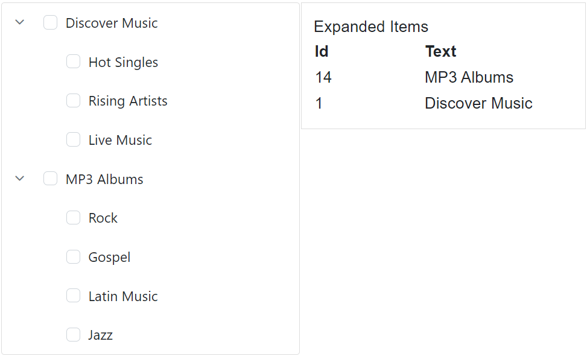

# Expand/Collapse Actions in Blazor TreeView Component

"Parent TreeView nodes in the Blazor TreeView component can be expanded or collapsed by clicking the respective arrow icons. The [**Expanded**](https://help.syncfusion.com/cr/blazor/Syncfusion.Blazor.Navigations.TreeViewFieldOptions-1.html#Syncfusion_Blazor_Navigations_TreeViewFieldOptions_1_Expanded) field or the [ExpandedNodes](https://help.syncfusion.com/cr/blazor/Syncfusion.Blazor.Navigations.SfTreeView-1.html#Syncfusion_Blazor_Navigations_SfTreeView_1_ExpandedNodes) property can be used to perform expand actions within the TreeView component. When the Expanded field is utilized, it can be mapped directly in the data source. The [ExpandedNodes](https://help.syncfusion.com/cr/blazor/Syncfusion.Blazor.Navigations.SfTreeView-1.html#Syncfusion_Blazor_Navigations_SfTreeView_1_ExpandedNodes) property in the TreeView component provides two-way binding."

## Expand Nodes through Data Binding

Specific nodes can be programmatically expanded upon TreeView initialization by utilizing the [`Expanded`](https://help.syncfusion.com/cr/blazor/Syncfusion.Blazor.Navigations.TreeViewFieldOptions-1.html#Syncfusion_Blazor_Navigations_TreeViewFieldOptions_1_Expanded) field within the data source. Setting this field to `true` for a parent node in the data will expand that node in the user interface.

```cshtml
@using Syncfusion.Blazor.Navigations

<SfTreeView TValue="MusicAlbum" ShowCheckBox="true" AutoCheck="true">
    <TreeViewFieldsSettings TValue="MusicAlbum" Id="Id" DataSource="@Albums" Text="Name" ParentID="ParentId" HasChildren="HasChild" Expanded="Expanded" IsChecked="IsChecked"></TreeViewFieldsSettings>
</SfTreeView>
@code {
    public class MusicAlbum
    {
        public string? Id { get; set; }
        public string? ParentId { get; set; }
        public string? Name { get; set; }
        public bool Expanded { get; set; }
        public bool? IsChecked { get; set; }
        public bool HasChild { get; set; }
    }
    List<MusicAlbum> Albums = new List<MusicAlbum>();
    protected override void OnInitialized()
    {
        base.OnInitialized();
        Albums.Add(new MusicAlbum
            {
                Id = "1",
                Name = "Discover Music",
                HasChild = true,
                Expanded=true
            });
        Albums.Add(new MusicAlbum
            {
                Id = "2",
                ParentId = "1",
                Name = "Hot Singles"
            });
        Albums.Add(new MusicAlbum
            {
                Id = "3",
                ParentId = "1",
                Name = "Rising Artists"
            });
        Albums.Add(new MusicAlbum
            {
                Id = "4",
                ParentId = "1",
                Name = "Live Music"
            });
        Albums.Add(new MusicAlbum
            {
                Id = "04",
                HasChild = true,
                Name = "MP3 Albums"
            });
        Albums.Add(new MusicAlbum
            {
                Id = "5",
                ParentId = "04",
                Name = "Rock",
                IsChecked = true
            });
        Albums.Add(new MusicAlbum
            {
                Id = "6",
                Name = "Gospel",
                ParentId = "04",
            });
        Albums.Add(new MusicAlbum
            {
                Id = "7",
                ParentId = "04",
                Name = "Latin Music"
            });
        Albums.Add(new MusicAlbum
            {
                Id = "8",
                ParentId = "04",
                Name = "Jazz"
            });
    }
}

```



## Expand Nodes through API

The Blazor TreeView component allows the expansion of specific nodes during initialization or dynamically through two-way binding capabilities provided by the [ExpandedNodes](https://help.syncfusion.com/cr/blazor/Syncfusion.Blazor.Navigations.SfTreeView-1.html#Syncfusion_Blazor_Navigations_SfTreeView_1_ExpandedNodes) property. This property allows for the expansion of particular parent nodes by passing in an array collection of the corresponding node IDs as strings. 

```cshtml
@using Syncfusion.Blazor.Navigations

<SfTreeView TValue="MusicAlbum" ShowCheckBox="true" AutoCheck="true" @bind-ExpandedNodes="ExpandedNodes">
    <TreeViewFieldsSettings TValue="MusicAlbum" Id="Id" DataSource="@Albums" Text="Name" ParentID="ParentId" HasChildren="HasChild" Expanded="Expanded" IsChecked="IsChecked"></TreeViewFieldsSettings>
</SfTreeView>
@code {
    public string[] ExpandedNodes = new string[] { "1" };
    public class MusicAlbum
    {
        public string? Id { get; set; }
        public string? ParentId { get; set; }
        public string? Name { get; set; }
        public bool Expanded { get; set; }
        public bool? IsChecked { get; set; }
        public bool HasChild { get; set; }
    }
    List<MusicAlbum> Albums = new List<MusicAlbum>();
    protected override void OnInitialized()
    {
        base.OnInitialized();
        Albums.Add(new MusicAlbum
            {
                Id = "1",
                Name = "Discover Music",
                HasChild = true,
            });
        Albums.Add(new MusicAlbum
            {
                Id = "2",
                ParentId = "1",
                Name = "Hot Singles"
            });
        Albums.Add(new MusicAlbum
            {
                Id = "3",
                ParentId = "1",
                Name = "Rising Artists"
            });
        Albums.Add(new MusicAlbum
            {
                Id = "4",
                ParentId = "1",
                Name = "Live Music"
            });
        Albums.Add(new MusicAlbum
            {
                Id = "04",
                HasChild = true,
                Name = "MP3 Albums"
            });
        Albums.Add(new MusicAlbum
            {
                Id = "5",
                ParentId = "04",
                Name = "Rock",
                IsChecked = true
            });
        Albums.Add(new MusicAlbum
            {
                Id = "6",
                Name = "Gospel",
                ParentId = "04",
            });
        Albums.Add(new MusicAlbum
            {
                Id = "7",
                ParentId = "04",
                Name = "Latin Music"
            });
        Albums.Add(new MusicAlbum
            {
                Id = "8",
                ParentId = "04",
                Name = "Jazz"
            });
    }
}

```


## Get Expanded Nodes

The Blazor TreeView component provides the `ExpandedNodes` property for two-way binding, allowing for both programmatic expansion and retrieval of currently expanded node IDs. Additionally, the [`GetTreeData`](https://help.syncfusion.com/cr/blazor/Syncfusion.Blazor.Navigations.SfTreeView-1.html#Syncfusion_Blazor_Navigations_SfTreeView_1_GetTreeData_System_String_) method can retrieve the updated data source. By passing the IDs of specific TreeView nodes (obtained from `ExpandedNodes`) to this method, the updated data source for those nodes is returned. If no arguments are passed, the entire updated data source of the TreeView is returned. If no arguments are passed, the entire updated data source of the TreeView will be returned.

```cshtml
@using Syncfusion.Blazor.Navigations

<div class="control_wrapper">
    <SfTreeView TValue="MusicAlbum" @ref="TreeRef" ShowCheckBox="true" @bind-ExpandedNodes="ExpandedNodes">
        <TreeViewFieldsSettings TValue="MusicAlbum" Id="Id" DataSource="@Albums" Text="Name" ParentID="ParentId" HasChildren="HasChild" Expanded="Expanded" IsChecked="IsChecked"></TreeViewFieldsSettings>
    </SfTreeView>
</div>


<div class="col-lg-4 property-section property-custom">
    <div class="property-panel-section">
        <div class="property-panel-header">Expanded Items</div>
        <div id="selecttable" class="property-panel-content">
            <table id="property" title="Properties" class="property-panel-table">
                <thead>
                    <tr>
                        <th style="width: 50%">Id</th>
                        <th style="width: 50%;">Text</th>
                    </tr>
                </thead>
                <tbody>
                    @if (TreeRef != null)
                    {
                        @for (int i = 0; i < ExpandedNodes?.Length; i++)
                        {
                            List<MusicAlbum> tree = TreeRef.GetTreeData(ExpandedNodes[i]);
                            <tr>
                                <td style="width: 30%">
                                    <div>@tree[0].Id</div>
                                </td>
                                <td style="width: 30%">
                                    <div>@tree[0].Name</div>
                                </td>
                            </tr>
                        }
                    }
                </tbody>
            </table>
        </div>
    </div>
</div>
@code {
    // Specify the reference of TreeView element.
    SfTreeView<MusicAlbum>? TreeRef;
    // Specifies the ExpandedNodes value for TreeView component.
    public string[] ExpandedNodes = new string[] { "1" };
    public class MusicAlbum
    {
        public string? Id { get; set; }
        public int? ParentId { get; set; }
        public string? Name { get; set; }
        public bool Expanded { get; set; }
        public bool? IsChecked { get; set; }
        public bool HasChild { get; set; }
    }
    List<MusicAlbum> Albums = new List<MusicAlbum>();
    protected override void OnAfterRender(bool firstRender)
    {
        if (firstRender)
        {
            StateHasChanged();
        }
    }
    protected override void OnInitialized()
    {
        base.OnInitialized();
        Albums.Add(new MusicAlbum
            {
                Id = "1",
                Name = "Discover Music",
                HasChild = true,
            });
        Albums.Add(new MusicAlbum
            {
                Id = "2",
                ParentId = 1,
                Name = "Hot Singles"
            });
        Albums.Add(new MusicAlbum
            {
                Id = "3",
                ParentId = 1,
                Name = "Rising Artists"
            });
        Albums.Add(new MusicAlbum
            {
                Id = "4",
                ParentId = 1,
                Name = "Live Music"
            });
        Albums.Add(new MusicAlbum
            {
                Id = "14",
                HasChild = true,
                Name = "MP3 Albums",

            });
        Albums.Add(new MusicAlbum
            {
                Id = "15",
                ParentId = 14,
                Name = "Rock"
            });
        Albums.Add(new MusicAlbum
            {
                Id = "16",
                Name = "Gospel",
                ParentId = 14,
            });
        Albums.Add(new MusicAlbum
            {
                Id = "17",
                ParentId = 14,
                Name = "Latin Music"
            });
        Albums.Add(new MusicAlbum
            {
                Id = "18",
                ParentId = 14,
                Name = "Jazz"
            });
    }
}
<style>
    .control_wrapper {
        max-width: 500px;
        border: 1px solid #dddddd;
        border-radius: 3px;
        max-height: 470px;
        overflow: auto;
    }

    .col-lg-4.property-section.property-custom {
        border: 1px solid #dddddd;
        padding: 12px;
    }
    #selecttable {
        overflow: auto;
        max-height: 420px;
    }

        #selecttable div {
            padding-left: 0;
        }
</style>
```




## Expand or Collapse a Node Programmatically

The [ExpandAllAsync](https://help.syncfusion.com/cr/blazor/Syncfusion.Blazor.Navigations.SfTreeView-1.html#Syncfusion_Blazor_Navigations_SfTreeView_1_ExpandAllAsync_System_String___) method is used to expand all the collapsed TreeView nodes in the Blazor TreeView component. Also, you can expand the specific nodes by passing the array of collapsed nodes. Also you can change through [ExpandedNodes](https://help.syncfusion.com/cr/blazor/Syncfusion.Blazor.Navigations.SfTreeView-1.html#Syncfusion_Blazor_Navigations_SfTreeView_1_ExpandedNodes) API or Expanded field dynamically.

The [CollapseAllAsync](https://help.syncfusion.com/cr/blazor/Syncfusion.Blazor.Navigations.SfTreeView-1.html#Syncfusion_Blazor_Navigations_SfTreeView_1_CollapseAllAsync_System_String___) method is used to collapse all the expanded TreeView nodes in the Blazor TreeView component. Also, collapse the specific nodes by passing the array of expanded nodes.

The following examples demonstrate using these methods with buttons to control the expansion and collapse state of specific nodes.

```cshtml 
@using Syncfusion.Blazor.Navigations
@using Syncfusion.Blazor.Buttons

<SfButton OnClick="Expand">Expand MP3 Albums Node</SfButton>
<SfButton OnClick="Collapse">Collapse MP3 Albums Node</SfButton>
<SfTreeView TValue="MusicAlbum" @ref="treeview" ShowCheckBox="true" AutoCheck="true">
    <TreeViewFieldsSettings TValue="MusicAlbum" Id="Id" DataSource="@Albums" Text="Name" ParentID="ParentId" HasChildren="HasChild" Expanded="Expanded" IsChecked="IsChecked"></TreeViewFieldsSettings>
</SfTreeView>
@code {
    SfTreeView<MusicAlbum>? treeview;
    public class MusicAlbum
    {
        public string? Id { get; set; }
        public string? ParentId { get; set; }
        public string? Name { get; set; }
        public bool Expanded { get; set; }
        public bool? IsChecked { get; set; }
        public bool HasChild { get; set; }
    }
    List<MusicAlbum> Albums = new List<MusicAlbum>();
    protected override void OnInitialized()
    {
        base.OnInitialized();
        Albums.Add(new MusicAlbum
            {
                Id = "1",
                Name = "Discover Music",
                HasChild = true,
            });
        Albums.Add(new MusicAlbum
            {
                Id = "2",
                ParentId = "1",
                Name = "Hot Singles"
            });
        Albums.Add(new MusicAlbum
            {
                Id = "3",
                ParentId = "1",
                Name = "Rising Artists"
            });
        Albums.Add(new MusicAlbum
            {
                Id = "4",
                ParentId = "1",
                Name = "Live Music"
            });
        Albums.Add(new MusicAlbum
            {
                Id = "04",
                HasChild = true,
                Name = "MP3 Albums"
            });
        Albums.Add(new MusicAlbum
            {
                Id = "5",
                ParentId = "04",
                Name = "Rock",
                IsChecked = true
            });
        Albums.Add(new MusicAlbum
            {
                Id = "6",
                Name = "Gospel",
                ParentId = "04",
            });
        Albums.Add(new MusicAlbum
            {
                Id = "7",
                ParentId = "04",
                Name = "Latin Music"
            });
        Albums.Add(new MusicAlbum
            {
                Id = "8",
                ParentId = "04",
                Name = "Jazz"
            });
    }
    public void Expand()
    {
        // To expand the particular node in the TreeView
        this.treeview.ExpandAllAsync(new string[]{"04"});
    }
    public void Collapse()
    {
        // To collapse the particular node in the TreeView
        this.treeview.CollapseAllAsync(new string[]{"04"});
    }
}

```


## Expand a Node on Single Click

The [`ExpandOn`](https://help.syncfusion.com/cr/blazor/Syncfusion.Blazor.Navigations.SfTreeView-1.html#Syncfusion_Blazor_Navigations_SfTreeView_1_ExpandOn) property determines the action that triggers node expansion or collapse. Available options include:

* **Click** : The expand/collapse operation happens when you single-click the node on both desktop and mobile devices.
* **DoubleClick** : The expand/collapse operation happens when you double-click the node on both desktop and mobile devices.
* **None** : The expand/collapse operation will not happen.

The default value of the `ExpandOn` property is `DoubleClick`.

```cshtml
@using Syncfusion.Blazor.Navigations

<SfTreeView TValue="MailItem" ExpandOn="@Expand">
    <TreeViewFieldsSettings TValue="MailItem" Id="Id" DataSource="@MyFolder" Text="FolderName" ParentID="ParentId" HasChildren="HasSubFolders" Expanded="Expanded"></TreeViewFieldsSettings>
</SfTreeView>
@code {
    public ExpandAction Expand = ExpandAction.Click;
    public class MailItem
    {
        public string? Id { get; set; }
        public string? ParentId { get; set; }
        public string? FolderName { get; set; }
        public bool Expanded { get; set; }
        public bool HasSubFolders { get; set; }
    }
    List<MailItem> MyFolder = new List<MailItem>();
    protected override void OnInitialized()
    {
        base.OnInitialized();
        MyFolder.Add(new MailItem
            {
                Id = "1",
                FolderName = "Inbox",
                HasSubFolders = true,
            });
        MyFolder.Add(new MailItem
            {
                Id = "2",
                ParentId = "1",
                FolderName = "Categories",
                HasSubFolders = true,
            });
        MyFolder.Add(new MailItem
            {
                Id = "3",
                ParentId = "2",
                FolderName = "Primary"
            });
        MyFolder.Add(new MailItem
            {
                Id = "4",
                ParentId = "2",
                FolderName = "Social"
            });
        MyFolder.Add(new MailItem
            {
                Id = "5",
                ParentId = "2",
                FolderName = "Promotions"
            });
    }
}

```


## Expand or Collapse all Parent Nodes

The [ExpandAllAsync](https://help.syncfusion.com/cr/blazor/Syncfusion.Blazor.Navigations.SfTreeView-1.html#Syncfusion_Blazor_Navigations_SfTreeView_1_ExpandAllAsync_System_String___) method is used to expand all the collapsed TreeView nodes in the Blazor TreeView component.

The [CollapseAllAsync](https://help.syncfusion.com/cr/blazor/Syncfusion.Blazor.Navigations.SfTreeView-1.html#Syncfusion_Blazor_Navigations_SfTreeView_1_CollapseAllAsync_System_String___) method is used to collapse all the expanded TreeView nodes in the Blazor TreeView component.

```cshtml
@using Syncfusion.Blazor.Navigations
@using Syncfusion.Blazor.Buttons

<SfButton OnClick="Expand">Expand All Node</SfButton>
<SfButton OnClick="Collaspe">Collaspe All Node</SfButton>
<SfTreeView TValue="MusicAlbum" @ref="treeview" ShowCheckBox="true" AutoCheck="true">
    <TreeViewFieldsSettings TValue="MusicAlbum" Id="Id" DataSource="@Albums" Text="Name" ParentID="ParentId" HasChildren="HasChild" Expanded="Expanded" IsChecked="IsChecked"></TreeViewFieldsSettings>
</SfTreeView>
@code {
    SfTreeView<MusicAlbum>? treeview;
    public class MusicAlbum
    {
        public string? Id { get; set; }
        public string? ParentId { get; set; }
        public string? Name { get; set; }
        public bool Expanded { get; set; }
        public bool? IsChecked { get; set; }
        public bool HasChild { get; set; }
    }
    List<MusicAlbum> Albums = new List<MusicAlbum>();
    protected override void OnInitialized()
    {
        base.OnInitialized();
        Albums.Add(new MusicAlbum
            {
                Id = "1",
                Name = "Discover Music",
                HasChild = true,
            });
        Albums.Add(new MusicAlbum
            {
                Id = "2",
                ParentId = "1",
                Name = "Hot Singles"
            });
        Albums.Add(new MusicAlbum
            {
                Id = "3",
                ParentId = "1",
                Name = "Rising Artists"
            });
        Albums.Add(new MusicAlbum
            {
                Id = "4",
                ParentId = "1",
                Name = "Live Music"
            });
        Albums.Add(new MusicAlbum
            {
                Id = "04",
                HasChild = true,
                Name = "MP3 Albums"
            });
        Albums.Add(new MusicAlbum
            {
                Id = "5",
                ParentId = "04",
                Name = "Rock",
                IsChecked = true
            });
        Albums.Add(new MusicAlbum
            {
                Id = "6",
                Name = "Gospel",
                ParentId = "04",
            });
        Albums.Add(new MusicAlbum
            {
                Id = "7",
                ParentId = "04",
                Name = "Latin Music"
            });
        Albums.Add(new MusicAlbum
            {
                Id = "8",
                ParentId = "04",
                Name = "Jazz"
            });
    }
    public void Expand()
    {
        // To expand all the TreeView nodes
        this.treeview.ExpandAllAsync();
    }
    public void Collaspe()
    {
        // To collapse the TreeView nodes
        this.treeview.CollapseAllAsync();
    }
}

```


## Single Expanded Node

"In the Blazor TreeView component, all expanded nodes can be collapsed while expanding a particular individual node using the [CollapseAllAsync](https://help.syncfusion.com/cr/blazor/Syncfusion.Blazor.Navigations.SfTreeView-1.html#Syncfusion_Blazor_Navigations_SfTreeView_1_CollapseAllAsync_System_String___) method using inside the [NodeExpanding](https://help.syncfusion.com/cr/blazor/Syncfusion.Blazor.Navigations.TreeViewEvents-1.html#Syncfusion_Blazor_Navigations_TreeViewEvents_1_NodeExpanding) event.

In the following example, the expanded nodes are collapsed while the **Gospel** node is expanded.

```cshtml
@using Syncfusion.Blazor.Navigations

<SfTreeView TValue="MusicAlbum" @ref="treeview" ShowCheckBox="true" AutoCheck="true">
    <TreeViewFieldsSettings TValue="MusicAlbum" Id="Id" DataSource="@Albums" Text="Name" ParentID="ParentId" HasChildren="HasChild" Expanded="Expanded" IsChecked="IsChecked"></TreeViewFieldsSettings>
    <TreeViewEvents TValue="MusicAlbum" NodeExpanding="nodeExpanding"></TreeViewEvents>
</SfTreeView>
@code {
    public void nodeExpanding(NodeExpandEventArgs args)
    {
        if (args.NodeData.Text == "Gospel")
        {
            this.treeview.CollapseAllAsync();
        }
    } 
    SfTreeView<MusicAlbum>? treeview;
    public class MusicAlbum
    {
        public string? Id { get; set; }
        public string? ParentId { get; set; }
        public string? Name { get; set; }
        public bool Expanded { get; set; }
        public bool? IsChecked { get; set; }
        public bool HasChild { get; set; }
    }
    List<MusicAlbum> Albums = new List<MusicAlbum>();
    protected override void OnInitialized()
    {
        base.OnInitialized();
        Albums.Add(new MusicAlbum
            {
                Id = "1",
                Name = "Discover Music",
                HasChild = true,
                Expanded=true
            });
        Albums.Add(new MusicAlbum
            {
                Id = "2",
                ParentId = "1",
                Name = "Hot Singles"
            });
        Albums.Add(new MusicAlbum
            {
                Id = "3",
                ParentId = "1",
                Name = "Rising Artists"
            });
        Albums.Add(new MusicAlbum
            {
                Id = "4",
                ParentId = "1",
                Name = "Live Music"
            });
        Albums.Add(new MusicAlbum
            {
                Id = "04",
                Name = "MP3 Albums",
                HasChild = true,
                Expanded=true
                
            });
        Albums.Add(new MusicAlbum
            {
                Id = "5",
                ParentId = "04",
                Name = "Rock",
                IsChecked = true
            });
        Albums.Add(new MusicAlbum
            {
                Id = "6",
                Name = "Gospel",
                HasChild = true,
            });
        Albums.Add(new MusicAlbum
            {
                Id = "7",
                ParentId = "6",
                Name = "Latin Music"
            });
        Albums.Add(new MusicAlbum
            {
                Id = "8",
                ParentId = "6",
                Name = "Jazz"
            });
    }
}

```

## Cancel the Expand or Collapse Action

The Blazor TreeView component offers the ability to cancel the expand action by setting the [Cancel](https://help.syncfusion.com/cr/blazor/Syncfusion.Blazor.Navigations.NodeExpandEventArgs.html#Syncfusion_Blazor_Navigations_NodeExpandEventArgs_Cancel) argument value as true within the [NodeExpanding](https://help.syncfusion.com/cr/blazor/Syncfusion.Blazor.Navigations.TreeViewEvents-1.html#Syncfusion_Blazor_Navigations_TreeViewEvents_1_NodeExpanding) event. This will prevent the expand action from occurring within the TreeView component.

In the following example, the expand action for the **Discover Music** node is canceled.

```cshtml
@using Syncfusion.Blazor.Navigations

<SfTreeView TValue="MusicAlbum" ShowCheckBox="true" AutoCheck="true">
    <TreeViewFieldsSettings TValue="MusicAlbum" Id="Id" DataSource="@Albums" Text="Name" ParentID="ParentId" HasChildren="HasChild" Expanded="Expanded" IsChecked="IsChecked"></TreeViewFieldsSettings>
    <TreeViewEvents TValue="MusicAlbum" NodeExpanding="nodeEpanding"></TreeViewEvents>
</SfTreeView>
@code {
    public void nodeEpanding(NodeExpandEventArgs args)
    {
        if (args.NodeData.Text == "Discover Music")
        {
            args.Cancel = true;
        }
    }
    public class MusicAlbum
    {
        public string? Id { get; set; }
        public string? ParentId { get; set; }
        public string? Name { get; set; }
        public bool Expanded { get; set; }
        public bool? IsChecked { get; set; }
        public bool HasChild { get; set; }
    }
    List<MusicAlbum> Albums = new List<MusicAlbum>();
    protected override void OnInitialized()
    {
        base.OnInitialized();
        Albums.Add(new MusicAlbum
            {
                Id = "1",
                Name = "Discover Music",
                HasChild = true,
            });
        Albums.Add(new MusicAlbum
            {
                Id = "2",
                ParentId = "1",
                Name = "Hot Singles"
            });
        Albums.Add(new MusicAlbum
            {
                Id = "3",
                ParentId = "1",
                Name = "Rising Artists"
            });
        Albums.Add(new MusicAlbum
            {
                Id = "4",
                ParentId = "1",
                Name = "Live Music"
            });
        Albums.Add(new MusicAlbum
            {
                Id = "04",
                HasChild = true,
                Name = "MP3 Albums"
            });
        Albums.Add(new MusicAlbum
            {
                Id = "5",
                ParentId = "04",
                Name = "Rock",
                IsChecked = true
            });
        Albums.Add(new MusicAlbum
            {
                Id = "6",
                Name = "Gospel",
                HasChild = true,
            });
        Albums.Add(new MusicAlbum
            {
                Id = "7",
                ParentId = "6",
                Name = "Latin Music"
            });
        Albums.Add(new MusicAlbum
            {
                Id = "8",
                ParentId = "6",
                Name = "Jazz"
            });
    }
}

```



## Animation on Expand/Collapse Node

### Customize Expand/Collapse Animation

The [`Animation`](https://help.syncfusion.com/cr/blazor/Syncfusion.Blazor.Navigations.SfTreeView-1.html#Syncfusion_Blazor_Navigations_SfTreeView_1_Animation) property controls the speed and visual effect of expand and collapse actions in the Blazor TreeView. The [`TreeViewNodeAnimationSettings`](https://help.syncfusion.com/cr/blazor/Syncfusion.Blazor.Navigations.TreeViewNodeAnimationSettings.html) API, which includes [`TreeViewAnimationExpand`](https://help.syncfusion.com/cr/blazor/Syncfusion.Blazor.Navigations.TreeViewAnimationExpand.html) and [`TreeViewAnimationCollapse`](https://help.syncfusion.com/cr/blazor/Syncfusion.Blazor.Navigations.TreeViewAnimationCollapse.html), allows fine-tuning these animations.

Both expand and collapse APIs offer the following properties:

**Duration** - specifies the duration to animate.
**Easing** - specifies the animation timing function.
**Effect** - specifies the type of animation.

```cshtml
@using Syncfusion.Blazor.Navigations

<SfTreeView TValue="MailItem">
    <TreeViewFieldsSettings TValue="MailItem" Id="Id" DataSource="@MyFolder" Text="FolderName" ParentID="ParentId" HasChildren="HasSubFolders" Expanded="Expanded"></TreeViewFieldsSettings>
        <TreeViewNodeAnimationSettings>
            <TreeViewAnimationExpand Duration="5000" Effect="Syncfusion.Blazor.AnimationEffect.SlideDown" Easing="Linear"></TreeViewAnimationExpand>
            <TreeViewAnimationCollapse Duration="1000" Effect="Syncfusion.Blazor.AnimationEffect.SlideUp" Easing="Linear"></TreeViewAnimationCollapse>
        </TreeViewNodeAnimationSettings>
</SfTreeView>
@code {
    public class MailItem
    {
        public string Id { get; set; }
        public string ParentId { get; set; }
        public string FolderName { get; set; }
        public bool Expanded { get; set; }
        public bool HasSubFolders { get; set; }
    }
    List<MailItem> MyFolder = new List<MailItem>();
    protected override void OnInitialized()
    {
        base.OnInitialized();
        MyFolder.Add(new MailItem
            {
                Id = "1",
                FolderName = "Inbox",
                HasSubFolders = true,
                Expanded = true
            });
        MyFolder.Add(new MailItem
            {
                Id = "2",
                ParentId = "1",
                FolderName = "Categories",
                Expanded = true,
                HasSubFolders = true
            });
        MyFolder.Add(new MailItem
            {
                Id = "3",
                ParentId = "2",
                FolderName = "Primary"
            });
        MyFolder.Add(new MailItem
            {
                Id = "4",
                ParentId = "2",
                FolderName = "Social"
            });
        MyFolder.Add(new MailItem
            {
                Id = "5",
                ParentId = "2",
                FolderName = "Promotions"
            });
    }
}

```
