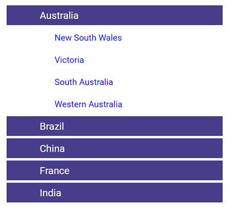

# Customize TreeView as Accordion in Blazor TreeView Component

An accordion is a UI pattern where a list of items allows one item to be expanded at a time, while others remain collapsed. Customize the TreeView to behave as an accordion. The following code sample demonstrates how to create an accordion tree.

```cshtml
@using Syncfusion.Blazor.Navigations

<div class="tree-container">
    <SfTreeView TValue="TreeItem" CssClass="accordiontree" @ref="tree" ExpandOn="ExpandAction.Click">
        <TreeViewEvents TValue="TreeItem" NodeSelecting="BeforeSelect"></TreeViewEvents>
        <TreeViewFieldsSettings DataSource="@TreeItems" Id="Id" Text="Name" Child="Child"></TreeViewFieldsSettings>
    </SfTreeView>
</div>
@code{
    List<TreeItem> TreeItems = new List<TreeItem>();
    SfTreeView<TreeItem> tree;
    public List<string> ExpandedNodes = new List<string>();
    async void BeforeSelect(NodeSelectEventArgs args)
    {
        this.tree.CollapseAllAsync();
    }
    protected override void OnInitialized()
    {
        base.OnInitialized();
        TreeItems.Add(new TreeItem
        {
            Id = 1,
            Name = "Australia",
            Child = new List<TreeItem>()
            {
                new TreeItem
                {
                    Id = 2,
                    Name = "New South Wales",
                },
                        new TreeItem
                {
                    Id = 3,
                    Name = "Victoria"
                },
                        new TreeItem
                {
                    Id = 4,
                    Name = "South Australia"
                },
                        new TreeItem
                {
                    Id = 6,
                    Name = "Western Australia",
                }
            }
        });
        TreeItems.Add(new TreeItem
        {
            Id = 7,
            Name = "Brazil",
            Child = new List<TreeItem>()
            {
                new TreeItem
                {
                    Id = 8,
                    Name = "Paraná"
                },
                new TreeItem
                {
                    Id = 9,
                    Name = "Ceará"
                },
                new TreeItem
                {
                    Id = 10,
                    Name = "Acre"
                }
            }
        });
        TreeItems.Add(new TreeItem
        {
            Id = 11,
            Name = "China",
            Child = new List<TreeItem>()
            {
                new TreeItem
                {
                    Id = 12,
                    Name = "Guangzhou"
                },
                new TreeItem
                {
                    Id = 13,
                    Name = "Shanghai"
                },
                new TreeItem
                {
                    Id = 14,
                    Name = "Beijing"
                },
                new TreeItem
                {
                    Id = 15,
                    Name = "Shantou"
                }
            }
        });
        TreeItems.Add(new TreeItem
        {
            Id = 16,
            Name = "France",
            Child = new List<TreeItem>()
            {
                new TreeItem
                {
                    Id = 17,
                    Name = "Pays de la Loire"
                },
                new TreeItem
                {
                    Id = 18,
                    Name = "Aquitaine"
                },
                new TreeItem
                {
                    Id = 19,
                    Name = "Brittany"
                },
                new TreeItem
                {
                    Id = 20,
                    Name = "Lorraine"
                }
            }
        });
        TreeItems.Add(new TreeItem
        {
            Id = 21,
            Name = "India",
            Child = new List<TreeItem>()
        {
                new TreeItem
                {
                    Id = 22,
                    Name = "Assam"
                },
                new TreeItem
                {
                    Id = 23,
                    Name = "Bihar"
                },
                new TreeItem
                {
                    Id = 24,
                    Name = "Tamil Nadu"
                }
            }
        });
    }
    class TreeItem
    {
        public int Id { get; set; }
        public string? Name { get; set; }
        public bool HasChild { get; set; }
        public bool Expanded { get; set; }
        public List<TreeItem> Child;
    }
}

<style>

    /*To display border for the tree*/
    .tree-container {
        max-width: 350px;
        max-height: 350px;
        margin: auto;
        overflow: auto;
    }

    /* To change the background color for the first level nodes*/
    .accordiontree .e-list-item.e-level-1 > .e-fullrow, .accordiontree .e-list-item.e-level-1.e-active > .e-fullrow, .accordiontree .e-list-item.e-level-1.e-hover > .e-fullrow, .accordiontree .e-list-item.e-level-1 > .e-fullrow, .accordiontree .e-list-item.e-level-1.e-active.e-hover > .e-fullrow {
        background-color: darkslateblue;
        border-color: darkslateblue;
    }

    /*To change the text color for the first level nodes*/
    .accordiontree .e-list-item.e-level-1 > .e-text-content .e-list-text, .accordiontree .e-list-item.e-level-1.e-active > .e-text-content .e-list-text, .accordiontree .e-list-item.e-level-1.e-hover > .e-text-content .e-list-text, .accordiontree .e-list-item.e-level-1.e-active.e-hover > .e-text-content .e-list-text {
        color: white;
        font-size: 16px;
    }

    /*To hide the expand and collapse icon*/
    .accordiontree .e-list-item.e-level- .e-icons.e-icon-collapsible, .accordiontree .e-list-item.e-level-1 .e-icons.e-icon-collapsible, .accordiontree .e-list-item.e-level-1 .e-icon-expandable {
        display: none
    }

    /*To change the background color for the second level nodes*/

    .accordiontree .e-list-item.e-level-2 > .e-fullrow, .accordiontree .e-list-item.e-level-2.e-active > .e-fullrow, .accordiontree .e-list-item.e-level-2.e-hover > .e-fullrow, .accordiontree .e-list-item.e-level-2 > .e-fullrow, .accordiontree .e-list-item.e-level-2.e-active.e-hover > .e-fullrow {
        background-color: white;
        border-color: white;
    }

     /*To change the text color for the second level nodes*/
    .accordiontree .e-list-item.e-level-2 > .e-text-content .e-list-text, .accordiontree .e-list-item.e-level-2.e-active > .e-text-content .e-list-text, .accordiontree .e-list-item.e-level-2.e-hover > .e-text-content .e-list-text, .accordiontree .e-list-item.e-level-2.e-active.e-hover > .e-text-content .e-list-text {
        color: blue;
        font-size: 14px;
    }
</style>
```



