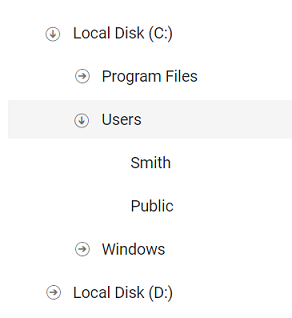
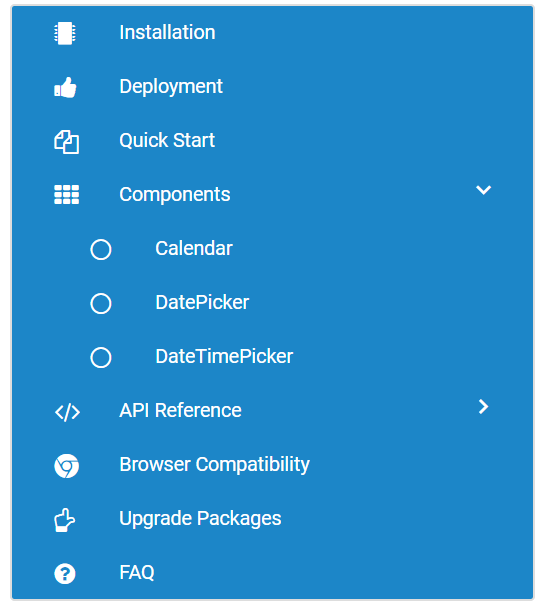

# Customize Expand and Collapse Icons in Blazor TreeView Component

TreeView expand and collapse icons are customized using the [`CssClass`](https://help.syncfusion.com/cr/blazor/Syncfusion.Blazor.Navigations.SfTreeView-1.html#Syncfusion_Blazor_Navigations_SfTreeView_1_CssClass) property of the TreeView component.

The following example demonstrates how to customize the expand and collapse icons.

```cshtml
@using Syncfusion.Blazor.Navigations
<SfTreeView TValue="DriveData" CssClass="custom">
    <TreeViewFieldsSettings TValue="DriveData" Id="NodeId" Text="NodeText" Child="Children" DataSource="@Drive" Expanded="Expanded"></TreeViewFieldsSettings>
</SfTreeView>

@code{
    public class DriveData
    {
        public string? NodeId { get; set; }
        public string? NodeText { get; set; }
        public bool Expanded { get; set; }
        public bool Selected { get; set; }
        public List<DriveData> Children;
    }

    List<DriveData> Drive = new List<DriveData>();

    protected override void OnInitialized()
    {
        base.OnInitialized();

        List<DriveData> Folder1 = new List<DriveData>();

        Drive.Add(new DriveData
        {
            NodeId = "01",
            NodeText = "Local Disk (C:)",
            Expanded = true,
            Children = Folder1,
        });

        List<DriveData> File1 = new List<DriveData>();

        Folder1.Add(new DriveData
        {
            NodeId = "01-01",
            NodeText = "Program Files",
            Children = File1
        });
        File1.Add(new DriveData
        {
            NodeId = "01-01-01",
            NodeText = "Windows NT"
        });

        List<DriveData> File2 = new List<DriveData>();

        Folder1.Add(new DriveData
        {
            NodeId = "01-02",
            NodeText = "Users",
            Expanded = true,
            Children = File2
        });
        File2.Add(new DriveData
        {
            NodeId = "01-02-01",
            NodeText = "Smith"
        });
        File2.Add(new DriveData
        {
            NodeId = "01-02-02",
            NodeText = "Public"
        });

        List<DriveData> File3 = new List<DriveData>();

        Folder1.Add(new DriveData
        {
            NodeId = "01-03",
            NodeText = "Windows",
            Children = File3
        });
        File3.Add(new DriveData
        {
            NodeId = "01-03-01",
            NodeText = "Boot"
        });

        List<DriveData> Folder2 = new List<DriveData>();

        Drive.Add(new DriveData
        {
            NodeId = "02",
            NodeText = "Local Disk (D:)",
            Children = Folder2,
        });
        Folder2.Add(new DriveData
        {
            NodeId = "02-01",
            NodeText = "Personals"
        });
        Folder2.Add(new DriveData
        {
            NodeId = "02-02",
            NodeText = "Projects"
        });
    }
}

<style>
    .custom .e-list-item .e-icons {
        font-family: "Customize-icon";
    }

    .custom.e-treeview .e-list-item div.e-icons.e-icon-expandable::before,
    .custom.e-treeview .e-list-item div.e-icons.e-icon-collapsible::before {
        content: '\e700';
        font-size: 12px;
    }

    .e-treeview.custom .e-icons.e-icon-collapsible, .e-treeview.custom .e-icons.e-icon-expandable {
        margin-top: 8px;
    }

    @@font-face {
        font-family: 'Customize-icon';
        src: url(data:application/x-font-ttf;charset=utf-8;base64,AAEAAAAKAIAAAwAgT1MvMj0gSRcAAAEoAAAAVmNtYXDnEOdaAAABjAAAADhnbHlmcYqIngAAAcwAAAD8aGVhZBWT124AAADQAAAANmhoZWEHmANtAAAArAAAACRobXR4C9AAAAAAAYAAAAAMbG9jYQBAAH4AAAHEAAAACG1heHABEAAxAAABCAAAACBuYW1l/qscPAAAAsgAAAJ5cG9zdIPGFvoAAAVEAAAAVgABAAADUv9qAFoEAAAA//8D6QABAAAAAAAAAAAAAAAAAAAAAwABAAAAAQAAIKcGUl8PPPUACwPoAAAAANlGSVAAAAAA2UZJUAAAAAAD6QPpAAAACAACAAAAAAAAAAEAAAADACUAAwAAAAAAAgAAAAoACgAAAP8AAAAAAAAAAQPwAZAABQAAAnoCvAAAAIwCegK8AAAB4AAxAQIAAAIABQMAAAAAAAAAAAAAAAAAAAAAAAAAAAAAUGZFZABA5wDnAQNS/2oAWgPpAJYAAAABAAAAAAAABAAAAAPoAAAD6AAAAAAAAgAAAAMAAAAUAAMAAQAAABQABAAkAAAABAAEAAEAAOcB//8AAOcA//8AAAABAAQAAAABAAIAAAAAAEAAfgADAAAAAAPpA+kACAAWACQAAAEhFSEHMzcnIyUWEAcGICcmEDc+ATIWBQYQFxYgNzYQJy4BIgYCMf6kAWqUqMK8rgF+goKK/qCEfn5Coquf/amRkZoBkpqRkUq3xLcCKmSTybt4if6ghYKChQFgiUJBQRma/m6akZGaAZKaSElJAAMAAAAAA+gD6QAGABQAIgAAASMXNyMRIyUWEAcGICcmEDc+ATIWBQYQFxYgNzYQJy4BIgYBvrLp6JmGAW6BgYf+oYiBgUGhqqH9qZOTmgGOmpOTSrbCtgGy6ekBbwuI/qGHgYGIAV6IQEFBFpr+cZmTk5oBj5lKSUkAAAAAABIA3gABAAAAAAAAAAEAAAABAAAAAAABAA4AAQABAAAAAAACAAcADwABAAAAAAADAA4AFgABAAAAAAAEAA4AJAABAAAAAAAFAAsAMgABAAAAAAAGAA4APQABAAAAAAAKACwASwABAAAAAAALABIAdwADAAEECQAAAAIAiQADAAEECQABABwAiwADAAEECQACAA4ApwADAAEECQADABwAtQADAAEECQAEABwA0QADAAEECQAFABYA7QADAAEECQAGABwBAwADAAEECQAKAFgBHwADAAEECQALACQBdyBDdXN0b21pemUtaWNvblJlZ3VsYXJDdXN0b21pemUtaWNvbkN1c3RvbWl6ZS1pY29uVmVyc2lvbiAxLjBDdXN0b21pemUtaWNvbkZvbnQgZ2VuZXJhdGVkIHVzaW5nIFN5bmNmdXNpb24gTWV0cm8gU3R1ZGlvd3d3LnN5bmNmdXNpb24uY29tACAAQwB1AHMAdABvAG0AaQB6AGUALQBpAGMAbwBuAFIAZQBnAHUAbABhAHIAQwB1AHMAdABvAG0AaQB6AGUALQBpAGMAbwBuAEMAdQBzAHQAbwBtAGkAegBlAC0AaQBjAG8AbgBWAGUAcgBzAGkAbwBuACAAMQAuADAAQwB1AHMAdABvAG0AaQB6AGUALQBpAGMAbwBuAEYAbwBuAHQAIABnAGUAbgBlAHIAYQB0AGUAZAAgAHUAcwBpAG4AZwAgAFMAeQBuAGMAZgB1AHMAaQBvAG4AIABNAGUAdAByAG8AIABTAHQAdQBkAGkAbwB3AHcAdwAuAHMAeQBuAGMAZgB1AHMAaQBvAG4ALgBjAG8AbQAAAAACAAAAAAAAAAoAAAAAAAAAAAAAAAAAAAAAAAAAAAAAAAMBAgEDAQQAFy1hcnJvdy1jaXJjbGUtcmlnaHQtXzAxEi1hcnJvdy1jaXJjbGUtZG93bgAAAAA=) format('truetype');
        font-weight: normal;
        font-style: normal;
    }
</style>

```





## Customize Expand/Collapse Icon Position and Color

The position and color of the expand or collapse icons are customized using CSS. Additionally, custom icons for nodes are added using the `IconCss` property of `TreeViewFieldsSettings`.

```cshtml
@using Syncfusion.Blazor.Navigations
<div id="treeview">
    <SfTreeView TValue="TreeViewData" CssClass="custom-tree">
        <TreeViewFieldsSettings Id="NodeId" ParentID="ParentId" DataSource="@ListData" Text="NodeText" HasChildren="HasChild" Expanded="Expanded" IconCss="IconCss"></TreeViewFieldsSettings>
    </SfTreeView>
</div>

@code
{
    public class TreeViewData
    {
        public string? NodeId { get; set; }
        public string? NodeText { get; set; }
        public string? ParentId { get; set; }
        public bool HasChild { get; set; }
        public string? IconCss { get; set; }
        public bool Expanded { get; set; }

    }

    List<TreeViewData> ListData = new List<TreeViewData>();

    protected override void OnInitialized()
    {
        base.OnInitialized();
        ListData = new List<TreeViewData>();
        ListData.Add(new TreeViewData
        {
            NodeId = "1",
            NodeText = "Installation",
            IconCss = "icon-microchip icon"
        });
        ListData.Add(new TreeViewData
        {
            NodeId = "2",
            NodeText = "Deployment",
            IconCss = "icon-thumbs-up-alt icon"
        });
        ListData.Add(new TreeViewData
        {
            NodeId = "3",
            NodeText = "Quick Start",
            IconCss = "icon-docs icon"
        });

        ListData.Add(new TreeViewData
        {
            NodeId = "4",
            NodeText = "Components",
            HasChild = true,
            IconCss = "icon-th icon",
            Expanded = true
        });
        ListData.Add(new TreeViewData
        {
            NodeId = "5",
            ParentId = "4",
            NodeText = "Calendar",
            IconCss = "icon-circle-thin icon"
        });
        ListData.Add(new TreeViewData
        {
            NodeId = "7",
            ParentId = "4",
            IconCss = "icon-circle-thin icon",
            NodeText = "DatePicker",
        });
        ListData.Add(new TreeViewData
        {
            NodeId = "8",
            ParentId = "4",
            IconCss = "icon-circle-thin icon",
            NodeText = "DateTimePicker",
        });
        ListData.Add(new TreeViewData
        {
            NodeId = "9",
            NodeText = "API Reference",
            HasChild = true,
            IconCss = "icon-code icon",
        });
        ListData.Add(new TreeViewData
        {
            NodeId = "10",
            ParentId = "9",
            NodeText = "Calendar",
            IconCss = "icon-circle-thin icon"
        });
        ListData.Add(new TreeViewData
        {
            NodeId = "11",
            ParentId = "9",
            NodeText = "DatePicker",
            IconCss = "icon-circle-thin icon"
        });
        ListData.Add(new TreeViewData
        {
            NodeId = "12",
            IconCss = "icon-chrome icon",
            NodeText = "Browser Compatibility",
        });
        ListData.Add(new TreeViewData
        {
            NodeId = "13",
            NodeText = "Upgrade Packages",
            IconCss = "icon-up-hand icon"
        });
        ListData.Add(new TreeViewData
        {
            NodeId = "14",
            NodeText = "FAQ",
            IconCss = "icon-help-circled icon"
        });
    }
}
<style>
    /*To apply border and background color for treeview*/
    #treeview {
        max-width: 400px;
        margin: auto;
        border: 1px solid #dddddd;
        border-radius: 3px;
        background: #1c86c8;
    }

    /* customize icon styles */
    .e-treeview.custom-tree .e-list-icon {
        font-family: 'fontello';
        font-size: 16px;
        margin-top: -4px;
        color: white;
    }
    /* icon styles */
    @@font-face {
        font-family: 'fontello';
        src: url('data:application/octet-stream;base64,AAEAAAAPAIAAAwBwR1NVQiCLJXoAAAD8AAAAVE9TLzI+JUkyAAABUAAAAFZjbWFw0almQAAAAagAAAIgY3Z0IAbV/vwAABfUAAAAIGZwZ22KkZBZAAAX9AAAC3BnYXNwAAAAEAAAF8wAAAAIZ2x5Zk3OJrMAAAPIAAAPrGhlYWQTw6AfAAATdAAAADZoaGVhB2gDnAAAE6wAAAAkaG10eDHm//YAABPQAAAAOGxvY2EejhqYAAAUCAAAAB5tYXhwAfYMkAAAFCgAAAAgbmFtZcydHiAAABRIAAACzXBvc3RuKDzPAAAXGAAAALRwcmVw5UErvAAAI2QAAACGAAEAAAAKADAAPgACREZMVAAObGF0bgAaAAQAAAAAAAAAAQAAAAQAAAAAAAAAAQAAAAFsaWdhAAgAAAABAAAAAQAEAAQAAAABAAgAAQAGAAAAAQAAAAEDkAGQAAUAAAJ6ArwAAACMAnoCvAAAAeAAMQECAAACAAUDAAAAAAAAAAAAAAAAAAAAAAAAAAAAAFBmRWQAQOgB6BMDUv9qAFoDUgCaAAAAAQAAAAAAAAAAAAUAAAADAAAALAAAAAQAAAF0AAEAAAAAAG4AAwABAAAALAADAAoAAAF0AAQAQgAAAAYABAABAALoCegT//8AAOgB6BD//wAAAAAAAQAGABYAAAABAAIAAwAEAAUABgAHAAgACQAKAAsADAANAAABBgAAAAAAAAAAAAAAAAAAAAAAAAAAAAAAAAAAAAAAAAAAAAAAAAAAAAAAAAAAAAAAAAAAAAAAAAAAAAAAAAAAAAAAAAAAAAAAAAAAAAAAAAAAAAAAAAAAAAAAAAAAAAAAAAAAAAAAAAAAAAAAAAAAAAAAAAAAAAAAAAAAAAAAAAAAAAAAAAAAAAAAAAAAAAAAAAAAAAAAAAAAAAAAAAAAAAAAAAAAAAAAAAAAAAAAAAAAAAAAAAAAAAAAAAAAAAAAAAAAAAAAAAAAAAAAAAAAAAAAAAAAAAAAAAAAAAAAAAAAAAAAAAAAAAAAAAAAAAAAAAAAAAAAAAAAAAAAAAAAAAAAAAAMAAAAAACsAAAAAAAAAA0AAOgBAADoAQAAAAEAAOgCAADoAgAAAAIAAOgDAADoAwAAAAMAAOgEAADoBAAAAAQAAOgFAADoBQAAAAUAAOgGAADoBgAAAAYAAOgHAADoBwAAAAcAAOgIAADoCAAAAAgAAOgJAADoCQAAAAkAAOgQAADoEAAAAAoAAOgRAADoEQAAAAsAAOgSAADoEgAAAAwAAOgTAADoEwAAAA0AAwAA//kDWgLEAA8AHwAvADdANCgBBAUIAAIAAQJHAAUABAMFBGAAAwACAQMCYAABAAABVAABAQBYAAABAEwmNSY1JjMGBRorJRUUBgchIiYnNTQ2NyEyFgMVFAYnISImJzU0NhchMhYDFRQGIyEiJic1NDYXITIWA1kUEPzvDxQBFg4DEQ8WARQQ/O8PFAEWDgMRDxYBFBD87w8UARYOAxEPFmRHDxQBFg5HDxQBFgEQSA4WARQPSA4WARQBDkcOFhYORw8WARQAAAAABQAA/2oD6ANSAB8AIgAlADMAPABsQGkjAQAGHQEJACcgAgcFA0cMAQAACQUACV4ABQAHBAUHYAAEAAoIBApgAAgAAgsIAmAABgYDWAADAwxIDQELCwFYAAEBDQFJNDQBADQ8NDw7OTY1MC8uLCkoJSQiIRoXDgwJBgAfAR4OBRQrATIWFxEUBgchIiYnNSEiJicRNDY/AT4BOwEyFhcVNjMPATMBBzMXNzUjFRQGByMRITU0NgERIxUUBicjEQOyFx4BIBb96RceAf7RFx4BFhDkDzYW6BceASYhR6en/punp22w1h4X6QEeFgIm1x4X6AJ8IBb9WhceASAWoCAWAXcWNg/kEBYgFrcXd6cBfafCsOnpFh4B/puPFjb+TgKD6BYgAf6aAAAJAAD/+QPoAwsADwAfAC8APwBPAF8AbwB/AI8AT0BMEQ0CBxAMAgYDBwZgDwkCAw4IAgIBAwJgCwUCAQAAAVQLBQIBAQBYCgQCAAEATI6LhoN+e3ZzbmtmY15bVlNOSzU1NTU1NTU1MxIFHSslFRQGByMiJic1NDYXMzIWExUUBicjIiYnNTQ2NzMyFgEVFAYHIyImJzU0NhczMhYBFRQGKwEiJic1NDY7ATIWARUUBicjIiYnNTQ2NzMyFgEVFAYHIyImPQE0NhczMhYBFRQGKwEiJic1NDY7ATIWARUUBicjIiY9ATQ2NzMyFhMVFAYrASImPQE0NjsBMhYBHiAWshceASAWshceASAWshceASAWshceAWYgFrIXHgEgFrIXHv6cIBayFx4BIBayFx4BZiAWshceASAWshceAWYgFrIWICAWshce/pwgFrIXHgEgFrIXHgFmIBayFiAgFrIXHgEgFrIWICAWshcemmwWHgEgFWwWIAEeAQZrFiABHhdrFx4BIP7NbBYeASAVbBYgAR4CJGsWICAWaxYgIP7MaxYgAR4XaxceASD+zWwWHgEgFWwWIAEeAiRrFiAgFmsWICD+zGsWIAEeF2sXHgEgAQhrFiAgFmsWICAAAAMAAP+5BBYCugAUACQAOQAeQBsuEQIAAQFHAwEBAAFvAgEAAGY1NCgnFxIEBRYrJQcGIicBJjQ3ATYyHwEWFA8BFxYUAQMOAS8BLgE3Ez4BHwEeAQkBBiIvASY0PwEnJjQ/ATYyFwEWFAFYHAUOBv78BgYBBAUQBBwGBtvbBgFE0AIOBiIIBgHRAgwHIwcIAWz+/AYOBhwFBdvbBQUcBg4GAQQFRRwFBQEFBQ4GAQQGBhwFEATc2wYOAk79LwcIAwkDDAgC0AgGAQoCDv6P/vsFBRwGDgbb3AUOBhwGBv78BRAAAAMAAP+xA30DCwAIABgAVQBOQEtKAQgHHxsCAAMAAQEAMRECAgEERwAHCAdvAAgDCG8GAQMAA28AAAEAbwAEAgRwAAECAgFUAAEBAlgFAQIBAkwvLBUkPyY1ExIJBR0rNzQuAQ4BHgE2ExEUBgcjIiYnETQ2FzMyFgUUBxYVFgcWBwYHFgcGByMiLgEnJiciJicRND4CNzY3PgI3PgMzMh4EBhcUDgEHDgIHMzIWjxYdFAEWHRRaFBCgDxQBFg6gDxYClB8JARkJCQkWBSAkSkglVjIqRRMPFAEUGzocJhIKDgYFBAYQFQ8ZKhgUCAYCAgwIDAEIBAObK0BkDxQBFh0UARYBLP6bDxQBFg4BZQ4WARQPMCMZEioiHyMfFT4nKwESDg8YARYOAWUOFgFAIzESCiIUGBYYIhYMEhoYIBINFSwWFAQMDgZAAAAACwAA/7EDWQNSAA8AHwAvAD8ATwBfAG8AfwCPAJ8ArwD6QPesARITnAEODzkBDQ6MLQIKC3wBBgdsAQIDBkcAFAAUcCkBEiYBERASEWAoLgITJwEQDxMQYCUBDiIBDQwODWAkLQIPIwEMCw8MYCEBCh4BCQgKCWAgLAILHwEIBwsIYB0BBhoBBQQGBWAcKwIHGwEEAwcEYBkBAhYBAQACAWAYKgIDFwEAFAMAYAAVFQwVSUBAMDAgIBAQAACvraqpqKakop+dmpmYlpSSj42KiYiGhIJ/fXp5eHZ0cm9tamloZmRiXltWU0BPQE5MSkdFQ0EwPzA+PDs3NTMxIC8gLywqJyUjIRAfEB4cGhcVExEADwAOIyIhLwUXKzcVIyI9ASMiPQE0OwE1NDM3FSMiPQEjIj0BNDsBNTQzNxUjIj0BIyI9ATQ7ATU0MzcVIyI9ASMiPQE0OwE1NDM3FSMiPQEjIj0BNDsBNTQzJREUBiMhIiYnETQ2NyEyFhMVFCsBFRQrATUzMh0BMzI1FRQrARUUKwE1MzIdATMyNRUUKwEVFCsBNTMyHQEzMjUVFCsBFRQrATUzMh0BMzI1FRQrARUUKwE1MzIdATMyaz4JGwkJGwk+PgkbCQkbCT4+CRsJCRsJPj4JGwkJGwk+PgkbCQkbCQKdHhf+LxYeASAVAdEWII4JGwg/PwgbCQkbCD8/CBsJCRsIPz8IGwkJGwg/PwgbCQkbCD8/CBsJiEgJCQkSCQkJj0gJCQkSCQkJjkcJCQkSCQkIj0cJCQkSCAkJj0cJCQkRCQkJWfzLFiAgFgM1Fx4BIP07EgkJCUgJCYYSCQkJSAkJhhIJCQlHCAmGEgkJCUcJCYYRCQkJRwkJAAAEAAD/ZgPzA1IADwAeACwAOQDhS7AJUFhADwQBAQAFAQUCGhkCAwUDRxtLsApQWEAPBAEBAAUBBQQaGQIDBQNHG0APBAEBAAUBBQIaGQIDBQNHWVlLsAlQWEAkAAEAAgABAm0HBAICBQACBWsABQMABQNrBgEAAAxIAAMDDQNJG0uwClBYQCoAAQACAAECbQACBAACBGsHAQQFAAQFawAFAwAFA2sGAQAADEgAAwMNA0kbQCQAAQACAAECbQcEAgIFAAIFawAFAwAFA2sGAQAADEgAAwMNA0lZWUAXLi0BADQzLTkuOSYlIB8KCQAPAQ8IBRQrAQYHBgcXPgIXBSYnJicmBQYHBhUUFx4BFzcGLgEnAQUeAQYHAxY2NzY3PgElIg4BFB4BMj4BNC4BAfJwZWdHmhNSbDoBniAxMkFz/dcoFBY4N8F3gDlwWBgCuf7mJh0UIuJIjUFqQj8Z/gIuTS4uTVxNLi5NA1IBMDFY7TdRKAYWQDQ2JkPiPEVGS3tsaYwS/AseSjUBFA8scHIv/qUFISY9Z2TtZS5NXE0uLk1cTS4AAAAAAv/9/7EDXwMLABAAHQArQCgAAwQBAAEDAGAAAQICAVQAAQECWAACAQJMAQAbGhUUCQgAEAEQBQUUKwEiDgMeAj4DNC4CARQOASIuAj4BMh4BAa1JhGA4AjxciI6GXjo6XoYBZXLG6MhuBnq89Lp+AsM4YISShF48BDRmfJp8aDD+n3XEdHTE6sR0dMQAAAAAAv///2oDoQMNAAgAIQArQCgfAQEADgEDAQJHAAQAAAEEAGAAAQADAgEDYAACAg0CSRcjFBMSBQUZKwE0LgEGFBY+AQEUBiIvAQYjIi4CPgQeAhcUBxcWAoOS0JKS0JIBHiw6FL9ke1CSaEACPGyOpI5sPAFFvxUBgmeSApbKmAaM/podKhW/RT5qkKKObjoEQmaWTXtkvxUAAAAAAv/9/2oDWQNSACYATQA8QDlFQj8NBwUGAAFLSEY+DgUDACIaAgIDA0cAAAEDAQADbQABAQxIAAMDAlgAAgINAkksKyAeFxIEBRYrET4BNzYXNjc1PgEyFhcTNhceAQcOAQcOAgcVFAYHISImJzU0LgE3HgIXITU+ATc+AT8BMjY3NicuAQ4BBxEuAScOAQcVJgcmBgcmBgJKSTNEGSACRmtEBQFeTDc2FxdwFRciUhEmGf6lGiQDHBY+AhYcAQFbEG4NFUIWRQQGAQQNFkg8WBYCIhwYIgMxOhpCDj46AaM8TAQrChAGazVMSDn+7y0cE3Y4FhALDipMFpsZJAMmGqochHQdN2x6FwMmYhMZIAQNAgQVGiMOFiIDAW0bJAICJBu/MTsQEhsJOAAAAgAA/74CygMLAAUAIgAyQC8UBQMCBAIAAUcDAQIAAnAEAQEAAAFUBAEBAQBWAAABAEoHBhgWEhAGIgchEAUFFSsBIREBHwETMhceARcRFAYHBiMiLwEHBiMiJy4BNRE0Njc2MwKD/cQBHjLsBwwMExQBFhIKDhsU9vYUGg0MEhYWEgwNAsP9SwESL+MC/QUIHhT9MRMgBwQS7OwTBQcgEwLPEyAHBQAABgAA/2oDWQNSABMAGgAjADMAQwBTAHJAbxQBAgQsJAIHBkA4AggJUEgCCgsERwACAAMGAgNgAAYABwkGB2ANAQkACAsJCGAOAQsACgULCmAABAQBWAABAQxIDAEFBQBYAAAADQBJREQ0NBsbRFNEUkxKNEM0Qjw6MC4oJhsjGyMTJhQ1Ng8FGSsBHgEVERQGByEiJicRNDY3ITIWFwcVMyYvASYTESMiJic1IRETNDYzITIWHQEUBiMhIiY1BTIWHQEUBiMhIiY9ATQ2MwUyFh0BFAYjISImPQE0NjMDMxAWHhf9EhceASAWAfQWNg9K0gUHrwbG6BceAf5TjwoIAYkICgoI/ncICgGbCAoKCP53CAoKCAGJCAoKCP53CAoKCAJ+EDQY/X4XHgEgFgN8Fx4BFhAm0hEGrwf8sAI8IBXp/KYB4wcKCgckCAoKCFkKCCQICgoIJAgKjwoIJAgKCggkCAoAAAAAA//9/7EDXwMLAA8ANwBEAEhARSkBBQMJAQIBAAJHAAQCAwIEA20AAwUCAwVrAAcAAgQHAmAABQAAAQUAYAABBgYBVAABAQZYAAYBBkwVHisTFiYmIwgFHCslNTQmKwEiBh0BFBY7ATI2EzQuASMiBwYfARYzMjc+ATIWFRQGBw4BFxUUFjsBMjY0Nj8BPgMXFA4BIi4CPgEyHgEB9AoIawgKCghrCAqPPlwxiEcJDUoEBgkFHiU4KhYbIzwBCghrCAoYEhwKHhQM13LG6MhuBnq89Lp+UmsICgoIawgKCgF/MVQudw0LNwQHJhseEhUaDA9CJRQICgoSIgsQBhocKFJ1xHR0xOrEdHTEAAEAAAABAACCKpnPXw889QALA+gAAAAA2EiuQQAAAADYSK5B//3/ZgQWA1IAAAAIAAIAAAAAAAAAAQAAA1L/agAABC///f/0BBYAAQAAAAAAAAAAAAAAAAAAAA4D6AAAA1kAAAPoAAAD6AAABC8AAAOgAAADWQAAA+gAAANZ//0DoP//A03//QLKAAADWQAAA1n//QAAAAAAZgD6AegCWgMABEgFHAVkBbIGSAacB1AH1gAAAAEAAAAOALAACwAAAAAAAgBeAG4AcwAAAQsLcAAAAAAAAAASAN4AAQAAAAAAAAA1AAAAAQAAAAAAAQAIADUAAQAAAAAAAgAHAD0AAQAAAAAAAwAIAEQAAQAAAAAABAAIAEwAAQAAAAAABQALAFQAAQAAAAAABgAIAF8AAQAAAAAACgArAGcAAQAAAAAACwATAJIAAwABBAkAAABqAKUAAwABBAkAAQAQAQ8AAwABBAkAAgAOAR8AAwABBAkAAwAQAS0AAwABBAkABAAQAT0AAwABBAkABQAWAU0AAwABBAkABgAQAWMAAwABBAkACgBWAXMAAwABBAkACwAmAclDb3B5cmlnaHQgKEMpIDIwMTggYnkgb3JpZ2luYWwgYXV0aG9ycyBAIGZvbnRlbGxvLmNvbWZvbnRlbGxvUmVndWxhcmZvbnRlbGxvZm9udGVsbG9WZXJzaW9uIDEuMGZvbnRlbGxvR2VuZXJhdGVkIGJ5IHN2ZzJ0dGYgZnJvbSBGb250ZWxsbyBwcm9qZWN0Lmh0dHA6Ly9mb250ZWxsby5jb20AQwBvAHAAeQByAGkAZwBoAHQAIAAoAEMAKQAgADIAMAAxADgAIABiAHkAIABvAHIAaQBnAGkAbgBhAGwAIABhAHUAdABoAG8AcgBzACAAQAAgAGYAbwBuAHQAZQBsAGwAbwAuAGMAbwBtAGYAbwBuAHQAZQBsAGwAbwBSAGUAZwB1AGwAYQByAGYAbwBuAHQAZQBsAGwAbwBmAG8AbgB0AGUAbABsAG8AVgBlAHIAcwBpAG8AbgAgADEALgAwAGYAbwBuAHQAZQBsAGwAbwBHAGUAbgBlAHIAYQB0AGUAZAAgAGIAeQAgAHMAdgBnADIAdAB0AGYAIABmAHIAbwBtACAARgBvAG4AdABlAGwAbABvACAAcAByAG8AagBlAGMAdAAuAGgAdAB0AHAAOgAvAC8AZgBvAG4AdABlAGwAbABvAC4AYwBvAG0AAAAAAgAAAAAAAAAKAAAAAAAAAAAAAAAAAAAAAAAAAAAAAAAOAQIBAwEEAQUBBgEHAQgBCQEKAQsBDAENAQ4BDwAEbWVudQRkb2NzAnRoBGNvZGUNdGh1bWJzLXVwLWFsdAltaWNyb2NoaXAGY2hyb21lC2NpcmNsZS10aGluCHNlYXJjaC0xB3VwLWhhbmQOYm9va21hcmstZW1wdHkIZG9jLXRleHQMaGVscC1jaXJjbGVkAAAAAQAB//8ADwAAAAAAAAAAAAAAAAAAAAAAGAAYABgAGANS/2YDUv9msAAsILAAVVhFWSAgS7gADlFLsAZTWliwNBuwKFlgZiCKVViwAiVhuQgACABjYyNiGyEhsABZsABDI0SyAAEAQ2BCLbABLLAgYGYtsAIsIGQgsMBQsAQmWrIoAQpDRWNFUltYISMhG4pYILBQUFghsEBZGyCwOFBYIbA4WVkgsQEKQ0VjRWFksChQWCGxAQpDRWNFILAwUFghsDBZGyCwwFBYIGYgiophILAKUFhgGyCwIFBYIbAKYBsgsDZQWCGwNmAbYFlZWRuwAStZWSOwAFBYZVlZLbADLCBFILAEJWFkILAFQ1BYsAUjQrAGI0IbISFZsAFgLbAELCMhIyEgZLEFYkIgsAYjQrEBCkNFY7EBCkOwAWBFY7ADKiEgsAZDIIogirABK7EwBSWwBCZRWGBQG2FSWVgjWSEgsEBTWLABKxshsEBZI7AAUFhlWS2wBSywB0MrsgACAENgQi2wBiywByNCIyCwACNCYbACYmawAWOwAWCwBSotsAcsICBFILALQ2O4BABiILAAUFiwQGBZZrABY2BEsAFgLbAILLIHCwBDRUIqIbIAAQBDYEItsAkssABDI0SyAAEAQ2BCLbAKLCAgRSCwASsjsABDsAQlYCBFiiNhIGQgsCBQWCGwABuwMFBYsCAbsEBZWSOwAFBYZVmwAyUjYUREsAFgLbALLCAgRSCwASsjsABDsAQlYCBFiiNhIGSwJFBYsAAbsEBZI7AAUFhlWbADJSNhRESwAWAtsAwsILAAI0KyCwoDRVghGyMhWSohLbANLLECAkWwZGFELbAOLLABYCAgsAxDSrAAUFggsAwjQlmwDUNKsABSWCCwDSNCWS2wDywgsBBiZrABYyC4BABjiiNhsA5DYCCKYCCwDiNCIy2wECxLVFixBGREWSSwDWUjeC2wESxLUVhLU1ixBGREWRshWSSwE2UjeC2wEiyxAA9DVVixDw9DsAFhQrAPK1mwAEOwAiVCsQwCJUKxDQIlQrABFiMgsAMlUFixAQBDYLAEJUKKiiCKI2GwDiohI7ABYSCKI2GwDiohG7EBAENgsAIlQrACJWGwDiohWbAMQ0ewDUNHYLACYiCwAFBYsEBgWWawAWMgsAtDY7gEAGIgsABQWLBAYFlmsAFjYLEAABMjRLABQ7AAPrIBAQFDYEItsBMsALEAAkVUWLAPI0IgRbALI0KwCiOwAWBCIGCwAWG1EBABAA4AQkKKYLESBiuwcisbIlktsBQssQATKy2wFSyxARMrLbAWLLECEystsBcssQMTKy2wGCyxBBMrLbAZLLEFEystsBossQYTKy2wGyyxBxMrLbAcLLEIEystsB0ssQkTKy2wHiwAsA0rsQACRVRYsA8jQiBFsAsjQrAKI7ABYEIgYLABYbUQEAEADgBCQopgsRIGK7ByKxsiWS2wHyyxAB4rLbAgLLEBHistsCEssQIeKy2wIiyxAx4rLbAjLLEEHistsCQssQUeKy2wJSyxBh4rLbAmLLEHHistsCcssQgeKy2wKCyxCR4rLbApLCA8sAFgLbAqLCBgsBBgIEMjsAFgQ7ACJWGwAWCwKSohLbArLLAqK7AqKi2wLCwgIEcgILALQ2O4BABiILAAUFiwQGBZZrABY2AjYTgjIIpVWCBHICCwC0NjuAQAYiCwAFBYsEBgWWawAWNgI2E4GyFZLbAtLACxAAJFVFiwARawLCqwARUwGyJZLbAuLACwDSuxAAJFVFiwARawLCqwARUwGyJZLbAvLCA1sAFgLbAwLACwAUVjuAQAYiCwAFBYsEBgWWawAWOwASuwC0NjuAQAYiCwAFBYsEBgWWawAWOwASuwABa0AAAAAABEPiM4sS8BFSotsDEsIDwgRyCwC0NjuAQAYiCwAFBYsEBgWWawAWNgsABDYTgtsDIsLhc8LbAzLCA8IEcgsAtDY7gEAGIgsABQWLBAYFlmsAFjYLAAQ2GwAUNjOC2wNCyxAgAWJSAuIEewACNCsAIlSYqKRyNHI2EgWGIbIVmwASNCsjMBARUUKi2wNSywABawBCWwBCVHI0cjYbAJQytlii4jICA8ijgtsDYssAAWsAQlsAQlIC5HI0cjYSCwBCNCsAlDKyCwYFBYILBAUVizAiADIBuzAiYDGllCQiMgsAhDIIojRyNHI2EjRmCwBEOwAmIgsABQWLBAYFlmsAFjYCCwASsgiophILACQ2BkI7ADQ2FkUFiwAkNhG7ADQ2BZsAMlsAJiILAAUFiwQGBZZrABY2EjICCwBCYjRmE4GyOwCENGsAIlsAhDRyNHI2FgILAEQ7ACYiCwAFBYsEBgWWawAWNgIyCwASsjsARDYLABK7AFJWGwBSWwAmIgsABQWLBAYFlmsAFjsAQmYSCwBCVgZCOwAyVgZFBYIRsjIVkjICCwBCYjRmE4WS2wNyywABYgICCwBSYgLkcjRyNhIzw4LbA4LLAAFiCwCCNCICAgRiNHsAErI2E4LbA5LLAAFrADJbACJUcjRyNhsABUWC4gPCMhG7ACJbACJUcjRyNhILAFJbAEJUcjRyNhsAYlsAUlSbACJWG5CAAIAGNjIyBYYhshWWO4BABiILAAUFiwQGBZZrABY2AjLiMgIDyKOCMhWS2wOiywABYgsAhDIC5HI0cjYSBgsCBgZrACYiCwAFBYsEBgWWawAWMjICA8ijgtsDssIyAuRrACJUZSWCA8WS6xKwEUKy2wPCwjIC5GsAIlRlBYIDxZLrErARQrLbA9LCMgLkawAiVGUlggPFkjIC5GsAIlRlBYIDxZLrErARQrLbA+LLA1KyMgLkawAiVGUlggPFkusSsBFCstsD8ssDYriiAgPLAEI0KKOCMgLkawAiVGUlggPFkusSsBFCuwBEMusCsrLbBALLAAFrAEJbAEJiAuRyNHI2GwCUMrIyA8IC4jOLErARQrLbBBLLEIBCVCsAAWsAQlsAQlIC5HI0cjYSCwBCNCsAlDKyCwYFBYILBAUVizAiADIBuzAiYDGllCQiMgR7AEQ7ACYiCwAFBYsEBgWWawAWNgILABKyCKimEgsAJDYGQjsANDYWRQWLACQ2EbsANDYFmwAyWwAmIgsABQWLBAYFlmsAFjYbACJUZhOCMgPCM4GyEgIEYjR7ABKyNhOCFZsSsBFCstsEIssDUrLrErARQrLbBDLLA2KyEjICA8sAQjQiM4sSsBFCuwBEMusCsrLbBELLAAFSBHsAAjQrIAAQEVFBMusDEqLbBFLLAAFSBHsAAjQrIAAQEVFBMusDEqLbBGLLEAARQTsDIqLbBHLLA0Ki2wSCywABZFIyAuIEaKI2E4sSsBFCstsEkssAgjQrBIKy2wSiyyAABBKy2wSyyyAAFBKy2wTCyyAQBBKy2wTSyyAQFBKy2wTiyyAABCKy2wTyyyAAFCKy2wUCyyAQBCKy2wUSyyAQFCKy2wUiyyAAA+Ky2wUyyyAAE+Ky2wVCyyAQA+Ky2wVSyyAQE+Ky2wViyyAABAKy2wVyyyAAFAKy2wWCyyAQBAKy2wWSyyAQFAKy2wWiyyAABDKy2wWyyyAAFDKy2wXCyyAQBDKy2wXSyyAQFDKy2wXiyyAAA/Ky2wXyyyAAE/Ky2wYCyyAQA/Ky2wYSyyAQE/Ky2wYiywNysusSsBFCstsGMssDcrsDsrLbBkLLA3K7A8Ky2wZSywABawNyuwPSstsGYssDgrLrErARQrLbBnLLA4K7A7Ky2waCywOCuwPCstsGkssDgrsD0rLbBqLLA5Ky6xKwEUKy2wayywOSuwOystsGwssDkrsDwrLbBtLLA5K7A9Ky2wbiywOisusSsBFCstsG8ssDorsDsrLbBwLLA6K7A8Ky2wcSywOiuwPSstsHIsswkEAgNFWCEbIyFZQiuwCGWwAyRQeLABFTAtAEu4AMhSWLEBAY5ZsAG5CAAIAGNwsQAFQrIAAQAqsQAFQrMKAgEIKrEABUKzDgABCCqxAAZCugLAAAEACSqxAAdCugBAAAEACSqxAwBEsSQBiFFYsECIWLEDZESxJgGIUVi6CIAAAQRAiGNUWLEDAERZWVlZswwCAQwquAH/hbAEjbECAEQAAA==') format('truetype');
    }

    .e-treeview.custom-tree .e-list-icon.icon-microchip::before {
        content: '\e806';
    }

    .e-treeview.custom-tree .e-list-icon.icon-thumbs-up-alt::before {
        content: '\e805';
    }

    .e-treeview.custom-tree .e-list-icon.icon-chrome::before {
        content: '\e807';
    }

    .e-treeview.custom-tree .e-list-icon.icon-up-hand::before {
        content: '\e810';
    }

    .e-treeview.custom-tree .e-list-icon.icon-docs::before {
        content: '\e802';
    }

    .e-treeview.custom-tree .e-list-icon.icon-th::before {
        content: '\e803';
    }

    .e-treeview.custom-tree .e-list-icon.icon-code::before {
        content: '\e804';
    }

    .e-treeview.custom-tree .e-list-icon.icon-help-circled::before {
        content: '\e813';
    }

    .e-treeview.custom-tree .e-list-icon.icon-circle-thin::before {
        content: '\e808';
    }

    /*To float the expand/collapse icon right*/
    .e-treeview.custom-tree .e-icon-collapsible, .e-treeview .e-icon-expandable {
        float: right;
    }
     /*To customize the expand collapse icon color*/
    .e-treeview.custom-tree .e-icon-collapsible::before, .e-treeview.custom-tree .e-icon-expandable::before {
        color: white;
    }
    .e-treeview.custom-tree .e-icons.e-icon-collapsible, .e-treeview.custom-tree .e-icons.e-icon-expandable {
        margin-top:8px;
    }
    /*To change the text color for treeview*/
    .e-treeview .e-text-content > .e-list-text {
        color: white;
    }
</style>
```




## Increase Padding Between Text, Expand/Collapse Icons, and Custom Icons

The spacing between the text, expand/collapse icons, and custom element icons is increased by adjusting the following CSS properties within the previous sample's style block.

```csharp

/* customize icon styles */
    .e-treeview.custom-tree .e-list-icon {
        font-family: 'fontello';
        font-size: 16px;
        margin-top: -4px;
        color: white;
        /*To increase the padding between icon and text*/
        margin-left: -20px;
    }

    /*To float the expand/collapse icon right*/
    .e-treeview.custom-tree .e-icon-collapsible, .e-treeview .e-icon-expandable {
        float: right;
        /*To increase the space between the text and chevron*/
        margin-right: 20px;
    }
     /*To change the text color for treeview*/
    .e-treeview .e-text-content > .e-list-text {
        color: white;
        /*To increase the padding between the text*/
        padding-left: 25px;
    }
```

