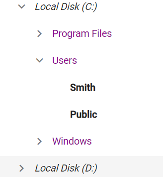

# Customize the tree nodes based on levels

You can customize the tree nodes level wise by adding custom CssClass to the component and enabling styles.

```csharp
@using Syncfusion.Blazor.Navigations
<SfTreeView TValue="DriveData" CssClass="mytree">
    <TreeViewFieldsSettings TValue="DriveData" Id="NodeId" Text="NodeText" Child="Children" DataSource="@Drive" Expanded="Expanded"></TreeViewFieldsSettings>
</SfTreeView>
<div id="details">
    <label>Note:</label>
    <div><b>1. The font-weight "Bold" is applied for all the leaf nodes</b></div>
    <div><i>2. The font-weight "Italic" is applied for first level nodes</i></div>
    <div style="color: darkmagenta">3. The color "darkmagenta" is applied for second level nodes</div>
</div>

@code{
    public class DriveData
    {
        public string NodeId { get; set; }
        public string NodeText { get; set; }
        public bool Expanded { get; set; }
        public bool Selected { get; set; }
        public List<DriveData> Children;
    }

    object Child;
    List<DriveData> Drive = new List<DriveData>();

    protected override void OnInitialized()
    {
        base.OnInitialized();

        List<DriveData> Folder1 = new List<DriveData>();

        Drive.Add(new DriveData
        {
            NodeId = "01",
            NodeText = "Local Disk (C:)",
            Expanded = true,
            Children = Folder1,
        });

        List<DriveData> File1 = new List<DriveData>();

        Folder1.Add(new DriveData
        {
            NodeId = "01-01",
            NodeText = "Program Files",
            Children = File1
        });
        File1.Add(new DriveData
        {
            NodeId = "01-01-01",
            NodeText = "Windows NT"
        });

        List<DriveData> File2 = new List<DriveData>();

        Folder1.Add(new DriveData
        {
            NodeId = "01-02",
            NodeText = "Users",
            Expanded = true,
            Children = File2
        });
        File2.Add(new DriveData
        {
            NodeId = "01-02-01",
            NodeText = "Smith"
        });
        File2.Add(new DriveData
        {
            NodeId = "01-02-02",
            NodeText = "Public"
        });

        List<DriveData> File3 = new List<DriveData>();

        Folder1.Add(new DriveData
        {
            NodeId = "01-03",
            NodeText = "Windows",
            Children = File3
        });
        File3.Add(new DriveData
        {
            NodeId = "01-03-01",
            NodeText = "Boot"
        });

        List<DriveData> Folder2 = new List<DriveData>();

        Drive.Add(new DriveData
        {
            NodeId = "02",
            NodeText = "Local Disk (D:)",
            Children = Folder2,
        });
        Folder2.Add(new DriveData
        {
            NodeId = "02-01",
            NodeText = "Personals"
        });
        Folder2.Add(new DriveData
        {
            NodeId = "02-02",
            NodeText = "Projects"
        });
        this.Child = "Children";
    }
}

<style>

    .mytree .e-level-1 > .e-text-content .e-list-text {
        font-style: italic;
    }

    .mytree .e-level-2 > .e-text-content .e-list-text {
        color: darkmagenta;
    }

    .mytree .e-level-3 > .e-text-content .e-list-text {
        font-weight: bold;
    }
</style>

```

Output be like the below.


