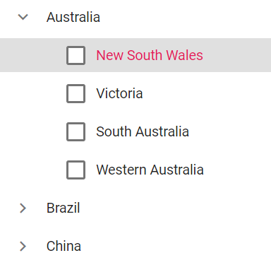

# Remove the check box of the parent nodes alone in TreeView

By enabling the `ShowCheckBox` property, you can render check box before each node of TreeView. However, some application needs to render check box in child nodes alone. In such case, you can remove the check box of the parent node by customizing the CSS.

```csharp
@using Syncfusion.Blazor.Navigations
<SfTreeView TValue="Country" ShowCheckBox="true" CssClass="CustomTree">
    <TreeViewFieldsSettings TValue="Country" Id="Id" DataSource="@Countries" Text="Name" ParentID="ParentId" HasChildren="HasChild" Expanded="Expanded" Selected="IsSelected"></TreeViewFieldsSettings>
</SfTreeView>

@code{
    public class Country
    {
        public int Id { get; set; }
        public int? ParentId { get; set; }
        public string Name { get; set; }
        public bool HasChild { get; set; }
        public bool Expanded { get; set; }
        public bool IsSelected { get; set; }
    }
    List<Country> Countries = new List<Country>();

    protected override void OnInitialized()
    {
        base.OnInitialized();
        Countries.Add(new Country
        {
            Id = 1,
            Name = "Australia",
            HasChild = true,
            Expanded = true
        });
        Countries.Add(new Country
        {
            Id = 2,
            ParentId = 1,
            Name = "New South Wales",
            IsSelected = true
        });
        Countries.Add(new Country
        {
            Id = 3,
            ParentId = 1,
            Name = "Victoria",
            IsSelected = true
        });
        Countries.Add(new Country
        {
            Id = 4,
            ParentId = 1,
            Name = "South Australia"
        });
        Countries.Add(new Country
        {
            Id = 5,
            ParentId = 1,
            Name = "Western Australia"
        });
        Countries.Add(new Country
        {
            Id = 6,
            Name = "Brazil",
            HasChild = true
        });
        Countries.Add(new Country
        {
            Id = 7,
            ParentId = 6,
            Name = "Paraná"
        });
        Countries.Add(new Country
        {
            Id = 8,
            ParentId = 6,
            Name = "Ceará"
        });
        Countries.Add(new Country
        {
            Id = 9,
            Name = "China",
            HasChild = true
        });
        Countries.Add(new Country
        {
            Id = 10,
            ParentId = 9,
            Name = "Guangzhou"
        });
        Countries.Add(new Country
        {
            Id = 11,
            ParentId = 9,
            Name = "Shantou"
        });
    }
}

<style>
    .CustomTree .e-list-item.e-level-1 .e-text-content.e-icon-wrapper
    .e-checkbox-wrapper {
        display: none
    }
</style>
```

Output be like the below.

