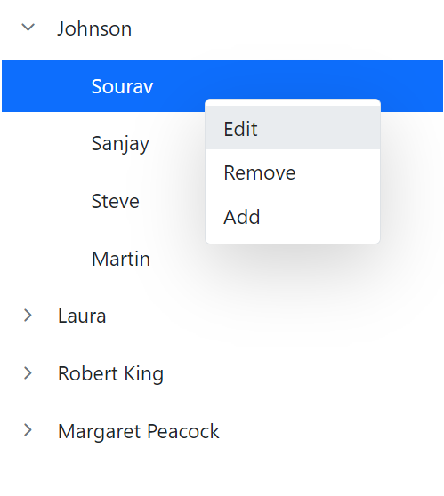

# Integration in Blazor TreeView Component

A Context Menu, Badge, Sidebar, Error boundary components, and Icon library can all be integrated into the Blazor TreeView component.

## Context Menu in Blazor TreeView Component

The Blazor TreeView component integrates seamlessly with a context menu to perform operations such as adding, removing, and renaming nodes.

This is demonstrated in an example where the TreeView operations are manipulated in the `ItemSelected` event of the context menu.

```cshtml
@using Syncfusion.Blazor.Navigations

<div id="treeview">
    <SfTreeView TValue="EmployeeData" @ref="tree" AllowDragAndDrop="true" @bind-SelectedNodes="@selectedNodes" @bind-ExpandedNodes="expandedNodes">
        <TreeViewFieldsSettings Id="Id" ParentID="Pid" DataSource="@ListData" Text="Name" HasChildren="HasChild"></TreeViewFieldsSettings>
        <TreeViewEvents TValue="EmployeeData" NodeSelected="OnSelect" NodeClicked="nodeClicked"></TreeViewEvents>
        <SfContextMenu TValue="MenuItem" @ref="menu" Target="#treeview" Items="@MenuItems">
            <MenuEvents TValue="MenuItem" ItemSelected="MenuSelect"></MenuEvents>
        </SfContextMenu>
    </SfTreeView>
</div>

@code
{
    // Reference for treeview
    SfTreeView<EmployeeData> tree;

    // Reference for context menu
    SfContextMenu<MenuItem> menu;
    string selectedId;
    public string[] selectedNodes = Array.Empty<string>();
    public string[] expandedNodes = new string[] {  };
    int index = 100;

    // Datasource for menu items
    public List<MenuItem> MenuItems = new List<MenuItem>{
        new MenuItem { Text = "Edit" },
        new MenuItem { Text = "Remove" },
        new MenuItem { Text = "Add" }
    };

    public class EmployeeData
    {
        public string? Id { get; set; }
        public string? Name { get; set; }
        public string? Pid { get; set; }
        public bool HasChild { get; set; }
    }

    // Triggers when TreeView Node is selected
    public void OnSelect(NodeSelectEventArgs args)
    {
        this.selectedId = args.NodeData.Id;
    }

    // Triggers when TreeView node is clicked
    public void nodeClicked(NodeClickEventArgs args)
    {
        selectedId = args.NodeData.Id;
        selectedNodes = new string[] { args.NodeData.Id };
    }

    // To add a new node
    async Task AddNodes()
    {
        // Expand the selected nodes
        expandedNodes = new string[] { this.selectedId };
        string NodeId = "tree_" + this.index.ToString();
        ListData.Add(new EmployeeData
            {
                Id = NodeId,
                Name = "NewItem",
                Pid = this.selectedId
            });
        await Task.Delay(100);
        // Edit the added node.
        await this.tree.BeginEditAsync(NodeId);
        this.index = this.index + 1;

    }

    // To delete a tree node
    void RemoveNodes()
    {
        List<EmployeeData> removeNode = tree.GetTreeData(selectedId);
        ListData.Remove(removeNode.ElementAt(0));
    }

    // To edit a tree node
    async Task RenameNodes()
    {
        await this.tree.BeginEditAsync(this.selectedId);
    }

    // Triggers when context menu is selected
    public async Task MenuSelect(MenuEventArgs<MenuItem> args)
    {
        string selectedText;
        selectedText = args.Item.Text;
        if (selectedText == "Edit")
        {
            await this.RenameNodes();
        }
        else if (selectedText == "Remove")
        {
            this.RemoveNodes();
        }
        else if (selectedText == "Add")
        {
            await this.AddNodes();
        }
    }

    // local data source
    List<EmployeeData> ListData = new List<EmployeeData>();

    protected override void OnInitialized()
    {
        selectedNodes = new string[] { "1" };
        base.OnInitialized();
        ListData = new List<EmployeeData>();
        ListData.Add(new EmployeeData
            {
                Id = "1",
                Name = "Johnson",
                HasChild = true,
            });
        ListData.Add(new EmployeeData
            {
                Id = "2",
                Pid = "1",
                Name = "Sourav",
            });
        ListData.Add(new EmployeeData
            {
                Id = "3",
                Pid = "1",
                Name = "Sanjay",
            });

        ListData.Add(new EmployeeData
            {
                Id = "4",
                Pid = "1",
                Name = "Steve",
            });
        ListData.Add(new EmployeeData
            {
                Id = "6",
                Pid = "1",
                Name = "Martin",
            });
        ListData.Add(new EmployeeData
            {
                Id = "7",
                Name = "Laura",
                HasChild = true,
            });
        ListData.Add(new EmployeeData
            {
                Id = "8",
                Pid = "7",
                Name = "Mic",
            });
        ListData.Add(new EmployeeData
            {
                Id = "9",
                Pid = "7",
                Name = "Nancy",
            });
        ListData.Add(new EmployeeData
            {
                Id = "10",
                Pid = "7",
                Name = "Andrew",
            });
        ListData.Add(new EmployeeData
            {
                Id = "11",
                Name = "Robert King",
                HasChild = true,
            });
        ListData.Add(new EmployeeData
            {
                Id = "12",
                Pid = "11",
                Name = "Richard",
            });
        ListData.Add(new EmployeeData
            {
                Id = "13",
                Pid = "11",
                Name = "James",
            });
        ListData.Add(new EmployeeData
            {
                Id = "14",
                Pid = "11",
                Name = "Murrey",
            });
        ListData.Add(new EmployeeData
            {
                Id = "15",
                Pid = "11",
                Name = "Chris",
            });
        ListData.Add(new EmployeeData
            {
                Id = "16",
                Name = "Margaret Peacock",
                HasChild = true,
            });
        ListData.Add(new EmployeeData
            {
                Id = "17",
                Pid = "16",
                Name = "Ryaz",
            });
        ListData.Add(new EmployeeData
            {
                Id = "18",
                Pid = "16",
                Name = "Mary",
            });
        ListData.Add(new EmployeeData
            {
                Id = "19",
                Pid = "16",
                Name = "Stephen",
            });
        ListData.Add(new EmployeeData
            {
                Id = "20",
                Pid = "16",
                Name = "Raffel",
            });
    }
}

```



## Badge Integration

The Blazor TreeView component integrates with the Syncfusion Badge component, enabling customization of the node structure. This is achieved using the [`NodeTemplate`](https://help.syncfusion.com/cr/blazor/Syncfusion.Blazor.Navigations.TreeViewTemplates-1.html#Syncfusion_Blazor_Navigations_TreeViewTemplates_1_NodeTemplate) tag, which facilitates the creation of a tree node with any custom structure, such as a web mail folder displaying a name and unread message count using the Badge component.

```cshtml
@using Syncfusion.Blazor.Lists
@using Syncfusion.Blazor.Navigations

<div class="control-section">
    <div class="control_wrapper">
        <SfTreeView TValue="TreeData">
            <TreeViewFieldsSettings Id="Id" Text="Name" ParentID="Pid" HasChildren="HasChild" Selected="Selected" Expanded="Expanded" DataSource="@LocalData"></TreeViewFieldsSettings>
            <TreeViewTemplates TValue="TreeData">
                <NodeTemplate>
                    <div>
                        <div class="treeviewdiv">
                            <div class="nodetext">
                                <span class="treeName">@((context as TreeData).Name)</span>
                            </div>
                            @{
                                @if (((context as TreeData).Count) != 0)
                                {
                                    <div class="nodebadge">
                                        <span class="treeCount e-badge e-badge-primary">@((context as TreeData).Count)</span>
                                    </div>
                                }
                            }
                        </div>
                    </div>
                </NodeTemplate>
            </TreeViewTemplates>
        </SfTreeView>
    </div>
</div>
@code {
    // Specifies the DataSource value for TreeView component.
    List<TreeData> LocalData = new List<TreeData>();
    protected override void OnInitialized()
    {
        base.OnInitialized();
        LocalData.Add(new TreeData
            {
                Id = "1",
                Name = "Favorites",
                HasChild = true,
            });
        LocalData.Add(new TreeData
            {
                Id = "2",
                Pid = "1",
                Name = "Sales Reports",
                Count = 4
            });
        LocalData.Add(new TreeData
            {
                Id = "3",
                Pid = "1",
                Name = "Sent Items"
            });
        LocalData.Add(new TreeData
            {
                Id = "4",
                Pid = "1",
                Name = "Marketing Reports",
                Count = 6
            });
        LocalData.Add(new TreeData
            {
                Id = "5",
                HasChild = true,
                Name = "My Folder",
                Expanded = true
            });
        LocalData.Add(new TreeData
            {
                Id = "6",
                Pid = "5",
                Name = "Inbox",
                Selected = true,
                Count = 20
            });
        LocalData.Add(new TreeData
            {
                Id = "7",
                Pid = "5",
                Name = "Drafts",
                Count = 5
            });
        LocalData.Add(new TreeData
            {
                Id = "8",
                Pid = "5",
                Name = "Deleted Items"
            });
        LocalData.Add(new TreeData
            {
                Id = "9",
                Pid = "5",
                Name = "Sent Items"
            });
        LocalData.Add(new TreeData
            {
                Id = "10",
                Pid = "5",
                Name = "Sales Reports",
                Count = 4
            });
        LocalData.Add(new TreeData
            {
                Id = "11",
                Pid = "5",
                Name = "Marketing Reports",
                Count = 6
            });
        LocalData.Add(new TreeData
            {
                Id = "12",
                Pid = "5",
                Name = "Outbox"
            });
    }
    class TreeData
    {
        public string? Id { get; set; }
        public string? Pid { get; set; }
        public string? Name { get; set; }
        public bool HasChild { get; set; }
        public bool Expanded { get; set; }
        public int Count { get; set; }
        public bool Selected { get; set; }
    }
}
<style>
    /* Sample specific styles */
    .control_wrapper {
        max-width: 320px;
        margin: auto;
        border: 1px solid #dddddd;
        border-radius: 3px;
        max-height: 420px;
        overflow: auto;
    }
    /* Specifies the styles for custom generated elements in the TreeView component */
    .e-treeview .e-list-text {
        width: 99%;
    }

    .treeCount.e-badge {
        padding: 0.4em;
        vertical-align: text-bottom;
    }

    .nodetext {
        float: left;
    }

    .nodebadge {
        float: right;
        margin-right: 5px
    }
</style>

```



## Icons Library Integration

The Blazor TreeView component has the built-in option to customize each node's appearance with Icons by mapping the [**IconCss**](https://help.syncfusion.com/cr/blazor/Syncfusion.Blazor.Navigations.TreeViewFieldOptions-1.html#Syncfusion_Blazor_Navigations_TreeViewFieldOptions_1_IconCss) fields.

```cshtml
@using Syncfusion.Blazor.Navigations

<div class="control-section">
    <div class="control_wrapper">
        <SfTreeView TValue="TreeItem" SortOrder="Syncfusion.Blazor.Navigations.SortOrder.Ascending">
            <TreeViewFieldsSettings DataSource="@TreeDataSource" Id="NodeId" Text="NodeText" Expanded="Expanded" Child="@("Child")" IconCss="Icon" ImageUrl="ImageUrl"></TreeViewFieldsSettings>
        </SfTreeView>
    </div>
</div>
@code {
    // Specifies the DataSource value for TreeView component.
    List<TreeItem> TreeDataSource = new List<TreeItem>();
    protected override void OnInitialized()
    {
        base.OnInitialized();
        TreeDataSource.Add(new TreeItem
            {
                NodeId = "01",
                NodeText = "Music",
                Icon = "folder",
                Child = new List<TreeItem>()
            {
                new TreeItem { NodeId = "01-01", NodeText = "Gouttes.mp3", Icon = "audio" }
            }
            });
        TreeDataSource.Add(new TreeItem
            {
                NodeId = "02",
                NodeText = "Videos",
                Icon = "folder",
                Child = new List<TreeItem>()
            {
                new TreeItem { NodeId = "02-01", NodeText = "Naturals.mp4", Icon = "video" },
                new TreeItem { NodeId = "02-02", NodeText = "Wild.mpeg", Icon = "video" },
            },
            });
        TreeDataSource.Add(new TreeItem
            {
                NodeId = "03",
                NodeText = "Documents",
                Icon = "folder",
                Child = new List<TreeItem>()
            {
                new TreeItem { NodeId = "03-01", NodeText = "Environment Pollution.docx", Icon = "docx" },
                new TreeItem { NodeId = "03-02", NodeText = "Global Water, Sanitation, & Hygiene.docx", Icon = "docx" },
                new TreeItem { NodeId = "03-03", NodeText = "Global Warming.ppt", Icon = "ppt" },
                new TreeItem { NodeId = "03-04", NodeText = "Social Network.pdf", Icon = "pdf" },
                new TreeItem { NodeId = "03-05", NodeText = "Youth Empowerment.pdf", Icon = "pdf" },
            },
            });
        TreeDataSource.Add(new TreeItem
            {
                NodeId = "04",
                NodeText = "Pictures",
                Icon = "folder",
                Expanded = true,
                Child = new List<TreeItem>()
            {
                new TreeItem { NodeId = "04-01", NodeText = "Camera Roll", Icon = "folder", Expanded=true,
                Child = new List<TreeItem>(){
                new TreeItem { NodeId = "04-01-01", NodeText = "WIN_20160726_094117.JPG", ImageUrl = "//ej2.syncfusion.com/demos/src/treeview/images/employees/9.png" },
                new TreeItem { NodeId = "04-01-02", NodeText = "WIN_20160726_094118.JPG", ImageUrl="//ej2.syncfusion.com/demos/src/treeview/images/employees/3.png" },
                } },
                new TreeItem { NodeId = "04-02", NodeText = "Wind.jpg", Icon = "images" },
                new TreeItem { NodeId = "04-03", NodeText = "Stone.jpg", Icon = "images" },
            },
            });
        TreeDataSource.Add(new TreeItem
            {
                NodeId = "05",
                NodeText = "Downloads",
                Icon = "folder",
                Child = new List<TreeItem>()
            {
                new TreeItem { NodeId = "05-01", NodeText = "UI-Guide.pdf", Icon = "pdf" },
                new TreeItem { NodeId = "05-02", NodeText = "Tutorials.zip", Icon = "zip" },
                new TreeItem { NodeId = "05-03", NodeText = "Game.exe", Icon = "exe" },
                new TreeItem { NodeId = "05-04", NodeText = "TypeScript.7z", Icon = "zip" },
            },
            });
    }
    class TreeItem
    {
        public string? NodeId { get; set; }
        public string? NodeText { get; set; }
        public string? Icon { get; set; }
        public string? ImageUrl { get; set; }
        public bool Expanded { get; set; }
        public bool Selected { get; set; }
        public List<TreeItem> Child;
    }
}
<style>
    /* Sample specific styles */
    .control_wrapper {
        max-width: 500px;
        margin: auto;
        border: 1px solid #dddddd;
        border-radius: 3px;
        max-height: 470px;
        overflow: auto;
    }
    /* Loading sprite image for TreeView */
    .e-treeview .e-list-icon {
        background-repeat: no-repeat;
        background-image: url('//ej2.syncfusion.com/demos/src/listview/images/file_icons.png');
        height: 20px;
    }
    .e-treeview .e-list-img {
        width: 25px;
        height: 25px;
    }
    /* Specify the Icon positions based upon the class name */
    .e-treeview .e-list-icon.folder {
        background-position: -197px -552px
    }
    .e-treeview .e-list-icon.docx {
        background-position: -197px -20px
    }

    .e-treeview .e-list-icon.ppt {
        background-position: -197px -48px
    }

    .e-treeview .e-list-icon.pdf {
        background-position: -197px -104px
    }

    .e-treeview .e-list-icon.images {
        background-position: -197px -132px
    }

    .e-treeview .e-list-icon.zip {
        background-position: -197px -188px
    }

    .e-treeview .e-list-icon.audio {
        background-position: -197px -244px
    }

    .e-treeview .e-list-icon.video {
        background-position: -197px -272px
    }

    .e-treeview .e-list-icon.exe {
        background-position: -197px -412px
    }
</style>

```



## Navigation within Sidebar

The Blazor TreeView component's [`NavigateUrl`](https://help.syncfusion.com/cr/blazor/Syncfusion.Blazor.Navigations.TreeViewFieldSettings-1.html#Syncfusion_Blazor_Navigations_TreeViewFieldSettings_1_NavigateUrl) field is used for navigation between pages. This example maps `NavigateUrl` to facilitate page transitions when the TreeView is embedded within a Sidebar component.

```cshtml
@using Syncfusion.Blazor.Navigations
@using Syncfusion.Blazor.Inputs
@inject Microsoft.AspNetCore.Components.NavigationManager UriHelper;
<body>
    <div class="page">
        <div id="wrapper">
            <div>
                @*Initialize the Toolbar component*@
                <SfToolbar>
                    <ToolbarEvents Clicked="@Toggle"></ToolbarEvents>
                    <ToolbarItems>
                        <ToolbarItem PrefixIcon="e-tbar-menu-icon tb-icons" TooltipText="Menu"></ToolbarItem>
                        <ToolbarItem>
                            <Template>
                                <div class="e-folder">
                                    <div class="e-folder-name">Navigation Pane</div>
                                </div>
                            </Template>
                        </ToolbarItem>
                    </ToolbarItems>
                </SfToolbar>
            </div>
            @*Initialize the Sidebar component*@
            <SfSidebar @attributes="@HtmlAttribute" Width="290px" Target=".e-main-content" MediaQuery="(min-width:600px)" @bind-IsOpen="SidebarToggle">
                <ChildContent>
                    <div class="main-menu">
                        <div class="table-content">
                            <SfTextBox Placeholder="Search..."></SfTextBox>
                            <p class="main-menu-header">TABLE OF CONTENTS</p>
                        </div>
                        <div>
                            <SfTreeView CssClass="main-treeview" @bind-SelectedNodes="@selectedNodes" @ref="tree" ExpandOn="@Expand" TValue="TreeData">
                                <TreeViewFieldsSettings Id="NodeId" NavigateUrl="NavigateUrl" Text="NodeText" IconCss="IconCss" DataSource="Treedata" HasChildren="HasChild" ParentID="Pid">
                                </TreeViewFieldsSettings>
                                <TreeViewEvents TValue="TreeData" ></TreeViewEvents>
                            </SfTreeView>
                        </div>
                    </div>
                </ChildContent>
            </SfSidebar>
            <!-- end of sidebar element -->
            @*main-content declaration*@
            <div class="main-content" id="main-text" onclick="click()">
                <div class="sidebar-content">
                    <div class="content">
                        @Body
                    </div>
                </div>
                <!--end of main content declaration -->
            </div>
        </div>
    </div>
</body>
@code {
    public string[] selectedNodes = new string[] { "01" };
    // Specifies the value of TreeView component ExpanOn property.
    public ExpandAction Expand = ExpandAction.Click;
    // Specify the value of Sidebar component state. It indicates whether the sidebar component is in an open/close state.
    public bool SidebarToggle = false;
    // Specifies the value of Sidebar HTMLAttribute property.
    Dictionary<string, object> HtmlAttribute = new Dictionary<string, object>()
{
        {"class", "sidebar-treeview" }
    };
    // Specifies the event handler for Clicked event in Toolbar component.
    public void Toggle(ClickEventArgs args)
    {
        if (args.Item.TooltipText == "Menu")
        {
            SidebarToggle = !SidebarToggle;
        }
    }
    SfTreeView<TreeData> tree;
    public class TreeData
    {
        public string? NodeId { get; set; }
        public string? NodeText { get; set; }
        public string? IconCss { get; set; }
        public bool HasChild { get; set; }
        public string? Pid { get; set; }
        public string? NavigateUrl { get; set; }
    }
    private List<TreeData> Treedata = new List<TreeData>();
    protected override void OnInitialized()
    {
        base.OnInitialized();
        Treedata.Add(new TreeData { NodeId = "01", NodeText = "Installation", IconCss = "icon-microchip icon", NavigateUrl = "/" });
        Treedata.Add(new TreeData { NodeId = "02", NodeText = "Deployment", IconCss = "icon-thumbs-up-alt icon", NavigateUrl = "/counter" });
        Treedata.Add(new TreeData { NodeId = "03", NodeText = "Quick Start", IconCss = "icon-docs icon", NavigateUrl = "/fetchData" });
    }
}

<style>
    /* Sample specific styles*/
    .container-fluid {
        padding-left: 0;
        padding-right: 0;
    }
    /* Specific styles for TreeView component expandable && collapse icon element*/
    .sidebar-treeview .e-treeview .e-icon-collapsible,
    .sidebar-treeview .e-treeview .e-icon-expandable {
        float: right;
    }

    .sidebar-treeview .e-treeview .e-icon-collapsible,
    .sidebar-treeview .e-treeview .e-icon-expandable {
        margin: 3px;
    }
    .sidebar-treeview .e-treeview,
    .sidebar-treeview .e-treeview .e-ul {
        padding: 0;
        margin: 0;
    }

    .sidebar-treeview {
        z-index: 20 !important;
        top: 40px !important;
    }
    /* Specific styles for main-menu-header element */
    .sidebar-treeview .main-menu .main-menu-header {
        color: #656a70;
        padding: 15px 15px 15px 0;
        font-size: 14px;
        width: 13em;
        margin: 0;
    }

    #main-text .sidebar-heading {
        font-size: 16px;
    }

    /* specifies the table of content area styles */
    .sidebar-treeview .table-content {
        padding: 20px 18px;
        height: 8em;
    }
    /*Specific styles for content area elements */
    #main-text .sidebar-content .line {
        width: 100%;
        height: 1px;
        border-bottom: 1px dashed #ddd;
        margin: 40px 0;
    }

    #main-text .sidebar-content {
        padding: 15px;
        font-size: 14px;
    }

    #main-text .paragraph-content {
        padding: 15px 0;
        font-weight: normal;
        font-size: 14px;
    }
    /*Specific styles for icon elements */
    @@font-face {
        font-family: 'Material_toolbar';
        src: url(data:application/x-font-ttf;charset=utf-8;base64,AAEAAAAKAIAAAwAgT1MvMj1tShMAAAEoAAAAVmNtYXDoMOjqAAACDAAAAHhnbHlmIuy19QAAAswAACNMaGVhZA6okZMAAADQAAAANmhoZWEIUQQkAAAArAAAACRobXR4jAAAAAAAAYAAAACMbG9jYYc0kUIAAAKEAAAASG1heHABOwG8AAABCAAAACBuYW1lx/RZbQAAJhgAAAKRcG9zdJZeEVUAACisAAACGAABAAAEAAAAAFwEAAAAAAAD9AABAAAAAAAAAAAAAAAAAAAAIwABAAAAAQAAAQsu/F8PPPUACwQAAAAAANXLJlEAAAAA1csmUQAAAAAD9AP0AAAACAACAAAAAAAAAAEAAAAjAbAADgAAAAAAAgAAAAoACgAAAP8AAAAAAAAAAQQAAZAABQAAAokCzAAAAI8CiQLMAAAB6wAyAQgAAAIABQMAAAAAAAAAAAAAAAAAAAAAAAAAAAAAUGZFZABA5wDnIQQAAAAAXAQAAAAAAAABAAAAAAAABAAAAAQAAAAEAAAABAAAAAQAAAAEAAAABAAAAAQAAAAEAAAABAAAAAQAAAAEAAAABAAAAAQAAAAEAAAABAAAAAQAAAAEAAAABAAAAAQAAAAEAAAABAAAAAQAAAAEAAAABAAAAAQAAAAEAAAABAAAAAQAAAAEAAAABAAAAAQAAAAEAAAABAAAAAQAAAAAAAACAAAAAwAAABQAAwABAAAAFAAEAGQAAAAEAAQAAQAA5yH//wAA5wD//wAAAAEABAAAAAEAAgADAAQABQAGAAcACAAJAAoACwAMAA0ADgAPABAAEQASABMAFAAVABYAFwAYABkAGgAbABwAHQAeAB8AIAAhACIAAAAAADIAjgFwAfgCIAKYAxIDSAO2BRYFMAVcBnIGugb2ByoHQgguCNYJRgn6CiQKiAquCsgMFgzADOYNzg7WDvAQyBEyEaYABwAAAAAD9APzAAMABwAKAA4AEgAVABkAADchNSElITUhJTkBBSE1ITUhNSEFFxEnITUhDAPo/BgBtgIy/c7+SgG2AjL9zgIy/c7+Svr6A+j8GAxefV67Pl19Xvr6AfScXgAAAAIAAAAAA/QD9AAEAEgAACUhNxc3AREfDyE/DxEvDyEPDgOF/PbDisP9gQEBAwQEBgYICAgJCgoLCwsDCgsLCwoKCQgICAYGBAQDAQEBAQMEBAYGCAgICQoKCwsL/PYLCwsKCgkICAgGBgQEAwGz+qf6AYX89gsLCwoKCQgICAYGBAQDAQEBAQMEBAYGCAgICQoKCwsLAwoLCwsKCgkICAgGBgQEAwEBAQEDBAQGBggICAkKCgsLAAACAAAAAAPzA/QAQAC/AAABFQ8PLw8/Dx8OAQ8ELwErAQ8FFR8FBxcPAxUfBzsBNx8LOwI/Cx8BOwE/Bj0BLwQ/Aic/BC8HKwEHLwsrAg8FArIBAgUGBwkKDAwODxAQERITEhIREQ8PDgwMCgkHBgUCAQECBQYHCQoMDA4PDxEREhITEhEQEA8ODAwKCQcGBQL+zxUWFhUWfwUFBAUDBANqAgEBAgIDbgMDbwMCAQEBAmkDBAQEBQSEFBYWFxQCAgIDBAQEBcwFBAQEAwICAhQXFRYVgAQFBQQEAwNoAgEBAgIDcAEBAQNvAgIBAQEBA2gDBAQFBAWDFBYWFxIBAgMDAwQFBcwFBAQDBAICAgAJCRIQEBAODgwLCgkHBgQDAQEDBAYHCQoLDA4OEBAQEhISEhAQEA4ODAsKCQcGBAMBAQMEBgcJCgsMDg4QEBASAc6ECwwNDjIBAQICA7QEBQQFBAMEUjIyVgMEBAQFBAWwAwICATMODQwLhAQEBAMCAgECAgIDBAMEhAsMDQ4yAQECAgOwBAQFBAUEAwRSDAwaMlYDBAQEBQQFsAMCAgEzDg0MC4QEAwQDAgICAgICAwQDAAAAAAMAAAAAA/MD2AAyADUAaQAAJRUfDTsBPw41LwgPBwMhAScXAQ8GHQEfBQEfBjsBPwYBPwYvBwEDFgIDBAQGBgcICQkKCgsLCwsLCwoKCQgICAYGBAQDAQEDBAcMCQoLFCMtFQoJCQcFBHv96gEL04X+4gYFBAQCAgICAgIEBAUBNwcHBwgHCAcIBwgHCAgHBwYBOAUEAwMCAQEBAQIDAwQFBv4PlwsLCwoKCQkIBwYGBAQDAgIDBAQGBgcICQkKCgsLCwcPEBAYEBAPHCk3HRAQEBAQEAEIAQrThf7iBgcIBwgHCAgICAgHBwcH/skGBQQEAwIBAQIDBAQFBgE3BwcHBwgICAgHCAgHCAcGAfEABQAAAAAD9APzAAMABwALAA8AEwAANyE1ITchNSEnITUhNyE1ISchNSEMA+j8GN4CLP3U3gPo/BjeAiz91N4D6PwYDF6AW5xefVqAXgAAAAAEAAAAAAP0A/QACQATABcAWwAAAQcVMzcXMzUjLwEjFTMbATM1IwElESERBxEfDyE/DxEvDyEPDgFro8ObnnROxOp0nZvqTij+8AGW/NReAQEDBAQGBggICAkKCgsLCwMKCwsLCgoJCAgIBgYEBAMBAQEBAwQEBgYICAgJCgoLCwv89gsLCwoKCQgICAYGBAQDAQENAyOWliO4BSUBK/7VJQFSffzUAywR/PYLCwsKCgkICAgGBgQEAwEBAQEDBAQGBggICAkKCgsLCwMKCwsLCgoJCAgIBgYEBAMBAQEBAwQEBgYICAgJCgoLCwAAAAACAAAAAAOWA/QAAwBpAAA3ITUhExUfHTsBPx01ESMRDw8vDxEjagMs/NRKAgIDAwUFBgcHCAkJCgsLCwwNDQ0ODw4PEA8QERAREREREBEQDxAPDg8ODQ0NDAsLCwoJCQgHBwYFBQMDAgKLAQMFBggKCwwODxARERMTFBQTExEREA8ODAsFCQcGBAKLDH0BsBEREREQEA8QDg8ODg0MDQsLCwoJCQgHBwYFBQQDAgEBAgMEBQUGBggICQkKCgsMDAwNDg4ODw8PEBAQERERAb7+RRQTEhIREA8NDQsKCAYFAwEBAwUGCAoLDQ0PCBASEhMTAcUABQAAAAAD9APXAAIABQANABcAGgAAJTcjASM3ATM3MxczAyMFIQEVITUhATUhJTMnAgJx4wG/vl/+/Fot+i1a3FD9RgEg/t4Bov7UAST+aAF/6XQobQET//47eHgCM07+XD5NAaQ/UHMAAAAAAQAAAAAD9ALoAF8AABMhJz8PHxo3Lx8PDycMAbWyDQ0ODg8PDxAQEBERERIREhAQEBAQDw8PDw4ODg0NDQwMFxYTEhAHBgYGBXUHBwgJCQoLCwwNDQ0PDg8QEBERERITEhMUExQVFBUVFRgYFxcXFhYVFhQUFBMTEhGwARi6CwsJCggICAYGBgQEAwIBAQEBAgIDBAQFBQYHBwgICQkKFRYYGhsODg8PDygUFBMTEhISERARDw8PDg0NDAsLCgoICAgGBgQEAwMBAQECAwQFBgcJCQoLDA0ODg+6AAYAAAAAA/MD9AA/AGsAqwDrAO8BMwAAARUfDTsBPw09AS8ODw4lHwk7AT8IPQEvByMnByMPByUfDz8PLw8PDiUfDz8OPQEvDSsBDw0lESERBxEfDyE/DxEvDyEPDgHhAgMFBQYHCAkKCgsLDA0NDA0MCwsKCgkIBwYFBQMCAgMFBQYHCAkKCgsLDA0MDQ0MCwsKCgkIBwYFBQMC/scBAQEFBwgKCwYGBwYGBgwKCAcFAQEBAQUHCAoMBgYGBwYGCwoIBwUBAQHzAQECBAQEBgYGCAcICQkJCgoJCQgJBwgGBgYEBAMDAQEBAQMDBAQGBgYIBwkICQkKCgkJCQgHCAYGBgQEBAIB/qgBAQMEBAYGBwgICQoKCgsLCwsLCgkJCQcHBwUFAwMCAgMDBQUHBwcJCQkKCwsLCwsKCgoJCAgHBgYEBAMBAlD81F4BAQMDBAUGBgcHCAkJCQkKAyYKCQkJCQgHBwYGBQQEAgEBAQECBAQFBgYHBwgJCQkJCvzaCgkJCQkIBwcGBgUEAwMBAWQNDAwMCwoKCQgHBgUFAwICAwUFBgcICQoKCwwMDA0NDAwLCwsJCQgHBwUEAwIBAQIDBAUHBwgJCQsLCwwMMQYGBgsKCQcEAgEBAgQHCQoLBgYGBwYGCwoJBgUCAQECBQYJCgsGBvMJCgkICAgHBwYFBQQDAwEBAQEDAwQFBQYHBwgICAkKCQoJCQkICAcGBwUFBAMCAQEBAQIDBAUFBwYHCAgJCQkGCwsKCgoJCAgHBgYEBAMBAQEBAwQEBgYHCAgJCgoKCwsLCwsKCQkJBwcHBQUDAwICAwMFBQcHBwkJCQoLC9/81AMsA/zaCgkJCQkIBwcGBgUEBAIBAQEBAgQEBQUHBwcICQkJCQoDJgoJCQkJCAcHBwUFBAQCAQEBAQIEBAUFBwcHCAkJCQkAAAAAAgAAAAADtQP0AAMACgAANyE1IQEjCQEjESFKA2z8lAEG7AGcAZzs/qAMfQIK/mQBnAFhAAYAAAAAA/QD8wADAAcACwAPABIAFgAANyE1ISUhNSE1ITUhNSE1KQERNwMhNSEMA+j8GAG2AjL9zgIy/c4CMv3O/kr6+gPo/BgMXn1efV19Xv4M+gGWXgAFAAAAAAPzA/MAJQBpAKgArADwAAABFT8bIw8GBR8PNSMvDT8CJw8OHw8TByMPDBc/AzsBHwUzHwYzLxcjJREhEQcRHw8hPw8RLw8hDw4CKg8QDw8ODg4NDQwMDAwKCwoKCQgJDw0KCQQDAgLxBAUGBggJC/7WDQ0NDg4PDw8PEA8QEBAQEAoKCQkJCQgIBgQEBAUDAQEDBKsKCQgIBwYGBQUDAwMBAQEBAQEDAwQEBQYHBwgICgoL9g4OHA4ODQ4NDg0NDQwNDKkLDA8HCAkJCAgICA4DEAUFBQMEAu4EBwkKDQ8REwoKCwsMDAwNDQ4ODg4PDy8KAZP81F4BAQMDBAUGBgcHCAkJCQkKAyYKCQkJCQgHBwYGBQQEAgEBAQECBAQFBgYHBwgJCQkJCvzaCgkJCQkIBwcGBgUEAwMBAZz0AgMDBAQFBQYHBwgICQkJCgsLCwsYGhsbDw4PDwoKCQgIBwaUDAsLCgkIBwcGBQQEAgIBAfEBAwMEBQYIBQcGBw8PEA8ODa0NDQ0ODg4ODw8PDw8PEA8PEA8PEA8ODw8ODg0ODQ0MAj8BBAMDBAQFBgcHBwkJCqoGBQQBAQICBAMJEAcHCAgJCh0dHRsaGRcXCgoKCQgICAcGBgYEBQMDBj781AMsA/zaCgkJCQkIBwcGBgUEAwMBAQEBAgQEBQYGBwcICQkJCQoDJgoJCQkJCAcHBgYFBAQCAQEBAQIEBAUFBwcHCAkJCQkAAgAAAAAD8wPrAB8AMwAAEw8HHww/BBUhNSEBNwkBPwcvCDYKCAcGBQMCAQECAwUGBwgKrwgJCgoKCgkINQKQ/Xv+20EBPAGOCgkHBgUDAgEBAgMFBgcJCtMBoQsMDQ0NDg4ODg0ODQ0NDAuvBgUDAQECBAY0I14BJEH+xAGRCwwMDQ0ODg4ODg4NDQwMC9QABgAAAAAD9AP0AAMADwATAB0AIQAnAAAlITUhIzMVIxUzFSMVMzUjNyE1ISMzBxUzNSM3NSM3ITUhJzMVMzUjAQYC7v0S+n0/P328vPoC7v0S+nh4vHh4vPoC7v0S+j4/fWpeID4gPvrbXXw/P3w/u14gvPoAAAAABQAAAAAD9APbAAIABQANABcAGgAAJTcjAyM3ATM3MxczAyMFIQEVITUhATUhJzMnAgJx4x6+Xv76Wi39LF3fTwFlAST+3AGk/tIBJP5mw+l0JXMBGP/+N3h4AjRQ/lo+TQGpPk5zAAABAAAAAAOsA/QACwAAATMDIxUhNSMTMzUhAXGd88gCPJ3zyP3EAx79xNbWAjzWAAAGAAAAAAP0A9QAAwBDAEcAhwCLAMsAACUhNSEHFR8OPw49AS8ODw4TITUhBxUfDTsBPw09AS8ODw4TITUhBxUfDj8OPQEvDg8OAQYC7v0S+gIBAwMEBQUFBgcGCAcICAgICAcHBgYGBQQEAwMCAQECAwMEBAUGBgYHBwgICAgIBwgGBwYFBQUEAwMBAvoC7v0S+gIBAwMEBQUFBgcGCAcICAgICAcHBgYGBQQEAwMCAQECAwMEBAUGBgYHBwgICAgIBwgGBwYFBQUEAwMBAvoC7v0S+gIBAwMEBQUFBgcGCAcICAgICAcHBgYGBQQEAwMCAQECAwMEBAUGBgYHBwgICAgIBwgGBwYFBQUEAwMBAkpeLwgIBwcHBwYFBQUDBAICAQEBAQICBAMFBQUGBwcHBwgICAgIBwcGBgYFBAQDAwIBAQEBAgMDBAQFBgYGBwcICAFgXS4ICAgHBwYGBgUEBAMDAgEBAgMDBAQFBgYGBwcICAgICAcHBwcGBQUFAwQCAgEBAQECAgQDBQUFBgcHBwcIAUBdLggICAcHBgYGBQQEAwMCAQEBAQIDAwQEBQYGBgcHCAgICAgHBwcHBgUFBQMEAgIBAQEBAgIEAwUFBQYHBwcHCAAAAwAAAAADmQP0AAcAKACNAAABFSE1MxEhESUHFQ8GLwc/Bx8GJysBDw0VERUfDTMhMz8NNRE1Lw0rAS8OKwEPDQEdAcZb/YQBbAEDBAYHBwkJCQkHBwYEAwEBAwQGBwcJCQkJBwcGBAOsvwkJCQgICAcGBgYEBAMCAgICAwQEBgYGBwgICAkJCQJ8CQkJCAgIBwYGBgQEAwICAgIDBAQGBgYHCAgICQkJvwMFBQYGBwgICQkJCgoKCwsLCwoKCgkJCQgIBwYGBQUDPoiI/SkC1y4FBQgIBwUEAwEBAwQFBwgICgkICAcFBQIBAQIFBQcICCQCAgMEBAYGBgcICAgJCQn9KQkJCQgICAcGBgUFBAMCAgICAwQFBQYGBwgICAkJCQLXCQkJCAgIBwYGBgQEAwICCgkJCAgIBwYGBQQEAwICAgIDBAQFBgYHCAgICQkAAQAAAAAD9ALoAGAAAAExLw8PHxc/Gh8PByERA0QREhMTFBQUFRYWFhcXFxgYFRUVFBUUExQTEhMSEREREBAPDg8NDQ0MCwsKCQkIBwd1BQYGBgcQEhMWFwwMDQ0NDg4ODw8PDxAQEBAQEhESEREQERAQDw8PDg4NDbIBtQIuDw4ODQwLCgkJBwYFBAMCAQEBAwMEBAYGCAgICgoLCwwNDQ4PDw8REBESEhITExQUKA8PDw4OGxoYFhUKCQkICAcHBgUFBAQDAgIBAQEBAgMEBAYGBggICAoJCwu6AdAAAAAOAAAAAAP0A/MAAgAFAAgACwAQABQAFwAbAB4AIQApAC0AMQB1AAABETclFzUXNyMFNyETFQUhEQEhJRMlMycFMSEnBzcnBxcRBRMDBSUDEy0BEQMlIwUDEQcRHw8hPw8RLw8hDw4CGcj+ZaG3MJb+wM7+4jQBCv6EAy7+ggEKdP1S3JkBCwEjWemWlvrIATJ0dP7n/up3dwEWAZhy/vQ0/vZyXgEBAwQEBgYICAgJCgoLCwsDCgsLCwoKCQgICAYGBAQDAQEBAQMEBAYGCAgICQoKCwsL/PYLCwsKCgkICAgGBgQEAwEBxv7fWSQ730Bky8v+9QNxAYH+f28BHx2ZmcukmTgJywEeP/7n/ud3dwEZARl3Bv5xAR1ycv7yAYAR/PYLCwsKCgkICAcHBQUEAwEBAQEDBAUFBwcICAkKCgsLCwMKCwsLCgoJCAgHBwUFBAMBAQEBAwQEBgYIBwkJCgoLCwAAAAAFAAAAAAP0A/MAAwAHAAsADwATAAA3ITUhJSE1ISUhNSElITUhJSE1IQwD6PwYAVgCkP1w/qgD6PwYAVgCkP1w/qgD6PwYDF6AW5xefV19XgAAAAAKAAAAAAP0A/MAAwAHAAsADwATABcAGwAfACMARwAAARUjNSMVIzUjFSM1ARUjNSMVIzUjFSM1JRUjNSMVIzUjFSM1JxEfByE/BxEvByEPBgOW+j7bP9oDLPo+2z/aAyz6Pts/2l4BAwUGAwgJCgOJCgkJBwYDBAIBAwUGAwgJCvx3CgkJBwYFAwElvb27u7u7ARrb29vb29v6vLy8vLy8hvyCCwoJBwQGBAIBAwUHBwUJCgOECwoJBwQGBAIBAwUGCAkKAAAAAAUAAAAAA/QD8wADAAcACwAPABMAADchNSE1ITUhNSE1ITUhNSE1ITUhDAPo/BgCkP1wA+j8GAKQ/XAD6PwYDF6BV59efVqAXgAAAAADAAAAAAP0A00AAwAHAAsAADchNSE1ITUhNSE1IQwD6PwYA+j8GAPo/Bizb6Zwpm8AAAAABQAAAAAD9AP0AD8AXwCfAKQBIgAAJQ8PLw8/Dx8OExUPBSsBLwU9AT8FOwEfBQMPDy8PPw8fEAE1IwUVHw8zPwMXBy8FDw8fDz8PNS8DNwEzNQE/BS8PDw4BOAEBAwMEBQYGBwgICQkKCgoKCgoJCQgIBwYGBQQDAwEBAQEDAwQFBgYHCAgJCQoKCgoKCgkJCAgHBgYFBAMDAeICAgMDBQUFBQUFAwMCAgICAwMFBQUFBQUDAwIC4QEBAwMEBQYGBwgICQkKCgoKCgoJCQgIBwYGBQQDAwEBAQEDAwQFBgYHCAgJCQoKCgoKCgkJCAgHBgYFBAMDAftkAV6W/K4BAwUHCAoMDQ4PERETExQUCwsVFBN2dgkKCgoVFhQUExMREQ8ODQwKCAcFAwEBAwUHCAoMDQ4PERETExQUFBQTExERDw4NDAoIBwUDAQEEBgd2AV6W/ZYFBAMCAwEBAwUHCAoMDQ4PERETExQUFBQTExERDw4NDAoIBwUD1AoKCgkJCAgHBgYFBAMDAQEBAQMDBAUGBgcICAkJCgoKCgoKCQkICAcGBgUEAwMBAQEBAwMEBQYGBwgICQkKCgEiBQUFAwMCAgICAwMFBQUFBQUDAwICAgIDAwUFAScKCgoJCQgIBwYGBQQDAwEBAQEDAwQFBgYHCAgJCQoKCgoKCgkJCAgHBgYFBAMDAQEBAQMDBAUGBgcICAkJCgqgZAFeMpYKChQTExERDw4NDAoIBwUDAQEEBgd2dgUEAwIDAQEDBQcICgwNDg8RERMTFBQUFBMTEREPDg0MCggHBQMBAQMFBwgKDA0ODxERExMUFAsLFRQTdv6iMgJqCQoKChUWFBQTExERDw4NDAoIBwUDAQEDBQcICgwNDg8RERMTFAADAAAAAANXA7UAIgBFAJMAAAEzHw4PDisBNRMzHw4PDisBNQMhPxEvDz8PLxghAkgKCgkJCAgHBwYGBAQEAgEBAQEDAwQFBgYHBwgJCAkKCeDACgoJCQgIBwcGBgQEBAIBAQEBAgQEBAYGBwcICAkJCgrAwAHDDQwMDBcWFRMSEQ8NDAoHBgQBAQIDBAYHBwkKCgsNDA4ODwsLCgoKCAgIBgYFBQMDAQEBAQECAwQEBAUGDA8QEhQVFgwMDA0NDQ0N/nABogICAwQEBgYGBwgICQkKCQoKCQgJBwgGBgUFBAMCArsBdwICAwQEBgYGCAcICQkKCQoKCQkIBwgGBgYEBAMCArv9MQEBAQIGCAoMDg8REhQUFhcYGBERERAQEA4ODgwMDAoJCQcICQkKCgoLDAsMDAwMDQwNDQwNDQwMCwwLCxQUERAODQoFAwQDAgEBAQAABQAAAAAD9APzAAMABwALAA8AEwAANyE1ITUhNSE1ITUhNSE1ITUhNSEMA+j8GAPo/BgD6PwYA+j8GAPo/BgMXn1enF59XX1eAAAAAAEAAAAAA9QD1ADUAAATHx8/DxcRIRcPDy8fPx8fDzMvHw8eKwECAwQFBggICQoMDA0ODhAQERISExQUFRUWFhcXGBgYGBgXFxcWFhUVFBQTEhIREIr+ZrsMDA0ODg4PEBAQEBESERISEhIREhEQEQ8QDw8ODg0NDAwLCgoJCQgHBgYEBAQCAQEBAQIEBAQGBgcICQkKCgsMDA0NDg4PDxAPERAREhESEhwcGxoaGBgWFRQSEQ8OCwp7BQYHCAgJCQoLCwwNDQ4ODg8QEBERERISEhMTFBMUFRQYGBgXFxYWFRUUFBMSEhEQEA4ODQwMCgkICAYFBAMCAgAYGBcXFxYWFRUUFBMSEhEQEA4ODQ0LCgoICAYFBAMCAQECAwQFBggICgoLDQ0ODhCKAZq7DAsLCgkJCAcHBQUEAwMBAQEBAgQEBAYGBwgICgkLCwwMDQ0ODg8PDxAREBESERISEhIREhEQERAPDw8ODg0NDAwLCwkKCAgHBgYEBAQCAQECAwUICQsNDxASExUWFxgaExITERIREBAQDw8ODg0NDAsLCgoJCAcHBgYEBAMCAQEBAgMEBQYICAoKCw0NDg4QEBESEhMUFBUVFhYXFxcYAAAAAgAAAAAD8gP0AGcA7gAAARUPGC8YPQE/FzsBHxcFHx8/DxcVATcBIyc/Dj0BLx0rAQ8dAoABAgIDAwQFBQUNDxATExYLCwwMDAwNDQ0NDQ0NDQwNDAsMCxUUEhAPDQUFBQQDAwMBAQEBAwMDBAUFBQ0PEBIUFQsMCwwNDA0NDQ0NDQ0NDAwMDAsLFhMTEA8NBQUFBAMDAgIB/Y0BAQMDBAUGBggICQkLCwsNDA4ODg8QEBARERISEhMTExEREBEQEBAQDw8ODg4ODA0OAR1W/uMuDgoKCQkIBwYGBgQEAwMCAQICAwQFBgcHCAkKCgsMDA0NDg8PDxAREREREhMSExMTExMSEhIRERAQEA8ODg4MDQsLCwkJCAgGBgUEAwMBAoIODQ0MDQwMDAsLFRQSEQ4NBgUEBAQDAgEBAQEBAQIDBAQEBQYNDhESFBULCwwMDA0MDQ0ODQ0NDQwMDAwLCxUUEhEODQYFBQQDAwICAQECAgMDBAUFBg0OERIUFQsLDAwMDA0NDQ0UEhMSEhIRERAQEA8ODg4NDAsLCwkJCAgGBgUEBAIBAQEBAgIEBAUFBgcHCAgJCgoSLf7jVgEfDg0NDQ4ODg8PDxAQEBERERITExISEhIRERAQEA8ODg4NDAwLCgoICQcHBQUEBAICAgIEBAUFBwcJCAoKCwwMDQ4ODg8QEBARERISEhITAAAAAgAAAAADtQP0AAMACgAANyE1IRMzESERMwFKA2z8lA/zAWjz/lkMfQHN/p0BYwGeAAAAAAUAAAAAA/QD9AA/AH8AvwD/Aa8AAAEPDisBLw4/Dx8OBQ8OKwEvDj8PHw4lFQ8OLw49AT8OHw4FFQ8OLw49AT8OHw4BHx8zPw09AS8MPQE/DjsBPx01Lx8PHgOFAQECAgQEBQUGBgcHCAgJCAkJCAcIBgcGBQUEAwMCAQEBAQIDAwQFBQYHBggHCAkJCAkIBwgHBgYFBQQEAgIB/Z4BAQIDAwQFBQYGBwgHCAkJCAkIBwgHBgYFBQQDAwIBAQEBAgMDBAUFBgYHCAcICQgJCQgHCAcGBgUFBAMDAgEBvQECAwQEBAYGBgcHCAgICQkICAgHBwcFBgQFAwMCAQECAwMFBAYFBwcHCAgICQkICAgHBwYGBgQEBAMCAf7qAQIDAwUEBgUHBwcICAgJCQgICAcHBgYGBAQEAwIBAQIDBAQEBgYGBwcICAgJCQgICAcHBwUGBAUDAwIB/kQBAgMEBgcHCQsLDA0ODw8RERITFBQVFhYXFxcZGBkZGgkICAgHBwYGBgQEBAMCAQECAwMEBAoEBAMDAgECAgIEBAUFBgYHBwgICAlkDg8NDg0ODA0MDAwLCwsKCQoICQcIBgYGBQQEAwMCAQECAwQGBwcJCwsMDQ4PDxEREhMUFBUWFhcXFxkYGRkaGhkZGBkXFxcWFhUUFBMSEREPDw4NDAsLCQcHBgQDAgJTCAkICAcHBgYFBQQEAgICAgICBAQFBQYGBwcICAkICQgJBwgGBwYFBQQDAwIBAQEBAgMDBAUFBgcGCAcJCAkICQgIBwcGBgUFBAQCAgICAgIEBAUFBgYHBwgICQgJCAkHCAYHBgUFBAMDAgEBAQECAwMEBQUGBwYIBwkI1gkJCAcIBgcGBQUEAwMCAQEBAQIDAwQFBQYHBggHCAkJCAkICAcHBgYFBQQEAgIBAQEBAgIEBAUFBgYHBwgICQgJCQgHCAYHBgUFBAMDAgEBAQECAwMEBQUGBwYIBwgJCQgJCAgHBwYGBQUEBAICAQEBAQICBAQFBQYGBwcICAn+xhoZGRgZFxcXFhYVFBQTEhERDw8ODQwLCwkHBwYEAwIBAgICBAQFBQYGBwcICAkICAgIBwcGBgsGBwYIBwgICQkIBwgGBwYFBQQDAwIBAQECAgMEBQUFBgcHCAgJCQoKCwoMCwwNDA0NDg0ODg4XFxYWFRUVFBQTExIRERAPDw4NDQsLCgkIBwYFBAMBAQECAwQGBwcJCwsMDQ4PDxEREhMUFBUWFhcXFxkYGRkAAgAAAAAD9AO1AAgAVAAAARchFSEHFzcnJREVHw4hPw49ASMVIREhFTM9AS8OIQ8OAtV1/k0BsHI/4OD8+AICAwQFBQYHBwcICQkJCQHPCQkJCQgHBwcGBQUEAwICXP4xAc9cAgIDBAUFBgcHBwgJCQkJ/jEJCQkJCAcHBwYFBQQDAgICoHRYdD7e3oD9RAkJCAgIBwcGBgUEBAMCAQEBAQIDBAQFBgYHBwgICAkJzMwCvMzMCQkICAgHBwYGBQQEAwIBAQEBAgMEBAUGBgcHCAgICQADAAAAAAOvA/QAAwBHAF0AAAERIREHERUfDTMhMz8OES8OIyEjDw0nETMRITUhIw8NA1X+DFsCAgMEBQUGBgcICAgJCQkB9AkJCQgICAcGBgUFBAMCAQEBAQIDBAUFBgYHCAgICQkJ/gwJCQkICAgHBgYFBQQDAgK2WQIT/e0JCQkIBwgHBgYFBAQDAgEC4/2EAnwF/YgJCQgJCAcHBgYGBAQDAgICAgMEBAYGBgcHCAkICQkCeAkJCQgICAcGBgUFAwMDAQEDAwMFBQYGBwgICAkJsv2EAnxbAgIDBAUFBgYHCAgICQkAAAASAN4AAQAAAAAAAAABAAAAAQAAAAAAAQAQAAEAAQAAAAAAAgAHABEAAQAAAAAAAwAQABgAAQAAAAAABAAQACgAAQAAAAAABQALADgAAQAAAAAABgAQAEMAAQAAAAAACgAsAFMAAQAAAAAACwASAH8AAwABBAkAAAACAJEAAwABBAkAAQAgAJMAAwABBAkAAgAOALMAAwABBAkAAwAgAMEAAwABBAkABAAgAOEAAwABBAkABQAWAQEAAwABBAkABgAgARcAAwABBAkACgBYATcAAwABBAkACwAkAY8gdG9vbGJhci1tYXRlcmlhbFJlZ3VsYXJ0b29sYmFyLW1hdGVyaWFsdG9vbGJhci1tYXRlcmlhbFZlcnNpb24gMS4wdG9vbGJhci1tYXRlcmlhbEZvbnQgZ2VuZXJhdGVkIHVzaW5nIFN5bmNmdXNpb24gTWV0cm8gU3R1ZGlvd3d3LnN5bmNmdXNpb24uY29tACAAdABvAG8AbABiAGEAcgAtAG0AYQB0AGUAcgBpAGEAbABSAGUAZwB1AGwAYQByAHQAbwBvAGwAYgBhAHIALQBtAGEAdABlAHIAaQBhAGwAdABvAG8AbABiAGEAcgAtAG0AYQB0AGUAcgBpAGEAbABWAGUAcgBzAGkAbwBuACAAMQAuADAAdABvAG8AbABiAGEAcgAtAG0AYQB0AGUAcgBpAGEAbABGAG8AbgB0ACAAZwBlAG4AZQByAGEAdABlAGQAIAB1AHMAaQBuAGcAIABTAHkAbgBjAGYAdQBzAGkAbwBuACAATQBlAHQAcgBvACAAUwB0AHUAZABpAG8AdwB3AHcALgBzAHkAbgBjAGYAdQBzAGkAbwBuAC4AYwBvAG0AAAAAAgAAAAAAAAAKAAAAAAAAAAAAAAAAAAAAAAAAAAAAAAAjAQIBAwEEAQUBBgEHAQgBCQEKAQsBDAENAQ4BDwEQAREBEgETARQBFQEWARcBGAEZARoBGwEcAR0BHgEfASABIQEiASMBJAAQVGV4dF9PdXRkZW50XzAwMQtQaWN0dXJlXzAwMQxTZXR0aW5nc18wMDEQQ29sb3JfcGlja2VyXzAwMhBBbGlnbl9DZW50ZXJfMDA2CExpbmVfMDAxDVVuZGVybGluZV8wMDEMU29ydF9aLUFfMDAxCFVuZG9fMDAxEENoYXJ0X2J1YmJsZV8wMDELRG93bmxvYWRfMDAPVGV4dF9pbmRlbnRfMDAxEkNoYXJ0X0RvdWdobnV0XzAwMQlDbGVhcl8wMDINTnVtYmVyaW5nXzAwMQxTb3J0X0EtWl8wMDEKSXRhbGljXzAwMQtCdWxsZXRzXzAwMQlQYXN0ZV8wMDEIUmVkb18wMDEPQ2hhcnRfcmFkYXJfMDAxD0FsaWduX1JpZ2h0XzAwMQlUYWJsZV8wMDEOQWxpZ25fTGVmdF8wMDEITWVudV8wMDEHQ3V0XzAwMghCb2xkXzAwMRFBbGlnbl9KdXN0aWZ5XzAwMQpSZWxvYWRfMDAxClNlYXJjaF8wMDEKVXBsb2FkXzAwMQpEZXNpZ25fMDA1CkV4cG9ydF8wMDEIQ29weV8wMDIAAA==) format('truetype');
        font-weight: normal;
        font-style: normal;
    }

    @@font-face {
        font-family: 'fontello';
        src: url('data:application/octet-stream;base64,AAEAAAAPAIAAAwBwR1NVQiCLJXoAAAD8AAAAVE9TLzI+JUkyAAABUAAAAFZjbWFw0almQAAAAagAAAIgY3Z0IAbV/vwAABfUAAAAIGZwZ22KkZBZAAAX9AAAC3BnYXNwAAAAEAAAF8wAAAAIZ2x5Zk3OJrMAAAPIAAAPrGhlYWQTw6AfAAATdAAAADZoaGVhB2gDnAAAE6wAAAAkaG10eDHm//YAABPQAAAAOGxvY2EejhqYAAAUCAAAAB5tYXhwAfYMkAAAFCgAAAAgbmFtZcydHiAAABRIAAACzXBvc3RuKDzPAAAXGAAAALRwcmVw5UErvAAAI2QAAACGAAEAAAAKADAAPgACREZMVAAObGF0bgAaAAQAAAAAAAAAAQAAAAQAAAAAAAAAAQAAAAFsaWdhAAgAAAABAAAAAQAEAAQAAAABAAgAAQAGAAAAAQAAAAEDkAGQAAUAAAJ6ArwAAACMAnoCvAAAAeAAMQECAAACAAUDAAAAAAAAAAAAAAAAAAAAAAAAAAAAAFBmRWQAQOgB6BMDUv9qAFoDUgCaAAAAAQAAAAAAAAAAAAUAAAADAAAALAAAAAQAAAF0AAEAAAAAAG4AAwABAAAALAADAAoAAAF0AAQAQgAAAAYABAABAALoCegT//8AAOgB6BD//wAAAAAAAQAGABYAAAABAAIAAwAEAAUABgAHAAgACQAKAAsADAANAAABBgAAAAAAAAAAAAAAAAAAAAAAAAAAAAAAAAAAAAAAAAAAAAAAAAAAAAAAAAAAAAAAAAAAAAAAAAAAAAAAAAAAAAAAAAAAAAAAAAAAAAAAAAAAAAAAAAAAAAAAAAAAAAAAAAAAAAAAAAAAAAAAAAAAAAAAAAAAAAAAAAAAAAAAAAAAAAAAAAAAAAAAAAAAAAAAAAAAAAAAAAAAAAAAAAAAAAAAAAAAAAAAAAAAAAAAAAAAAAAAAAAAAAAAAAAAAAAAAAAAAAAAAAAAAAAAAAAAAAAAAAAAAAAAAAAAAAAAAAAAAAAAAAAAAAAAAAAAAAAAAAAAAAAAAAAAAAAAAAAAAAAAAAAMAAAAAACsAAAAAAAAAA0AAOgBAADoAQAAAAEAAOgCAADoAgAAAAIAAOgDAADoAwAAAAMAAOgEAADoBAAAAAQAAOgFAADoBQAAAAUAAOgGAADoBgAAAAYAAOgHAADoBwAAAAcAAOgIAADoCAAAAAgAAOgJAADoCQAAAAkAAOgQAADoEAAAAAoAAOgRAADoEQAAAAsAAOgSAADoEgAAAAwAAOgTAADoEwAAAA0AAwAA//kDWgLEAA8AHwAvADdANCgBBAUIAAIAAQJHAAUABAMFBGAAAwACAQMCYAABAAABVAABAQBYAAABAEwmNSY1JjMGBRorJRUUBgchIiYnNTQ2NyEyFgMVFAYnISImJzU0NhchMhYDFRQGIyEiJic1NDYXITIWA1kUEPzvDxQBFg4DEQ8WARQQ/O8PFAEWDgMRDxYBFBD87w8UARYOAxEPFmRHDxQBFg5HDxQBFgEQSA4WARQPSA4WARQBDkcOFhYORw8WARQAAAAABQAA/2oD6ANSAB8AIgAlADMAPABsQGkjAQAGHQEJACcgAgcFA0cMAQAACQUACV4ABQAHBAUHYAAEAAoIBApgAAgAAgsIAmAABgYDWAADAwxIDQELCwFYAAEBDQFJNDQBADQ8NDw7OTY1MC8uLCkoJSQiIRoXDgwJBgAfAR4OBRQrATIWFxEUBgchIiYnNSEiJicRNDY/AT4BOwEyFhcVNjMPATMBBzMXNzUjFRQGByMRITU0NgERIxUUBicjEQOyFx4BIBb96RceAf7RFx4BFhDkDzYW6BceASYhR6en/punp22w1h4X6QEeFgIm1x4X6AJ8IBb9WhceASAWoCAWAXcWNg/kEBYgFrcXd6cBfafCsOnpFh4B/puPFjb+TgKD6BYgAf6aAAAJAAD/+QPoAwsADwAfAC8APwBPAF8AbwB/AI8AT0BMEQ0CBxAMAgYDBwZgDwkCAw4IAgIBAwJgCwUCAQAAAVQLBQIBAQBYCgQCAAEATI6LhoN+e3ZzbmtmY15bVlNOSzU1NTU1NTU1MxIFHSslFRQGByMiJic1NDYXMzIWExUUBicjIiYnNTQ2NzMyFgEVFAYHIyImJzU0NhczMhYBFRQGKwEiJic1NDY7ATIWARUUBicjIiYnNTQ2NzMyFgEVFAYHIyImPQE0NhczMhYBFRQGKwEiJic1NDY7ATIWARUUBicjIiY9ATQ2NzMyFhMVFAYrASImPQE0NjsBMhYBHiAWshceASAWshceASAWshceASAWshceAWYgFrIXHgEgFrIXHv6cIBayFx4BIBayFx4BZiAWshceASAWshceAWYgFrIWICAWshce/pwgFrIXHgEgFrIXHgFmIBayFiAgFrIXHgEgFrIWICAWshcemmwWHgEgFWwWIAEeAQZrFiABHhdrFx4BIP7NbBYeASAVbBYgAR4CJGsWICAWaxYgIP7MaxYgAR4XaxceASD+zWwWHgEgFWwWIAEeAiRrFiAgFmsWICD+zGsWIAEeF2sXHgEgAQhrFiAgFmsWICAAAAMAAP+5BBYCugAUACQAOQAeQBsuEQIAAQFHAwEBAAFvAgEAAGY1NCgnFxIEBRYrJQcGIicBJjQ3ATYyHwEWFA8BFxYUAQMOAS8BLgE3Ez4BHwEeAQkBBiIvASY0PwEnJjQ/ATYyFwEWFAFYHAUOBv78BgYBBAUQBBwGBtvbBgFE0AIOBiIIBgHRAgwHIwcIAWz+/AYOBhwFBdvbBQUcBg4GAQQFRRwFBQEFBQ4GAQQGBhwFEATc2wYOAk79LwcIAwkDDAgC0AgGAQoCDv6P/vsFBRwGDgbb3AUOBhwGBv78BRAAAAMAAP+xA30DCwAIABgAVQBOQEtKAQgHHxsCAAMAAQEAMRECAgEERwAHCAdvAAgDCG8GAQMAA28AAAEAbwAEAgRwAAECAgFUAAEBAlgFAQIBAkwvLBUkPyY1ExIJBR0rNzQuAQ4BHgE2ExEUBgcjIiYnETQ2FzMyFgUUBxYVFgcWBwYHFgcGByMiLgEnJiciJicRND4CNzY3PgI3PgMzMh4EBhcUDgEHDgIHMzIWjxYdFAEWHRRaFBCgDxQBFg6gDxYClB8JARkJCQkWBSAkSkglVjIqRRMPFAEUGzocJhIKDgYFBAYQFQ8ZKhgUCAYCAgwIDAEIBAObK0BkDxQBFh0UARYBLP6bDxQBFg4BZQ4WARQPMCMZEioiHyMfFT4nKwESDg8YARYOAWUOFgFAIzESCiIUGBYYIhYMEhoYIBINFSwWFAQMDgZAAAAACwAA/7EDWQNSAA8AHwAvAD8ATwBfAG8AfwCPAJ8ArwD6QPesARITnAEODzkBDQ6MLQIKC3wBBgdsAQIDBkcAFAAUcCkBEiYBERASEWAoLgITJwEQDxMQYCUBDiIBDQwODWAkLQIPIwEMCw8MYCEBCh4BCQgKCWAgLAILHwEIBwsIYB0BBhoBBQQGBWAcKwIHGwEEAwcEYBkBAhYBAQACAWAYKgIDFwEAFAMAYAAVFQwVSUBAMDAgIBAQAACvraqpqKakop+dmpmYlpSSj42KiYiGhIJ/fXp5eHZ0cm9tamloZmRiXltWU0BPQE5MSkdFQ0EwPzA+PDs3NTMxIC8gLywqJyUjIRAfEB4cGhcVExEADwAOIyIhLwUXKzcVIyI9ASMiPQE0OwE1NDM3FSMiPQEjIj0BNDsBNTQzNxUjIj0BIyI9ATQ7ATU0MzcVIyI9ASMiPQE0OwE1NDM3FSMiPQEjIj0BNDsBNTQzJREUBiMhIiYnETQ2NyEyFhMVFCsBFRQrATUzMh0BMzI1FRQrARUUKwE1MzIdATMyNRUUKwEVFCsBNTMyHQEzMjUVFCsBFRQrATUzMh0BMzI1FRQrARUUKwE1MzIdATMyaz4JGwkJGwk+PgkbCQkbCT4+CRsJCRsJPj4JGwkJGwk+PgkbCQkbCQKdHhf+LxYeASAVAdEWII4JGwg/PwgbCQkbCD8/CBsJCRsIPz8IGwkJGwg/PwgbCQkbCD8/CBsJiEgJCQkSCQkJj0gJCQkSCQkJjkcJCQkSCQkIj0cJCQkSCAkJj0cJCQkRCQkJWfzLFiAgFgM1Fx4BIP07EgkJCUgJCYYSCQkJSAkJhhIJCQlHCAmGEgkJCUcJCYYRCQkJRwkJAAAEAAD/ZgPzA1IADwAeACwAOQDhS7AJUFhADwQBAQAFAQUCGhkCAwUDRxtLsApQWEAPBAEBAAUBBQQaGQIDBQNHG0APBAEBAAUBBQIaGQIDBQNHWVlLsAlQWEAkAAEAAgABAm0HBAICBQACBWsABQMABQNrBgEAAAxIAAMDDQNJG0uwClBYQCoAAQACAAECbQACBAACBGsHAQQFAAQFawAFAwAFA2sGAQAADEgAAwMNA0kbQCQAAQACAAECbQcEAgIFAAIFawAFAwAFA2sGAQAADEgAAwMNA0lZWUAXLi0BADQzLTkuOSYlIB8KCQAPAQ8IBRQrAQYHBgcXPgIXBSYnJicmBQYHBhUUFx4BFzcGLgEnAQUeAQYHAxY2NzY3PgElIg4BFB4BMj4BNC4BAfJwZWdHmhNSbDoBniAxMkFz/dcoFBY4N8F3gDlwWBgCuf7mJh0UIuJIjUFqQj8Z/gIuTS4uTVxNLi5NA1IBMDFY7TdRKAYWQDQ2JkPiPEVGS3tsaYwS/AseSjUBFA8scHIv/qUFISY9Z2TtZS5NXE0uLk1cTS4AAAAAAv/9/7EDXwMLABAAHQArQCgAAwQBAAEDAGAAAQICAVQAAQECWAACAQJMAQAbGhUUCQgAEAEQBQUUKwEiDgMeAj4DNC4CARQOASIuAj4BMh4BAa1JhGA4AjxciI6GXjo6XoYBZXLG6MhuBnq89Lp+AsM4YISShF48BDRmfJp8aDD+n3XEdHTE6sR0dMQAAAAAAv///2oDoQMNAAgAIQArQCgfAQEADgEDAQJHAAQAAAEEAGAAAQADAgEDYAACAg0CSRcjFBMSBQUZKwE0LgEGFBY+AQEUBiIvAQYjIi4CPgQeAhcUBxcWAoOS0JKS0JIBHiw6FL9ke1CSaEACPGyOpI5sPAFFvxUBgmeSApbKmAaM/podKhW/RT5qkKKObjoEQmaWTXtkvxUAAAAAAv/9/2oDWQNSACYATQA8QDlFQj8NBwUGAAFLSEY+DgUDACIaAgIDA0cAAAEDAQADbQABAQxIAAMDAlgAAgINAkksKyAeFxIEBRYrET4BNzYXNjc1PgEyFhcTNhceAQcOAQcOAgcVFAYHISImJzU0LgE3HgIXITU+ATc+AT8BMjY3NicuAQ4BBxEuAScOAQcVJgcmBgcmBgJKSTNEGSACRmtEBQFeTDc2FxdwFRciUhEmGf6lGiQDHBY+AhYcAQFbEG4NFUIWRQQGAQQNFkg8WBYCIhwYIgMxOhpCDj46AaM8TAQrChAGazVMSDn+7y0cE3Y4FhALDipMFpsZJAMmGqochHQdN2x6FwMmYhMZIAQNAgQVGiMOFiIDAW0bJAICJBu/MTsQEhsJOAAAAgAA/74CygMLAAUAIgAyQC8UBQMCBAIAAUcDAQIAAnAEAQEAAAFUBAEBAQBWAAABAEoHBhgWEhAGIgchEAUFFSsBIREBHwETMhceARcRFAYHBiMiLwEHBiMiJy4BNRE0Njc2MwKD/cQBHjLsBwwMExQBFhIKDhsU9vYUGg0MEhYWEgwNAsP9SwESL+MC/QUIHhT9MRMgBwQS7OwTBQcgEwLPEyAHBQAABgAA/2oDWQNSABMAGgAjADMAQwBTAHJAbxQBAgQsJAIHBkA4AggJUEgCCgsERwACAAMGAgNgAAYABwkGB2ANAQkACAsJCGAOAQsACgULCmAABAQBWAABAQxIDAEFBQBYAAAADQBJREQ0NBsbRFNEUkxKNEM0Qjw6MC4oJhsjGyMTJhQ1Ng8FGSsBHgEVERQGByEiJicRNDY3ITIWFwcVMyYvASYTESMiJic1IRETNDYzITIWHQEUBiMhIiY1BTIWHQEUBiMhIiY9ATQ2MwUyFh0BFAYjISImPQE0NjMDMxAWHhf9EhceASAWAfQWNg9K0gUHrwbG6BceAf5TjwoIAYkICgoI/ncICgGbCAoKCP53CAoKCAGJCAoKCP53CAoKCAJ+EDQY/X4XHgEgFgN8Fx4BFhAm0hEGrwf8sAI8IBXp/KYB4wcKCgckCAoKCFkKCCQICgoIJAgKjwoIJAgKCggkCAoAAAAAA//9/7EDXwMLAA8ANwBEAEhARSkBBQMJAQIBAAJHAAQCAwIEA20AAwUCAwVrAAcAAgQHAmAABQAAAQUAYAABBgYBVAABAQZYAAYBBkwVHisTFiYmIwgFHCslNTQmKwEiBh0BFBY7ATI2EzQuASMiBwYfARYzMjc+ATIWFRQGBw4BFxUUFjsBMjY0Nj8BPgMXFA4BIi4CPgEyHgEB9AoIawgKCghrCAqPPlwxiEcJDUoEBgkFHiU4KhYbIzwBCghrCAoYEhwKHhQM13LG6MhuBnq89Lp+UmsICgoIawgKCgF/MVQudw0LNwQHJhseEhUaDA9CJRQICgoSIgsQBhocKFJ1xHR0xOrEdHTEAAEAAAABAACCKpnPXw889QALA+gAAAAA2EiuQQAAAADYSK5B//3/ZgQWA1IAAAAIAAIAAAAAAAAAAQAAA1L/agAABC///f/0BBYAAQAAAAAAAAAAAAAAAAAAAA4D6AAAA1kAAAPoAAAD6AAABC8AAAOgAAADWQAAA+gAAANZ//0DoP//A03//QLKAAADWQAAA1n//QAAAAAAZgD6AegCWgMABEgFHAVkBbIGSAacB1AH1gAAAAEAAAAOALAACwAAAAAAAgBeAG4AcwAAAQsLcAAAAAAAAAASAN4AAQAAAAAAAAA1AAAAAQAAAAAAAQAIADUAAQAAAAAAAgAHAD0AAQAAAAAAAwAIAEQAAQAAAAAABAAIAEwAAQAAAAAABQALAFQAAQAAAAAABgAIAF8AAQAAAAAACgArAGcAAQAAAAAACwATAJIAAwABBAkAAABqAKUAAwABBAkAAQAQAQ8AAwABBAkAAgAOAR8AAwABBAkAAwAQAS0AAwABBAkABAAQAT0AAwABBAkABQAWAU0AAwABBAkABgAQAWMAAwABBAkACgBWAXMAAwABBAkACwAmAclDb3B5cmlnaHQgKEMpIDIwMTggYnkgb3JpZ2luYWwgYXV0aG9ycyBAIGZvbnRlbGxvLmNvbWZvbnRlbGxvUmVndWxhcmZvbnRlbGxvZm9udGVsbG9WZXJzaW9uIDEuMGZvbnRlbGxvR2VuZXJhdGVkIGJ5IHN2ZzJ0dGYgZnJvbSBGb250ZWxsbyBwcm9qZWN0Lmh0dHA6Ly9mb250ZWxsby5jb20AQwBvAHAAeQByAGkAZwBoAHQAIAAoAEMAKQAgADIAMAAxADgAIABiAHkAIABvAHIAaQBnAGkAbgBhAGwAIABhAHUAdABoAG8AcgBzACAAQAAgAGYAbwBuAHQAZQBsAGwAbwAuAGMAbwBtAGYAbwBuAHQAZQBsAGwAbwBSAGUAZwB1AGwAYQByAGYAbwBuAHQAZQBsAGwAbwBmAG8AbgB0AGUAbABsAG8AVgBlAHIAcwBpAG8AbgAgADEALgAwAGYAbwBuAHQAZQBsAGwAbwBHAGUAbgBlAHIAYQB0AGUAZAAgAGIAeQAgAHMAdgBnADIAdAB0AGYAIABmAHIAbwBtACAARgBvAG4AdABlAGwAbABvACAAcAByAG8AagBlAGMAdAAuAGgAdAB0AHAAOgAvAC8AZgBvAG4AdABlAGwAbABvAC4AYwBvAG0AAAAAAgAAAAAAAAAKAAAAAAAAAAAAAAAAAAAAAAAAAAAAAAAOAQIBAwEEAQUBBgEHAQgBCQEKAQsBDAENAQ4BDwAEbWVudQRkb2NzAnRoBGNvZGUNdGh1bWJzLXVwLWFsdAltaWNyb2NoaXAGY2hyb21lC2NpcmNsZS10aGluCHNlYXJjaC0xB3VwLWhhbmQOYm9va21hcmstZW1wdHkIZG9jLXRleHQMaGVscC1jaXJjbGVkAAAAAQAB//8ADwAAAAAAAAAAAAAAAAAAAAAAGAAYABgAGANS/2YDUv9msAAsILAAVVhFWSAgS7gADlFLsAZTWliwNBuwKFlgZiCKVViwAiVhuQgACABjYyNiGyEhsABZsABDI0SyAAEAQ2BCLbABLLAgYGYtsAIsIGQgsMBQsAQmWrIoAQpDRWNFUltYISMhG4pYILBQUFghsEBZGyCwOFBYIbA4WVkgsQEKQ0VjRWFksChQWCGxAQpDRWNFILAwUFghsDBZGyCwwFBYIGYgiophILAKUFhgGyCwIFBYIbAKYBsgsDZQWCGwNmAbYFlZWRuwAStZWSOwAFBYZVlZLbADLCBFILAEJWFkILAFQ1BYsAUjQrAGI0IbISFZsAFgLbAELCMhIyEgZLEFYkIgsAYjQrEBCkNFY7EBCkOwAWBFY7ADKiEgsAZDIIogirABK7EwBSWwBCZRWGBQG2FSWVgjWSEgsEBTWLABKxshsEBZI7AAUFhlWS2wBSywB0MrsgACAENgQi2wBiywByNCIyCwACNCYbACYmawAWOwAWCwBSotsAcsICBFILALQ2O4BABiILAAUFiwQGBZZrABY2BEsAFgLbAILLIHCwBDRUIqIbIAAQBDYEItsAkssABDI0SyAAEAQ2BCLbAKLCAgRSCwASsjsABDsAQlYCBFiiNhIGQgsCBQWCGwABuwMFBYsCAbsEBZWSOwAFBYZVmwAyUjYUREsAFgLbALLCAgRSCwASsjsABDsAQlYCBFiiNhIGSwJFBYsAAbsEBZI7AAUFhlWbADJSNhRESwAWAtsAwsILAAI0KyCwoDRVghGyMhWSohLbANLLECAkWwZGFELbAOLLABYCAgsAxDSrAAUFggsAwjQlmwDUNKsABSWCCwDSNCWS2wDywgsBBiZrABYyC4BABjiiNhsA5DYCCKYCCwDiNCIy2wECxLVFixBGREWSSwDWUjeC2wESxLUVhLU1ixBGREWRshWSSwE2UjeC2wEiyxAA9DVVixDw9DsAFhQrAPK1mwAEOwAiVCsQwCJUKxDQIlQrABFiMgsAMlUFixAQBDYLAEJUKKiiCKI2GwDiohI7ABYSCKI2GwDiohG7EBAENgsAIlQrACJWGwDiohWbAMQ0ewDUNHYLACYiCwAFBYsEBgWWawAWMgsAtDY7gEAGIgsABQWLBAYFlmsAFjYLEAABMjRLABQ7AAPrIBAQFDYEItsBMsALEAAkVUWLAPI0IgRbALI0KwCiOwAWBCIGCwAWG1EBABAA4AQkKKYLESBiuwcisbIlktsBQssQATKy2wFSyxARMrLbAWLLECEystsBcssQMTKy2wGCyxBBMrLbAZLLEFEystsBossQYTKy2wGyyxBxMrLbAcLLEIEystsB0ssQkTKy2wHiwAsA0rsQACRVRYsA8jQiBFsAsjQrAKI7ABYEIgYLABYbUQEAEADgBCQopgsRIGK7ByKxsiWS2wHyyxAB4rLbAgLLEBHistsCEssQIeKy2wIiyxAx4rLbAjLLEEHistsCQssQUeKy2wJSyxBh4rLbAmLLEHHistsCcssQgeKy2wKCyxCR4rLbApLCA8sAFgLbAqLCBgsBBgIEMjsAFgQ7ACJWGwAWCwKSohLbArLLAqK7AqKi2wLCwgIEcgILALQ2O4BABiILAAUFiwQGBZZrABY2AjYTgjIIpVWCBHICCwC0NjuAQAYiCwAFBYsEBgWWawAWNgI2E4GyFZLbAtLACxAAJFVFiwARawLCqwARUwGyJZLbAuLACwDSuxAAJFVFiwARawLCqwARUwGyJZLbAvLCA1sAFgLbAwLACwAUVjuAQAYiCwAFBYsEBgWWawAWOwASuwC0NjuAQAYiCwAFBYsEBgWWawAWOwASuwABa0AAAAAABEPiM4sS8BFSotsDEsIDwgRyCwC0NjuAQAYiCwAFBYsEBgWWawAWNgsABDYTgtsDIsLhc8LbAzLCA8IEcgsAtDY7gEAGIgsABQWLBAYFlmsAFjYLAAQ2GwAUNjOC2wNCyxAgAWJSAuIEewACNCsAIlSYqKRyNHI2EgWGIbIVmwASNCsjMBARUUKi2wNSywABawBCWwBCVHI0cjYbAJQytlii4jICA8ijgtsDYssAAWsAQlsAQlIC5HI0cjYSCwBCNCsAlDKyCwYFBYILBAUVizAiADIBuzAiYDGllCQiMgsAhDIIojRyNHI2EjRmCwBEOwAmIgsABQWLBAYFlmsAFjYCCwASsgiophILACQ2BkI7ADQ2FkUFiwAkNhG7ADQ2BZsAMlsAJiILAAUFiwQGBZZrABY2EjICCwBCYjRmE4GyOwCENGsAIlsAhDRyNHI2FgILAEQ7ACYiCwAFBYsEBgWWawAWNgIyCwASsjsARDYLABK7AFJWGwBSWwAmIgsABQWLBAYFlmsAFjsAQmYSCwBCVgZCOwAyVgZFBYIRsjIVkjICCwBCYjRmE4WS2wNyywABYgICCwBSYgLkcjRyNhIzw4LbA4LLAAFiCwCCNCICAgRiNHsAErI2E4LbA5LLAAFrADJbACJUcjRyNhsABUWC4gPCMhG7ACJbACJUcjRyNhILAFJbAEJUcjRyNhsAYlsAUlSbACJWG5CAAIAGNjIyBYYhshWWO4BABiILAAUFiwQGBZZrABY2AjLiMgIDyKOCMhWS2wOiywABYgsAhDIC5HI0cjYSBgsCBgZrACYiCwAFBYsEBgWWawAWMjICA8ijgtsDssIyAuRrACJUZSWCA8WS6xKwEUKy2wPCwjIC5GsAIlRlBYIDxZLrErARQrLbA9LCMgLkawAiVGUlggPFkjIC5GsAIlRlBYIDxZLrErARQrLbA+LLA1KyMgLkawAiVGUlggPFkusSsBFCstsD8ssDYriiAgPLAEI0KKOCMgLkawAiVGUlggPFkusSsBFCuwBEMusCsrLbBALLAAFrAEJbAEJiAuRyNHI2GwCUMrIyA8IC4jOLErARQrLbBBLLEIBCVCsAAWsAQlsAQlIC5HI0cjYSCwBCNCsAlDKyCwYFBYILBAUVizAiADIBuzAiYDGllCQiMgR7AEQ7ACYiCwAFBYsEBgWWawAWNgILABKyCKimEgsAJDYGQjsANDYWRQWLACQ2EbsANDYFmwAyWwAmIgsABQWLBAYFlmsAFjYbACJUZhOCMgPCM4GyEgIEYjR7ABKyNhOCFZsSsBFCstsEIssDUrLrErARQrLbBDLLA2KyEjICA8sAQjQiM4sSsBFCuwBEMusCsrLbBELLAAFSBHsAAjQrIAAQEVFBMusDEqLbBFLLAAFSBHsAAjQrIAAQEVFBMusDEqLbBGLLEAARQTsDIqLbBHLLA0Ki2wSCywABZFIyAuIEaKI2E4sSsBFCstsEkssAgjQrBIKy2wSiyyAABBKy2wSyyyAAFBKy2wTCyyAQBBKy2wTSyyAQFBKy2wTiyyAABCKy2wTyyyAAFCKy2wUCyyAQBCKy2wUSyyAQFCKy2wUiyyAAA+Ky2wUyyyAAE+Ky2wVCyyAQA+Ky2wVSyyAQE+Ky2wViyyAABAKy2wVyyyAAFAKy2wWCyyAQBAKy2wWSyyAQFAKy2wWiyyAABDKy2wWyyyAAFDKy2wXCyyAQBDKy2wXSyyAQFDKy2wXiyyAAA/Ky2wXyyyAAE/Ky2wYCyyAQA/Ky2wYSyyAQE/Ky2wYiywNysusSsBFCstsGMssDcrsDsrLbBkLLA3K7A8Ky2wZSywABawNyuwPSstsGYssDgrLrErARQrLbBnLLA4K7A7Ky2waCywOCuwPCstsGkssDgrsD0rLbBqLLA5Ky6xKwEUKy2wayywOSuwOystsGwssDkrsDwrLbBtLLA5K7A9Ky2wbiywOisusSsBFCstsG8ssDorsDsrLbBwLLA6K7A8Ky2wcSywOiuwPSstsHIsswkEAgNFWCEbIyFZQiuwCGWwAyRQeLABFTAtAEu4AMhSWLEBAY5ZsAG5CAAIAGNwsQAFQrIAAQAqsQAFQrMKAgEIKrEABUKzDgABCCqxAAZCugLAAAEACSqxAAdCugBAAAEACSqxAwBEsSQBiFFYsECIWLEDZESxJgGIUVi6CIAAAQRAiGNUWLEDAERZWVlZswwCAQwquAH/hbAEjbECAEQAAA==') format('truetype');
    }

    .sidebar-treeview .main-treeview .icon {
        font-family: 'fontello';
        font-size: 16px;
        margin: -4px 0;
    }

    #wrapper .e-toolbar .e-icons {
        font-size: 20px;
    }

    #wrapper .e-tbar-menu-icon:before {
        content: '\e718';
        font-family: 'Material_toolbar';
    }

    .e-folder {
        text-align: center;
        font-weight: 500;
        font-size: 16px
    }
    /* Specific styles for TreeView component*/
    .sidebar-treeview .e-treeview .e-text-content {
        padding-left: 18px;
    }

    .sidebar-treeview .main-treeview .icon-microchip::before {
        content: '\e806';
    }

    .sidebar-treeview .main-treeview .icon-thumbs-up-alt::before {
        content: '\e805';
    }

    .sidebar-treeview .main-treeview .icon-docs::before {
        content: '\e802';
    }
    #wrapper .main-content {
        height: 380px;
    }
</style>

```


## Tooltip in Blazor TreeView Component

Implemented the functionality to display a Syncfusion<sup style="font-size:70%">&reg;</sup> Tooltip when hovering over nodes in the Blazor TreeView component. This was achieved by utilizing the Tooltip component's [OnRender](https://help.syncfusion.com/cr/blazor/Syncfusion.Blazor.Popups.SfTooltip.html#Syncfusion_Blazor_Popups_SfTooltip_OnRender) event and performing a JavaScript interop call to dynamically update the [Content](https://help.syncfusion.com/cr/blazor/Syncfusion.Blazor.Popups.SfTooltip.html#Syncfusion_Blazor_Popups_SfTooltip_Content) based on the node being hovered over.

```cshtml

@using Syncfusion.Blazor.Navigations
@using Syncfusion.Blazor.Popups
@inject IJSRuntime JSRuntime

<div class="control_wrapper">
    <SfTooltip Target=".e-text-content" Content="@content" OnRender="OnRender">
        <SfTreeView TValue="MailItem" ShowCheckBox="true">
            <TreeViewFieldsSettings  TValue="MailItem" Id="Id" DataSource="@MyFolder" Text="FolderName" ParentID="ParentId" HasChildren="HasSubFolders" Expanded="Expanded"></TreeViewFieldsSettings>
        </SfTreeView>
    </SfTooltip>
</div>
@code {
    public string content = "...Loading";
    public async Task OnRender(TooltipEventArgs args)
    {
        string returnValue = await JSRuntime.InvokeAsync<string>("content", args);
        content = returnValue;
    }
    public class MailItem
    {
        public string? Id { get; set; }
        public string? ParentId { get; set; }
        public string? FolderName { get; set; }
        public bool Expanded { get; set; }
        public bool HasSubFolders { get; set; }
    }
    List<MailItem> MyFolder = new List<MailItem>();
    protected override void OnInitialized()
    {
        base.OnInitialized();
        MyFolder.Add(new MailItem
            {
                Id = "1",
                FolderName = "Inbox",
                HasSubFolders = true,
                Expanded = true
            });
        MyFolder.Add(new MailItem
            {
                Id = "2",
                ParentId = "1",
                FolderName = "Categories",
                Expanded = true,
                HasSubFolders = true
            });
        MyFolder.Add(new MailItem
            {
                Id = "3",
                ParentId = "2",
                FolderName = "Primary"
            });
        MyFolder.Add(new MailItem
            {
                Id = "4",
                ParentId = "2",
                FolderName = "Social"
            });
        MyFolder.Add(new MailItem
            {
                Id = "5",
                ParentId = "2",
                FolderName = "Promotions"
            });
    }

}

<style>
    /* Sample specific styles */

    .e-treeview.e-fullrow-wrap .e-text-content {
        pointer-events: auto;
    }

    .control_wrapper {
        max-width: 500px;
        margin: auto;
        border: 1px solid #dddddd;
        border-radius: 3px;
        max-height: 470px;
        overflow: auto;
    }
</style>

<script>
    function content(args) {
        var cellElement = document.elementFromPoint(args.left, args.top);
        var content= cellElement.innerText;
        return (content)
    }
</script>

```

## Blazor Error Boundary

The Blazor Error Boundary component is a tool for handling and recovering from runtime errors in Blazor applications, similar to the try-catch concept in traditional programming. The Error Boundary component envelops a piece of the Blazor component tree, capturing any exceptions that occur within that tree. When an error is detected, the Error Boundary component can opt to display a substitute user interface instead of the problematic component tree, maintaining the application's stability and avoiding the display of a "white screen of death".

In the sample provided, the code snippet for the [Error Boundary component](https://learn.microsoft.com/en-us/aspnet/core/blazor/fundamentals/handle-errors?view=aspnetcore-7.0) with Blazor TreeView is shown.

```cshtml 
// MainLayout razor page

<ErrorBoundary @ref="errorBoundary">
    <ChildContent>
        @Body
    </ChildContent>
    <ErrorContent Context="Exception">
        <div class="alert alert-primary">
            <h3>@Exception.GetType();</h3>
            <h3>@Exception.Message;</h3>
            <button class="btn btn-info" @onclick="()=> errorBoundary.Recover()"> Clear </button>
        </div>
    </ErrorContent>
</ErrorBoundary>

@code {
    private ErrorBoundary? errorBoundary;

    protected override void OnInitialized()
    {
        errorBoundary = new ErrorBoundary();
    }
}

// Index razor page

@using Syncfusion.Blazor.Navigations

<SfTreeView TValue="MailItem">
    <TreeViewFieldsSettings TValue="MailItem" Id="Id" DataSource="@MyFolder" Text="FolderName" ParentID="ParentId" HasChildren="HasSubFolders" Expanded="Expanded"></TreeViewFieldsSettings>
</SfTreeView>
@code {

    public class MailItem
    {
        public string? Id { get; set; }
        public string? ParentId { get; set; }
        public string? FolderName { get; set; }
        public bool Expanded { get; set; }
        public bool HasSubFolders { get; set; }
    }
    List<MailItem> MyFolder = new List<MailItem>();
    List<MailItem> MyFolder1 = new List<MailItem>();
    protected override void OnInitialized()
    {
        //throw new ArgumentException();
        base.OnInitialized();
        MyFolder.Add(new MailItem
            {
                Id = "1",
                FolderName = "Inbox",
                HasSubFolders = true,
                Expanded = true
            });
        MyFolder.Add(new MailItem
            {
                Id = "2",
                ParentId = "1",
                FolderName = "Categories",
                Expanded = true,
                HasSubFolders = true
            });
        MyFolder.Add(new MailItem
            {
                Id = "3",
                ParentId = "2",
                FolderName = "Primary"
            });
        MyFolder.Add(new MailItem
            {
                Id = "4",
                ParentId = "2",
                FolderName = "Social"
            });
        MyFolder.Add(new MailItem
            {
                Id = "5",
                ParentId = "2",
                FolderName = "Promotions"
            });
    }
}


```
