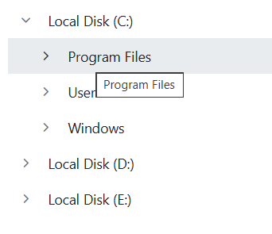

# Node Customization in Blazor TreeView Component

The TreeView nodes in the Blazor TreeView component can be customized based on your needs.

The TreeView component offers customization for the appearance of each node. This includes using images by mapping the [**ImageUrl**](https://help.syncfusion.com/cr/blazor/Syncfusion.Blazor.Navigations.TreeViewFieldOptions-1.html#Syncfusion_Blazor_Navigations_TreeViewFieldOptions_1_ImageUrl) field, enable or disable wrapping the text using the [AllowTextWrap](https://help.syncfusion.com/cr/blazor/Syncfusion.Blazor.Navigations.SfTreeView-1.html#Syncfusion_Blazor_Navigations_SfTreeView_1_AllowTextWrap) property, enable or disable the nodes on initial load or dynamically, show or hide the nodes on initial load or dynamically, and enable or customize the tooltip for tree nodes, and more.

## Images in Blazor TreeView Component

The Blazor TreeView component has the built-in option to customize each node's appearance with images by mapping the [**ImageUrl**](https://help.syncfusion.com/cr/blazor/Syncfusion.Blazor.Navigations.TreeViewFieldOptions-1.html#Syncfusion_Blazor_Navigations_TreeViewFieldOptions_1_ImageUrl) fields.

```cshtml
@using Syncfusion.Blazor.Navigations
@inject Microsoft.AspNetCore.Components.NavigationManager UriHelper
<div class="control-section">
    <div class="control_wrapper">
        @*Initialize the TreeView component*@
        <SfTreeView TValue="TreeItem" SortOrder="Syncfusion.Blazor.Navigations.SortOrder.Ascending">
            <TreeViewFieldsSettings DataSource="@TreeDataSource" Id="NodeId" Text="NodeText" Expanded="Expanded" Child="@("Child")" IconCss="Icon" ImageUrl="ImageUrl"></TreeViewFieldsSettings>
        </SfTreeView>
    </div>
</div>
@code{
    // Specifies the DataSource value for TreeView component.
    List<TreeItem> TreeDataSource = new List<TreeItem>();
    protected override void OnInitialized()
    {
        base.OnInitialized();
        TreeDataSource.Add(new TreeItem
        {
            NodeId = "01",
            NodeText = "Music",
            Icon = "folder",
            Child = new List<TreeItem>()
            {
                new TreeItem { NodeId = "01-01", NodeText = "Gouttes.mp3", Icon = "audio" }
            }
        });
        TreeDataSource.Add(new TreeItem
        {
            NodeId = "02",
            NodeText = "Videos",
            Icon = "folder",
            Child = new List<TreeItem>()
            {
                new TreeItem { NodeId = "02-01", NodeText = "Naturals.mp4", Icon = "video" },
                new TreeItem { NodeId = "02-02", NodeText = "Wild.mpeg", Icon = "video" },
            },
        });
        TreeDataSource.Add(new TreeItem
        {
            NodeId = "03",
            NodeText = "Documents",
            Icon = "folder",
            Child = new List<TreeItem>()
            {
                new TreeItem { NodeId = "03-01", NodeText = "Environment Pollution.docx", Icon = "docx" },
                new TreeItem { NodeId = "03-02", NodeText = "Global Water, Sanitation, & Hygiene.docx", Icon = "docx" },
                new TreeItem { NodeId = "03-03", NodeText = "Global Warming.ppt", Icon = "ppt" },
                new TreeItem { NodeId = "03-04", NodeText = "Social Network.pdf", Icon = "pdf" },
                new TreeItem { NodeId = "03-05", NodeText = "Youth Empowerment.pdf", Icon = "pdf" },
            },
        });
        TreeDataSource.Add(new TreeItem
        {
            NodeId = "04",
            NodeText = "Pictures",
            Icon = "folder",
            Expanded = true,
            Child = new List<TreeItem>()
            {
                new TreeItem { NodeId = "04-01", NodeText = "Camera Roll", Icon = "folder", Expanded=true,
                Child = new List<TreeItem>(){
                new TreeItem { NodeId = "04-01-01", NodeText = "WIN_20160726_094117.JPG", ImageUrl = "//ej2.syncfusion.com/demos/src/treeview/images/employees/9.png" },
                new TreeItem { NodeId = "04-01-02", NodeText = "WIN_20160726_094118.JPG", ImageUrl="//ej2.syncfusion.com/demos/src/treeview/images/employees/3.png" },
                } },
                new TreeItem { NodeId = "04-02", NodeText = "Wind.jpg", Icon = "images" },
                new TreeItem { NodeId = "04-03", NodeText = "Stone.jpg", Icon = "images" },
            },
        });
        TreeDataSource.Add(new TreeItem
        {
            NodeId = "05",
            NodeText = "Downloads",
            Icon = "folder",
            Child = new List<TreeItem>()
            {
                new TreeItem { NodeId = "05-01", NodeText = "UI-Guide.pdf", Icon = "pdf" },
                new TreeItem { NodeId = "05-02", NodeText = "Tutorials.zip", Icon = "zip" },
                new TreeItem { NodeId = "05-03", NodeText = "Game.exe", Icon = "exe" },
                new TreeItem { NodeId = "05-04", NodeText = "TypeScript.7z", Icon = "zip" },
            },
        });
    }
    class TreeItem
    {
        public string? NodeId { get; set; }
        public string? NodeText { get; set; }
        public string? Icon { get; set; }
        public string? ImageUrl { get; set; }
        public bool Expanded { get; set; }
        public bool Selected { get; set; }
        public List<TreeItem> Child;
    }
}
<style>
    /* Sample specific styles */
    .control_wrapper {
        max-width: 500px;
        margin: auto;
        border: 1px solid #dddddd;
        border-radius: 3px;
        max-height: 470px;
        overflow: auto;
    }
    /* Loading sprite image for TreeView */
    .e-treeview .e-list-icon {
        background-repeat: no-repeat;
        background-image: url('@UriHelper.ToAbsoluteUri($"https://blazor.syncfusion.com/demos/_content/blazor_server_common_net9/images/treeview/file-icons.png")');
        height: 20px;
    }
    .e-treeview .e-list-img {
        width: 25px;
        height: 25px;
    }
    /* Specify the Icon positions based upon the class name */
    .e-treeview .e-list-icon.folder {
        background-position: -197px -552px
    }
    .e-treeview .e-list-icon.docx {
        background-position: -197px -20px
    }
    .e-treeview .e-list-icon.ppt {
        background-position: -197px -48px
    }
    .e-treeview .e-list-icon.pdf {
        background-position: -197px -104px
    }
    .e-treeview .e-list-icon.images {
        background-position: -197px -132px
    }
    .e-treeview .e-list-icon.zip {
        background-position: -197px -188px
    }
    .e-treeview .e-list-icon.audio {
        background-position: -197px -244px
    }
    .e-treeview .e-list-icon.video {
        background-position: -197px -272px
    }
    .e-treeview .e-list-icon.exe {
        background-position: -197px -412px
    }
</style>
```


## Wrapping Text in Blazor TreeView Component

The [AllowTextWrap](https://help.syncfusion.com/cr/blazor/Syncfusion.Blazor.Navigations.SfTreeView-1.html#Syncfusion_Blazor_Navigations_SfTreeView_1_AllowTextWrap) property is used to enable or disable text wrapping within TreeView nodes. When set to `true`, text will wrap to the next line if it exceeds the width of the TreeView node.

The default value of the `AllowTextWrap` property is false.

```cshtml
@using Syncfusion.Blazor.Navigations
<div style="width:500px">
    <SfTreeView TValue="MailItem" @ref="treeview" AllowTextWrap="true">
        <TreeViewFieldsSettings TValue="MailItem" Id="ID" DataSource="@MyFolder" Text="FolderName" ParentID="ParentId" HasChildren="HasSubFolders" Expanded="Expanded"></TreeViewFieldsSettings>
    </SfTreeView>
</div>
@code{
    SfTreeView<MailItem> treeview;
    public class MailItem
    {
        public string? ID { get; set; }
        public string? ParentId { get; set; }
        public string? FolderName { get; set; }
        public bool Expanded { get; set; }
        public bool HasSubFolders { get; set; }
    }
    List<MailItem> MyFolder = new List<MailItem>();
    protected override void OnInitialized()
    {
        base.OnInitialized();
        MyFolder.Add(new MailItem
        {
            ID = "1",
            FolderName = "The Inbox is the default location for all incoming mail, unless rules are set up to forward messages to another e-mail address, folder, or program.",
            HasSubFolders = true,
            Expanded = true,
        });
        MyFolder.Add(new MailItem
        {
            ID = "2",
            ParentId = "1",
            FolderName = "Categories",
            Expanded = true,
            HasSubFolders = true,
        });
        MyFolder.Add(new MailItem
        {
            ID = "3",
            ParentId = "2",
            FolderName = "Primary"
        });
        MyFolder.Add(new MailItem
        {
            ID = "4",
            ParentId = "2",
            FolderName = "Social"
        });
        MyFolder.Add(new MailItem
        {
            ID = "5",
            ParentId = "2",
            FolderName = "Promotions"
        });
    }
}
```


## Enable or Disable Individual Node on Load in Blazor TreeView Component

Individual nodes are disabled on initial rendering by passing their IDs to the [`DisableNodesAsync`](https://help.syncfusion.com/cr/blazor/Syncfusion.Blazor.Navigations.SfTreeView-1.html#Syncfusion_Blazor_Navigations_SfTreeView_1_DisableNodesAsync_System_String___) method within the [`Created`](https://help.syncfusion.com/cr/blazor/Syncfusion.Blazor.Navigations.TreeViewEvents-1.html#Syncfusion_Blazor_Navigations_TreeViewEvents_1_Created) event handler. Disabled nodes can be re-enabled by modifying the logic in the `Created` event or by using `EnableNodesAsync` later.


```cshtml
@using Syncfusion.Blazor.Navigations
<SfTreeView TValue="MailItem" @ref="tree" >
    <TreeViewFieldsSettings TValue="MailItem" Id="ID" DataSource="@MyFolder" Text="FolderName" ParentID="ParentId" HasChildren="HasSubFolders" Expanded="Expanded"></TreeViewFieldsSettings>
    <TreeViewEvents TValue="MailItem" Created="created" />
</SfTreeView>
@code{
    SfTreeView<MailItem> tree;
    public class MailItem
    {
        public string? ID { get; set; }
        public string? ParentId { get; set; }
        public string? FolderName { get; set; }
        public bool Expanded { get; set; }
        public bool HasSubFolders { get; set; }
    }
    List<MailItem> MyFolder = new List<MailItem>();
    protected override void OnInitialized()
    {
        base.OnInitialized();
        MyFolder.Add(new MailItem
        {
            ID = "1",
            FolderName = "Inbox",
            HasSubFolders = true,
            Expanded = true
        });
        MyFolder.Add(new MailItem
        {
            ID = "2",
            ParentId = "1",
            FolderName = "Categories",
            Expanded = true,
            HasSubFolders = true
        });
        MyFolder.Add(new MailItem
        {
            ID = "3",
            ParentId = "2",
            FolderName = "Primary"
        });
        MyFolder.Add(new MailItem
        {
            ID = "4",
            ParentId = "2",
            FolderName = "Social"
        });
        MyFolder.Add(new MailItem
        {
            ID = "5",
            ParentId = "2",
            FolderName = "Promotions"
        });

    }
    void created(ActionEventArgs args)
    {
        tree.DisableNodesAsync(new string[] { "1","2" });  
    }
}
```


## Enable or Disable Individual Node Programmatically in Blazor TreeView Component

Individual nodes are enabled or disabled dynamically by passing their IDs to the [`EnableNodesAsync`](https://help.syncfusion.com/cr/blazor/Syncfusion.Blazor.Navigations.SfTreeView-1.html#Syncfusion_Blazor_Navigations_SfTreeView_1_EnableNodesAsync_System_String___) and [`DisableNodesAsync`](https://help.syncfusion.com/cr/blazor/Syncfusion.Blazor.Navigations.SfTreeView-1.html#Syncfusion_Blazor_Navigations_SfTreeView_1_DisableNodesAsync_System_String___) methods, typically triggered by a button click.

```cshtml
@using Syncfusion.Blazor.Navigations
@using Syncfusion.Blazor.Buttons
<SfTreeView TValue="MailItem" @ref="tree">
    <TreeViewFieldsSettings TValue="MailItem" Id="ID" DataSource="@MyFolder" Text="FolderName" ParentID="ParentId" HasChildren="HasSubFolders" Expanded="Expanded"></TreeViewFieldsSettings>
</SfTreeView>
<SfButton @onclick="DisableNode" CssClass="e-flat" IsPrimary="true">Disable Social node</SfButton>
<SfButton @onclick="EnableNode" CssClass="e-flat" IsPrimary="true">Enable Social node</SfButton>

@code {
    SfTreeView<MailItem> tree;
    public class MailItem
    {
        public string? ID { get; set; }
        public string? ParentId { get; set; }
        public string? FolderName { get; set; }
        public bool Expanded { get; set; }
        public bool HasSubFolders { get; set; }
    }
    List<MailItem> MyFolder = new List<MailItem>();

    void DisableNode()
    {
        tree.DisableNodesAsync(new string[] { "4" });
    }
    void EnableNode()
    {
        tree.EnableNodesAsync(new string[] { "4" });
    }
    protected override void OnInitialized()
    {
        base.OnInitialized();
        MyFolder.Add(new MailItem
            {
                ID = "1",
                FolderName = "Inbox",
                HasSubFolders = true,
                Expanded = true
            });
        MyFolder.Add(new MailItem
            {
                ID = "2",
                ParentId = "1",
                FolderName = "Categories",
                Expanded = true,
                HasSubFolders = true
            });
        MyFolder.Add(new MailItem
            {
                ID = "3",
                ParentId = "2",
                FolderName = "Primary"
            });
        MyFolder.Add(new MailItem
            {
                ID = "4",
                ParentId = "2",
                FolderName = "Social"
            });
        MyFolder.Add(new MailItem
            {
                ID = "5",
                ParentId = "2",
                FolderName = "Promotions"
            });

    }
}

```


## Show or Hide an Individual Node on Load in Blazor TreeView Component

To show or hide particular TreeView nodes on initial rendering, add or remove them from the data source. 

```cshtml
@using Syncfusion.Blazor.Navigations
@using Syncfusion.Blazor.Buttons

<SfTreeView TValue="MailItem">
    <TreeViewFieldsSettings TValue="MailItem" DataSource="@MyFolder" Id="ID" Text="FolderName" ParentID="ParentId" HasChildren="HasSubFolders" Expanded="Expanded"></TreeViewFieldsSettings>
</SfTreeView>

@code {
    public string Content = "Hide Social node";
    List<MailItem> MyFolder = new List<MailItem>();
    MailItem showHideItem = new MailItem();

    protected override void OnInitialized()
    {
        base.OnInitialized();
        MyFolder.Add(new MailItem
            {
                ID = "1",
                FolderName = "Root",
                HasSubFolders = true,
                Expanded = true
            });
        MyFolder.Add(new MailItem
            {
                ID = "2",
                ParentId = "1",
                FolderName = "Categories",
                Expanded = true,
                HasSubFolders = true
            });
        MyFolder.Add( new MailItem
            {
                ID = "3",
                ParentId = "2",
                FolderName = "Primary"
            });
        showHideItem=(new MailItem
            {
                ID = "4",
                ParentId = "2",
                FolderName = "Social"
            });
        //To hide the Social node during initial rendering, comment out the below line to remove it from the data source. 
        MyFolder.Add(showHideItem);
        MyFolder.Add(new MailItem
            {
                ID = "5",
                ParentId = "2",
                FolderName = "Promotions"
            });

    }

    public class MailItem
    {
        public string? ID { get; set; }
        public string? ParentId { get; set; }
        public string? FolderName { get; set; }
        public bool Expanded { get; set; }
        public bool HasSubFolders { get; set; }
    
    }
}
```

## Show or Hide an Individual Node Programmatically in Blazor TreeView Component

Particular TreeView nodes are shown or hidden dynamically on a button click by adding or removing them from the data source, followed by a UI update.

```cshtml
@using Syncfusion.Blazor.Navigations

<SfTreeView TValue="MailItem">
    <TreeViewFieldsSettings TValue="MailItem" DataSource="@MyFolder" Id="ID" Text="FolderName" ParentID="ParentId" HasChildren="HasSubFolders" Expanded="Expanded"></TreeViewFieldsSettings>
</SfTreeView>

<SfButton @onclick="onToggleClick" CssClass="e-flat" IsToggle="true" IsPrimary="true" Content="@Content"></SfButton>

@code {
    public string Content = "Hide Social node";
    List<MailItem> MyFolder = new List<MailItem>();
    MailItem showHideItem = new MailItem();

    private void onToggleClick(MouseEventArgs args)
    {
        if (Content == "Hide Social node")
        {
            this.Content = "Show Social node";
            MyFolder.Remove(showHideItem);
        }
        else
        {
            this.Content = "Hide Social node";
            MyFolder.Insert(3, showHideItem);
        }
    }

    protected override void OnInitialized()
    {
        base.OnInitialized();
        MyFolder.Add(new MailItem
            {
                ID = "1",
                FolderName = "Root",
                HasSubFolders = true,
                Expanded = true
            });
        MyFolder.Add(new MailItem
            {
                ID = "2",
                ParentId = "1",
                FolderName = "Categories",
                Expanded = true,
                HasSubFolders = true
            });
        MyFolder.Add( new MailItem
            {
                ID = "3",
                ParentId = "2",
                FolderName = "Primary"
            });
        showHideItem=(new MailItem
            {
                ID = "4",
                ParentId = "2",
                FolderName = "Social"
            });
        MyFolder.Add(showHideItem);
        MyFolder.Add(new MailItem
            {
                ID = "5",
                ParentId = "2",
                FolderName = "Promotions"
            });

    }

    public class MailItem
    {
        public string? ID { get; set; }
        public string? ParentId { get; set; }
        public string? FolderName { get; set; }
        public bool Expanded { get; set; }
        public bool HasSubFolders { get; set; }
    
    }
}
```

## Enable Tooltip in Blazor TreeView Component

The TreeView component provides a straightforward way to enable tooltips for tree nodes using the [`Tooltip`](https://help.syncfusion.com/cr/blazor/Syncfusion.Blazor.Navigations.TreeViewFieldOptions-1.html#Syncfusion_Blazor_Navigations_TreeViewFieldOptions_1_Tooltip) property.

```cshtml
@using Syncfusion.Blazor.Navigations
<SfTreeView TValue="DriveData">
    <TreeViewFieldsSettings DataSource="@Drive" Id="NodeId" Text="NodeText" Tooltip="Tooltip" Expanded="Expanded" Child="@("Child")"></TreeViewFieldsSettings>
</SfTreeView>
@code {
    List<DriveData> Drive = new List<DriveData>();
    protected override void OnInitialized()
    {
        base.OnInitialized();
        Drive.Add(new DriveData
            {
                NodeId = "01",
                NodeText = "Local Disk (C:)",
                Tooltip = "Local Disk (C:)",
                Expanded = true,
                Child = new List<DriveData>()
            {
                new DriveData { NodeId = "01-01", NodeText = "Program Files", Tooltip = "Program Files",
                    Child = new List<DriveData>()
                    {
                        new DriveData { NodeId = "01-01-01", NodeText = "Windows NT" , Tooltip = "Windows NT"},
                    },
                },
                new DriveData { NodeId = "01-02", NodeText = "Users", Tooltip="Users",
                    Child = new List<DriveData>()
                    {
                        new DriveData { NodeId = "01-02-01", NodeText = "Smith", Tooltip= "Smith" },
                        new DriveData { NodeId = "01-02-02", NodeText = "Public", Tooltip="Public" },
                    },
                },
                new DriveData { NodeId = "01-03", NodeText = "Windows", Tooltip= "Windows",
                    Child = new List<DriveData>()
                    {
                        new DriveData { NodeId = "01-03-01", NodeText = "Boot", Tooltip = "Boot" },
                    }
                },
            },
            });
        Drive.Add(new DriveData
            {
                NodeId = "02",
                NodeText = "Local Disk (D:)",
                Tooltip = "Local Disk (D:)",
                Child = new List<DriveData>()
            {
                new DriveData { NodeId = "02-01", NodeText = "Personals", Tooltip="Personals"
                },
                new DriveData { NodeId = "02-02", NodeText = "Projects", Tooltip = "Projects"
                },
                new DriveData { NodeId = "02-02", NodeText = "Office", Tooltip = "Office"
            }
                }
            });
        Drive.Add(new DriveData
            {
                NodeId = "03",
                NodeText = "Local Disk (E:)",
                Tooltip = "Local Disk (E:)",
                Child = new List<DriveData>()
            {
                new DriveData { NodeId = "03-01", NodeText = "Pictures", Tooltip = "Pictures"
                },
                new DriveData { NodeId = "03-02", NodeText = "Documents", Tooltip ="Documents"
                },
                new DriveData { NodeId = "03-03", NodeText = "Study Materials", Tooltip = "Study Materials"
                },
            },
            });
    }
    class DriveData
    {
        public string? NodeId { get; set; }
        public string? NodeText { get; set; }
        public string? Tooltip { get; set; }
        public string? Icon { get; set; }
        public bool Expanded { get; set; }
        public bool Selected { get; set; }
        public List<DriveData> Child { get; set; }
    }
}

```



## Customize Nodes Tooltip in Blazor TreeView Component

While native tooltip elements might offer limited customization, the Blazor Tooltip component allows for extensive customization of tooltips. It is integrated within the TreeView node template by setting the Tooltip [`Target`](https://help.syncfusion.com/cr/blazor/Syncfusion.Blazor.Popups.SfTooltip.html#Syncfusion_Blazor_Popups_SfTooltip_Target) property to apply the tooltip to desired elements.

```cshtml
@using Syncfusion.Blazor.Navigations
@using Syncfusion.Blazor.Popups
<SfTreeView TValue="EmployeeDetails" CssClass="custom" FullRowSelect="true">
    <TreeViewFieldsSettings TValue="EmployeeDetails" Id="EmployeeId" Text="EmployeeName" DataSource="@Employee" Expanded="Expanded" HasChildren="HasChild" Selected="Selected" ParentID="ParentId"></TreeViewFieldsSettings>
    <TreeViewTemplates TValue="EmployeeDetails">
        <NodeTemplate>
            @{
                var employee = ((context as EmployeeDetails));
                <SfTooltip Target="#def">
                    <ContentTemplate>
                            @employee.EmployeeName @employee.EmployeeId
                    </ContentTemplate>
                    <ChildContent>
                    <div id="def">
                        <div class="ename">@((@context as EmployeeDetails).EmployeeName)</div>
                        <div class="ejob">@((@context as EmployeeDetails).Designation)</div>
                    </div>
                    </ChildContent>
                </SfTooltip>
            }
        </NodeTemplate>
    </TreeViewTemplates>
    <TreeViewEvents TValue="EmployeeDetails"></TreeViewEvents>
</SfTreeView>

@code
    {
    public class EmployeeDetails
    {
        public string? EmployeeName { get; set; }
        public int EmployeeId { get; set; }
        public int? ParentId { get; set; }
        public bool HasChild { get; set; }
        public bool Expanded { get; set; }
        public bool Selected { get; set; }
        public string? Image { get; set; }
        public string? Designation { get; set; }
    }

    List<EmployeeDetails> Employee = new List<EmployeeDetails>();
    protected override void OnInitialized()
    {
        base.OnInitialized();

        Employee.Add(new EmployeeDetails
            {
                EmployeeId = 1,
                EmployeeName = "Steven Buchanan",
                HasChild = false,
                Expanded = true,
                Image = "10",
                Designation = "CEO"
            });
        Employee.Add(new EmployeeDetails
            {
                EmployeeId = 2,
                EmployeeName = "Laura Callahan",
                Image = "2",
                Designation = "Product Manager",
                HasChild = false
            });
        Employee.Add(new EmployeeDetails
            {
                EmployeeId = 3,
                EmployeeName = "Andrew Fuller",
                Image = "7",
                Designation = "Team Lead",
                HasChild = false
            });
        Employee.Add(new EmployeeDetails
            {
                EmployeeId = 4,
                EmployeeName = "Anne Dodsworth",
                Image = "1",
                Designation = "Developer"
            });
        Employee.Add(new EmployeeDetails
            {
                EmployeeId = 5,
                EmployeeName = "Nancy Davolio",
                HasChild = false,
                Image = "4",
                Designation = "Product Manager"
            });
        Employee.Add(new EmployeeDetails
            {
                EmployeeId = 6,
                EmployeeName = "Michael Suyama",
                Image = "9",
                Designation = "Team Lead",
                HasChild = false
            });
        Employee.Add(new EmployeeDetails
            {
                EmployeeId = 7,
                EmployeeName = "Robert King",
                Image = "8",
                Designation = "Developer"
            });
        Employee.Add(new EmployeeDetails
            {
                EmployeeId = 8,
                EmployeeName = "Margaret Peacock",
                Image = "6",
                Designation = "Developer"
            });
        Employee.Add(new EmployeeDetails
            {
                EmployeeId = 9,
                EmployeeName = "Janet Leverling",
                Image = "3",
                Designation = "HR"
            });
    }
}
<style>
    /* Customize the Tooltip*/
    .e-tooltip-wrap .e-tip-content {
        color: white;
        font-size: 12px;
        line-height: 20px;
    }

    .custom.e-treeview .e-fullrow {
        height: 72px;
    }

    .custom.e-treeview .e-list-text {
        line-height: normal;
    }

    .eimage {
        float: left;
        padding: 11px 16px 11px 0;
        height: 48px;
        width: 48px;
        box-sizing: content-box;
    }

    .ename {
        font-size: 16px;
        padding: 14px 0 0;
    }

    .ejob {
        font-size: 14px;
        opacity: .87;
    }

    .e-list-text[data-title] {
        background-color: red;
    }
</style>

```



## Get all Nodes in Blazor TreeView Component

All TreeView node details are retrieved using the [`GetTreeData`](https://help.syncfusion.com/cr/blazor/Syncfusion.Blazor.Navigations.SfTreeView-1.html#Syncfusion_Blazor_Navigations_SfTreeView_1_GetTreeData_System_String_) method. The following code example demonstrates how to retrieve and display the `FolderName` (text) values of all TreeView nodes when a button is clicked.

```cshtml
@using Syncfusion.Blazor.Navigations
<button @onclick="@TreeData">TreeView Data</button>
<SfTreeView TValue="MailItem" @ref="tree">
    <TreeViewFieldsSettings TValue="MailItem" Id="ID" DataSource="@MyFolder" Text="FolderName" ParentID="ParentId" HasChildren="HasSubFolders" Expanded="Expanded"></TreeViewFieldsSettings>
</SfTreeView>
<h4>TreeView node texts</h4>
@foreach (var datas in data)
{
    <p>@datas.FolderName</p>
}

@code {
    public List<MailItem> data = new List<MailItem>();
    SfTreeView<MailItem> tree;
    public class MailItem
    {
        public string? ID { get; set; }
        public string? ParentId { get; set; }
        public string? FolderName { get; set; }
        public bool Expanded { get; set; }
        public bool HasSubFolders { get; set; }
    }
    List<MailItem> MyFolder = new List<MailItem>();

    void TreeData()
    {
        data = tree.GetTreeData();
    }
    protected override void OnInitialized()
    {
        base.OnInitialized();
        MyFolder.Add(new MailItem
            {
                ID = "1",
                FolderName = "Inbox",
                HasSubFolders = true,
                Expanded = true
            });
        MyFolder.Add(new MailItem
            {
                ID = "2",
                ParentId = "1",
                FolderName = "Categories",
                Expanded = true,
                HasSubFolders = true
            });
        MyFolder.Add(new MailItem
            {
                ID = "3",
                ParentId = "2",
                FolderName = "Primary"
            });
        MyFolder.Add(new MailItem
            {
                ID = "4",
                ParentId = "2",
                FolderName = "Social"
            });
        MyFolder.Add(new MailItem
            {
                ID = "5",
                ParentId = "2",
                FolderName = "Promotions"
            });

    }
}

```
