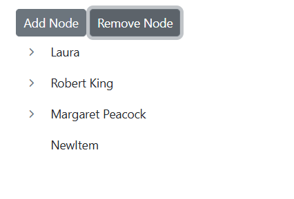

# Node Editing in Blazor TreeView Component

The Blazor TreeView allows node editing by setting the [`AllowEditing`](https://help.syncfusion.com/cr/blazor/Syncfusion.Blazor.Navigations.SfTreeView-1.html#Syncfusion_Blazor_Navigations_SfTreeView_1_AllowEditing) property to `true`. Nodes are directly edited in place by **double-clicking** the TreeView node or by **selecting** the node and pressing the <kbd>F2</kbd> key.

When editing is completed by focusing out or by pressing the <kbd>Enter</kbd> key, the modified node’s text saves automatically. To discard changes, press the <kbd>Escape</kbd> key, which prevents saving the edited text to the TreeView node.

* Node editing can also be performed programmatically by using the [BeginEditAsync](https://help.syncfusion.com/cr/blazor/Syncfusion.Blazor.Navigations.SfTreeView-1.html#Syncfusion_Blazor_Navigations_SfTreeView_1_BeginEditAsync_System_String_) method. On passing the node ID or element through this method, the edit textbox will be created for the particular node thus allowing us to edit it.

* In order to validate or prevent editing, the [`NodeEditing`](https://help.syncfusion.com/cr/blazor/Syncfusion.Blazor.Navigations.TreeViewEvents-1.html#Syncfusion_Blazor_Navigations_TreeViewEvents_1_NodeEditing) event can be used which is triggered before the TreeView node is renamed. On successfully renaming a node the [`NodeEdited`](https://help.syncfusion.com/cr/blazor/Syncfusion.Blazor.Navigations.TreeViewEvents-1.html#Syncfusion_Blazor_Navigations_TreeViewEvents_1_NodeEdited) event will be triggered.

```cshtml
@using Syncfusion.Blazor.Navigations
<SfTreeView TValue="DriveData" AllowEditing="true">
    <TreeViewFieldsSettings TValue="DriveData" Id="NodeId" Text="NodeText" Child="Children" DataSource="@Drive" Expanded="Expanded"></TreeViewFieldsSettings>
</SfTreeView>

@code {
    public class DriveData
    {
        public string? NodeId { get; set; }
        public string? NodeText { get; set; }
        public bool Expanded { get; set; }
        public bool Selected { get; set; }
        public List<DriveData>? Children;
    }

    List<DriveData> Drive = new List<DriveData>();
    protected override void OnInitialized()
    {
        base.OnInitialized();
        InitializeTreeData();
    }
    private void InitializeTreeData()
    {
        List<DriveData> Folder1 = new List<DriveData>();

        Drive.Add(new DriveData
            {
                NodeId = "01",
                NodeText = "Local Disk (C:)",
                Children = Folder1,
            });

        List<DriveData> File1 = new List<DriveData>();

        Folder1.Add(new DriveData
            {
                NodeId = "01-01",
                NodeText = "Program Files",
                Children = File1
            });
        File1.Add(new DriveData
            {
                NodeId = "01-01-01",
                NodeText = "Windows NT"
            });

        List<DriveData> File2 = new List<DriveData>();

        Folder1.Add(new DriveData
            {
                NodeId = "01-02",
                NodeText = "Users",
                Expanded = true,
                Children = File2
            });
        File2.Add(new DriveData
            {
                NodeId = "01-02-01",
                NodeText = "Smith"
            });

        List<DriveData> File3 = new List<DriveData>();

        Folder1.Add(new DriveData
            {
                NodeId = "01-03",
                NodeText = "Windows",
                Children = File3
            });
        File3.Add(new DriveData
            {
                NodeId = "01-03-01",
                NodeText = "Boot"
            });

        List<DriveData> Folder2 = new List<DriveData>();

        Drive.Add(new DriveData
            {
                NodeId = "02",
                NodeText = "Local Disk (D:)",
                Children = Folder2,
                Expanded = true,
            });

        List<DriveData> File4 = new List<DriveData>();

        Folder2.Add(new DriveData
            {
                NodeId = "02-01",
                NodeText = "Personals"
            });
        Folder2.Add(new DriveData
            {
                NodeId = "02-02",
                NodeText = "Projects"
            });
        Folder2.Add(new DriveData
            {
                NodeId = "02-03",
                NodeText = "Office"
            });
    }
}

```



## CRUD Operations

The Blazor TreeView component provides dynamic options for adding, removing, and renaming nodes.

A video demonstrating CRUD operations on the Blazor TreeView component is available:



### CRUD operation using list

The Blazor TreeView component allows for the integration of a context menu to perform CRUD operations, such as adding, removing, and renaming nodes, on the TreeView. 

The example provided demonstrates how to use the `ItemSelected` event of the context menu to manipulate TreeView operations.

```cshtml
@using Syncfusion.Blazor.Navigations

<div id="treeview">
    <SfTreeView TValue="EmployeeData" @ref="tree" AllowDragAndDrop="true" @bind-SelectedNodes="@selectedNodes" @bind-ExpandedNodes="expandedNodes">
        <TreeViewFieldsSettings Id="Id" ParentID="Pid" DataSource="@ListData" Text="Name" HasChildren="HasChild"></TreeViewFieldsSettings>
        <TreeViewEvents TValue="EmployeeData" NodeSelected="OnSelect" NodeClicked="nodeClicked"></TreeViewEvents>
        <SfContextMenu TValue="MenuItem" @ref="menu" Target="#treeview" Items="@MenuItems">
            <MenuEvents TValue="MenuItem" ItemSelected="MenuSelect"></MenuEvents>
        </SfContextMenu>
    </SfTreeView>
</div>

@code
{
    // Reference for treeview
    SfTreeView<EmployeeData> tree;

    // Reference for context menu
    SfContextMenu<MenuItem> menu;
    string selectedId;
    public string[] selectedNodes = Array.Empty<string>();
    public string[] expandedNodes = new string[] { };
    int index = 100;

    // Datasource for menu items
    public List<MenuItem> MenuItems = new List<MenuItem>{
        new MenuItem { Text = "Edit" },
        new MenuItem { Text = "Remove" },
        new MenuItem { Text = "Add" }
    };

    public class EmployeeData
    {
        public string? Id { get; set; }
        public string? Name { get; set; }
        public string? Pid { get; set; }
        public bool HasChild { get; set; }
    }

    // Triggers when TreeView Node is selected
    public void OnSelect(NodeSelectEventArgs args)
    {
        this.selectedId = args.NodeData.Id;
    }

    // Triggers when TreeView node is clicked
    public void nodeClicked(NodeClickEventArgs args)
    {
        selectedId = args.NodeData.Id;
        selectedNodes = new string[] { args.NodeData.Id };
    }

    // To add a new node
    async Task AddNodes()
    {
        // Expand the selected nodes
        expandedNodes = new string[] { this.selectedId };
        string NodeId = "tree_" + this.index.ToString();
        ListData.Add(new EmployeeData
            {
                Id = NodeId,
                Name = "NewItem",
                Pid = this.selectedId
            });
        await Task.Delay(100);
        // Edit the added node.
        await this.tree.BeginEditAsync(NodeId);
        this.index = this.index + 1;

    }

    // To delete a tree node
    void RemoveNodes()
    {
        List<EmployeeData> removeNode = tree.GetTreeData(selectedId);
        ListData.Remove(removeNode.ElementAt(0));
    }

    // To edit a tree node
    async Task RenameNodes()
    {
        await this.tree.BeginEditAsync(this.selectedId);
    }

    // Triggers when context menu is selected
    public async Task MenuSelect(MenuEventArgs<MenuItem> args)
    {
        string selectedText;
        selectedText = args.Item.Text;
        if (selectedText == "Edit")
        {
            await this.RenameNodes();
        }
        else if (selectedText == "Remove")
        {
            this.RemoveNodes();
        }
        else if (selectedText == "Add")
        {
            await this.AddNodes();
        }
    }

    // local data source
    List<EmployeeData> ListData = new List<EmployeeData>();

    protected override void OnInitialized()
    {
        base.OnInitialized();
        InitializeTreeData();
    }
    private void InitializeTreeData()
    {
        ListData = new List<EmployeeData>();
        ListData.Add(new EmployeeData
            {
                Id = "1",
                Name = "Johnson",
                HasChild = true,
            });
        ListData.Add(new EmployeeData
            {
                Id = "2",
                Pid = "1",
                Name = "Sourav",
            });
        ListData.Add(new EmployeeData
            {
                Id = "3",
                Pid = "1",
                Name = "Sanjay",
            });

        ListData.Add(new EmployeeData
            {
                Id = "4",
                Pid = "1",
                Name = "Steve",
            });
        ListData.Add(new EmployeeData
            {
                Id = "6",
                Pid = "1",
                Name = "Martin",
            });
        ListData.Add(new EmployeeData
            {
                Id = "7",
                Name = "Laura",
                HasChild = true,
            });
        ListData.Add(new EmployeeData
            {
                Id = "8",
                Pid = "7",
                Name = "Mic",
            });
        ListData.Add(new EmployeeData
            {
                Id = "9",
                Pid = "7",
                Name = "Nancy",
            });
        ListData.Add(new EmployeeData
            {
                Id = "10",
                Pid = "7",
                Name = "Andrew",
            });
        ListData.Add(new EmployeeData
            {
                Id = "11",
                Name = "Robert King",
                HasChild = true,
            });
        ListData.Add(new EmployeeData
            {
                Id = "12",
                Pid = "11",
                Name = "Richard",
            });
        ListData.Add(new EmployeeData
            {
                Id = "13",
                Pid = "11",
                Name = "James",
            });
        ListData.Add(new EmployeeData
            {
                Id = "14",
                Pid = "11",
                Name = "Murrey",
            });
        ListData.Add(new EmployeeData
            {
                Id = "15",
                Pid = "11",
                Name = "Chris",
            });
        ListData.Add(new EmployeeData
            {
                Id = "16",
                Name = "Margaret Peacock",
                HasChild = true,
            });
        ListData.Add(new EmployeeData
            {
                Id = "17",
                Pid = "16",
                Name = "Ryaz",
            });
        ListData.Add(new EmployeeData
            {
                Id = "18",
                Pid = "16",
                Name = "Mary",
            });
        ListData.Add(new EmployeeData
            {
                Id = "19",
                Pid = "16",
                Name = "Stephen",
            });
        ListData.Add(new EmployeeData
            {
                Id = "20",
                Pid = "16",
                Name = "Raffel",
            });
    }
}

```



### Add or Remove Node Programmatically

The Blazor TreeView component allows for the dynamic addition or removal of specific nodes by manipulating the data source. This can be achieved by using appropriate methods to update the data source.

```cshtml
@using Syncfusion.Blazor.Navigations
@using Syncfusion.Blazor.Buttons

<SfButton OnClick="AddNodes"> Add Node</SfButton>
<SfButton OnClick="RemoveNodes"> Remove Node</SfButton>
<div id="treeview">
    <SfTreeView TValue="EmployeeData" @ref="tree" @bind-SelectedNodes="@selectedNodes" @bind-ExpandedNodes="expandedNodes">
        <TreeViewFieldsSettings Id="Id" ParentID="Pid" DataSource="@ListData" Text="Name" HasChildren="HasChild"></TreeViewFieldsSettings>
        <TreeViewEvents TValue="EmployeeData" NodeSelected="OnSelect" NodeClicked="nodeClicked"></TreeViewEvents>
    </SfTreeView>
</div>

@code
{
    // Reference for treeview
    SfTreeView<EmployeeData> tree;
    string selectedId;
    public string[] selectedNodes = Array.Empty<string>();
    public string[] expandedNodes = new string[] { };
    int index = 100;

    public class EmployeeData
    {
        public string? Id { get; set; }
        public string? Name { get; set; }
        public string? Pid { get; set; }
        public bool HasChild { get; set; }
    }

    // Triggers when TreeView Node is selected
    public void OnSelect(NodeSelectEventArgs args)
    {
        this.selectedId = args.NodeData.Id;
    }

    // Triggers when TreeView node is clicked
    public void nodeClicked(NodeClickEventArgs args)
    {
        selectedId = args.NodeData.Id;
        selectedNodes = new string[] { args.NodeData.Id };
    }

    // To add a new node
    public async Task AddNodes()
    {
        // Expand the selected nodes
        expandedNodes = new string[] { this.selectedId };
        string NodeId = "tree_" + this.index.ToString();
        ListData.Add(new EmployeeData
            {
                Id = NodeId,
                Name = "NewItem",
                Pid = this.selectedId
            });
        await Task.Delay(100);
        // Edit the added node.
        await this.tree.BeginEditAsync(NodeId);
        this.index = this.index + 1;

    }
    // To delete a tree node
    void RemoveNodes()
    {
        List<EmployeeData> removeNode = tree.GetTreeData(selectedId);
        ListData.Remove(removeNode.ElementAt(0));
    }

    // local data source
    List<EmployeeData> ListData = new List<EmployeeData>();

    protected override void OnInitialized()
    {
        base.OnInitialized();
        InitializeTreeData();
    }
    private void InitializeTreeData()
    {
        ListData = new List<EmployeeData>();
        ListData.Add(new EmployeeData
            {
                Id = "1",
                Name = "Johnson",
                HasChild = true,
            });
        ListData.Add(new EmployeeData
            {
                Id = "2",
                Pid = "1",
                Name = "Sourav",
            });
        ListData.Add(new EmployeeData
            {
                Id = "3",
                Pid = "1",
                Name = "Sanjay",
            });

        ListData.Add(new EmployeeData
            {
                Id = "4",
                Pid = "1",
                Name = "Steve",
            });
        ListData.Add(new EmployeeData
            {
                Id = "6",
                Pid = "1",
                Name = "Martin",
            });
        ListData.Add(new EmployeeData
            {
                Id = "7",
                Name = "Laura",
                HasChild = true,
            });
        ListData.Add(new EmployeeData
            {
                Id = "8",
                Pid = "7",
                Name = "Mic",
            });
        ListData.Add(new EmployeeData
            {
                Id = "9",
                Pid = "7",
                Name = "Nancy",
            });
        ListData.Add(new EmployeeData
            {
                Id = "10",
                Pid = "7",
                Name = "Andrew",
            });
        ListData.Add(new EmployeeData
            {
                Id = "11",
                Name = "Robert King",
                HasChild = true,
            });
        ListData.Add(new EmployeeData
            {
                Id = "12",
                Pid = "11",
                Name = "Richard",
            });
        ListData.Add(new EmployeeData
            {
                Id = "13",
                Pid = "11",
                Name = "James",
            });
        ListData.Add(new EmployeeData
            {
                Id = "14",
                Pid = "11",
                Name = "Murrey",
            });
        ListData.Add(new EmployeeData
            {
                Id = "15",
                Pid = "11",
                Name = "Chris",
            });
        ListData.Add(new EmployeeData
            {
                Id = "16",
                Name = "Margaret Peacock",
                HasChild = true,
            });
        ListData.Add(new EmployeeData
            {
                Id = "17",
                Pid = "16",
                Name = "Ryaz",
            });
        ListData.Add(new EmployeeData
            {
                Id = "18",
                Pid = "16",
                Name = "Mary",
            });
        ListData.Add(new EmployeeData
            {
                Id = "19",
                Pid = "16",
                Name = "Stephen",
            });
        ListData.Add(new EmployeeData
            {
                Id = "20",
                Pid = "16",
                Name = "Raffel",
            });
    }
}

```



### Add or Remove Node Programmatically with Template

The Blazor TreeView component with template support also allows for the dynamic addition or removal of specific nodes by manipulating the data source. This can be achieved by using appropriate methods to update the data source.

```cshtml
@using Syncfusion.Blazor.Navigations
@using Syncfusion.Blazor.Buttons

<SfButton OnClick="AddNodes"> Add Node</SfButton>
<SfButton OnClick="RemoveNodes"> Remove Node</SfButton>
<div class="control_wrapper">
    <SfTreeView TValue="TreeData" @ref="tree" @bind-SelectedNodes="@selectedNodes" @bind-ExpandedNodes="expandedNodes">
        <TreeViewFieldsSettings Id="Id" Text="Name" ParentID="Pid" HasChildren="HasChild" Selected="Selected" Expanded="Expanded" DataSource="@LocalData"></TreeViewFieldsSettings>
        <TreeViewEvents TValue="TreeData" NodeSelected="OnSelect" NodeClicked="nodeClicked"></TreeViewEvents>
        <TreeViewTemplates TValue="TreeData">
            <NodeTemplate>
                <div>
                    <div class="treeviewdiv">
                        <div class="nodetext">
                            <span class="treeName">@((context as TreeData).Name)</span>
                        </div>
                        @{
                            @if (((context as TreeData).Count) != 0)
                            {
                                <div class="nodebadge">
                                    <span class="treeCount e-badge e-badge-primary">@((context as TreeData).Count)</span>
                                </div>
                            }
                        }
                    </div>
                </div>
            </NodeTemplate>
        </TreeViewTemplates>
    </SfTreeView>
</div>

@code {
    // Reference for treeview
    SfTreeView<TreeData>? tree;
    string selectedId;
    public string[] selectedNodes = Array.Empty<string>();
    public string[] expandedNodes = new string[] { };
    int index = 100;
    // Triggers when TreeView Node is selected
    public void OnSelect(NodeSelectEventArgs args)
    {
        this.selectedId = args.NodeData.Id;
    }

    // Triggers when TreeView node is clicked
    public void nodeClicked(NodeClickEventArgs args)
    {
        selectedId = args.NodeData.Id;
        selectedNodes = new string[] { args.NodeData.Id };
    }

    // To add a new node
    public async Task AddNodes()
    {
        // Expand the selected nodes
        expandedNodes = new string[] { this.selectedId };
        string NodeId = "tree_" + this.index.ToString();
        LocalData.Add(new TreeData
            {
                Id = NodeId,
                Name = "NewItem",
                Pid = this.selectedId
            });
        await Task.Delay(100);
        // Edit the added node.
        await this.tree.BeginEditAsync(NodeId);
        this.index = this.index + 1;

    }
    // To delete a tree node
    public void RemoveNodes()
    {
        List<TreeData> removeNode = tree.GetTreeData(selectedId);
        LocalData.Remove(removeNode.ElementAt(0));
    }

    // Specifies the DataSource value for TreeView component.
    List<TreeData> LocalData = new List<TreeData>();
    protected override void OnInitialized()
    {
        base.OnInitialized();
        InitializeTreeData();
    }
    private void InitializeTreeData()
    {
        LocalData.Add(new TreeData
            {
                Id = "1",
                Name = "Favorites",
                HasChild = true,
            });
        LocalData.Add(new TreeData
            {
                Id = "2",
                Pid = "1",
                Name = "Sales Reports",
                Count = 4
            });
        LocalData.Add(new TreeData
            {
                Id = "3",
                Pid = "1",
                Name = "Sent Items"
            });
        LocalData.Add(new TreeData
            {
                Id = "4",
                Pid = "1",
                Name = "Marketing Reports",
                Count = 6
            });
        LocalData.Add(new TreeData
            {
                Id = "5",
                HasChild = true,
                Name = "My Folder",
                Expanded = true
            });
        LocalData.Add(new TreeData
            {
                Id = "6",
                Pid = "5",
                Name = "Inbox",
                Selected = true,
                Count = 20
            });
        LocalData.Add(new TreeData
            {
                Id = "7",
                Pid = "5",
                Name = "Drafts",
                Count = 5
            });
        LocalData.Add(new TreeData
            {
                Id = "8",
                Pid = "5",
                Name = "Deleted Items"
            });
        LocalData.Add(new TreeData
            {
                Id = "9",
                Pid = "5",
                Name = "Sent Items"
            });
        LocalData.Add(new TreeData
            {
                Id = "10",
                Pid = "5",
                Name = "Sales Reports",
                Count = 4
            });
        LocalData.Add(new TreeData
            {
                Id = "11",
                Pid = "5",
                Name = "Marketing Reports",
                Count = 6
            });
        LocalData.Add(new TreeData
            {
                Id = "12",
                Pid = "5",
                Name = "Outbox"
            });
    }
    class TreeData
    {
        public string? Id { get; set; }
        public string? Pid { get; set; }
        public string? Name { get; set; }
        public bool HasChild { get; set; }
        public bool Expanded { get; set; }
        public int Count { get; set; }
        public bool Selected { get; set; }
    }
}
<style>
    /* Sample specific styles */
    .control_wrapper {
        max-width: 320px;
        border: 1px solid #dddddd;
        border-radius: 3px;
        max-height: 420px;
        overflow: auto;
    }
    /* Specifies the styles for custom generated elements in the TreeView component */
    .e-treeview .e-list-text {
        width: 99%;
    }

    .treeCount.e-badge {
        padding: 0.4em;
        vertical-align: text-bottom;
    }

    .nodetext {
        float: left;
    }

    .nodebadge {
        float: right;
        margin-right: 5px
    }
</style>

```



### Add Node through Popup

In the Blazor TreeView component, it is possible to add a new tree node using a Dialog popup window. This can be done by using appropriate methods to add new items to the data source in the popup. 

```cshtml
@using Syncfusion.Blazor.Navigations
@using Syncfusion.Blazor.Buttons
@using Syncfusion.Blazor.Popups

<SfButton @onclick="@OpenDialog">Open Dialog Popup</SfButton>
<SfDialog Width="300px" CssClass="dialog" ShowCloseIcon="true" IsModal="true" @bind-Visible="@IsVisible">
    <DialogTemplates>
        <Header> Dialog </Header>
        <Content>
            <input type="text" placeholder="Enter new node name" @bind="newNodeName" />
            <SfButton OnClick="AddNodeInPopup"> Add</SfButton>
        </Content>
    </DialogTemplates>
</SfDialog>
<SfTreeView TValue="EmployeeData" @ref="tree" AllowEditing="true" AllowDragAndDrop="true" @bind-SelectedNodes="@selectedNodes">
    <TreeViewFieldsSettings Id="Id" ParentID="Pid" DataSource="@ListData" Text="Name" HasChildren="HasChild"></TreeViewFieldsSettings>
    <TreeViewEvents TValue="EmployeeData" NodeSelected="OnSelect" NodeClicked="nodeClicked"></TreeViewEvents>
</SfTreeView>

@code
{
    private bool IsVisible { get; set; } = false;

    private void OpenDialog()
    {
        this.IsVisible = true;
    }
    public string? newNodeName;
    async Task AddNodeInPopup()
    {
        // Expand the selected nodes
        expandedNodes = new string[] { this.selectedId };
        string NodeId = "tree_" + this.index.ToString();
        ListData.Add(new EmployeeData
            {
                Id = NodeId,
                Name = newNodeName,
                Pid = this.selectedId
            });
        this.index = this.index + 1;
    }
    // Reference for treeview
    SfTreeView<EmployeeData>? tree;
    string selectedId;
    public string[] selectedNodes = Array.Empty<string>();
    public string[] expandedNodes = new string[] { };
    int index = 100;

    public class EmployeeData
    {
        public string? Id { get; set; }
        public string? Name { get; set; }
        public string? Pid { get; set; }
        public bool HasChild { get; set; }
    }

    // Triggers when TreeView Node is selected
    public void OnSelect(NodeSelectEventArgs args)
    {
        this.selectedId = args.NodeData.Id;
    }

    // Triggers when TreeView node is clicked
    public void nodeClicked(NodeClickEventArgs args)
    {
        selectedId = args.NodeData.Id;
        selectedNodes = new string[] { args.NodeData.Id };
    }

    // local data source
    List<EmployeeData> ListData = new List<EmployeeData>();

    protected override void OnInitialized()
    {
        base.OnInitialized();
        InitializeTreeData();
    }
    private void InitializeTreeData()
    {
        ListData = new List<EmployeeData>();
        ListData.Add(new EmployeeData
            {
                Id = "1",
                Name = "Johnson",
                HasChild = true,
            });
        ListData.Add(new EmployeeData
            {
                Id = "2",
                Pid = "1",
                Name = "Sourav",
            });
        ListData.Add(new EmployeeData
            {
                Id = "3",
                Pid = "1",
                Name = "Sanjay",
            });

        ListData.Add(new EmployeeData
            {
                Id = "4",
                Pid = "1",
                Name = "Steve",
            });
        ListData.Add(new EmployeeData
            {
                Id = "6",
                Pid = "1",
                Name = "Martin",
            });
        ListData.Add(new EmployeeData
            {
                Id = "7",
                Name = "Laura",
                HasChild = true,
            });
        ListData.Add(new EmployeeData
            {
                Id = "8",
                Pid = "7",
                Name = "Mic",
            });
        ListData.Add(new EmployeeData
            {
                Id = "9",
                Pid = "7",
                Name = "Nancy",
            });
        ListData.Add(new EmployeeData
            {
                Id = "10",
                Pid = "7",
                Name = "Andrew",
            });
        ListData.Add(new EmployeeData
            {
                Id = "11",
                Name = "Robert King",
                HasChild = true,
            });
        ListData.Add(new EmployeeData
            {
                Id = "12",
                Pid = "11",
                Name = "Richard",
            });
        ListData.Add(new EmployeeData
            {
                Id = "13",
                Pid = "11",
                Name = "James",
            });
        ListData.Add(new EmployeeData
            {
                Id = "14",
                Pid = "11",
                Name = "Murrey",
            });
        ListData.Add(new EmployeeData
            {
                Id = "15",
                Pid = "11",
                Name = "Chris",
            });
        ListData.Add(new EmployeeData
            {
                Id = "16",
                Name = "Margaret Peacock",
                HasChild = true,
            });
        ListData.Add(new EmployeeData
            {
                Id = "17",
                Pid = "16",
                Name = "Ryaz",
            });
        ListData.Add(new EmployeeData
            {
                Id = "18",
                Pid = "16",
                Name = "Mary",
            });
        ListData.Add(new EmployeeData
            {
                Id = "19",
                Pid = "16",
                Name = "Stephen",
            });
        ListData.Add(new EmployeeData
            {
                Id = "20",
                Pid = "16",
                Name = "Raffel",
            });
    }
}

```


### Edit a Node Programmatically

The Blazor TreeView component enables dynamic editing of specific nodes. This can be accomplished by passing the selected node's ID to the [BeginEditAsync](https://help.syncfusion.com/cr/blazor/Syncfusion.Blazor.Navigations.SfTreeView-1.html#Syncfusion_Blazor_Navigations_SfTreeView_1_BeginEditAsync_System_String_) method of the TreeView component. 

```cshtml
@using Syncfusion.Blazor.Navigations
@using Syncfusion.Blazor.Buttons

<SfButton OnClick="EditNodes"> Edit Node</SfButton>
<div id="treeview">
    <SfTreeView TValue="EmployeeData" @ref="tree" @bind-SelectedNodes="@selectedNodes" @bind-ExpandedNodes="expandedNodes">
        <TreeViewFieldsSettings Id="Id" ParentID="Pid" DataSource="@ListData" Text="Name" HasChildren="HasChild"></TreeViewFieldsSettings>
        <TreeViewEvents TValue="EmployeeData" NodeSelected="OnSelect" NodeClicked="nodeClicked"></TreeViewEvents>
    </SfTreeView>
</div>

@code
{
    // Reference for treeview
    SfTreeView<EmployeeData>? tree;
    string selectedId;
    public string[] selectedNodes = Array.Empty<string>();
    public string[] expandedNodes = new string[] { };
    int index = 100;

    public class EmployeeData
    {
        public string? Id { get; set; }
        public string? Name { get; set; }
        public string? Pid { get; set; }
        public bool HasChild { get; set; }
    }

    // Triggers when TreeView Node is selected
    public void OnSelect(NodeSelectEventArgs args)
    {
        this.selectedId = args.NodeData.Id;
    }

    // Triggers when TreeView node is clicked
    public void nodeClicked(NodeClickEventArgs args)
    {
        selectedId = args.NodeData.Id;
        selectedNodes = new string[] { args.NodeData.Id };
    }

    // To edit a tree node
    async Task EditNodes()
    {
        await this.tree.BeginEditAsync(this.selectedId);
    }

    // local data source
    List<EmployeeData> ListData = new List<EmployeeData>();

    protected override void OnInitialized()
    {
        base.OnInitialized();
        InitializeTreeData();
    }
    private void InitializeTreeData()
    {
        ListData = new List<EmployeeData>();
        ListData.Add(new EmployeeData
            {
                Id = "1",
                Name = "Johnson",
                HasChild = true,
            });
        ListData.Add(new EmployeeData
            {
                Id = "2",
                Pid = "1",
                Name = "Sourav",
            });
        ListData.Add(new EmployeeData
            {
                Id = "3",
                Pid = "1",
                Name = "Sanjay",
            });

        ListData.Add(new EmployeeData
            {
                Id = "4",
                Pid = "1",
                Name = "Steve",
            });
        ListData.Add(new EmployeeData
            {
                Id = "6",
                Pid = "1",
                Name = "Martin",
            });
        ListData.Add(new EmployeeData
            {
                Id = "7",
                Name = "Laura",
                HasChild = true,
            });
        ListData.Add(new EmployeeData
            {
                Id = "8",
                Pid = "7",
                Name = "Mic",
            });
        ListData.Add(new EmployeeData
            {
                Id = "9",
                Pid = "7",
                Name = "Nancy",
            });
        ListData.Add(new EmployeeData
            {
                Id = "10",
                Pid = "7",
                Name = "Andrew",
            });
        ListData.Add(new EmployeeData
            {
                Id = "11",
                Name = "Robert King",
                HasChild = true,
            });
        ListData.Add(new EmployeeData
            {
                Id = "12",
                Pid = "11",
                Name = "Richard",
            });
        ListData.Add(new EmployeeData
            {
                Id = "13",
                Pid = "11",
                Name = "James",
            });
        ListData.Add(new EmployeeData
            {
                Id = "14",
                Pid = "11",
                Name = "Murrey",
            });
        ListData.Add(new EmployeeData
            {
                Id = "15",
                Pid = "11",
                Name = "Chris",
            });
        ListData.Add(new EmployeeData
            {
                Id = "16",
                Name = "Margaret Peacock",
                HasChild = true,
            });
        ListData.Add(new EmployeeData
            {
                Id = "17",
                Pid = "16",
                Name = "Ryaz",
            });
        ListData.Add(new EmployeeData
            {
                Id = "18",
                Pid = "16",
                Name = "Mary",
            });
        ListData.Add(new EmployeeData
            {
                Id = "19",
                Pid = "16",
                Name = "Stephen",
            });
        ListData.Add(new EmployeeData
            {
                Id = "20",
                Pid = "16",
                Name = "Raffel",
            });
    }
}

```



### Edit a Node with Template

The Blazor TreeView component, when using a `NodeTemplate`, enables dynamic editing of specific nodes. This is accomplished by passing the selected node's ID to the [`BeginEditAsync`](https://help.syncfusion.com/cr/blazor/Syncfusion.Blazor.Navigations.SfTreeView-1.html#Syncfusion_Blazor_Navigations_SfTreeView_1_BeginEditAsync_System_String_) method of the TreeView component.

```cshtml
@using Syncfusion.Blazor.Navigations
@using Syncfusion.Blazor.Buttons

<SfButton OnClick="EditNodes"> Edit Node</SfButton>
<div class="control_wrapper">
    <SfTreeView TValue="TreeData" @ref="tree" @bind-SelectedNodes="@selectedNodes" @bind-ExpandedNodes="expandedNodes">
        <TreeViewFieldsSettings Id="Id" Text="Name" ParentID="Pid" HasChildren="HasChild" Selected="Selected" Expanded="Expanded" DataSource="@LocalData"></TreeViewFieldsSettings>
        <TreeViewEvents TValue="TreeData" NodeSelected="OnSelect" NodeClicked="nodeClicked"></TreeViewEvents>
        <TreeViewTemplates TValue="TreeData">
            <NodeTemplate>
                <div>
                    <div class="treeviewdiv">
                        <div class="nodetext">
                            <span class="treeName">@((context as TreeData).Name)</span>
                        </div>
                        @{
                            @if (((context as TreeData).Count) != 0)
                            {
                                <div class="nodebadge">
                                    <span class="treeCount e-badge e-badge-primary">@((context as TreeData).Count)</span>
                                </div>
                            }
                        }
                    </div>
                </div>
            </NodeTemplate>
        </TreeViewTemplates>
    </SfTreeView>
</div>

@code {
    // Reference for treeview
    SfTreeView<TreeData>? tree;
    string selectedId;
    public string[] selectedNodes = Array.Empty<string>();
    public string[] expandedNodes = new string[] { };
    int index = 100;
    // Triggers when TreeView Node is selected
    public void OnSelect(NodeSelectEventArgs args)
    {
        this.selectedId = args.NodeData.Id;
    }

    // Triggers when TreeView node is clicked
    public void nodeClicked(NodeClickEventArgs args)
    {
        selectedId = args.NodeData.Id;
        selectedNodes = new string[] { args.NodeData.Id };
    }

    // To edit a tree node
    async Task EditNodes()
    {
        await this.tree.BeginEditAsync(this.selectedId);
    }

    // Specifies the DataSource value for TreeView component.
    List<TreeData> LocalData = new List<TreeData>();
    protected override void OnInitialized()
    {
        base.OnInitialized();
        InitializeTreeData();
    }
    private void InitializeTreeData()
    {
        LocalData.Add(new TreeData
            {
                Id = "1",
                Name = "Favorites",
                HasChild = true,
            });
        LocalData.Add(new TreeData
            {
                Id = "2",
                Pid = "1",
                Name = "Sales Reports",
                Count = 4
            });
        LocalData.Add(new TreeData
            {
                Id = "3",
                Pid = "1",
                Name = "Sent Items"
            });
        LocalData.Add(new TreeData
            {
                Id = "4",
                Pid = "1",
                Name = "Marketing Reports",
                Count = 6
            });
        LocalData.Add(new TreeData
            {
                Id = "5",
                HasChild = true,
                Name = "My Folder",
                Expanded = true
            });
        LocalData.Add(new TreeData
            {
                Id = "6",
                Pid = "5",
                Name = "Inbox",
                Selected = true,
                Count = 20
            });
        LocalData.Add(new TreeData
            {
                Id = "7",
                Pid = "5",
                Name = "Drafts",
                Count = 5
            });
        LocalData.Add(new TreeData
            {
                Id = "8",
                Pid = "5",
                Name = "Deleted Items"
            });
        LocalData.Add(new TreeData
            {
                Id = "9",
                Pid = "5",
                Name = "Sent Items"
            });
        LocalData.Add(new TreeData
            {
                Id = "10",
                Pid = "5",
                Name = "Sales Reports",
                Count = 4
            });
        LocalData.Add(new TreeData
            {
                Id = "11",
                Pid = "5",
                Name = "Marketing Reports",
                Count = 6
            });
        LocalData.Add(new TreeData
            {
                Id = "12",
                Pid = "5",
                Name = "Outbox"
            });
    }
    class TreeData
    {
        public string? Id { get; set; }
        public string? Pid { get; set; }
        public string? Name { get; set; }
        public bool HasChild { get; set; }
        public bool Expanded { get; set; }
        public int Count { get; set; }
        public bool Selected { get; set; }
    }
}
<style>
    /* Sample specific styles */
    .control_wrapper {
        max-width: 320px;
        border: 1px solid #dddddd;
        border-radius: 3px;
        max-height: 420px;
        overflow: auto;
    }
    /* Specifies the styles for custom generated elements in the TreeView component */
    .e-treeview .e-list-text {
        width: 99%;
    }

    .treeCount.e-badge {
        padding: 0.4em;
        vertical-align: text-bottom;
    }

    .nodetext {
        float: left;
    }

    .nodebadge {
        float: right;
        margin-right: 5px
    }
</style>

```


## Read-Only TreeView

A Blazor TreeView component is set to read-only mode by disabling specific features or handling events that typically trigger actions. This includes disabling the context menu, handling item selection, and managing item expand/collapse events. Disabling the `AllowEditing` property of the TreeView component prevents adding, removing, or editing nodes.

```cshtml
@using Syncfusion.Blazor.Navigations

<SfTreeView TValue="MailItem">
    <TreeViewFieldsSettings TValue="MailItem" Id="Id" DataSource="@MyFolder" Text="FolderName" ParentID="ParentId" HasChildren="HasSubFolders" Expanded="Expanded"></TreeViewFieldsSettings>
    <TreeViewEvents TValue="MailItem" NodeSelecting="NodeSelecting" NodeExpanding="NodeExpanding" NodeCollapsing="NodeCollapsing"></TreeViewEvents>
</SfTreeView>

@code {
    public class MailItem
    {
        public string? Id { get; set; }
        public string? ParentId { get; set; }
        public string? FolderName { get; set; }
        public bool Expanded { get; set; }
        public bool HasSubFolders { get; set; }
    }
    List<MailItem> MyFolder = new List<MailItem>();
    public void NodeSelecting(NodeSelectEventArgs args)
    {
        args.Cancel = true;
    }
    public void NodeExpanding(NodeExpandEventArgs args)
    {
        args.Cancel = true;
    }
    public void NodeCollapsing(NodeExpandEventArgs args)
    {
        args.Cancel = true;
    }
    protected override void OnInitialized()
    {
        base.OnInitialized();
        InitializeTreeData();
    }
    private void InitializeTreeData()
    {
        MyFolder.Add(new MailItem
            {
                Id = "1",
                FolderName = "Inbox",
                HasSubFolders = true,
                Expanded = true
            });
        MyFolder.Add(new MailItem
            {
                Id = "2",
                ParentId = "1",
                FolderName = "Categories",
                Expanded = true,
                HasSubFolders = true
            });
        MyFolder.Add(new MailItem
            {
                Id = "3",
                ParentId = "2",
                FolderName = "Primary"
            });
        MyFolder.Add(new MailItem
            {
                Id = "4",
                ParentId = "2",
                FolderName = "Social"
            });
        MyFolder.Add(new MailItem
            {
                Id = "5",
                ParentId = "2",
                FolderName = "Promotions"
            });
    }
}

```


## Restrict Node Editing for Specific Node

Node editing for a specific node is prevented by setting the [`Cancel`](https://help.syncfusion.com/cr/blazor/Syncfusion.Blazor.Navigations.NodeEditEventArgs.html#Syncfusion_Blazor_Navigations_NodeEditEventArgs_Cancel) argument to `true` within the [`NodeEditing`](https://help.syncfusion.com/cr/blazor/Syncfusion.Blazor.Navigations.TreeViewEvents-1.html#Syncfusion_Blazor_Navigations_TreeViewEvents_1_NodeEditing) event.

An example of this can be seen in the provided code snippet, where the node editing is prevented for the **Johnson** TreeView node.

```cshtml 
@using Syncfusion.Blazor.Navigations

<div id="treeview">
    <SfTreeView TValue="EmployeeData" @ref="tree" AllowEditing="true" AllowDragAndDrop="true" @bind-SelectedNodes="@selectedNodes" @bind-ExpandedNodes="expandedNodes">
        <TreeViewFieldsSettings Id="Id" ParentID="Pid" DataSource="@ListData" Text="Name" HasChildren="HasChild"></TreeViewFieldsSettings>
        <TreeViewEvents TValue="EmployeeData" NodeEditing="NodeEditing" NodeSelected="OnSelect" NodeClicked="nodeClicked"></TreeViewEvents>
        <SfContextMenu TValue="MenuItem" @ref="menu" Target="#treeview" Items="@MenuItems">
            <MenuEvents TValue="MenuItem" ItemSelected="MenuSelect"></MenuEvents>
        </SfContextMenu>
    </SfTreeView>
</div>

@code
{
    // Reference for treeview
    SfTreeView<EmployeeData>? tree;

    // Reference for context menu
    SfContextMenu<MenuItem>? menu;
    string selectedId;
    public string[] selectedNodes = Array.Empty<string>();
    public string[] expandedNodes = new string[] { "" };
    int index = 100;
    public void NodeEditing(NodeEditEventArgs args)
    {

        if (args.NodeData.Text == "Johnson")
        {
            args.Cancel = true;
        }

    }
    // Datasource for menu items
    public List<MenuItem> MenuItems = new List<MenuItem>{
        new MenuItem { Text = "Edit" },
    };

    public class EmployeeData
    {
        public string? Id { get; set; }
        public string? Name { get; set; }
        public string? Pid { get; set; }
        public bool HasChild { get; set; }
    }

    // Triggers when TreeView Node is selected
    public void OnSelect(NodeSelectEventArgs args)
    {
        this.selectedId = args.NodeData.Id;
    }

    // Triggers when TreeView node is clicked
    public void nodeClicked(NodeClickEventArgs args)
    {
        selectedId = args.NodeData.Id;
        selectedNodes = new string[] { args.NodeData.Id };
    }
    // To edit a tree node
    async Task RenameNodes()
    {
        await tree.BeginEditAsync(this.selectedId);
    }

    // Triggers when context menu is selected
    public async Task MenuSelect(MenuEventArgs<MenuItem> args)
    {
        string selectedText;
        selectedText = args.Item.Text;
        if (selectedText == "Edit")
        {
            await this.RenameNodes();
        }
    }

    // local data source
    List<EmployeeData> ListData = new List<EmployeeData>();

    protected override void OnInitialized()
    {
        base.OnInitialized();
        InitializeTreeData();
    }
    private void InitializeTreeData()
    {
        ListData = new List<EmployeeData>();
        ListData.Add(new EmployeeData
            {
                Id = "1",
                Name = "Johnson",
                HasChild = true,
            });
        ListData.Add(new EmployeeData
            {
                Id = "2",
                Pid = "1",
                Name = "Sourav",
            });
        ListData.Add(new EmployeeData
            {
                Id = "3",
                Pid = "1",
                Name = "Sanjay",
            });

        ListData.Add(new EmployeeData
            {
                Id = "4",
                Pid = "1",
                Name = "Steve",
            });
        ListData.Add(new EmployeeData
            {
                Id = "6",
                Pid = "1",
                Name = "Martin",
            });
        ListData.Add(new EmployeeData
            {
                Id = "7",
                Name = "Laura",
                HasChild = true,
            });
        ListData.Add(new EmployeeData
            {
                Id = "8",
                Pid = "7",
                Name = "Mic",
            });
        ListData.Add(new EmployeeData
            {
                Id = "9",
                Pid = "7",
                Name = "Nancy",
            });
        ListData.Add(new EmployeeData
            {
                Id = "10",
                Pid = "7",
                Name = "Andrew",
            });
        ListData.Add(new EmployeeData
            {
                Id = "11",
                Name = "Robert King",
                HasChild = true,
            });
        ListData.Add(new EmployeeData
            {
                Id = "12",
                Pid = "11",
                Name = "Richard",
            });
        ListData.Add(new EmployeeData
            {
                Id = "13",
                Pid = "11",
                Name = "James",
            });
        ListData.Add(new EmployeeData
            {
                Id = "14",
                Pid = "11",
                Name = "Murrey",
            });
        ListData.Add(new EmployeeData
            {
                Id = "15",
                Pid = "11",
                Name = "Chris",
            });
        ListData.Add(new EmployeeData
            {
                Id = "16",
                Name = "Margaret Peacock",
                HasChild = true,
            });
        ListData.Add(new EmployeeData
            {
                Id = "17",
                Pid = "16",
                Name = "Ryaz",
            });
        ListData.Add(new EmployeeData
            {
                Id = "18",
                Pid = "16",
                Name = "Mary",
            });
        ListData.Add(new EmployeeData
            {
                Id = "19",
                Pid = "16",
                Name = "Stephen",
            });
        ListData.Add(new EmployeeData
            {
                Id = "20",
                Pid = "16",
                Name = "Raffel",
            });
    }
}

```


## Get Index of Editing Node

The index value of an editing node is obtained using the [`NodeEditing`](https://help.syncfusion.com/cr/blazor/Syncfusion.Blazor.Navigations.TreeViewEvents-1.html#Syncfusion_Blazor_Navigations_TreeViewEvents_1_NodeEditing) event. To access the TreeView data, utilize the [`GetTreeData`](https://help.syncfusion.com/cr/blazor/Syncfusion.Blazor.Navigations.SfTreeView-1.html#Syncfusion_Blazor_Navigations_SfTreeView_1_GetTreeData_System_String_) method and store it in a variable. Then, iterate through the data to find the matching node ID, which provides the index of the edited node.

```cshtml
@using Syncfusion.Blazor.Navigations

<div>Node Index value : @indexValue</div>
<div id="treeview">
    <SfTreeView TValue="EmployeeData" @ref="tree" AllowEditing="true" AllowDragAndDrop="true" @bind-SelectedNodes="@selectedNodes" @bind-ExpandedNodes="expandedNodes">
        <TreeViewFieldsSettings Id="Id" ParentID="Pid" DataSource="@ListData" Text="Name" HasChildren="HasChild"></TreeViewFieldsSettings>
        <TreeViewEvents TValue="EmployeeData" NodeEditing="NodeEditing" NodeSelected="OnSelect" NodeClicked="nodeClicked"></TreeViewEvents>
        <SfContextMenu TValue="MenuItem" @ref="menu" Target="#treeview" Items="@MenuItems">
            <MenuEvents TValue="MenuItem" ItemSelected="MenuSelect"></MenuEvents>
        </SfContextMenu>
    </SfTreeView>
</div>

@code
{
    // Reference for treeview
    SfTreeView<EmployeeData>? tree;

    // Reference for context menu
    SfContextMenu<MenuItem>? menu;
    string selectedId;
    public string[] selectedNodes = Array.Empty<string>();
    public string[] expandedNodes = new string[] { "" };
    int index = 100;
    int indexValue;
    public void NodeEditing(NodeEditEventArgs args)
    {
        var data = tree.GetTreeData();
        for (int i = 0; i < data.Count(); i++)
        {
            if (data[i].Id == args.NodeData.Id)
            {
                indexValue = i;
            }
        }
    }
    // Datasource for menu items
    public List<MenuItem> MenuItems = new List<MenuItem>{
        new MenuItem { Text = "Edit" },
    };

    public class EmployeeData
    {
        public string? Id { get; set; }
        public string? Name { get; set; }
        public string? Pid { get; set; }
        public bool HasChild { get; set; }
    }

    // Triggers when TreeView Node is selected
    public void OnSelect(NodeSelectEventArgs args)
    {
        this.selectedId = args.NodeData.Id;
    }

    // Triggers when TreeView node is clicked
    public void nodeClicked(NodeClickEventArgs args)
    {
        selectedId = args.NodeData.Id;
        selectedNodes = new string[] { args.NodeData.Id };
    }
    // To edit a tree node
    async Task RenameNodes()
    {
        await tree.BeginEditAsync(this.selectedId);
    }

    // Triggers when context menu is selected
    public async Task MenuSelect(MenuEventArgs<MenuItem> args)
    {
        string selectedText;
        selectedText = args.Item.Text;
        if (selectedText == "Edit")
        {
            await this.RenameNodes();
        }
    }

    // local data source
    List<EmployeeData> ListData = new List<EmployeeData>();

    protected override void OnInitialized()
    {
        base.OnInitialized();
        InitializeTreeData();
    }
    private void InitializeTreeData()
    {
        ListData = new List<EmployeeData>();
        ListData.Add(new EmployeeData
            {
                Id = "1",
                Name = "Johnson",
                HasChild = true,
            });
        ListData.Add(new EmployeeData
            {
                Id = "2",
                Pid = "1",
                Name = "Sourav",
            });
        ListData.Add(new EmployeeData
            {
                Id = "3",
                Pid = "1",
                Name = "Sanjay",
            });

        ListData.Add(new EmployeeData
            {
                Id = "4",
                Pid = "1",
                Name = "Steve",
            });
        ListData.Add(new EmployeeData
            {
                Id = "6",
                Pid = "1",
                Name = "Martin",
            });
        ListData.Add(new EmployeeData
            {
                Id = "7",
                Name = "Laura",
                HasChild = true,
            });
        ListData.Add(new EmployeeData
            {
                Id = "8",
                Pid = "7",
                Name = "Mic",
            });
        ListData.Add(new EmployeeData
            {
                Id = "9",
                Pid = "7",
                Name = "Nancy",
            });
        ListData.Add(new EmployeeData
            {
                Id = "10",
                Pid = "7",
                Name = "Andrew",
            });
        ListData.Add(new EmployeeData
            {
                Id = "11",
                Name = "Robert King",
                HasChild = true,
            });
        ListData.Add(new EmployeeData
            {
                Id = "12",
                Pid = "11",
                Name = "Richard",
            });
        ListData.Add(new EmployeeData
            {
                Id = "13",
                Pid = "11",
                Name = "James",
            });
        ListData.Add(new EmployeeData
            {
                Id = "14",
                Pid = "11",
                Name = "Murrey",
            });
        ListData.Add(new EmployeeData
            {
                Id = "15",
                Pid = "11",
                Name = "Chris",
            });
        ListData.Add(new EmployeeData
            {
                Id = "16",
                Name = "Margaret Peacock",
                HasChild = true,
            });
        ListData.Add(new EmployeeData
            {
                Id = "17",
                Pid = "16",
                Name = "Ryaz",
            });
        ListData.Add(new EmployeeData
            {
                Id = "18",
                Pid = "16",
                Name = "Mary",
            });
        ListData.Add(new EmployeeData
            {
                Id = "19",
                Pid = "16",
                Name = "Stephen",
            });
        ListData.Add(new EmployeeData
            {
                Id = "20",
                Pid = "16",
                Name = "Raffel",
            });
    }
}

```

## Prevent Node Editing on Node Double-Click

In the Blazor TreeView component, you have the [AllowEditing](https://help.syncfusion.com/cr/blazor/Syncfusion.Blazor.Navigations.SfTreeView-1.html#Syncfusion_Blazor_Navigations_SfTreeView_1_AllowEditing) property, which enables editing a node's text by either double-clicking on the TreeView node or pressing the F2 key. When the `AllowEditing` property is set to true, the TreeView allows for editing a node by either double-clicking on the node or navigating to the node and pressing the F2 key. However, when the property is set to false, the TreeView only allows for reading the node's text.

The default value of `AllowEditing` property is false.

```cshtml
@using Syncfusion.Blazor.Navigations

<SfTreeView TValue="MailItem" AllowEditing="false">
    <TreeViewFieldsSettings TValue="MailItem" Id="Id" DataSource="@MyFolder" Text="FolderName" ParentID="ParentId" HasChildren="HasSubFolders" Expanded="Expanded"></TreeViewFieldsSettings>
</SfTreeView>

@code {
    public class MailItem
    {
        public string? Id { get; set; }
        public string? ParentId { get; set; }
        public string? FolderName { get; set; }
        public bool Expanded { get; set; }
        public bool HasSubFolders { get; set; }
    }
    List<MailItem> MyFolder = new List<MailItem>();
    protected override void OnInitialized()
    {
        base.OnInitialized();
        InitializeTreeData();
    }
    private void InitializeTreeData()
    {
        MyFolder.Add(new MailItem
            {
                Id = "1",
                FolderName = "Inbox",
                HasSubFolders = true,
                Expanded = true
            });
        MyFolder.Add(new MailItem
            {
                Id = "2",
                ParentId = "1",
                FolderName = "Categories",
                Expanded = true,
                HasSubFolders = true
            });
        MyFolder.Add(new MailItem
            {
                Id = "3",
                ParentId = "2",
                FolderName = "Primary"
            });
        MyFolder.Add(new MailItem
            {
                Id = "4",
                ParentId = "2",
                FolderName = "Social"
            });
        MyFolder.Add(new MailItem
            {
                Id = "5",
                ParentId = "2",
                FolderName = "Promotions"
            });
    }
}

```


## Cancel the Edit Action

The edit action is canceled by setting the [`Cancel`](https://help.syncfusion.com/cr/blazor/Syncfusion.Blazor.Navigations.NodeEditEventArgs.html#Syncfusion_Blazor_Navigations_NodeEditEventArgs_Cancel) argument to `true` within the [`NodeEditing`](https://help.syncfusion.com/cr/blazor/Syncfusion.Blazor.Navigations.TreeViewEvents-1.html#Syncfusion_Blazor_Navigations_TreeViewEvents_1_NodeEditing) event.

An example of this can be seen in the provided code snippet, where node editing is canceled for all TreeView nodes.

```cshtml
@using Syncfusion.Blazor.Navigations

<div id="treeview">
    <SfTreeView TValue="EmployeeData" @ref="tree" AllowEditing="true" AllowDragAndDrop="true" @bind-SelectedNodes="@selectedNodes" @bind-ExpandedNodes="expandedNodes">
        <TreeViewFieldsSettings Id="Id" ParentID="Pid" DataSource="@ListData" Text="Name" HasChildren="HasChild"></TreeViewFieldsSettings>
        <TreeViewEvents TValue="EmployeeData" NodeEditing="NodeEditing" NodeSelected="OnSelect" NodeClicked="nodeClicked"></TreeViewEvents>
        <SfContextMenu TValue="MenuItem" @ref="menu" Target="#treeview" Items="@MenuItems">
            <MenuEvents TValue="MenuItem" ItemSelected="MenuSelect"></MenuEvents>
        </SfContextMenu>
    </SfTreeView>
</div>

@code
{
    // Reference for treeview
    SfTreeView<EmployeeData>? tree;

    // Reference for context menu
    SfContextMenu<MenuItem>? menu;
    string selectedId;
    public string[] selectedNodes = Array.Empty<string>();
    public string[] expandedNodes = new string[] { "" };
    int index = 100;
    public void NodeEditing(NodeEditEventArgs args)
    {
        args.Cancel = true;
    }
    // Datasource for menu items
    public List<MenuItem> MenuItems = new List<MenuItem>{
        new MenuItem { Text = "Edit" },
    };

    public class EmployeeData
    {
        public string? Id { get; set; }
        public string? Name { get; set; }
        public string? Pid { get; set; }
        public bool HasChild { get; set; }
    }

    // Triggers when TreeView Node is selected
    public void OnSelect(NodeSelectEventArgs args)
    {
        this.selectedId = args.NodeData.Id;
    }

    // Triggers when TreeView node is clicked
    public void nodeClicked(NodeClickEventArgs args)
    {
        selectedId = args.NodeData.Id;
        selectedNodes = new string[] { args.NodeData.Id };
    }
    // To edit a tree node
    async Task RenameNodes()
    {
        await tree.BeginEditAsync(this.selectedId);
    }

    // Triggers when context menu is selected
    public async Task MenuSelect(MenuEventArgs<MenuItem> args)
    {
        string selectedText;
        selectedText = args.Item.Text;
        if (selectedText == "Edit")
        {
            await this.RenameNodes();
        }
    }

    // local data source
    List<EmployeeData> ListData = new List<EmployeeData>();

    protected override void OnInitialized()
    {
        base.OnInitialized();
        InitializeTreeData();
    }
    private void InitializeTreeData()
    {
        ListData = new List<EmployeeData>();
        ListData.Add(new EmployeeData
            {
                Id = "1",
                Name = "Johnson",
                HasChild = true,
            });
        ListData.Add(new EmployeeData
            {
                Id = "2",
                Pid = "1",
                Name = "Sourav",
            });
        ListData.Add(new EmployeeData
            {
                Id = "3",
                Pid = "1",
                Name = "Sanjay",
            });

        ListData.Add(new EmployeeData
            {
                Id = "4",
                Pid = "1",
                Name = "Steve",
            });
        ListData.Add(new EmployeeData
            {
                Id = "6",
                Pid = "1",
                Name = "Martin",
            });
        ListData.Add(new EmployeeData
            {
                Id = "7",
                Name = "Laura",
                HasChild = true,
            });
        ListData.Add(new EmployeeData
            {
                Id = "8",
                Pid = "7",
                Name = "Mic",
            });
        ListData.Add(new EmployeeData
            {
                Id = "9",
                Pid = "7",
                Name = "Nancy",
            });
        ListData.Add(new EmployeeData
            {
                Id = "10",
                Pid = "7",
                Name = "Andrew",
            });
        ListData.Add(new EmployeeData
            {
                Id = "11",
                Name = "Robert King",
                HasChild = true,
            });
        ListData.Add(new EmployeeData
            {
                Id = "12",
                Pid = "11",
                Name = "Richard",
            });
        ListData.Add(new EmployeeData
            {
                Id = "13",
                Pid = "11",
                Name = "James",
            });
        ListData.Add(new EmployeeData
            {
                Id = "14",
                Pid = "11",
                Name = "Murrey",
            });
        ListData.Add(new EmployeeData
            {
                Id = "15",
                Pid = "11",
                Name = "Chris",
            });
        ListData.Add(new EmployeeData
            {
                Id = "16",
                Name = "Margaret Peacock",
                HasChild = true,
            });
        ListData.Add(new EmployeeData
            {
                Id = "17",
                Pid = "16",
                Name = "Ryaz",
            });
        ListData.Add(new EmployeeData
            {
                Id = "18",
                Pid = "16",
                Name = "Mary",
            });
        ListData.Add(new EmployeeData
            {
                Id = "19",
                Pid = "16",
                Name = "Stephen",
            });
        ListData.Add(new EmployeeData
            {
                Id = "20",
                Pid = "16",
                Name = "Raffel",
            });
    }
}

```

