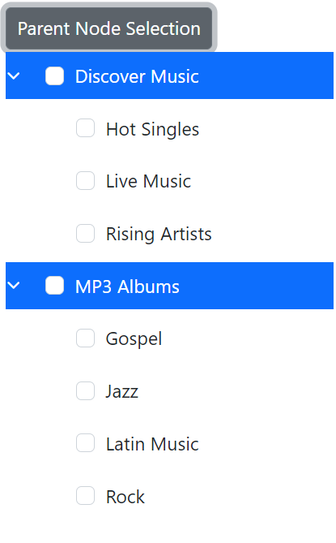
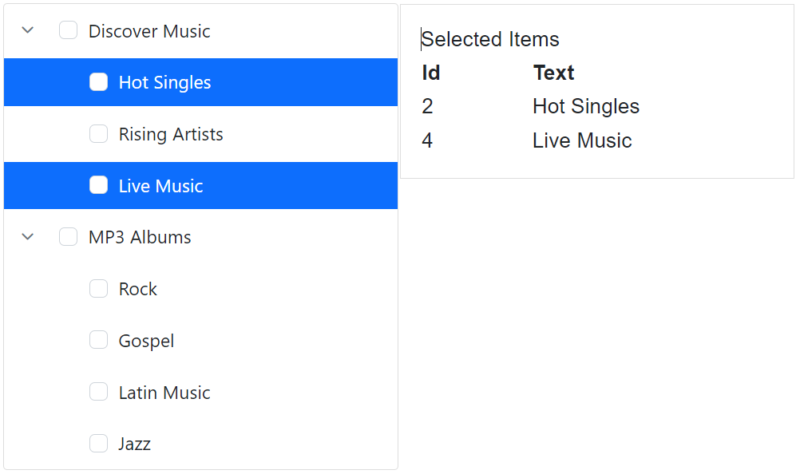
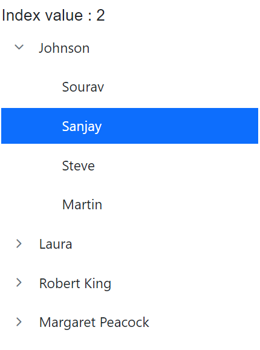

# Node Selection in Blazor TreeView Component

Node selection in the Blazor TreeView component occurs by clicking the corresponding nodes. The [**Selected**](https://help.syncfusion.com/cr/blazor/Syncfusion.Blazor.Navigations.TreeViewFieldOptions-1.html#Syncfusion_Blazor_Navigations_TreeViewFieldOptions_1_Selected) field or [SelectedNodes](https://help.syncfusion.com/cr/blazor/Syncfusion.Blazor.Navigations.SfTreeView-1.html#Syncfusion_Blazor_Navigations_SfTreeView_1_SelectedNodes) property is used to perform node selection.

When using the `Selected` field, you can directly map it within your data source. The `SelectedNodes` property further offers two-way binding for more dynamic control over selection.

## Select Nodes through Data Binding

The Blazor TreeView component enables the selection of specific nodes during initialization by utilizing the [**Selected**](https://help.syncfusion.com/cr/blazor/Syncfusion.Blazor.Navigations.TreeViewFieldOptions-1.html#Syncfusion_Blazor_Navigations_TreeViewFieldOptions_1_Selected) field, where setting it to true for a node in the data source will select the corresponding node in the user interface. 

```cshtml
@using Syncfusion.Blazor.Navigations

<SfTreeView TValue="MusicAlbum" ShowCheckBox="true" AllowMultiSelection="true" AutoCheck="true">
    <TreeViewFieldsSettings TValue="MusicAlbum" Id="Id" DataSource="@Albums" Text="Name" ParentID="ParentId" HasChildren="HasChild" Expanded="Expanded" IsChecked="IsChecked" Selected="Selected"></TreeViewFieldsSettings>
</SfTreeView>

@code {
    public class MusicAlbum
    {
        public int Id { get; set; }
        public int? ParentId { get; set; }
        public string? Name { get; set; }
        public bool Expanded { get; set; }
        public bool? IsChecked { get; set; }
        public bool HasChild { get; set; }
        public bool Selected { get; set; }
    }
    List<MusicAlbum> Albums = new List<MusicAlbum>();
    protected override void OnInitialized()
    {
        base.OnInitialized();
        Albums.Add(new MusicAlbum
            {
                Id = 1,
                Name = "Discover Music",
                HasChild = true,
                Expanded = true,
                Selected=true
            });
        Albums.Add(new MusicAlbum
            {
                Id = 2,
                ParentId = 1,
                Name = "Hot Singles",
                Selected = true
    });
        Albums.Add(new MusicAlbum
            {
                Id = 3,
                ParentId = 1,
                Name = "Rising Artists"
            });
        Albums.Add(new MusicAlbum
            {
                Id = 4,
                ParentId = 1,
                Name = "Live Music"
            });
        Albums.Add(new MusicAlbum
            {
                Id = 14,
                HasChild = true,
                Name = "MP3 Albums",
                Expanded = true

            });
        Albums.Add(new MusicAlbum
            {
                Id = 15,
                ParentId = 14,
                Name = "Rock"
            });
        Albums.Add(new MusicAlbum
            {
                Id = 16,
                Name = "Gospel",
                ParentId = 14,
            });
        Albums.Add(new MusicAlbum
            {
                Id = 17,
                ParentId = 14,
                Name = "Latin Music"
            });
        Albums.Add(new MusicAlbum
            {
                Id = 18,
                ParentId = 14,
                Name = "Jazz"
            });
    }
}

```



## Select Nodes through API

The Blazor TreeView component provides the capability to select specific nodes dynamically or during initialization through the two-way bound [SelectedNodes](https://help.syncfusion.com/cr/blazor/Syncfusion.Blazor.Navigations.SfTreeView-1.html#Syncfusion_Blazor_Navigations_SfTreeView_1_SelectedNodes) property. To select particular nodes, pass an array of their corresponding string IDs to this property. 

```cshtml
@using Syncfusion.Blazor.Navigations

<SfTreeView TValue="MusicAlbum" ShowCheckBox="true" AllowMultiSelection="true" AutoCheck="true" @bind-SelectedNodes="SelectedNodes">
    <TreeViewFieldsSettings TValue="MusicAlbum" Id="Id" DataSource="@Albums" Text="Name" ParentID="ParentId" HasChildren="HasChild" Expanded="Expanded" IsChecked="IsChecked"></TreeViewFieldsSettings>
</SfTreeView>

@code {
    public string[] SelectedNodes = new string[] { "1","2" };
    public class MusicAlbum
    {
        public int Id { get; set; }
        public int? ParentId { get; set; }
        public string? Name { get; set; }
        public bool Expanded { get; set; }
        public bool? IsChecked { get; set; }
        public bool HasChild { get; set; }
    }
    List<MusicAlbum> Albums = new List<MusicAlbum>();
    protected override void OnInitialized()
    {
        base.OnInitialized();
        Albums.Add(new MusicAlbum
            {
                Id = 1,
                Name = "Discover Music",
                HasChild = true,
                Expanded = true
            });
        Albums.Add(new MusicAlbum
            {
                Id = 2,
                ParentId = 1,
                Name = "Hot Singles"
    });
        Albums.Add(new MusicAlbum
            {
                Id = 3,
                ParentId = 1,
                Name = "Rising Artists"
            });
        Albums.Add(new MusicAlbum
            {
                Id = 4,
                ParentId = 1,
                Name = "Live Music"
            });
        Albums.Add(new MusicAlbum
            {
                Id = 14,
                HasChild = true,
                Name = "MP3 Albums",
                Expanded = true

            });
        Albums.Add(new MusicAlbum
            {
                Id = 15,
                ParentId = 14,
                Name = "Rock"
            });
        Albums.Add(new MusicAlbum
            {
                Id = 16,
                Name = "Gospel",
                ParentId = 14,
            });
        Albums.Add(new MusicAlbum
            {
                Id = 17,
                ParentId = 14,
                Name = "Latin Music"
            });
        Albums.Add(new MusicAlbum
            {
                Id = 18,
                ParentId = 14,
                Name = "Jazz"
            });
    }
}

```



## Select all Nodes Programmatically

All nodes in the Blazor TreeView component can be selected using a button click. Based on the requirement, the necessary TreeView node IDs are added to an empty List and assigned to the [SelectedNodes](https://help.syncfusion.com/cr/blazor/Syncfusion.Blazor.Navigations.SfTreeView-1.html#Syncfusion_Blazor_Navigations_SfTreeView_1_SelectedNodes) property.

### Parent nodes

Here, selected all TreeView parent nodes by clicking a button. If the nodes have child nodes, added those node IDs in the SelectedItems list and assigned that value to the [SelectedNodes](https://help.syncfusion.com/cr/blazor/Syncfusion.Blazor.Navigations.SfTreeView-1.html#Syncfusion_Blazor_Navigations_SfTreeView_1_SelectedNodes) property.

```cshtml
@using Syncfusion.Blazor.Navigations
@using Syncfusion.Blazor.Buttons

<SfButton OnClick="ParentNode">Parent Node Selection</SfButton>
<SfTreeView TValue="MusicAlbum" ShowCheckBox="true" AllowMultiSelection="true" AutoCheck="true" @ref="tree" @bind-SelectedNodes="SelectedNodes">
    <TreeViewFieldsSettings TValue="MusicAlbum" Id="Id" DataSource="@Albums" Text="Name" ParentID="ParentId" HasChildren="HasChild" Expanded="Expanded" IsChecked="IsChecked"></TreeViewFieldsSettings>
</SfTreeView>

@code {
    SfTreeView<MusicAlbum>? tree;
    List<string> SelectedItems = new List<string>();
    public string[] SelectedNodes = new string[] { };

    public void ParentNode()
    {
        var data = tree.GetTreeData();
        for(int i=0; i < data.Count(); i++)
        {
            if (data[i].HasChild)
            {
                SelectedItems.Add(data[i].Id.ToString());
            }
        }
        SelectedNodes = SelectedItems.ToArray();
    }
    public class MusicAlbum
    {
        public int? Id { get; set; }
        public int? ParentId { get; set; }
        public string? Name { get; set; }
        public bool Expanded { get; set; }
        public bool? IsChecked { get; set; }
        public bool HasChild { get; set; }
    }
    List<MusicAlbum> Albums = new List<MusicAlbum>();
    protected override void OnInitialized()
    {
        base.OnInitialized();
        Albums.Add(new MusicAlbum
            {
                Id = 1,
                Name = "Discover Music",
                HasChild = true,
                Expanded = true
            });
        Albums.Add(new MusicAlbum
            {
                Id = 2,
                ParentId = 1,
                Name = "Hot Singles",
            });
        Albums.Add(new MusicAlbum
            {
                Id = 3,
                ParentId = 1,
                Name = "Rising Artists"
            });
        Albums.Add(new MusicAlbum
            {
                Id = 4,
                ParentId = 1,
                Name = "Live Music"
            });
        Albums.Add(new MusicAlbum
            {
                Id = 14,
                HasChild = true,
                Name = "MP3 Albums",
                Expanded = true

            });
        Albums.Add(new MusicAlbum
            {
                Id = 15,
                ParentId = 14,
                Name = "Rock"
            });
        Albums.Add(new MusicAlbum
            {
                Id = 16,
                Name = "Gospel",
                ParentId = 14,
            });
        Albums.Add(new MusicAlbum
            {
                Id = 17,
                ParentId = 14,
                Name = "Latin Music"
            });
        Albums.Add(new MusicAlbum
            {
                Id = 18,
                ParentId = 14,
                Name = "Jazz"
            });
    }
}

```




### Child Nodes

To select only child nodes in the TreeView, retrieve all nodes and add the IDs of nodes that do not have children (leaf nodes) to a `SelectedItems` list. Then, assign this list to the [SelectedNodes](https://help.syncfusion.com/cr/blazor/Syncfusion.Blazor.Navigations.SfTreeView-1.html#Syncfusion_Blazor_Navigations_SfTreeView_1_SelectedNodes) property.

```cshtml
@using Syncfusion.Blazor.Navigations
@using Syncfusion.Blazor.Buttons

<SfButton OnClick="ChildNode">Child Node Selection</SfButton>
<SfTreeView TValue="MusicAlbum" ShowCheckBox="true" AllowMultiSelection="true" AutoCheck="true" @ref="tree" @bind-SelectedNodes="SelectedNodes">
    <TreeViewFieldsSettings TValue="MusicAlbum" Id="Id" DataSource="@Albums" Text="Name" ParentID="ParentId" HasChildren="HasChild" Expanded="Expanded" IsChecked="IsChecked"></TreeViewFieldsSettings>
</SfTreeView>

@code {
    SfTreeView<MusicAlbum>? tree;
    List<string> SelectedItems = new List<string>();
    public string[] SelectedNodes = new string[] { };

    public void ChildNode()
    {
        var data = tree.GetTreeData();
        for(int i=0; i < data.Count(); i++)
        {
            if (!data[i].HasChild)
            {
                SelectedItems.Add(data[i].Id.ToString());
            }
        }
        SelectedNodes = SelectedItems.ToArray();
    }
    public class MusicAlbum
    {
        public int? Id { get; set; }
        public int? ParentId { get; set; }
        public string? Name { get; set; }
        public bool Expanded { get; set; }
        public bool? IsChecked { get; set; }
        public bool HasChild { get; set; }
    }
    List<MusicAlbum> Albums = new List<MusicAlbum>();
    protected override void OnInitialized()
    {
        base.OnInitialized();
        Albums.Add(new MusicAlbum
            {
                Id = 1,
                Name = "Discover Music",
                HasChild = true,
                Expanded = true
            });
        Albums.Add(new MusicAlbum
            {
                Id = 2,
                ParentId = 1,
                Name = "Hot Singles",
            });
        Albums.Add(new MusicAlbum
            {
                Id = 3,
                ParentId = 1,
                Name = "Rising Artists"
            });
        Albums.Add(new MusicAlbum
            {
                Id = 4,
                ParentId = 1,
                Name = "Live Music"
            });
        Albums.Add(new MusicAlbum
            {
                Id = 14,
                HasChild = true,
                Name = "MP3 Albums",
                Expanded = true

            });
        Albums.Add(new MusicAlbum
            {
                Id = 15,
                ParentId = 14,
                Name = "Rock"
            });
        Albums.Add(new MusicAlbum
            {
                Id = 16,
                Name = "Gospel",
                ParentId = 14,
            });
        Albums.Add(new MusicAlbum
            {
                Id = 17,
                ParentId = 14,
                Name = "Latin Music"
            });
        Albums.Add(new MusicAlbum
            {
                Id = 18,
                ParentId = 14,
                Name = "Jazz"
            });
    }
}

```



## Get Selected Nodes

The Blazor TreeView component provides the capability to select specific nodes during initialization or dynamically through the two-way binding provided by the [SelectedNodes](https://help.syncfusion.com/cr/blazor/Syncfusion.Blazor.Navigations.SfTreeView-1.html#Syncfusion_Blazor_Navigations_SfTreeView_1_SelectedNodes) property. This property allows for the selection of particular nodes by passing in an array collection of the corresponding node IDs as strings.  Additionally, the component offers the [GetTreeData](https://help.syncfusion.com/cr/blazor/Syncfusion.Blazor.Navigations.SfTreeView-1.html#Syncfusion_Blazor_Navigations_SfTreeView_1_GetTreeData_System_String_) method, which allows for retrieval of the updated data source of the TreeView. By passing the SelectedNodes of specific TreeView nodes as arguments to this method, the updated data source of only those nodes will be returned. If no arguments are passed, the entire updated data source of the TreeView will be returned.

```cshtml
@using Syncfusion.Blazor.Navigations

<div class="control_wrapper">
    <SfTreeView TValue="MusicAlbum" @ref="TreeRef" AllowMultiSelection="true" ShowCheckBox="true" @bind-SelectedNodes="@SelectedNodes">
        <TreeViewFieldsSettings TValue="MusicAlbum" Id="Id" DataSource="@Albums" Text="Name" ParentID="ParentId" HasChildren="HasChild" Expanded="Expanded" IsChecked="IsChecked"></TreeViewFieldsSettings>
    </SfTreeView>
</div>
<div class="col-lg-4 property-section property-custom">
    <div class="property-panel-section">
        <div class="property-panel-header">Selected Items</div>
        <div id="selecttable" class="property-panel-content">
            <table id="property" title="Properties" class="property-panel-table">
                <thead>
                    <tr>
                        <th style="width: 50%">Id</th>
                        <th style="width: 50%;">Text</th>
                    </tr>
                </thead>
                <tbody>
                    @if (TreeRef != null)
                    {
                        @for (int i = 0; i < SelectedNodes?.Length; i++)
                        {
                            List<MusicAlbum> tree = TreeRef.GetTreeData(SelectedNodes[i]);
                            <tr>
                                <td style="width: 30%">
                                    <div>@tree[0].Id</div>
                                </td>
                                <td style="width: 30%">
                                    <div>@tree[0].Name</div>
                                </td>
                            </tr>
                        }
                    }
                </tbody>
            </table>
        </div>
    </div>
</div>
@code {
    // Specify the reference of TreeView element.
    SfTreeView<MusicAlbum>? TreeRef;
    // Specifies the SelectedNodes value for TreeView component.
    string[] SelectedNodes = new string[] { "2", "4" };
    public class MusicAlbum
    {
        public string? Id { get; set; }
        public int? ParentId { get; set; }
        public string? Name { get; set; }
        public bool Expanded { get; set; }
        public bool? IsChecked { get; set; }
        public bool HasChild { get; set; }
    }
    List<MusicAlbum> Albums = new List<MusicAlbum>();
    protected override void OnAfterRender(bool firstRender)
    {
        if (firstRender)
        {
            StateHasChanged();
        }
    }
    protected override void OnInitialized()
    {
        base.OnInitialized();
        Albums.Add(new MusicAlbum
            {
                Id = "1",
                Name = "Discover Music",
                HasChild = true,
                Expanded = true
            });
        Albums.Add(new MusicAlbum
            {
                Id = "2",
                ParentId = 1,
                Name = "Hot Singles"
            });
        Albums.Add(new MusicAlbum
            {
                Id = "3",
                ParentId = 1,
                Name = "Rising Artists"
            });
        Albums.Add(new MusicAlbum
            {
                Id = "4",
                ParentId = 1,
                Name = "Live Music"
            });
        Albums.Add(new MusicAlbum
            {
                Id = "14",
                HasChild = true,
                Name = "MP3 Albums",
                Expanded = true

            });
        Albums.Add(new MusicAlbum
            {
                Id = "15",
                ParentId = 14,
                Name = "Rock"
            });
        Albums.Add(new MusicAlbum
            {
                Id = "16",
                Name = "Gospel",
                ParentId = 14,
            });
        Albums.Add(new MusicAlbum
            {
                Id = "17",
                ParentId = 14,
                Name = "Latin Music"
            });
        Albums.Add(new MusicAlbum
            {
                Id = "18",
                ParentId = 14,
                Name = "Jazz"
            });
    }
}
<style>
    .control_wrapper {
        max-width: 500px;
        border: 1px solid #dddddd;
        border-radius: 3px;
        max-height: 470px;
        overflow: auto;
    }

    .col-lg-4.property-section.property-custom {
        border: 1px solid #dddddd;
        padding: 15px;
        width: 500px !important;
    }

    #selecttable {
        overflow: auto;
        max-height: 420px;
    }

    #selecttable div {
        padding-left: 0;
    }
</style>

```




## Select all nodes on load

In the Blazor TreeView component, you can select all TreeView nodes on initial rendering by using the TreeView component's [Created](https://help.syncfusion.com/cr/blazor/Syncfusion.Blazor.Navigations.TreeViewEvents-1.html#Syncfusion_Blazor_Navigations_TreeViewEvents_1_Created) event. This event is raised when the TreeView component is created successfully. In this event, you can add all the TreeView nodes IDs in the TreeData list and assign that to the [SelectedNodes](https://help.syncfusion.com/cr/blazor/Syncfusion.Blazor.Navigations.SfTreeView-1.html#Syncfusion_Blazor_Navigations_SfTreeView_1_SelectedNodes) property to select all the nodes on initial rendering.

```cshtml
@using Syncfusion.Blazor.Navigations

<SfTreeView TValue="MusicAlbum" ShowCheckBox="true" AllowMultiSelection="true" AutoCheck="true" @ref="tree" @bind-SelectedNodes="SelectedNodes">
    <TreeViewEvents TValue="MusicAlbum" Created="Created"></TreeViewEvents>
    <TreeViewFieldsSettings TValue="MusicAlbum" Id="Id" DataSource="@Albums" Text="Name" ParentID="ParentId" HasChildren="HasChild" Expanded="Expanded" IsChecked="IsChecked"></TreeViewFieldsSettings>
</SfTreeView>

@code {
    SfTreeView<MusicAlbum>? tree;
    List<string> TreeData = new List<string>();
    public string[] SelectedNodes = new string[] { };

    public void Created(ActionEventArgs args)
    {
        var data = tree.GetTreeData();
        for (int i = 0; i < data.Count(); i++)
        {
            TreeData.Add(data[i].Id.ToString());
        }
        SelectedNodes = TreeData.ToArray();
    }
    public class MusicAlbum
    {
        public int Id { get; set; }
        public int? ParentId { get; set; }
        public string? Name { get; set; }
        public bool Expanded { get; set; }
        public bool? IsChecked { get; set; }
        public bool HasChild { get; set; }
    }
    List<MusicAlbum> Albums = new List<MusicAlbum>();
    protected override void OnInitialized()
    {
        base.OnInitialized();
        Albums.Add(new MusicAlbum
            {
                Id = 1,
                Name = "Discover Music",
                HasChild = true,
                Expanded = true
            });
        Albums.Add(new MusicAlbum
            {
                Id = 2,
                ParentId = 1,
                Name = "Hot Singles"
            });
        Albums.Add(new MusicAlbum
            {
                Id = 3,
                ParentId = 1,
                Name = "Rising Artists"
            });
        Albums.Add(new MusicAlbum
            {
                Id = 4,
                ParentId = 1,
                Name = "Live Music"
            });
        Albums.Add(new MusicAlbum
            {
                Id = 14,
                HasChild = true,
                Name = "MP3 Albums",
                Expanded = true

            });
        Albums.Add(new MusicAlbum
            {
                Id = 15,
                ParentId = 14,
                Name = "Rock"
            });
        Albums.Add(new MusicAlbum
            {
                Id = 16,
                Name = "Gospel",
                ParentId = 14,
            });
        Albums.Add(new MusicAlbum
            {
                Id = 17,
                ParentId = 14,
                Name = "Latin Music"
            });
        Albums.Add(new MusicAlbum
            {
                Id = 18,
                ParentId = 14,
                Name = "Jazz"
            });
    }
}

```



## Select all Nodes Programmatically

To select all TreeView nodes on initial rendering, utilize the TreeView component's `Created` event. This event fires upon successful component creation. Within this event, add all TreeView node IDs to a `TreeData` list and then assign this list to the [SelectedNodes](https://help.syncfusion.com/cr/blazor/Syncfusion.Blazor.Navigations.SfTreeView-1.html#Syncfusion_Blazor_Navigations_SfTreeView_1_SelectedNodes) property to select all the nodes on the button click operation.

```cshtml
@using Syncfusion.Blazor.Navigations
@using Syncfusion.Blazor.Buttons

<SfButton OnClick="SelectAll">Select All Nodes</SfButton>
<SfTreeView @ref="tree" TValue="MusicAlbum" ShowCheckBox="true" AllowMultiSelection="true" AutoCheck="true" @bind-SelectedNodes="SelectedNodes">
    <TreeViewFieldsSettings TValue="MusicAlbum" Id="Id" DataSource="@Albums" Text="Name" ParentID="ParentId" HasChildren="HasChild" Expanded="Expanded" IsChecked="IsChecked"></TreeViewFieldsSettings>
</SfTreeView>

@code {
    SfTreeView<MusicAlbum>? tree;
    List<string> TreeData = new List<string>();
    public string[] SelectedNodes = new string[] { };

    public void SelectAll()
    {
        var data = tree.GetTreeData();
        for (int i = 0; i < data.Count(); i++)
        {
            TreeData.Add(data[i].Id.ToString());
        }
        SelectedNodes = TreeData.ToArray();
    }
    public class MusicAlbum
    {
        public int Id { get; set; }
        public int? ParentId { get; set; }
        public string? Name { get; set; }
        public bool Expanded { get; set; }
        public bool? IsChecked { get; set; }
        public bool HasChild { get; set; }
    }
    List<MusicAlbum> Albums = new List<MusicAlbum>();
    protected override void OnInitialized()
    {
        base.OnInitialized();
        Albums.Add(new MusicAlbum
            {
                Id = 1,
                Name = "Discover Music",
                HasChild = true,
                Expanded = true
            });
        Albums.Add(new MusicAlbum
            {
                Id = 2,
                ParentId = 1,
                Name = "Hot Singles"
            });
        Albums.Add(new MusicAlbum
            {
                Id = 3,
                ParentId = 1,
                Name = "Rising Artists"
            });
        Albums.Add(new MusicAlbum
            {
                Id = 4,
                ParentId = 1,
                Name = "Live Music"
            });
        Albums.Add(new MusicAlbum
            {
                Id = 14,
                HasChild = true,
                Name = "MP3 Albums",
                Expanded = true

            });
        Albums.Add(new MusicAlbum
            {
                Id = 15,
                ParentId = 14,
                Name = "Rock"
            });
        Albums.Add(new MusicAlbum
            {
                Id = 16,
                Name = "Gospel",
                ParentId = 14,
            });
        Albums.Add(new MusicAlbum
            {
                Id = 17,
                ParentId = 14,
                Name = "Latin Music"
            });
        Albums.Add(new MusicAlbum
            {
                Id = 18,
                ParentId = 14,
                Name = "Jazz"
            });
    }
}

```




## Select Individual Node Programmatically

To select a specific TreeView node programmatically, use a button click or other event to update the [SelectedNodes](https://help.syncfusion.com/cr/blazor/Syncfusion.Blazor.Navigations.SfTreeView-1.html#Syncfusion_Blazor_Navigations_SfTreeView_1_SelectedNodes) property with an array containing the ID of the desired node as a string..

```cshtml
@using Syncfusion.Blazor.Navigations
@using Syncfusion.Blazor.Buttons

<SfButton OnClick="SelectIndividualNode">Select Discover Music node</SfButton>
<SfTreeView TValue="MusicAlbum" ShowCheckBox="true" AllowMultiSelection="true" AutoCheck="true" @bind-SelectedNodes="SelectedNodes">
    <TreeViewFieldsSettings TValue="MusicAlbum" Id="Id" DataSource="@Albums" Text="Name" ParentID="ParentId" HasChildren="HasChild" Expanded="Expanded" IsChecked="IsChecked"></TreeViewFieldsSettings>
</SfTreeView>

@code {
    public string[] SelectedNodes = Array.Empty<string>();
    public void SelectIndividualNode()
    {
        SelectedNodes = new string[] { "1" };
    }
    public class MusicAlbum
    {
        public int Id { get; set; }
        public int? ParentId { get; set; }
        public string? Name { get; set; }
        public bool Expanded { get; set; }
        public bool? IsChecked { get; set; }
        public bool HasChild { get; set; }
    }
    List<MusicAlbum> Albums = new List<MusicAlbum>();
    protected override void OnInitialized()
    {
        base.OnInitialized();
        Albums.Add(new MusicAlbum
            {
                Id = 1,
                Name = "Discover Music",
                HasChild = true,
                Expanded = true
            });
        Albums.Add(new MusicAlbum
            {
                Id = 2,
                ParentId = 1,
                Name = "Hot Singles"
            });
        Albums.Add(new MusicAlbum
            {
                Id = 3,
                ParentId = 1,
                Name = "Rising Artists"
            });
        Albums.Add(new MusicAlbum
            {
                Id = 4,
                ParentId = 1,
                Name = "Live Music"
            });
        Albums.Add(new MusicAlbum
            {
                Id = 14,
                HasChild = true,
                Name = "MP3 Albums",
                Expanded = true

            });
        Albums.Add(new MusicAlbum
            {
                Id = 15,
                ParentId = 14,
                Name = "Rock"
            });
        Albums.Add(new MusicAlbum
            {
                Id = 16,
                Name = "Gospel",
                ParentId = 14,
            });
        Albums.Add(new MusicAlbum
            {
                Id = 17,
                ParentId = 14,
                Name = "Latin Music"
            });
        Albums.Add(new MusicAlbum
            {
                Id = 18,
                ParentId = 14,
                Name = "Jazz"
            });
    }
}

```



## Retrieve Indices of Selected Nodes

In the Blazor TreeView component, you can display the index value of selected TreeView nodes in the UI. The index of selected items can be obtained using the TreeView's [GetTreeData](https://help.syncfusion.com/cr/blazor/Syncfusion.Blazor.Navigations.SfTreeView-1.html#Syncfusion_Blazor_Navigations_SfTreeView_1_GetTreeData_System_String_) method in the [NodeSelecting](https://help.syncfusion.com/cr/blazor/Syncfusion.Blazor.Navigations.TreeViewEvents-1.html#Syncfusion_Blazor_Navigations_TreeViewEvents_1_NodeSelecting) event.

```cshtml
@using Syncfusion.Blazor.Navigations

<div>Index value : @indexValue</div>
<div id="treeview">
    <SfTreeView TValue="EmployeeData" @ref="tree" AllowEditing="true" AllowDragAndDrop="true" @bind-SelectedNodes="@selectedNodes">
        <TreeViewFieldsSettings Id="Id" ParentID="PId" DataSource="@ListData" Text="Name" HasChildren="HasChild"></TreeViewFieldsSettings>
        <TreeViewEvents TValue="EmployeeData" NodeSelecting="NodeSelecting" ></TreeViewEvents>
    </SfTreeView>
</div>

@code
{
    // Reference for treeview
    SfTreeView<EmployeeData>? tree;
    public string[] selectedNodes = Array.Empty<string>();
    int indexValue;
    public void NodeSelecting(NodeSelectEventArgs args)
    {
        //index value
        var data = tree.GetTreeData();
        for (int i = 0; i < data.Count(); i++)
        {
            if (data[i].Id == (args.NodeData.Id))
            {
                indexValue = i;
            }
        }
    }

    public class EmployeeData
    {
        public string? Id { get; set; }
        public string? Name { get; set; }
        public string? PId { get; set; }
        public bool HasChild { get; set; }
    }

    // local data source
    List<EmployeeData> ListData = new List<EmployeeData>();

    protected override void OnInitialized()
    {
        selectedNodes = new string[] { "1" };
        base.OnInitialized();
        ListData = new List<EmployeeData>();
        ListData.Add(new EmployeeData
            {
                Id = "1",
                Name = "Johnson",
                HasChild = true,
            });
        ListData.Add(new EmployeeData
            {
                Id = "2",
                PId = "1",
                Name = "Sourav",
            });
        ListData.Add(new EmployeeData
            {
                Id = "3",
                PId = "1",
                Name = "Sanjay",
            });

        ListData.Add(new EmployeeData
            {
                Id = "4",
                PId = "1",
                Name = "Steve",
            });
        ListData.Add(new EmployeeData
            {
                Id = "6",
                PId = "1",
                Name = "Martin",
            });
        ListData.Add(new EmployeeData
            {
                Id = "7",
                Name = "Laura",
                HasChild = true,
            });
        ListData.Add(new EmployeeData
            {
                Id = "8",
                PId = "7",
                Name = "Mic",
            });
        ListData.Add(new EmployeeData
            {
                Id = "9",
                PId = "7",
                Name = "Nancy",
            });
        ListData.Add(new EmployeeData
            {
                Id = "10",
                PId = "7",
                Name = "Andrew",
            });
        ListData.Add(new EmployeeData
            {
                Id = "11",
                Name = "Robert King",
                HasChild = true,
            });
        ListData.Add(new EmployeeData
            {
                Id = "12",
                PId = "11",
                Name = "Richard",
            });
        ListData.Add(new EmployeeData
            {
                Id = "13",
                PId = "11",
                Name = "James",
            });
        ListData.Add(new EmployeeData
            {
                Id = "14",
                PId = "11",
                Name = "Murrey",
            });
        ListData.Add(new EmployeeData
            {
                Id = "15",
                PId = "11",
                Name = "Chris",
            });
        ListData.Add(new EmployeeData
            {
                Id = "16",
                Name = "Margaret Peacock",
                HasChild = true,
            });
        ListData.Add(new EmployeeData
            {
                Id = "17",
                PId = "16",
                Name = "Ryaz",
            });
        ListData.Add(new EmployeeData
            {
                Id = "18",
                PId = "16",
                Name = "Mary",
            });
        ListData.Add(new EmployeeData
            {
                Id = "19",
                PId = "16",
                Name = "Stephen",
            });
        ListData.Add(new EmployeeData
            {
                Id = "20",
                PId = "16",
                Name = "Raffel",
            });
    }
}

```




## Disable Full Row Selection

The Blazor TreeView component offers the [FullRowSelect](https://help.syncfusion.com/cr/blazor/Syncfusion.Blazor.Navigations.SfTreeView-1.html#Syncfusion_Blazor_Navigations_SfTreeView_1_FullRowSelect) property to control the selection of the entire row of a node by clicking on it.

By default, the value of this property is true. When set to false, full-row selection is disabled and only the node's text section is selected.

```cshtml
@using Syncfusion.Blazor.Navigations

<SfTreeView TValue="MusicAlbum" AllowMultiSelection="true" FullRowSelect="false">
    <TreeViewFieldsSettings TValue="MusicAlbum" Id="Id" DataSource="@Albums" Text="Name" ParentID="ParentId" HasChildren="HasChild" Expanded="Expanded" IsChecked="IsChecked"></TreeViewFieldsSettings>
</SfTreeView>

@code {
    public class MusicAlbum
    {
        public int? Id { get; set; }
        public int? ParentId { get; set; }
        public string? Name { get; set; }
        public bool Expanded { get; set; }
        public bool? IsChecked { get; set; }
        public bool HasChild { get; set; }
    }
    List<MusicAlbum> Albums = new List<MusicAlbum>();
    protected override void OnInitialized()
    {
        base.OnInitialized();
        Albums.Add(new MusicAlbum
            {
                Id = 1,
                Name = "Discover Music",
                HasChild = true,
                Expanded = true
            });
        Albums.Add(new MusicAlbum
            {
                Id = 2,
                ParentId = 1,
                Name = "Hot Singles",
                HasChild = true,
                Expanded = true
            });
        Albums.Add(new MusicAlbum
            {
                Id = 3,
                ParentId = 1,
                Name = "Rising Artists"
            });
        Albums.Add(new MusicAlbum
            {
                Id = 4,
                ParentId = 1,
                Name = "Live Music"
            });
        Albums.Add(new MusicAlbum
            {
                Id = 14,
                HasChild = true,
                Name = "MP3 Albums",
                Expanded = true

            });
        Albums.Add(new MusicAlbum
            {
                Id = 15,
                ParentId = 14,
                Name = "Rock"
            });
        Albums.Add(new MusicAlbum
            {
                Id = 16,
                Name = "Gospel",
                ParentId = 14,
            });
        Albums.Add(new MusicAlbum
            {
                Id = 17,
                ParentId = 14,
                Name = "Latin Music"
            });
        Albums.Add(new MusicAlbum
            {
                Id = 18,
                ParentId = 14,
                Name = "Jazz"
            });
    }
}

```


## Get Path of Selected Node

In the Blazor TreeView component, you can get the parent node details when selecting child nodes by passing the selected nodes IDs and parent nodes IDs in the TreeView [GetNode](https://help.syncfusion.com/cr/blazor/Syncfusion.Blazor.Navigations.SfTreeView-1.html#Syncfusion_Blazor_Navigations_SfTreeView_1_GetNode_System_String_) method in the [NodeSelected](https://help.syncfusion.com/cr/blazor/Syncfusion.Blazor.Navigations.TreeViewEvents-1.html#Syncfusion_Blazor_Navigations_TreeViewEvents_1_NodeSelected) event. 

```cshtml
@using Syncfusion.Blazor.Navigations

@for (int i = 0; i < ParentIdArray.Length; i++)
{
    <p> @(i+1) Parent Id : @ParentIdArray[i] &nbsp;&nbsp;&nbsp; Parent Text : @ParentTextArray[i]</p>
}
<SfTreeView TValue="MusicAlbum" AllowMultiSelection="true" @ref="tree" @bind-SelectedNodes="SelectedNodes">
    <TreeViewEvents TValue="MusicAlbum" NodeSelected="NodeSelected"></TreeViewEvents>
    <TreeViewFieldsSettings TValue="MusicAlbum" Id="Id" DataSource="@Albums" Text="Name" ParentID="ParentId" HasChildren="HasChild" Expanded="Expanded" IsChecked="IsChecked"></TreeViewFieldsSettings>
</SfTreeView>

@code {
    SfTreeView<MusicAlbum>? tree;
    public string[] SelectedNodes = new string[] {};
    public string[] ParentIdArray = new string[] {};
    public string[] ParentTextArray = new string[] {};

    public void NodeSelected(NodeSelectEventArgs args)
    {

        List<string> IdList = new List<string>();
        List<string> TextList = new List<string>();
        var TreeViewIds = tree.GetNode(args.NodeData.Id).ParentID;
        var TreeViewTexts = tree.GetNode(args.NodeData.ParentID).Text;
        while (TreeViewIds != null)
        {
            IdList.Add(TreeViewIds);
            TextList.Add(TreeViewTexts);
            TreeViewIds = tree.GetNode(TreeViewIds).ParentID;
            TreeViewTexts = tree.GetNode(TreeViewIds).Text;
        }
        ParentIdArray = IdList.ToArray();
        ParentTextArray = TextList.ToArray();

    }
    public class MusicAlbum
    {
        public int? Id { get; set; }
        public int? ParentId { get; set; }
        public string? Name { get; set; }
        public bool Expanded { get; set; }
        public bool? IsChecked { get; set; }
        public bool HasChild { get; set; }
    }
    List<MusicAlbum> Albums = new List<MusicAlbum>();
    protected override void OnInitialized()
    {
        base.OnInitialized();
        Albums.Add(new MusicAlbum
            {
                Id = 1,
                Name = "Discover Music",
                HasChild = true,
                Expanded = true
            });
        Albums.Add(new MusicAlbum
            {
                Id = 2,
                ParentId = 1,
                Name = "Hot Singles",
                HasChild = true,
                Expanded = true
            });
        Albums.Add(new MusicAlbum
            {
                Id = 3,
                ParentId = 2,
                Name = "Rising Artists"
            });
        Albums.Add(new MusicAlbum
            {
                Id = 4,
                ParentId = 1,
                Name = "Live Music"
            });
        Albums.Add(new MusicAlbum
            {
                Id = 14,
                HasChild = true,
                Name = "MP3 Albums",
                Expanded = true

            });
        Albums.Add(new MusicAlbum
            {
                Id = 15,
                ParentId = 14,
                Name = "Rock"
            });
        Albums.Add(new MusicAlbum
            {
                Id = 16,
                Name = "Gospel",
                ParentId = 14,
            });
        Albums.Add(new MusicAlbum
            {
                Id = 17,
                ParentId = 14,
                Name = "Latin Music"
            });
        Albums.Add(new MusicAlbum
            {
                Id = 18,
                ParentId = 14,
                Name = "Jazz"
            });
    }
}

```

## Cancel the Node Selection

The Blazor TreeView component offers the ability to cancel the selection action by setting the [Cancel](https://help.syncfusion.com/cr/blazor/Syncfusion.Blazor.Navigations.NodeSelectEventArgs.html#Syncfusion_Blazor_Navigations_NodeSelectEventArgs_Cancel) argument value as true within the [NodeSelecting](https://help.syncfusion.com/cr/blazor/Syncfusion.Blazor.Navigations.TreeViewEvents-1.html#Syncfusion_Blazor_Navigations_TreeViewEvents_1_NodeSelecting) event. This will prevent the select action from occurring within the TreeView component.

```cshtml
@using Syncfusion.Blazor.Navigations

<SfTreeView TValue="MusicAlbum" ShowCheckBox="true" AllowMultiSelection="true" AutoCheck="true">
    <TreeViewEvents TValue="MusicAlbum" NodeSelecting="NodeSelecting"></TreeViewEvents>
    <TreeViewFieldsSettings TValue="MusicAlbum" Id="Id" DataSource="@Albums" Text="Name" ParentID="ParentId" HasChildren="HasChild" Expanded="Expanded" IsChecked="IsChecked"></TreeViewFieldsSettings>
</SfTreeView>

@code {

    public class MusicAlbum
    {
        public int Id { get; set; }
        public int? ParentId { get; set; }
        public string? Name { get; set; }
        public bool Expanded { get; set; }
        public bool? IsChecked { get; set; }
        public bool HasChild { get; set; }
    }
    public void NodeSelecting(NodeSelectEventArgs args)
    {
        args.Cancel = true;
    }
    List<MusicAlbum> Albums = new List<MusicAlbum>();
    protected override void OnInitialized()
    {
        base.OnInitialized();
        Albums.Add(new MusicAlbum
            {
                Id = 1,
                Name = "Discover Music",
                HasChild = true,
                Expanded = true
            });
        Albums.Add(new MusicAlbum
            {
                Id = 2,
                ParentId = 1,
                Name = "Hot Singles"
    });
        Albums.Add(new MusicAlbum
            {
                Id = 3,
                ParentId = 1,
                Name = "Rising Artists"
            });
        Albums.Add(new MusicAlbum
            {
                Id = 4,
                ParentId = 1,
                Name = "Live Music"
            });
        Albums.Add(new MusicAlbum
            {
                Id = 14,
                HasChild = true,
                Name = "MP3 Albums",
                Expanded = true

            });
        Albums.Add(new MusicAlbum
            {
                Id = 15,
                ParentId = 14,
                Name = "Rock"
            });
        Albums.Add(new MusicAlbum
            {
                Id = 16,
                Name = "Gospel",
                ParentId = 14,
            });
        Albums.Add(new MusicAlbum
            {
                Id = 17,
                ParentId = 14,
                Name = "Latin Music"
            });
        Albums.Add(new MusicAlbum
            {
                Id = 18,
                ParentId = 14,
                Name = "Jazz"
            });
    }
}

```
