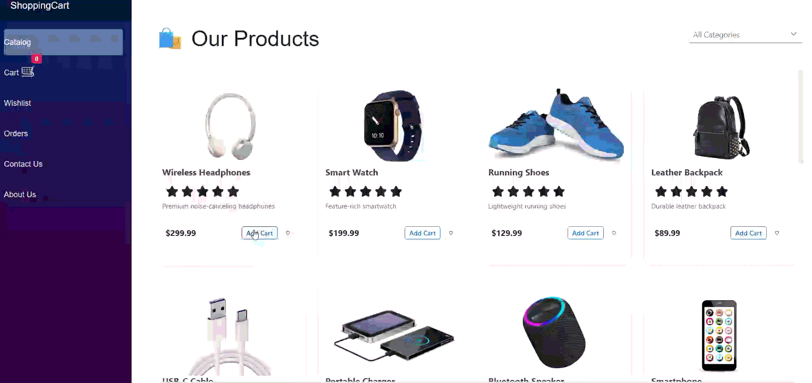

# Getting Started with the Stripe Payment Gateway in Blazor

This guide explains how to integrate the Stripe payment gateway in a Blazor application using [Blazor components](https://www.syncfusion.com/blazor-components). It walks through the core building blocks of a card-based checkout flow, including configuring Stripe, creating and updating Payment Intents, collecting card details through Stripe Elements.

## Prerequisites

* [.NET 8 SDK or later](https://dotnet.microsoft.com/en-us/download/dotnet)
* [Visual Studio](https://visualstudio.microsoft.com/downloads/) 2022 or later, or [Visual Studio Code](https://code.visualstudio.com/) with the [C# Dev Kit](https://marketplace.visualstudio.com/items?itemName=ms-dotnettools.csdevkit) extension
* A [Stripe account](https://dashboard.stripe.com/register) in test mode with access to API keys

## Create the Blazor project

To create a Blazor application, follow the [Blazor Server App getting started guide](https://blazor.syncfusion.com/documentation/getting-started/blazor-server-side-visual-studio?tabcontent=visual-studio-code).

This article adds Stripe checkout on top of an [existing Blazor shopping cart application](https://blazor.syncfusion.com/documentation/tutorials/shopping-cart). Complete that tutorial first, then continue with the steps below.

## Install NuGet package

Install the [Stripe.net](https://www.nuget.org/packages/Stripe.net) package by using the NuGet Package Manager in Visual Studio (*Tools → NuGet Package Manager → Manage NuGet Packages for Solution*), or the integrated terminal in Visual Studio Code (`dotnet add package`), or the .NET CLI.

* [Stripe.net](https://www.nuget.org/packages/Stripe.net)

Alternatively, open a terminal in the project root and run the following commands to install this package.




dotnet add package Stripe.net




N> The Syncfusion Blazor packages [Buttons](https://www.nuget.org/packages/Syncfusion.Blazor.Buttons), [Spinner](https://www.nuget.org/packages/Syncfusion.Blazor.Spinner), and [Inputs](https://www.nuget.org/packages/Syncfusion.Blazor.Inputs) are included as dependencies from the shopping cart tutorial. If you're starting this tutorial independently, ensure these packages are installed. For a complete list, refer to [Blazor NuGet packages](https://blazor.syncfusion.com/documentation/nuget-packages).

### Add required namespaces

Open the `Components/_Imports.razor` file and import the namespaces required by the Stripe checkout components, alongside the existing shopping cart namespaces.




@using System.ComponentModel.DataAnnotations
@using Microsoft.JSInterop
@using ShoppingCart.Models
@using ShoppingCart.Services
@using Syncfusion.Blazor
@using Syncfusion.Blazor.Buttons
@using Syncfusion.Blazor.DropDowns
@using Syncfusion.Blazor.Grids
@using Syncfusion.Blazor.Inputs
@using Syncfusion.Blazor.Spinner




### Bind the Stripe configuration

Bind the Stripe configuration section to the `StripeOptions` model in the `~/Program.cs` file. 




var builder = WebApplication.CreateBuilder(args);
...
builder.Services.Configure<StripeOptions>(
    builder.Configuration.GetSection(StripeOptions.SectionName));




## Project structure

Organize the application using the following folder structure to separate concerns and maintain a clean project layout.

```
ShoppingCart/
├── Components/
│   ├── Pages/                # Routable pages (Home, Catalog, Cart, Checkout, OrderConfirmation, etc.)
│   ├── Layout/               # Layout components (MainLayout, NavMenu)
│   ├── _Imports.razor        # Namespace imports
│   ├── App.razor             # Root component
│   └── Routes.razor          # Route definitions
├── Models/                   # Data models (Product, CartItem, Order, StripeOptions)
├── Services/                 # Application services (CartService, OrderService, StripePaymentService, etc.)
├── wwwroot/
│   └── js/
│       └── payment.js        # Stripe Elements JavaScript interop module
├── Properties/
│   └── launchSettings.json
├── appsettings.json
└── Program.cs                # Service registration

```

This structure helps keep the application maintainable and scalable by clearly separating data models, services, and UI components. It also makes it easier to update or extend the application as payment requirements evolve.

## Define data models

The checkout flow uses two models to bridge the application's order data with Stripe's payment objects. The `StripeOptions` model represents the Stripe API configuration bound from `appsettings.json`. The existing `Order` model (defined in the shopping cart tutorial) needs new Stripe payment fields, and the `PaymentInfo` class must be replaced because Stripe Elements now collects card data securely. Replace the contents of `Models/Order.cs` with the following




using System.ComponentModel.DataAnnotations;

namespace ShoppingCart.Models
{
    public class Order
    {
        public int OrderId { get; set; }
        public List<CartItem> Items { get; set; } = new();
        public decimal TotalAmount { get; set; }
        public DateTime OrderDate { get; set; }
        public string Status { get; set; } = "Pending";

        // Stripe payment references (NEVER raw card data)
        public string? PaymentIntentId { get; set; }
        public string? PaymentStatus { get; set; }   // requires_payment_method | processing | succeeded | canceled
        public string? PaymentMethodId { get; set; }
        public string Currency { get; set; } = "usd";

        public ShippingInfo Shipping { get; set; } = new();
        public PaymentInfo Payment { get; set; } = new();
    }

    public class ShippingInfo
    {
        [Required(ErrorMessage = "Full name is required")]
        public string FullName { get; set; } = string.Empty;

        [Required(ErrorMessage = "Address is required")]
        public string Address { get; set; } = string.Empty;

        [Required(ErrorMessage = "City is required")]
        public string City { get; set; } = string.Empty;

        [Required(ErrorMessage = "State is required")]
        public string State { get; set; } = string.Empty;

        [Required(ErrorMessage = "ZIP code is required")]
        [RegularExpression(@"^\d{5}(-\d{4})?$", ErrorMessage = "Enter a valid ZIP code")]
        public string ZipCode { get; set; } = string.Empty;

        [Required(ErrorMessage = "Country is required")]
        public string Country { get; set; } = string.Empty;

        [Required(ErrorMessage = "Phone is required")]
        [Phone(ErrorMessage = "Enter a valid phone number")]
        public string Phone { get; set; } = string.Empty;

        // Optional: separate billing email, used by Stripe receipt
        [EmailAddress(ErrorMessage = "Enter a valid email")]
        public string? Email { get; set; }
    }

    // Holds NON-SENSITIVE billing metadata for display only.
    // Real card data is captured by Stripe Elements and never touches this object.
    public class PaymentInfo
    {
        public string? CardBrand { get; set; }
        public string? CardLast4 { get; set; }
        public int? CardExpMonth { get; set; }
        public int? CardExpYear { get; set; }
        public string? BillingName { get; set; }
        public string? BillingEmail { get; set; }
    }
}





namespace ShoppingCart.Models
{
    public class StripeOptions
    {
        public const string SectionName = "Stripe";

        public string PublishableKey { get; set; } = string.Empty;
        public string SecretKey { get; set; } = string.Empty;
        public string Currency { get; set; } = "usd";
    }
}




## Configure Stripe settings

Add a `Stripe` section to `appsettings.json` with empty placeholder values.




{
  "Stripe": {
    "PublishableKey": "",
    "SecretKey": "",
    "Currency": "usd"
  }
}




Populate the actual key values locally using .NET User Secrets so that the **Secret key** is never committed to source control.




dotnet user-secrets init
dotnet user-secrets set "Stripe:PublishableKey" "pk_test_..."
dotnet user-secrets set "Stripe:SecretKey" "sk_test_..."




Retrieve the **Publishable key** and **Secret key** from the Stripe Dashboard under **Developers > API keys**.

## Create the services

The checkout flow uses two services: a scoped `IStripePaymentService` for communicating with the Stripe API, and a singleton `IOrderService` for storing and updating orders as the Payment Intent transitions through its lifecycle.

### Stripe payment service

Creates and updates Stripe Payment Intents and looks up orders by their Payment Intent identifier.




using ShoppingCart.Models;

namespace ShoppingCart.Services
{
    public interface IStripePaymentService
    {
        Task<PaymentIntentResult> CreateOrUpdatePaymentIntentAsync(Order order);
    }

    public record PaymentIntentResult(string PaymentIntentId, string ClientSecret, string Status);
}




using Microsoft.Extensions.Options;
using ShoppingCart.Models;
using Stripe;

namespace ShoppingCart.Services
{
    public class StripePaymentService : IStripePaymentService
    {
        private readonly StripeOptions _options;
        private readonly IOrderService _orderService;

        public StripePaymentService(IOptions<StripeOptions> options, IOrderService orderService)
        {
            _options = options.Value;
            _orderService = orderService;

            // Set the global API key for the Stripe.net SDK once.
            StripeConfiguration.ApiKey = _options.SecretKey;
        }

        public async Task<PaymentIntentResult> CreateOrUpdatePaymentIntentAsync(Order order)
        {
            if (order == null) throw new ArgumentNullException(nameof(order));

            var amountInCents = (long)Math.Round(order.TotalAmount * 100m, MidpointRounding.AwayFromZero);
            var service = new PaymentIntentService();

            if (!string.IsNullOrWhiteSpace(order.PaymentIntentId))
            {
                // Update existing PaymentIntent
                var updateOptions = new PaymentIntentUpdateOptions
                {
                    Amount = amountInCents,
                    Currency = order.Currency,
                    Description = $"Order #{order.OrderId} for {order.Shipping.FullName}"
                };
                var intent = await service.UpdateAsync(order.PaymentIntentId, updateOptions);
                order.PaymentStatus = intent.Status;
                await _orderService.UpdateAsync(order);
                return new PaymentIntentResult(intent.Id, intent.ClientSecret, intent.Status);
            }
            else
            {
                // Create new PaymentIntent
                var createOptions = new PaymentIntentCreateOptions
                {
                    Amount = amountInCents,
                    Currency = order.Currency,
                    AutomaticPaymentMethods = new PaymentIntentAutomaticPaymentMethodsOptions
                    {
                        Enabled = true
                    },
                    Metadata = new Dictionary<string, string>
                    {
                        { "order_id", order.OrderId.ToString() },
                        { "customer_name", order.Shipping.FullName },
                        { "customer_email", order.Shipping.Email ?? "" }
                    },
                    Description = $"Order #{order.OrderId} for {order.Shipping.FullName}"
                };

                var intent = await service.CreateAsync(createOptions);

                order.PaymentIntentId = intent.Id;
                order.PaymentStatus = intent.Status;
                await _orderService.UpdateAsync(order);

                return new PaymentIntentResult(intent.Id, intent.ClientSecret!, intent.Status);
            }
        }

        public async Task<Order?> GetOrderByPaymentIntentIdAsync(string paymentIntentId)
        {
            var orders = await _orderService.GetOrdersAsync();
            return orders.FirstOrDefault(o => o.PaymentIntentId == paymentIntentId);
        }
    }
}




### Order service

Manages order creation and retrieval, and tracks the payment state of each order as the Payment Intent transitions through its lifecycle.




using ShoppingCart.Models;

namespace ShoppingCart.Services
{
    public interface IOrderService
    {
        Task<Order> PlaceOrderAsync(Order order);
        Task<Order?> UpdateAsync(Order order);
        Task<List<Order>> GetOrdersAsync();
        Task<Order?> GetOrderByIdAsync(int orderId);
    }
}




using System.Collections.Concurrent;
using ShoppingCart.Models;

namespace ShoppingCart.Services
{
    public class OrderService : IOrderService
    {
        private readonly ConcurrentDictionary<int, Order> _orders = new();
        private int _nextId = 1;

        public Task<Order> PlaceOrderAsync(Order order)
        {
            order.OrderId = Interlocked.Increment(ref _nextId) - 1;
            // Status will move to "Paid" once the PaymentIntent is confirmed by Stripe
            order.Status = "Awaiting Payment";
            order.PaymentStatus = "requires_payment_method";
            _orders[order.OrderId] = order;
            return Task.FromResult(order);
        }

        public Task<Order?> UpdateAsync(Order order)
        {
            if (order == null || order.OrderId == 0) return Task.FromResult<Order?>(null);
            _orders[order.OrderId] = order;
            return Task.FromResult<Order?>(order);
        }

        public Task<List<Order>> GetOrdersAsync()
        {
            var list = _orders.Values.OrderByDescending(o => o.OrderDate).ToList();
            return Task.FromResult(list);
        }

        public Task<Order?> GetOrderByIdAsync(int orderId)
        {
            _orders.TryGetValue(orderId, out var order);
            return Task.FromResult(order);
        }
    }
}




N> The `OrderService` stores data in memory, all orders are lost when the application restarts. For production applications, replace this with a persistent data store such as SQL Server, PostgreSQL, or Azure Cosmos DB.

## Register services

Register the payment-related services in `Program.cs` so they can be accessed throughout the Blazor application using dependency injection.




builder.Services.AddSingleton<IOrderService, OrderService>(); 
builder.Services.AddScoped<IStripePaymentService, StripePaymentService>();




This tutorial changes `IOrderService` from scoped to singleton (and adds UpdateAsync) so order state survives across the JS interop confirmation call and any post-confirmation page navigation. Replace the existing `AddScoped<IOrderService, OrderService>()` line from the shopping cart tutorial with `AddSingleton<IOrderService, OrderService>()` below. Don't add both.

N> The `ICartService`, `IProductService`, and `IWishlistService` registrations are covered in [Creating a Shopping Cart with Blazor Components](https://blazor.syncfusion.com/documentation/tutorials/shopping-cart).

## Create the JavaScript interop module

The `wwwroot/js/payment.js` module wraps Stripe.js and exposes the functions used by the `Checkout` page through Blazor JavaScript interop.




// wwwroot/js/payment.js
// Stripe Elements interop for Blazor Server.
// Loaded with: await JS.InvokeAsync<IJSObjectReference>("import", "/js/payment.js");

let stripe = null;
let elements = null;
let paymentElement = null;

// Lazy-load Stripe.js (https://js.stripe.com/v3) once per page load.
function loadStripeJs(publishableKey) {
    return new Promise((resolve, reject) => {
        if (window.Stripe) {
            resolve(window.Stripe(publishableKey));
            return;
        }
        const script = document.createElement("script");
        script.src = "https://js.stripe.com/v3/";
        script.onload = () => resolve(window.Stripe(publishableKey));
        script.onerror = () => reject(new Error("Failed to load Stripe.js"));
        document.head.appendChild(script);
    });
}

export async function mountPaymentElement(publishableKey, clientSecret, elementId) {
    if (!publishableKey || !clientSecret) {
        throw new Error("publishableKey and clientSecret are required");
    }
    stripe = await loadStripeJs(publishableKey);
    elements = stripe.elements({
        clientSecret,
        appearance: { theme: "stripe" }
    });
    paymentElement = elements.create("payment", { layout: "tabs" });
    const mountNode = document.getElementById(elementId);
    if (!mountNode) {
        throw new Error(`Element with id "${elementId}" not found`);
    }
    paymentElement.mount(mountNode);
    return { ok: true };
}

// Triggers Stripe's confirmation flow.
// Returns { ok: true, paymentIntent } OR { ok: false, error: "..." }.
export async function confirmPayment(returnUrl) {
    if (!stripe || !elements) {
        return { ok: false, error: "Stripe has not been initialized" };
    }
    const { error, paymentIntent } = await stripe.confirmPayment({
        elements,
        confirmParams: {
            return_url: returnUrl
        },
        redirect: "if_required"   // stay in-page for card payments, redirect for 3DS
    });

    if (error) {
        return { ok: false, error: error.message };
    }
    return { ok: true, paymentIntentId: paymentIntent.id, status: paymentIntent.status };
}

export function unmountPaymentElement() {
    if (paymentElement) {
        paymentElement.unmount();
        paymentElement = null;
    }
    elements = null;
    stripe = null;
}




`mountPaymentElement` loads Stripe.js using the **Publishable key**, creates a Stripe `elements` instance scoped to the **Client Secret**, and mounts the Payment Element into the specified DOM element. `confirmPayment` calls `stripe.confirmPayment` with `redirect: "if_required"`, which keeps the user on the page for standard card payments. `unmountPaymentElement` releases the mounted element and resets the module state.

N> `Stripe.js` is loaded on demand by `wwwroot/js/payment.js` only when the Checkout page mounts the payment form. Do not add a static `<script src="https://js.stripe.com/v3"></script>` tag to `App.razor`.

## Update the checkout and order confirmation pages

The pages below demonstrate how the checkout flow integrates the Syncfusion Blazor components with Stripe Elements to collect shipping and card details, confirm the Payment Intent, and display the final order status. Each page binds its inputs to a strongly typed `Order` model and uses [Blazor TextBox](https://www.syncfusion.com/blazor-components/blazor-textbox), [Blazor MaskedTextBox](https://www.syncfusion.com/blazor-components/blazor-input-mask), [Blazor Spinner](https://www.syncfusion.com/blazor-components/blazor-spinner), and [Blazor Button](https://www.syncfusion.com/blazor-components/blazor-button) components to capture user input and trigger actions.

### Update the `Checkout` page

Collects shipping information, creates the Stripe Payment Intent, mounts the Stripe Payment Element into a plain HTML `<div>`, and submits the payment for confirmation.




@page "/checkout"
@rendermode InteractiveServer
@using Microsoft.Extensions.Options
@using ShoppingCart.Models
@inject ICartService CartService
@inject IOrderService OrderService
@inject IStripePaymentService StripeService
@inject IOptions<StripeOptions> StripeOptionsAccessor
@inject NavigationManager NavigationManager
@inject IJSRuntime JS
@inject ILogger<Checkout> Logger

<PageTitle>Checkout</PageTitle>

<div class="container-fluid py-5">
    <h1>📦 Checkout</h1>

    @if (!CartService.Items.Any())
    {
        <div class="alert alert-warning">
            Your cart is empty. <a href="/catalog" aria-label="Browse the product catalog">Continue shopping</a>
        </div>
    }
    else
    {
        @if (string.IsNullOrEmpty(stripePublishableKey))
        {
            <div class="alert alert-danger">
                <strong>Stripe is not configured.</strong>
                <p>Set <code>Stripe:PublishableKey</code> in user-secrets or appsettings.</p>
                <pre>dotnet user-secrets set "Stripe:PublishableKey" "pk_test_..."</pre>
            </div>
        }

        <EditForm Model="@order" OnValidSubmit="ProcessOrder">
            <DataAnnotationsValidator />
            <ValidationSummary />

            <div class="row">
                <div class="col-md-7">
                    <!-- Shipping Information -->
                    <div class="card mb-4">
                        <div class="card-header">
                            <h4>📍 Shipping Information</h4>
                        </div>
                        <div class="card-body">
                            <div class="row g-3">
                                <div class="col-12">
                                    <label class="form-label">Full Name *</label>
                                    <SfTextBox Placeholder="Full name" @bind-Value="order.Shipping.FullName" />
                                </div>
                                <div class="col-12">
                                    <label class="form-label">Address *</label>
                                    <SfTextBox Placeholder="Street address" @bind-Value="order.Shipping.Address" />
                                </div>
                                <div class="col-md-6">
                                    <label class="form-label">City *</label>
                                    <SfTextBox Placeholder="City" @bind-Value="order.Shipping.City" />
                                </div>
                                <div class="col-md-6">
                                    <label class="form-label">State *</label>
                                    <SfTextBox Placeholder="State" @bind-Value="order.Shipping.State" />
                                </div>
                                <div class="col-md-6">
                                    <label class="form-label">ZIP Code *</label>
                                    <SfTextBox Placeholder="ZIP code" @bind-Value="order.Shipping.ZipCode" />
                                </div>
                                <div class="col-md-6">
                                    <label class="form-label">Country *</label>
                                    <SfTextBox Placeholder="Country" @bind-Value="order.Shipping.Country" />
                                </div>
                                <div class="col-md-6">
                                    <label class="form-label">Phone *</label>
                                    <SfMaskedTextBox Mask="(000) 000-0000"
                                                     Placeholder="(555) 555-5555"
                                                     @bind-Value="order.Shipping.Phone" />
                                </div>
                                <div class="col-md-6">
                                    <label class="form-label">Email (for receipt)</label>
                                    <SfTextBox Placeholder="you@example.com"
                                               @bind-Value="order.Shipping.Email" />
                                </div>
                            </div>
                        </div>
                    </div>

                    <!-- Payment Information (Stripe Elements) -->
                    <div class="card mb-4">
                        <div class="card-header">
                            <h4>💳 Payment Information</h4>
                            <small class="text-muted">Card details are collected securely by Stripe. Your data never touches our server.</small>
                        </div>
                        <div class="card-body" style="position: relative;">
                            <div id="stripe-payment-element" style="min-height: 280px;">
                                <!-- Stripe Payment Element will mount here -->
                            </div>
                            
                            @if (isPreparingPayment)
                            {
                                <div style="position: absolute; top: 0; left: 0; right: 0; bottom: 0; background: rgba(255,255,255,0.8); display: flex; align-items: center; justify-content: center; z-index: 10; border-radius: 0.25rem;">
                                    <SfSpinner Visible="true" Label="Loading secure payment form..." />
                                </div>
                            }

                            @if (!string.IsNullOrEmpty(paymentError))
                            {
                                <div class="alert alert-danger mt-3">@paymentError</div>
                            }
                        </div>
                    </div>

                    <SfButton Content="@(isProcessing ? "Processing..." : $"Pay {order.TotalAmount.ToString("C")} & Place Order")"
                              Type="ButtonType.Submit"
                              Disabled="@(isProcessing || isPreparingPayment || !CartService.Items.Any())"
                              CssClass="e-primary e-block mb-3" />
                </div>

                <div class="col-md-5">
                    <div class="card sticky-top" style="top: 20px;">
                        <div class="card-header bg-success text-white">
                            <h4 class="mb-0">Order Summary</h4>
                        </div>
                        <div class="card-body">
                            @foreach (var item in CartService.Items)
                            {
                                <div class="d-flex justify-content-between mb-2">
                                    <span>@item.ProductName × @item.Quantity</span>
                                    <span>@item.Subtotal.ToString("C")</span>
                                </div>
                            }
                            <hr />
                            <div class="d-flex justify-content-between fw-bold">
                                <span>Subtotal:</span>
                                <span>@CartService.Total.ToString("C")</span>
                            </div>
                            <div class="d-flex justify-content-between mb-3">
                                <span>Shipping:</span>
                                <span>$0.00</span>
                            </div>
                            <div class="d-flex justify-content-between fs-5 fw-bold text-success">
                                <span>Total:</span>
                                <span>@CartService.Total.ToString("C")</span>
                            </div>
                        </div>
                    </div>
                </div>
            </div>
        </EditForm>
    }
</div>

@code {
    private Order order = new();
    private string stripePublishableKey = string.Empty;
    private IJSObjectReference? jsModule;
    private bool isPreparingPayment = true;
    private bool isProcessing = false;
    private string? paymentError;
    private string? clientSecret;
    private bool paymentElementMounted;

    protected override async Task OnInitializedAsync()
    {
        stripePublishableKey = StripeOptionsAccessor.Value.PublishableKey;

        // Hydrate order from cart
        order.Items = CartService.Items.ToList();
        order.TotalAmount = CartService.Total;
        order.Currency = StripeOptionsAccessor.Value.Currency;
    }

    protected override async Task OnAfterRenderAsync(bool firstRender)
    {
        if (firstRender && CartService.Items.Any() && !paymentElementMounted)
        {
            try
            {
                isPreparingPayment = true;
                StateHasChanged();

                // 1) Save the order server-side so it has an ID
                order.OrderDate = DateTime.Now;
                await OrderService.PlaceOrderAsync(order);

                // 2) Create a PaymentIntent and get the client secret
                var pi = await StripeService.CreateOrUpdatePaymentIntentAsync(order);
                clientSecret = pi.ClientSecret;

                // 3) Import the JS module and mount Stripe Payment Element
                jsModule = await JS.InvokeAsync<IJSObjectReference>("import", "/js/payment.js");
                
                // Ensure the DOM is fully updated before mounting
                isPreparingPayment = false;
                StateHasChanged();
                await Task.Delay(100); // Brief delay to ensure DOM is ready
                
                await jsModule.InvokeVoidAsync("mountPaymentElement",
                    stripePublishableKey, clientSecret, "stripe-payment-element");

                paymentElementMounted = true;
            }
            catch (Exception ex)
            {
                Logger.LogError(ex, "Failed to initialize Stripe Payment Element");
                paymentError = "Could not load the secure payment form. Please refresh the page.";
            }
            finally
            {
                if (!paymentElementMounted)
                {
                    isPreparingPayment = false;
                    StateHasChanged();
                }
            }
        }
    }

    private async Task ProcessOrder()
    {
        if (isProcessing || jsModule is null) return;

        try
        {
            isProcessing = true;
            paymentError = null;
            StateHasChanged();

            var returnUrl = NavigationManager.BaseUri.TrimEnd('/') + $"/order-confirmation/{order.OrderId}";

            var result = await jsModule.InvokeAsync<PaymentResult>("confirmPayment", returnUrl);

            if (!result.Ok)
            {
                paymentError = result.Error ?? "Payment failed. Please try a different card.";
                isProcessing = false;
                StateHasChanged();
                return;
            }

            // Card payment succeeded.
            order.PaymentIntentId = result.PaymentIntentId;
            order.PaymentStatus = result.Status;
            order.Status = "Paid";

            await OrderService.UpdateAsync(order);

            CartService.ClearCart();
            NavigationManager.NavigateTo($"/order-confirmation/{order.OrderId}");
        }
        catch (Exception ex)
        {
            Logger.LogError(ex, "Payment confirmation error");
            paymentError = "Unexpected error during payment. Please try again.";
            isProcessing = false;
            StateHasChanged();
        }
    }

    public class PaymentResult
    {
        public bool Ok { get; set; }
        public string? Error { get; set; }
        public string? PaymentIntentId { get; set; }
        public string? Status { get; set; }
    }
}




N> The `<div id="stripe-payment-element">` is not a Syncfusion component. It is a plain DOM element controlled entirely by `Stripe.js`, which keeps raw card data out of the ASP.NET Core server's request pipeline.

### Update the `OrderConfirmation` page

Displays the final order status after checkout, using the order's `Status` and `PaymentStatus` values to determine which message to render.




@page "/order-confirmation/{OrderId:int}"
@rendermode InteractiveServer
@using ShoppingCart.Models
@inject IOrderService OrderService
@inject NavigationManager NavigationManager

<PageTitle>Order Confirmation</PageTitle>

<div class="container-fluid py-5">
    @if (order == null)
    {
        <div class="alert alert-danger">Order not found</div>
    }
    else
    {
        <div class="row">
            <div class="col-md-8 mx-auto">
                <div class="card text-center mb-4">
                    <div class="card-body py-5">
                        @if (IsPaid)
                        {
                            <h1 class="text-success mb-3">✅ Payment Successful!</h1>
                            <p class="fs-5">Thank you for your purchase.</p>
                        }
                        else if (IsFailed)
                        {
                            <h1 class="text-danger mb-3">❌ Payment Failed</h1>
                            <p class="fs-5">Your payment could not be processed. Please try again.</p>
                            <SfButton CssClass="e-primary mt-3"
                                       OnClick="@(() => NavigationManager.NavigateTo("/cart"))">
                                Back to Cart
                            </SfButton>
                        }
                        else
                        {
                            <h1 class="text-warning mb-3">⏳ Order Awaiting Payment</h1>
                            <p class="fs-5">Your order is reserved. Please complete payment to confirm.</p>
                        }
                        <h3 class="text-primary mt-2">Order #@order.OrderId</h3>
                        @if (!string.IsNullOrEmpty(order.PaymentIntentId))
                        {
                            <small class="text-muted">PaymentIntent: @order.PaymentIntentId</small>
                        }
                    </div>
                </div>

                <div class="card mb-4">
                    <div class="card-header">
                        <h5>📦 Order Items</h5>
                    </div>
                    <div class="card-body">
                        @foreach (var item in order.Items)
                        {
                            <div class="d-flex justify-content-between pb-2 border-bottom">
                                <span>@item.ProductName × @item.Quantity</span>
                                <span>@item.Subtotal.ToString("C")</span>
                            </div>
                        }
                        <div class="d-flex justify-content-between fw-bold mt-3">
                            <span>Total:</span>
                            <span class="text-success fs-5">@order.TotalAmount.ToString("C")</span>
                        </div>
                    </div>
                </div>

                <div class="card mb-4">
                    <div class="card-header">
                        <h5>📍 Shipping Address</h5>
                    </div>
                    <div class="card-body">
                        <p class="mb-0">
                            @order.Shipping.FullName<br />
                            @order.Shipping.Address<br />
                            @order.Shipping.City, @order.Shipping.State @order.Shipping.ZipCode<br />
                            @order.Shipping.Country<br />
                            @order.Shipping.Phone
                            @if (!string.IsNullOrWhiteSpace(order.Shipping.Email))
                            {
                                <br />@order.Shipping.Email
                            }
                        </p>
                    </div>
                </div>

                <div class="d-grid gap-2">
                    <SfButton Content="Continue Shopping"
                              CssClass="e-outline e-block w-100"
                              OnClick="NavigateToCatalog" />
                </div>
            </div>
        </div>
    }
</div>

@code {
    [Parameter] public int OrderId { get; set; }
    private Order? order;
    private bool IsPaid => string.Equals(order?.Status, "Paid", StringComparison.OrdinalIgnoreCase)
                          || string.Equals(order?.PaymentStatus, "succeeded", StringComparison.OrdinalIgnoreCase);
    private bool IsFailed => string.Equals(order?.Status, "Payment Failed", StringComparison.OrdinalIgnoreCase)
                            || string.Equals(order?.PaymentStatus, "canceled", StringComparison.OrdinalIgnoreCase);

    protected override async Task OnParametersSetAsync()
    {
        order = await OrderService.GetOrderByIdAsync(OrderId);
    }

    private void NavigateToCatalog() => NavigationManager.NavigateTo("/catalog");
}




## Run the application

Press Ctrl+F5 (Windows) or ⌘+F5 (macOS) to launch the application.

Alternatively, run the application using the .NET CLI from the project root directory.




dotnet run




Before running the application, configure the Stripe test-mode keys as described in [Configure Stripe settings](#configure-stripe-settings).

**Expected behavior**

* The checkout page loads the shipping form and the Stripe Payment Element, with a spinner shown while the secure payment form initializes.
* Submitting a valid test card (for example, `4242 4242 4242 4242`, any future expiry, any CVC) confirms the Payment Intent and navigates to the order confirmation page with a **Payment Successful** message.

**Output**



## See also

* [Creating a Shopping Cart with Blazor Components](https://blazor.syncfusion.com/documentation/tutorials/shopping-cart)
* [Getting started with Blazor Server app](https://blazor.syncfusion.com/documentation/getting-started/blazor-server-side-visual-studio)
* [Getting started with Blazor TextBox](https://blazor.syncfusion.com/documentation/textbox/getting-started-webapp)
* [Getting started with Blazor Spinner](https://blazor.syncfusion.com/documentation/spinner/getting-started-webapp)
* [Getting started with Blazor Button](https://blazor.syncfusion.com/documentation/button/getting-started-with-server-app)
* [Configure dependency injection in Blazor applications](https://learn.microsoft.com/en-us/aspnet/core/blazor/dependency-injection)
* [Stripe Payment Intents API documentation](https://docs.stripe.com/payments/payment-intents)
* [Stripe Elements documentation](https://docs.stripe.com/payments/elements)

