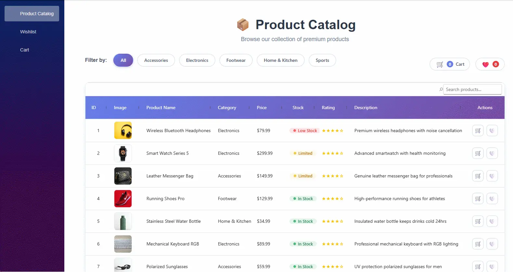

# Build a Blazor Product Catalog App

This guide shows how to build a **Product Catalog application** using [Blazor components](https://www.syncfusion.com/blazor-components). You will learn how to display, manage, and interact with product data efficiently. The application includes features like product listing, category filtering, search functionality, shopping cart, and favorites list management.

## Prerequisites

* [.NET 8 SDK or later](https://dotnet.microsoft.com/en-us/download/dotnet)
* [Visual Studio](https://visualstudio.microsoft.com/downloads/) 2022 or later or [Visual Studio Code](https://code.visualstudio.com/) with [C# Dev Kit](https://marketplace.visualstudio.com/items?itemName=ms-dotnettools.csdevkit) extension.

## Create the Blazor project

To create a Blazor application, follow the [Blazor getting started guide](https://blazor.syncfusion.com/documentation/getting-started/blazor-server-side-visual-studio?tabcontent=visual-studio-code).

### Install required Blazor packages


Install the NuGet packages listed below to add the required Blazor components to your application.

| Component Name | Package |
|----------------|---------|
| [Blazor DataGrid](https://www.syncfusion.com/blazor-components/blazor-datagrid) | [Syncfusion.Blazor.Grid](https://www.nuget.org/packages/Syncfusion.Blazor.Grid) |
| [Blazor Button](https://www.syncfusion.com/blazor-components/blazor-button) | [Syncfusion.Blazor.Buttons](https://www.nuget.org/packages/Syncfusion.Blazor.Buttons) |
| [Blazor TextBox](https://www.syncfusion.com/blazor-components/blazor-textbox) | [Syncfusion.Blazor.Inputs](https://www.nuget.org/packages/Syncfusion.Blazor.Inputs) |
| [Blazor Carousel](https://www.syncfusion.com/blazor-components/blazor-carousel) | [Syncfusion.Blazor.Navigations](https://www.nuget.org/packages/Syncfusion.Blazor.Navigations) |
| [Blazor Dialog](https://www.syncfusion.com/blazor-components/blazor-modal-dialog) | [Syncfusion.Blazor.Popups](https://www.nuget.org/packages/Syncfusion.Blazor.Popups) |
| Themes | [Syncfusion.Blazor.Themes](https://www.nuget.org/packages/Syncfusion.Blazor.Themes) |





1. Open your project in **Visual Studio**.
2. Navigate to **(*Tools → NuGet Package Manager → Manage NuGet Packages for Solution*)**.
3. Search for and install the required packages listed in the preceding table.





Open the integrated terminal and run the following commands:




dotnet add package Syncfusion.Blazor.Buttons --version {{ site.releaseversion }}
dotnet add package Syncfusion.Blazor.Inputs --version {{ site.releaseversion }}
dotnet add package Syncfusion.Blazor.Grid --version {{ site.releaseversion }}
dotnet add package Syncfusion.Blazor.Navigations --version {{ site.releaseversion }}
dotnet add package Syncfusion.Blazor.Popups --version {{ site.releaseversion }}
dotnet add package Syncfusion.Blazor.Themes --version {{ site.releaseversion }}








Run the following commands from a command prompt or terminal:




dotnet add package Syncfusion.Blazor.Buttons --version {{ site.releaseversion }}
dotnet add package Syncfusion.Blazor.Inputs --version {{ site.releaseversion }}
dotnet add package Syncfusion.Blazor.Grid --version {{ site.releaseversion }}
dotnet add package Syncfusion.Blazor.Navigations --version {{ site.releaseversion }}
dotnet add package Syncfusion.Blazor.Popups --version {{ site.releaseversion }}
dotnet add package Syncfusion.Blazor.Themes --version {{ site.releaseversion }}








### Register Blazor service

Add the Blazor service to the `~/Program.cs` file to enable Blazor components across all pages.




using Syncfusion.Blazor;
using BlazorProductGrid.Services;
...
// Add services to the container.
builder.Services.AddRazorComponents()
.AddInteractiveServerComponents();

// Register Syncfusion Blazor service
builder.Services.AddSyncfusionBlazor();

var app = builder.Build();
...




### Add required namespaces

Open the `Components/_Imports.razor` file and import the following Blazor component, model, data, and service namespaces.




@using BlazorProductGrid.Models
@using BlazorProductGrid.Data
@using BlazorProductGrid.Services
@using Syncfusion.Blazor
@using Syncfusion.Blazor.Grids
@using Syncfusion.Blazor.Navigations
@using Syncfusion.Blazor.Inputs
@using Syncfusion.Blazor.Buttons
@using Syncfusion.Blazor.Popups




### Add stylesheet and script resources

The theme stylesheet and script can be accessed from NuGet through [Static Web Assets](https://blazor.syncfusion.com/documentation/appearance/themes#static-web-assets). Include the [stylesheet](https://blazor.syncfusion.com/documentation/appearance/themes) and [script references](https://blazor.syncfusion.com/documentation/common/adding-script-references) in the **App.razor** file.




<head>
    ...
    <!-- Blazor theme stylesheet -->
    <link href="_content/Syncfusion.Blazor.Themes/fluent2.css" rel="stylesheet" />
</head>
<body>
    ...
    <!-- Blazor core script (required for UI components) -->
    <script src="_content/Syncfusion.Blazor.Core/scripts/syncfusion-blazor.min.js"></script>
</body>




## Project structure

Organize the application using the following folder structure to maintain a clear and modular architecture.

```text
BlazorProductGrid/
├── Components/
│   ├── Pages/
│   │   ├── ProductCatalog.razor     # Main catalog page with DataGrid
│   │   ├── Cart.razor               # Cart / order summary page
│   │   └── Wishlist.razor           # Wishlist page
│   ├── Layout/
│   │   ├── MainLayout.razor
│   │   └── NavMenu.razor
│   ├── App.razor
│   └── Routes.razor
├── Data/
│   └── ProductData.cs               # Sample product data
├── Models/
│   └── Product.cs                   # Product model
├── Services/
│   ├── CartService.cs              # Shopping cart logic
│   └── WishlistService.cs          # Wishlist logic
├── Program.cs
└── BlazorProductGrid.csproj
```

## Create the Product Model

The **Product** model defines the structure of a single product record used throughout the application. Create a `Models/Product.cs` file with the following code.




namespace BlazorProductGrid.Models;

public class Product
{
    public int Id { get; set; }
    public string Name { get; set; } = string.Empty;
    public string Category { get; set; } = string.Empty;
    public decimal Price { get; set; }
    public int Stock { get; set; }
    public string ImageUrl { get; set; } = string.Empty;
    public double Rating { get; set; }
    public string Description { get; set; } = string.Empty;
}




## Create Product Data

The **ProductData** class provides static sample data used to populate the DataGrid. Create a `Data/ProductData.cs` file with the following code.




using BlazorProductGrid.Models;

namespace BlazorProductGrid.Data;

public class ProductData
{
    public static List<Product> GetProducts()
    {
        return new List<Product>
        {
            new Product { Id = 1, Name = "Wireless Bluetooth Headphones", Category = "Electronics", Price = 79.99m, Stock = 4, ImageUrl = "https://images.unsplash.com/photo-1505740420928-5e560c06d30e?w=300", Rating = 4.5, Description = "Premium wireless headphones with noise cancellation" },
            new Product { Id = 2, Name = "Smart Watch Series 5", Category = "Electronics", Price = 299.99m, Stock = 30, ImageUrl = "https://images.unsplash.com/photo-1546868871-7041f2a55e12?w=300", Rating = 4.8, Description = "Advanced smartwatch with health monitoring" },
            new Product { Id = 3, Name = "Leather Messenger Bag", Category = "Accessories", Price = 149.99m, Stock = 25, ImageUrl = "https://images.unsplash.com/photo-1548036328-c9fa89d128fa?w=300", Rating = 4.6, Description = "Genuine leather messenger bag for professionals" },
            new Product { Id = 4, Name = "Running Shoes Pro", Category = "Footwear", Price = 129.99m, Stock = 60, ImageUrl = "https://images.unsplash.com/photo-1542291026-7eec264c27ff?w=300", Rating = 4.7, Description = "High-performance running shoes for athletes" },
            new Product { Id = 5, Name = "Stainless Steel Water Bottle", Category = "Home & Kitchen", Price = 34.99m, Stock = 100, ImageUrl = "https://images.unsplash.com/photo-1602143407151-7111542de6e8?w=300", Rating = 4.4, Description = "Insulated water bottle keeps drinks cold 24hrs" },
            new Product { Id = 6, Name = "Mechanical Keyboard RGB", Category = "Electronics", Price = 89.99m, Stock = 40, ImageUrl = "https://images.unsplash.com/photo-1587829741301-dc798b83add3?w=300", Rating = 4.9, Description = "Professional mechanical keyboard with RGB lighting" },
            new Product { Id = 7, Name = "Polarized Sunglasses", Category = "Accessories", Price = 59.99m, Stock = 55, ImageUrl = "https://images.unsplash.com/photo-1572635196237-14b3f281503f?w=300", Rating = 4.3, Description = "UV protection polarized sunglasses for men" },
            new Product { Id = 8, Name = "Ceramic Coffee Mug Set", Category = "Home & Kitchen", Price = 45.99m, Stock = 70, ImageUrl = "https://images.unsplash.com/photo-1514228742587-6b1558fcca3d?w=300", Rating = 4.5, Description = "Set of 4 premium ceramic coffee mugs" },
            new Product { Id = 9, Name = "Wireless Mouse Ergonomic", Category = "Electronics", Price = 49.99m, Stock = 80, ImageUrl = "https://images.unsplash.com/photo-1527864550417-7fd91fc51a46?w=300", Rating = 4.6, Description = "Ergonomic wireless mouse for comfortable use" },
            new Product { Id = 10, Name = "Canvas Backpack", Category = "Accessories", Price = 79.99m, Stock = 35, ImageUrl = "https://images.unsplash.com/photo-1553062407-98eeb64c6a62?w=300", Rating = 4.7, Description = "Durable canvas backpack with laptop compartment" },
            new Product { Id = 11, Name = "Yoga Mat Premium", Category = "Sports", Price = 39.99m, Stock = 90, ImageUrl = "https://images.unsplash.com/photo-1601925260368-ae2f83cf8b7f?w=300", Rating = 4.8, Description = "Non-slip premium yoga mat for fitness" },
            new Product { Id = 12, Name = "Portable Charger 20000mAh", Category = "Electronics", Price = 49.99m, Stock = 65, ImageUrl = "https://images.unsplash.com/photo-1609091839311-d5365f9ff1c5?w=300", Rating = 4.4, Description = "High capacity portable charger for all devices" },
            new Product { Id = 13, Name = "Wireless Earbuds Pro", Category = "Electronics", Price = 149.99m, Stock = 50, ImageUrl = "https://images.unsplash.com/photo-1484704849700-f032a568e944?w=300", Rating = 4.7, Description = "True wireless earbuds with active noise cancellation" },
            new Product { Id = 14, Name = "Smart Home Hub", Category = "Electronics", Price = 89.99m, Stock = 40, ImageUrl = "https://images.unsplash.com/photo-1558089687-f282ffcbc126?w=300", Rating = 4.5, Description = "Central hub for all your smart home devices" },
            new Product { Id = 15, Name = "Fitness Tracker Band", Category = "Electronics", Price = 59.99m, Stock = 75, ImageUrl = "https://images.unsplash.com/photo-1575311373937-040b8e1fd5b6?w=300", Rating = 4.4, Description = "Lightweight fitness tracker with heart rate monitor" },
            new Product { Id = 16, Name = "Leather Wallet", Category = "Accessories", Price = 69.99m, Stock = 45, ImageUrl = "https://images.unsplash.com/photo-1627123424574-724758594e93?w=300", Rating = 4.6, Description = "Genuine leather wallet with card organizer" },
            new Product { Id = 17, Name = "Desk Lamp LED", Category = "Home & Kitchen", Price = 44.99m, Stock = 85, ImageUrl = "https://images.unsplash.com/photo-1507473885765-e6ed057f782c?w=300", Rating = 4.3, Description = "Adjustable LED desk lamp with multiple brightness levels" },
            new Product { Id = 18, Name = "Hiking Boots", Category = "Footwear", Price = 159.99m, Stock = 30, ImageUrl = "https://images.unsplash.com/photo-1551107696-a4b0c5a0d9a2?w=300", Rating = 4.8, Description = "Waterproof hiking boots for all terrains" },
            new Product { Id = 19, Name = "Noise Canceling Earmuffs", Category = "Electronics", Price = 39.99m, Stock = 60, ImageUrl = "https://images.unsplash.com/photo-1583394838336-acd977736f90?w=300", Rating = 4.2, Description = "Comfortable earmuffs for focused work and travel" },
            new Product { Id = 20, Name = "Insulated Lunch Bag", Category = "Home & Kitchen", Price = 29.99m, Stock = 95, ImageUrl = "https://images.unsplash.com/photo-1567620905732-2d1ec7ab7445?w=300", Rating = 4.5, Description = "Reusable insulated lunch bag with multiple compartments" }
        };
    }
}




## Create services

Services manage business logic and share data across components. In Blazor, they are registered with dependency injection to provide consistent access throughout the application.





using BlazorProductGrid.Models;

namespace BlazorProductGrid.Services;

public class CartService
{
    private List<CartItem> _cartItems = new();

    public IReadOnlyList<CartItem> CartItems => _cartItems.AsReadOnly();
    public int TotalItems => _cartItems.Sum(c => c.Quantity);
    public decimal TotalAmount => _cartItems.Sum(c => c.Product.Price * c.Quantity);

    public void AddToCart(Product product)
    {
        var existingItem = _cartItems.FirstOrDefault(c => c.Product.Id == product.Id);
        if (existingItem != null)
        {
            if (existingItem.Quantity < product.Stock)
            {
                existingItem.Quantity++;
            }
        }
        else
        {
            _cartItems.Add(new CartItem { Product = product, Quantity = 1 });
        }
    }

    public void RemoveFromCart(Product product)
    {
        var item = _cartItems.FirstOrDefault(c => c.Product.Id == product.Id);
        if (item != null)
        {
            _cartItems.Remove(item);
        }
    }

    public void IncreaseQty(CartItem item)
    {
        var existing = _cartItems.FirstOrDefault(c => c.Product.Id == item.Product.Id);
        if (existing != null && existing.Quantity < item.Product.Stock)
        {
            existing.Quantity++;
        }
    }

    public void DecreaseQty(CartItem item)
    {
        var existing = _cartItems.FirstOrDefault(c => c.Product.Id == item.Product.Id);
        if (existing != null)
        {
            if (existing.Quantity > 1)
            {
                existing.Quantity--;
            }
            else
            {
                RemoveFromCart(item.Product);
            }
        }
    }

    public void ClearCart()
    {
        _cartItems.Clear();
    }

    public class CartItem
    {
        public Product Product { get; set; } = null!;
        public int Quantity { get; set; }
    }
}





using BlazorProductGrid.Models;

namespace BlazorProductGrid.Services;

public class WishlistService
{
    private List<Product> _wishlistItems = new();

    public IReadOnlyList<Product> WishlistItems => _wishlistItems.AsReadOnly();
    public int Count => _wishlistItems.Count;

    public void AddToWishlist(Product product)
    {
        if (!_wishlistItems.Any(p => p.Id == product.Id))
        {
            _wishlistItems.Add(product);
        }
    }

    public void RemoveFromWishlist(Product product)
    {
        var item = _wishlistItems.FirstOrDefault(p => p.Id == product.Id);
        if (item != null)
        {
            _wishlistItems.Remove(item);
        }
    }

    public bool IsInWishlist(Product product)
    {
        return _wishlistItems.Any(p => p.Id == product.Id);
    }

    public void ClearWishlist()
    {
        _wishlistItems.Clear();
    }
}





### Register services

Register the application services in `Program.cs` so they can be accessed throughout the Blazor application using dependency injection.




...
using Syncfusion.Blazor;

...
// Syncfusion Blazor service
builder.Services.AddSyncfusionBlazor();

// Application services
builder.Services.AddScoped<CartService>();
builder.Services.AddScoped<WishlistService>();

var app = builder.Build();
...




N> Application level services (CartService, WishlistService) are registered in the [Register services](#register-services) step below.

## Create the application pages

Pages define the main user interface of the application. Each page handles a specific part of the workflow, such as browsing products, saving items for later, and managing purchases.

### Create the Product Catalog Page

The product catalog page is the main entry point of the application. It uses the [Blazor DataGrid](https://www.syncfusion.com/blazor-components/blazor-datagrid) to display all products with sorting, paging, and search. Category filter chips, a cart preview dialog, and an image gallery powered by [Blazor Carousel](https://www.syncfusion.com/blazor-components/blazor-carousel) are also included on this page.




@page "/"
@rendermode InteractiveServer
@inject CartService CartService
@inject WishlistService WishlistService
@inject NavigationManager Navigation
@using BlazorProductGrid.Services
@using Syncfusion.Blazor.Grids
@using Syncfusion.Blazor.Navigations
@using Syncfusion.Blazor.Inputs
@using Syncfusion.Blazor.Buttons
@using Syncfusion.Blazor.Popups

<div class="catalog-container">
    <div class="catalog-header">
        <h1>📦 Product Catalog</h1>
        <p class="subtitle">Browse our collection of premium products</p>
    </div>

    <div class="toolbar-section">
        <div class="filter-chips-section">
            <span class="filter-label">Filter by:</span>
            <SfButton @onclick="() => FilterByCategory(null)" CssClass="@(SelectedCategory == null ? "filter-chip active" : "filter-chip")">All</SfButton>
            @foreach (var cat in Categories)
            {
                <SfButton @onclick="() => FilterByCategory(cat)" CssClass="@(SelectedCategory == cat ? "filter-chip active" : "filter-chip")">@cat</SfButton>
            }
        </div>
        <div class="toolbar-actions">
            <SfButton @onclick="ToggleCart" CssClass="cart-summary">
                <span class="cart-icon">🛒</span>
                <span class="cart-count">@CartService.TotalItems</span>
                <span class="cart-text">Cart</span>
                @if (CartService.CartItems.Any())
                {
                    <span class="cart-total">@CartService.TotalAmount.ToString("C")</span>
                }
            </SfButton>
            <SfButton @onclick="GoToWishlist" CssClass="@("wishlist-btn" + (WishlistService.Count > 0 ? " has-items" : ""))">
                <span class="heart-icon">❤️</span>
                <span class="wishlist-count">@WishlistService.Count</span>
            </SfButton>
        </div>
    </div>

    <SfDialog @bind-Visible="@ShowCart" IsModal="true" Width="500px" ShowCloseIcon="true" CssClass="cart-dialog">
        <DialogTemplates>
            <Header>
                <div class="cart-header">
                    <h3>🛒 Shopping Cart</h3>
                </div>
            </Header>
            <Content>
                @if (CartService.CartItems.Any())
                {
                    <div class="cart-items">
                        @foreach (var item in CartService.CartItems)
                        {
                            <div class="cart-item">
                                
                                <div class="cart-item-details">
                                    <div class="cart-item-name">@item.Product.Name</div>
                                    <div class="cart-item-price">@item.Product.Price.ToString("C")</div>
                                </div>
                                <div class="cart-item-qty">
                                    <SfButton @onclick="() => CartService.DecreaseQty(item)" CssClass="qty-btn">-</SfButton>
                                    <span>@item.Quantity</span>
                                    <SfButton @onclick="() => CartService.IncreaseQty(item)" CssClass="@("qty-btn" + (item.Quantity >= item.Product.Stock ? " disabled" : ""))" Disabled="@(item.Quantity >= item.Product.Stock)">+</SfButton>
                                </div>
                                <div class="cart-item-subtotal">@((item.Product.Price * item.Quantity).ToString("C"))</div>
                                <SfButton @onclick="() => CartService.RemoveFromCart(item.Product)" CssClass="remove-btn">🗑️</SfButton>
                            </div>
                        }
                    </div>
                    <div class="cart-footer">
                        <div class="cart-total-row">
                            <span>Total:</span>
                            <span class="cart-grand-total">@CartService.TotalAmount.ToString("C")</span>
                        </div>
                        <SfButton @onclick="GoToCart" CssClass="cart-btn">View Cart</SfButton>
                    </div>
                }
                else
                {
                    <div class="cart-empty">
                        <span class="empty-icon">🛒</span>
                        <p>Your cart is empty</p>
                    </div>
                }
            </Content>
        </DialogTemplates>
    </SfDialog>

    <SfDialog @bind-Visible="@ShowImageGallery" IsModal="true" Width="90%" MaxWidth="800px" ShowCloseIcon="true" CssClass="image-gallery-dialog" OnOverlayClick="CloseGalleryOnOverlay">
        <DialogTemplates>
            <Header>
                <div class="gallery-header">
                    <h3>@Products[CurrentImageIndex].Name</h3>
                </div>
            </Header>
            <Content>
                <SfCarousel @bind-SelectedIndex="@CurrentImageIndex" ShowIndicators="false" ShowArrows="Always" AutoPlay="false">
                    @foreach (var product in Products)
                    {
                        <CarouselItem>
                            <figure class="carousel-item-wrapper">
                                
                            </figure>
                        </CarouselItem>
                    }
                </SfCarousel>
            </Content>
        </DialogTemplates>
    </SfDialog>

    <SfGrid @ref="DefaultGrid" DataSource="@FilteredProducts" AllowPaging="true" AllowSorting="true"
            ShowColumnMenu="true" ID="ProductGrid" RowHeight="70">
        <SfToolbar>
            <ToolbarItems>
                <ToolbarItem Type="ItemType.Input" Align="ItemAlign.Right">
                    <Template>
                        <span class="e-search-icon e-icons"></span>
                        <SfTextBox Placeholder="Search products..." Input="OnInput"></SfTextBox>
                    </Template>
                </ToolbarItem>
            </ToolbarItems>
        </SfToolbar>
        <GridPageSettings PageSize="8"></GridPageSettings>
        <GridColumns>
            <GridColumn Field="@nameof(Product.Id)" HeaderText="ID" Width="80" TextAlign="TextAlign.Center"></GridColumn>
            <GridColumn Field="@nameof(Product.ImageUrl)" HeaderText="Image" Width="100">
                <Template>
                    @{
                        var product = context as Product;
                    }
                    <div class="product-image-cell">
                         OpenImageGallery(product!)" style="cursor: pointer;" />
                    </div>
                </Template>
            </GridColumn>
            <GridColumn Field="@nameof(Product.Name)" HeaderText="Product Name" Width="220"></GridColumn>
            <GridColumn Field="@nameof(Product.Category)" HeaderText="Category" Width="120"></GridColumn>
            <GridColumn Field="@nameof(Product.Price)" HeaderText="Price" Width="100" Format="C2"></GridColumn>
            <GridColumn Field="@nameof(Product.Stock)" HeaderText="Stock" Width="100" TextAlign="TextAlign.Center">
                <Template>
                    @{
                        var product = context as Product;
                    }
                    <div class="stock-cell stock-@GetStockClass(product?.Stock ?? 0)">
                        <span class="stock-dot"></span>
                        <span class="stock-text">@GetStockText(product?.Stock ?? 0)</span>
                    </div>
                </Template>
            </GridColumn>
            <GridColumn Field="@nameof(Product.Rating)" HeaderText="Rating" Width="100">
                <Template>
                    @{
                        var product = context as Product;
                    }
                    <div class="rating-cell">
                        <span class="rating-stars">@GetStarDisplay(product?.Rating ?? 0)</span>
                    </div>
                </Template>
            </GridColumn>
            <GridColumn Field="@nameof(Product.Description)" HeaderText="Description" Width="350"></GridColumn>
            <GridColumn HeaderText="Actions" Width="120" TextAlign="TextAlign.Center">
                <Template>
                    @{
                        var product = context as Product;
                        var inCart = CartService.CartItems.Any(c => c.Product.Id == product?.Id);
                        var cartItem = CartService.CartItems.FirstOrDefault(c => c.Product.Id == product?.Id);
                        var atStockLimit = cartItem != null && cartItem.Quantity >= product!.Stock;
                        var inWishlist = WishlistService.IsInWishlist(product!);
                    }
                    <div class="action-buttons">
                            <SfButton @onclick="() => { if (!atStockLimit) AddToCart(product!); }" Disabled="@atStockLimit" CssClass="@("action-btn" + (inCart ? " in-cart" : "") + (atStockLimit ? " disabled" : ""))">
                                🛒
                            </SfButton>
                            <SfButton @onclick="() => ToggleWishlist(product!)" CssClass="@("action-btn wishlist" + (inWishlist ? " in-wishlist" : ""))">
                                @(inWishlist ? "❤️" : "🤍")
                            </SfButton>
                    </div>
                </Template>
            </GridColumn>
        </GridColumns>
    </SfGrid>
</div>

@code {
    private SfGrid<Product>? DefaultGrid { get; set; }
    private List<Product> Products { get; set; } = new();
    private string? SelectedCategory { get; set; }
    private bool ShowCart { get; set; } = false;
    private bool ShowImageGallery { get; set; } = false;
    private int CurrentImageIndex { get; set; } = 0;

    private List<string> Categories => Products.Select(p => p.Category).Distinct().OrderBy(c => c).ToList();
    private List<Product> FilteredProducts => Products.Where(p => SelectedCategory == null || p.Category == SelectedCategory).ToList();

    private void OnInput(InputEventArgs args) => DefaultGrid?.SearchAsync(args.Value);
    protected override void OnInitialized() => Products = ProductData.GetProducts();
    private void FilterByCategory(string? category) => SelectedCategory = category;
    private void ToggleCart() => ShowCart = !ShowCart;
    private void AddToCart(Product product) { CartService.AddToCart(product); ShowCart = true; }
    private void ToggleWishlist(Product product) { if (WishlistService.IsInWishlist(product)) WishlistService.RemoveFromWishlist(product); else WishlistService.AddToWishlist(product); }
    private void GoToCart() => Navigation.NavigateTo("/cart");
    private void GoToWishlist() => Navigation.NavigateTo("/wishlist");
    private void CloseGalleryOnOverlay() => ShowImageGallery = false;
    private void OpenImageGallery(Product product)
    {
        CurrentImageIndex = Products.FindIndex(p => p.Id == product.Id);
        ShowImageGallery = true;
    }

    private string GetStockClass(int stock) => stock > 30 ? "high" : stock > 10 ? "medium" : "low";
    private string GetStockText(int stock) => stock > 30 ? "In Stock" : stock > 10 ? "Limited" : "Low Stock";
    private string GetStarDisplay(double rating) => new string('★', (int)Math.Floor(rating)) + new string('☆', 5 - (int)Math.Floor(rating));
}





.catalog-container {
    padding: 2rem;
    max-width: 1400px;
    margin: 0 auto;
}

.catalog-header {
    text-align: center;
    margin-bottom: 2rem;
}

.catalog-header h1 {
    font-size: 2.5rem;
    font-weight: 700;
    color: #2d3748;
    margin-bottom: 0.5rem;
}

.subtitle {
    color: #718096;
    font-size: 1.1rem;
}

.filter-chips-section {
    display: flex;
    flex-wrap: wrap;
    gap: 0.75rem;
    margin-bottom: 1.5rem;
    align-items: center;
}

.filter-label {
    font-weight: 600;
    color: #4a5568;
    margin-right: 0.5rem;
}

.filter-chip {
    padding: 0.5rem 1.25rem;
    border: 2px solid #e2e8f0;
    border-radius: 20px;
    background: #fff;
    color: #4a5568;
    font-weight: 500;
    cursor: pointer;
    transition: all 0.2s ease;
}

.filter-chip:hover {
    border-color: #667eea;
    color: #667eea;
    background: rgba(102, 126, 234, 0.05);
}

.filter-chip.active {
    background: linear-gradient(135deg, #667eea 0%, #764ba2 100%);
    border-color: transparent;
    color: #fff;
    box-shadow: 0 2px 8px rgba(102, 126, 234, 0.4);
}

.toolbar-section {
    display: flex;
    justify-content: space-between;
    align-items: center;
    flex-wrap: wrap;
    gap: 1rem;
    margin-bottom: 1.5rem;
}

.toolbar-actions {
    display: flex;
    gap: 1rem;
    align-items: center;
}

.cart-summary {
    display: flex;
    align-items: center;
    gap: 0.5rem;
    padding: 0.5rem 1rem;
    background: #fff;
    border: 2px solid #e2e8f0;
    border-radius: 25px;
    cursor: pointer;
    transition: all 0.2s ease;
}

.cart-summary:hover {
    border-color: #667eea;
    box-shadow: 0 2px 8px rgba(102, 126, 234, 0.2);
}

.cart-icon { font-size: 1.2rem; }
.cart-count {
    background: #667eea;
    color: #fff;
    border-radius: 50%;
    width: 20px;
    height: 20px;
    display: flex;
    align-items: center;
    justify-content: center;
    font-size: 0.75rem;
    font-weight: bold;
}
.cart-text { font-weight: 500; color: #4a5568; }
.cart-total {
    font-weight: bold;
    color: #667eea;
    margin-left: 0.5rem;
}

.wishlist-btn {
    display: flex;
    align-items: center;
    gap: 0.5rem;
    padding: 0.5rem 1rem;
    background: #fff;
    border: 2px solid #e2e8f0;
    border-radius: 25px;
    cursor: pointer;
    transition: all 0.2s ease;
}

.wishlist-btn:hover {
    border-color: #e53e3e;
    background: rgba(245, 101, 101, 0.05);
}

.wishlist-btn.has-items {
    border-color: #e53e3e;
    background: rgba(245, 101, 101, 0.05);
}

.heart-icon { font-size: 1.2rem; }
.wishlist-count {
    background: #e53e3e;
    color: #fff;
    border-radius: 50%;
    width: 20px;
    height: 20px;
    display: flex;
    align-items: center;
    justify-content: center;
    font-size: 0.75rem;
    font-weight: bold;
}

/* Cart Dialog */
.cart-dialog .e-dialog-header {
    background: linear-gradient(135deg, #667eea 0%, #764ba2 100%);
    color: #fff;
    padding: 1rem 1.5rem;
}

.cart-dialog .e-dialog-header h3 {
    margin: 0;
    font-size: 1.25rem;
    color: #fff;
}

.cart-dialog .e-dialog-content {
    padding: 0;
}

.cart-items {
    padding: 1rem;
    max-height: 400px;
    overflow-y: auto;
}

.cart-item {
    display: flex;
    align-items: center;
    gap: 1rem;
    padding: 0.75rem;
    border-radius: 12px;
    background: #f7fafc;
    margin-bottom: 0.75rem;
}

.cart-item-image {
    width: 50px;
    height: 50px;
    object-fit: cover;
    border-radius: 8px;
}

.cart-item-details { flex: 1; }
.cart-item-name { font-weight: 600; color: #2d3748; }
.cart-item-price { color: #667eea; font-weight: bold; }

.cart-item-qty {
    display: flex;
    align-items: center;
    gap: 0.5rem;
}

.qty-btn {
    width: 28px;
    height: 28px;
    border: 2px solid #e2e8f0;
    background: #fff;
    border-radius: 8px;
    cursor: pointer;
    font-weight: bold;
    color: #4a5568;
    display: flex;
    align-items: center;
    justify-content: center;
    text-align: center;
}

.qty-btn:hover {
    background: #667eea;
    color: #fff;
    border-color: #667eea;
}

.qty-btn.disabled {
    opacity: 0.5;
    cursor: not-allowed;
}

.qty-btn.disabled:hover {
    background: #fff;
    color: #4a5568;
    border-color: #e2e8f0;
}

.cart-item-subtotal {
    font-weight: bold;
    color: #2d3748;
    min-width: 70px;
    text-align: right;
}

.remove-btn {
    background: none;
    border: none;
    cursor: pointer;
    font-size: 1.2rem;
    opacity: 0.5;
    transition: opacity 0.2s;
}

.remove-btn:hover { opacity: 1; }

.cart-footer {
    padding: 1.25rem 1.5rem;
    border-top: 1px solid #e2e8f0;
    background: #f7fafc;
}

.cart-total-row {
    display: flex;
    justify-content: space-between;
    font-size: 1.25rem;
    font-weight: bold;
    margin-bottom: 1rem;
}

.cart-grand-total { color: #667eea; }

.cart-btn {
    width: 100%;
    padding: 1rem;
    background: linear-gradient(135deg, #667eea 0%, #764ba2 100%);
    color: #fff;
    border: none;
    border-radius: 12px;
    font-size: 1rem;
    font-weight: bold;
    cursor: pointer;
    transition: transform 0.2s;
}

.cart-btn:hover {
    transform: scale(1.02);
    box-shadow: 0 4px 15px rgba(102, 126, 234, 0.4);
}

.cart-empty {
    padding: 3rem;
    text-align: center;
}

.empty-icon { font-size: 3rem; display: block; margin-bottom: 1rem; }

/* Action Buttons in Grid */
.action-buttons {
    display: flex;
    gap: 0.5rem;
    justify-content: center;
}

.action-btn {
    width: 36px;
    height: 36px;
    border: 2px solid #e2e8f0;
    background: #fff;
    border-radius: 10px;
    cursor: pointer;
    font-size: 1rem;
    transition: all 0.2s ease;
    text-align: center;
    line-height: 36px;
    display: flex;
    align-items: center;
    justify-content: center;
}

.action-btn:hover {
    border-color: #667eea;
    background: rgba(102, 126, 234, 0.1);
    transform: scale(1.1);
}

.action-btn.in-cart {
    background: #667eea;
    border-color: #667eea;
}

.action-btn.wishlist.in-wishlist {
    background: rgba(245, 101, 101, 0.1);
    border-color: #e53e3e;
}

/* Grid Styling */
.e-grid {
    border-radius: 12px;
    overflow: hidden;
    box-shadow: 0 4px 15px rgba(0, 0, 0, 0.08);
    border: 1px solid #e2e8f0;
}

.e-grid .e-headercontent {
    background: linear-gradient(135deg, #667eea 0%, #764ba2 100%) !important;
    color: #fff;
}

.e-grid .e-headercell {
    color: #fff !important;
    font-weight: 600;
    padding: 1rem 0.5rem;
    background: transparent !important;
    border-bottom: 2px solid rgba(255,255,255,0.3);
}

.e-grid .e-columnheader {
    background: linear-gradient(135deg, #667eea 0%, #764ba2 100%) !important;
}

.e-grid .e-rowcell {
    vertical-align: middle;
}

.product-image-cell img {
    width: 55px;
    height: 55px;
    object-fit: cover;
    border-radius: 8px;
    border: 1px solid #e2e8f0;
    transition: transform 0.3s ease;
}

.product-image-cell img:hover {
    transform: scale(1.15);
}

.stock-cell {
    display: inline-flex;
    align-items: center;
    gap: 6px;
    padding: 4px 12px;
    border-radius: 20px;
    font-size: 0.8rem;
    font-weight: 600;
}

.stock-dot {
    width: 8px;
    height: 8px;
    border-radius: 50%;
}

.stock-high {
    background: rgba(72, 187, 120, 0.15);
    color: #2f855a;
}
.stock-high .stock-dot { background: #48bb78; }

.stock-medium {
    background: rgba(236, 201, 75, 0.15);
    color: #b7791f;
}
.stock-medium .stock-dot { background: #ecc94b; }

.stock-low {
    background: rgba(245, 101, 101, 0.15);
    color: #e53e3e;
}
.stock-low .stock-dot { background: #f56565; }

.rating-cell {
    display: flex;
    align-items: center;
    gap: 8px;
}

.rating-stars {
    color: #f6c105;
    letter-spacing: 2px;
}

/* Image Gallery Dialog */
.image-gallery-dialog .e-dialog-header {
    background: linear-gradient(135deg, #667eea 0%, #764ba2 100%);
    color: #fff;
    padding: 1rem 1.5rem;
}

.image-gallery-dialog .e-dialog-header h3 {
    margin: 0;
    font-size: 1.25rem;
    color: #fff;
}

.image-gallery-dialog .e-dialog-content {
    padding: 0;
}

.carousel-item-wrapper {
    display: flex;
    justify-content: center;
    align-items: center;
    height: 100%;
    margin: 0;
    padding: 1rem;
}

.gallery-image {
    max-width: 100%;
    max-height: 60vh;
    object-fit: contain;
    border-radius: 8px;
}

.image-gallery-dialog .e-carousel {
    height: 100%;
}

.image-gallery-dialog .e-carousel .e-carousel-item {
    height: 100%;
}




### Create the Wishlist Page

The **Wishlist** page displays all products the user has saved. It uses a Blazor DataGrid to list wishlist items and provides **Add to Cart** and **Remove** actions for each product.




@page "/wishlist"
@rendermode InteractiveServer
@inject WishlistService WishlistService
@inject CartService CartService
@inject NavigationManager Navigation
@using BlazorProductGrid.Models
@using BlazorProductGrid.Services
@using Syncfusion.Blazor.Grids
@using Syncfusion.Blazor.Buttons

<div class="wishlist-container">
    <div class="wishlist-header">
        <h1>❤️ My Wishlist</h1>
        <p class="subtitle">@(WishlistService.Count) item@(WishlistService.Count != 1 ? "s" : "") in your wishlist</p>
    </div>

    @if (WishlistService.WishlistItems.Any())
    {
        <div class="wishlist-grid-section">
            <SfGrid DataSource="@WishlistItems" ID="WishlistGrid" AllowSelection="false" Height="auto">
                <GridColumns>
                    <GridColumn HeaderText="Image" Width="100">
                        <Template>
                            @{
                                var product = context as Product;
                            }
                            <div class="product-image-cell">
                                
                            </div>
                        </Template>
                    </GridColumn>
                    <GridColumn Field="Name" HeaderText="Product Name" Width="200"></GridColumn>
                    <GridColumn Field="Category" HeaderText="Category" Width="120"></GridColumn>
                    <GridColumn Field="Price" HeaderText="Price" Width="120" Format="C2"></GridColumn>
                    <GridColumn Field="Stock" HeaderText="Stock" Width="100" TextAlign="TextAlign.Center">
                        <Template>
                            @{
                                var product = context as Product;
                            }
                            <span class="stock-badge stock-@GetStockClass(product?.Stock ?? 0)">
                                @GetStockText(product?.Stock ?? 0)
                            </span>
                        </Template>
                    </GridColumn>
                    <GridColumn HeaderText="Actions" Width="180">
                        <Template>
                            @{
                                var product = context as Product;
                                var inCart = CartService.CartItems.Any(c => c.Product.Id == product?.Id);
                                var cartBtnClass = inCart ? "add-cart-btn in-cart" : "add-cart-btn";
                            }
                            <div class="action-buttons">
                                <SfButton CssClass="@cartBtnClass" 
                                          @onclick="() => AddToCart(product!)">
                                    @(inCart ? "In Cart" : "Add to Cart")
                                </SfButton>
                                <SfButton CssClass="remove-btn" 
                                          @onclick="() => RemoveFromWishlist(product!)">
                                    🗑️
                                </SfButton>
                            </div>
                        </Template>
                    </GridColumn>
                </GridColumns>
            </SfGrid>
        </div>

        <div class="wishlist-actions">
            <SfButton CssClass="continue-btn" @onclick="ContinueShopping">Continue Shopping</SfButton>
            <SfButton CssClass="clear-btn" @onclick="ClearWishlist">Clear Wishlist</SfButton>
        </div>
    }
    else
    {
        <div class="empty-wishlist">
            <span class="empty-icon">❤️</span>
            <h3>Your wishlist is empty</h3>
            <p>Save items you love by clicking the heart icon on products.</p>
            <SfButton CssClass="browse-btn" @onclick="ContinueShopping">Browse Products</SfButton>
        </div>
    }
</div>

@code {
    private List<Product> WishlistItems = new();

    protected override void OnInitialized()
    {
        WishlistItems = WishlistService.WishlistItems.ToList();
    }

    private void AddToCart(Product product)
    {
        CartService.AddToCart(product);
        WishlistService.RemoveFromWishlist(product);
        WishlistItems = WishlistService.WishlistItems.ToList();
        StateHasChanged();
    }

    private void RemoveFromWishlist(Product product)
    {
        WishlistService.RemoveFromWishlist(product);
        WishlistItems = WishlistService.WishlistItems.ToList();
        StateHasChanged();
    }

    private void ClearWishlist()
    {
        WishlistService.ClearWishlist();
        WishlistItems = WishlistService.WishlistItems.ToList();
        StateHasChanged();
    }

    private void ContinueShopping()
    {
        Navigation.NavigateTo("/");
    }

    private string GetStockClass(int stock) => stock switch
    {
        > 30 => "high",
        > 10 => "medium",
        _ => "low"
    };

    private string GetStockText(int stock) => stock switch
    {
        > 30 => "In Stock",
        > 10 => "Limited",
        _ => "Low Stock"
    };
}





.wishlist-container {
    padding: 2rem;
    max-width: 1200px;
    margin: 0 auto;
}

.wishlist-header {
    text-align: center;
    margin-bottom: 2rem;
}

.wishlist-header h1 {
    font-size: 2rem;
    font-weight: 700;
    color: #2d3748;
    margin-bottom: 0.5rem;
}

.subtitle {
    color: #718096;
    font-size: 1.1rem;
}

.wishlist-grid-section {
    margin-bottom: 2rem;
}

.product-image-cell img {
    width: 55px;
    height: 55px;
    object-fit: cover;
    border-radius: 8px;
    border: 1px solid #e2e8f0;
}

.stock-badge {
    padding: 4px 12px;
    border-radius: 20px;
    font-size: 0.8rem;
    font-weight: 600;
}

.stock-high {
    background: rgba(72, 187, 120, 0.15);
    color: #2f855a;
}

.stock-medium {
    background: rgba(236, 201, 75, 0.15);
    color: #b7791f;
}

.stock-low {
    background: rgba(245, 101, 101, 0.15);
    color: #e53e3e;
}

.action-buttons {
    display: flex;
    gap: 0.5rem;
    align-items: center;
}

.add-cart-btn {
    background: linear-gradient(135deg, #667eea 0%, #764ba2 100%) !important;
    color: #fff !important;
    border: none !important;
    padding: 0.5rem 1rem !important;
    border-radius: 8px !important;
    font-weight: 600 !important;
    font-size: 0.875rem !important;
}

.add-cart-btn.in-cart {
    background: #48bb78 !important;
}

.remove-btn {
    background: #fff !important;
    border: 1px solid #e53e3e !important;
    color: #e53e3e !important;
    padding: 0.5rem 0.75rem !important;
    border-radius: 8px !important;
}

.remove-btn:hover {
    background: #e53e3e !important;
    color: #fff !important;
}

.wishlist-actions {
    display: flex;
    gap: 1rem;
    justify-content: center;
}

.continue-btn {
    background: #fff !important;
    color: #4a5568 !important;
    border: 2px solid #e2e8f0 !important;
    padding: 0.875rem 2rem !important;
    border-radius: 8px !important;
    font-weight: 600 !important;
}

.continue-btn:hover {
    border-color: #667eea !important;
    color: #667eea !important;
}

.clear-btn {
    background: #fff !important;
    color: #e53e3e !important;
    border: 2px solid #e53e3e !important;
    padding: 0.875rem 2rem !important;
    border-radius: 8px !important;
    font-weight: 600 !important;
}

.clear-btn:hover {
    background: #e53e3e !important;
    color: #fff !important;
}

.empty-wishlist {
    text-align: center;
    padding: 4rem 2rem;
    background: #fff;
    border-radius: 16px;
    box-shadow: 0 4px 20px rgba(0, 0, 0, 0.08);
}

.empty-icon {
    font-size: 4rem;
    display: block;
    margin-bottom: 1rem;
}

.empty-wishlist h3 {
    color: #4a5568;
    margin-bottom: 0.5rem;
}

.empty-wishlist p {
    color: #a0aec0;
    margin-bottom: 1.5rem;
}

.browse-btn {
    background: linear-gradient(135deg, #667eea 0%, #764ba2 100%) !important;
    color: #fff !important;
    border: none !important;
    padding: 1rem 2rem !important;
    border-radius: 12px !important;
    font-weight: 600 !important;
}

@@media (max-width: 768px) {
    .wishlist-container {
        padding: 1rem;
    }

    .action-buttons {
        flex-direction: column;
    }

    .wishlist-actions {
        flex-direction: column;
    }
}




### Create the Cart Page

The **Cart** page provides an order summary view. It displays all cart items in a Blazor DataGrid with per-item subtotals, a totals summary card, and a **Confirm Order** button that clears the cart and returns the user to the catalog.




@page "/cart"
@rendermode InteractiveServer
@inject CartService CartService
@inject NavigationManager Navigation
@using BlazorProductGrid.Models
@using BlazorProductGrid.Services
@using Syncfusion.Blazor.Grids
@using Syncfusion.Blazor.Buttons

<div class="cart-container">
    <div class="cart-header">
        <h1>🛒 Cart - Order Summary</h1>
        <p class="subtitle">Review your selected items before placing the order</p>
    </div>

    @if (CartService.CartItems.Any())
    {
        <div class="cart-grid-section">
            <SfGrid DataSource="@CartItems" ID="CartGrid" AllowSelection="false" Height="auto">
                <GridColumns>
                    <GridColumn HeaderText="Image" Width="100">
                        <Template>
                            @{
                                var item = context as CartService.CartItem;
                            }
                            <div class="product-image-cell">
                                
                            </div>
                        </Template>
                    </GridColumn>
                    <GridColumn Field="Product.Name" HeaderText="Product Name" Width="200"></GridColumn>
                    <GridColumn Field="Product.Category" HeaderText="Category" Width="120"></GridColumn>
                    <GridColumn Field="Product.Price" HeaderText="Price" Width="120" Format="C2"></GridColumn>
                    <GridColumn HeaderText="Quantity" Width="120">
                        <Template>
                            @{
                                var item = context as CartService.CartItem;
                            }
                            <span class="qty-badge">@item?.Quantity</span>
                        </Template>
                    </GridColumn>
                    <GridColumn HeaderText="Subtotal" Width="130">
                        <Template>
                            @{
                                var item = context as CartService.CartItem;
                                var subtotal = item != null ? item.Product.Price * item.Quantity : 0;
                            }
                            <span class="subtotal-text">@subtotal.ToString("C")</span>
                        </Template>
                    </GridColumn>
                </GridColumns>
            </SfGrid>
        </div>

        <div class="order-summary-card">
            <h3>💳 Order Summary</h3>
            <div class="summary-row">
                <span>Total Items:</span>
                <span>@CartService.TotalItems</span>
            </div>
            <div class="summary-row">
                <span>Subtotal:</span>
                <span>@CartService.TotalAmount.ToString("C")</span>
            </div>
            <div class="summary-row">
                <span>Shipping:</span>
                <span class="free-shipping">FREE</span>
            </div>
            <div class="summary-divider"></div>
            <div class="summary-row grand-total">
                <span>Grand Total:</span>
                <span>@CartService.TotalAmount.ToString("C")</span>
            </div>
            <div class="cart-actions">
                <SfButton CssClass="confirm-btn" @onclick="ConfirmOrder">Confirm Order</SfButton>
                <SfButton CssClass="continue-btn" @onclick="ContinueShopping">Continue Shopping</SfButton>
            </div>
        </div>
    }
    else
    {
        <div class="empty-cart">
            <span class="empty-icon">🛒</span>
            <h3>Your cart is empty</h3>
            <p>Add some products to your cart before ordering.</p>
            <SfButton CssClass="continue-btn" @onclick="ContinueShopping">Browse Products</SfButton>
        </div>
    }
</div>

@code {
    private List<CartService.CartItem> CartItems = new();

    protected override void OnInitialized()
    {
        // Copy cart items to local list for the grid
        CartItems = CartService.CartItems.ToList();
    }

    private void ConfirmOrder()
    {
        CartService.ClearCart();
        Navigation.NavigateTo("/");
    }

    private void ContinueShopping()
    {
        Navigation.NavigateTo("/");
    }
}





.cart-container {
    padding: 2rem;
    max-width: 1200px;
    margin: 0 auto;
}

.cart-header {
    text-align: center;
    margin-bottom: 2rem;
}

.cart-header h1 {
    font-size: 2rem;
    font-weight: 700;
    color: #2d3748;
    margin-bottom: 0.5rem;
}

.subtitle {
    color: #718096;
    font-size: 1.1rem;
}

.order-summary-card {
    background: #fff;
    border-radius: 16px;
    padding: 2rem;
    box-shadow: 0 4px 20px rgba(0, 0, 0, 0.08);
    border: 1px solid #e2e8f0;
}

.order-summary-card h3 {
    margin: 0 0 1.5rem 0;
    color: #2d3748;
    font-size: 1.25rem;
}

.summary-row {
    display: flex;
    justify-content: space-between;
    padding: 0.75rem 0;
    color: #4a5568;
    font-size: 1rem;
}

.summary-row span:last-child {
    font-weight: 600;
}

.free-shipping {
    color: #48bb78;
    font-weight: 600;
}

.summary-divider {
    height: 2px;
    background: linear-gradient(135deg, #667eea 0%, #764ba2 100%);
    margin: 1rem 0;
}

.summary-row.grand-total {
    font-size: 1.5rem;
    font-weight: bold;
    color: #2d3748;
}

.summary-row.grand-total span:last-child {
    color: #667eea;
}

.cart-actions {
    display: flex;
    gap: 1rem;
    margin-top: 2rem;
}

.confirm-btn {
    flex: 2;
    background: linear-gradient(135deg, #667eea 0%, #764ba2 100%);
    color: #fff;
    border: none;
    padding: 1rem;
    border-radius: 12px;
    font-weight: bold;
    font-size: 1.1rem;
    cursor: pointer;
    transition: transform 0.2s, box-shadow 0.2s;
}

.confirm-btn:hover {
    transform: scale(1.02);
    box-shadow: 0 4px 15px rgba(102, 126, 234, 0.4);
    opacity: 0.9;
}

.continue-btn {
    flex: 1;
    background: #fff;
    color: #4a5568;
    border: 2px solid #e2e8f0;
    padding: 0.875rem 1.5rem;
    border-radius: 8px;
    font-weight: 600;
    cursor: pointer;
    transition: all 0.2s;
}

.continue-btn:hover {
    border-color: #667eea;
    color: #667eea;
    background: #f7fafc;
}

.empty-cart {
    text-align: center;
    padding: 4rem 2rem;
    background: #fff;
    border-radius: 16px;
    box-shadow: 0 4px 20px rgba(0, 0, 0, 0.08);
}

.empty-icon {
    font-size: 4rem;
    display: block;
    margin-bottom: 1rem;
}

.empty-cart h3 {
    color: #4a5568;
    margin-bottom: 0.5rem;
}

.empty-cart p {
    color: #a0aec0;
    margin-bottom: 1.5rem;
}

.cart-grid-section {
    margin-bottom: 2rem;
    border-radius: 12px;
    overflow: hidden;
}

.product-image-cell img {
    width: 50px;
    height: 50px;
    object-fit: cover;
    border-radius: 6px;
    border: 1px solid #e2e8f0;
}

.qty-badge {
    background: #f0f0f0;
    color: #2d3748;
    padding: 0.25rem 0.75rem;
    border-radius: 12px;
    font-weight: 600;
    font-size: 0.875rem;
}

.subtotal-text {
    font-weight: bold;
    color: #2d3748;
}

@@media (max-width: 768px) {
    .cart-container {
        padding: 1rem;
    }

    .cart-actions {
        flex-direction: column;
    }

    .order-summary-card {
        padding: 1.5rem;
    }
}




## Navigation Setup

Update the navigation menu to include links to the Product Catalog, Wishlist, and Cart pages so users can move between sections of the application.




<div class="nav-scrollable">
    <nav class="nav flex-column">
        <div class="nav-item px-3">
            <NavLink class="nav-link" href="" Match="NavLinkMatch.All">
                <span class="bi bi-grid"></span> Product Catalog
            </NavLink>
        </div>

        <div class="nav-item px-3">
            <NavLink class="nav-link" href="wishlist">
                <span class="bi bi-heart"></span> Wishlist
            </NavLink>
        </div>

        <div class="nav-item px-3">
            <NavLink class="nav-link" href="cart">
                <span class="bi bi-cart"></span> Cart
            </NavLink>
        </div>
    </nav>
</div>




## Run the Application

Press **F5** or run the following command in your terminal:




dotnet run




1. Navigate to the URL shown in your terminal.

2. You will see the **Product Catalog** page with:
   - DataGrid listing all products with images, prices, stock status, and ratings
   - Category filter chips at the top
   - Search box in the toolbar
   - Cart and Wishlist buttons in the header
   - Sortable columns

3. Click **🛒** on any product to add it to your cart.

4. Click **❤️** to add products to your wishlist.

5. Click the **Cart** button in the toolbar to open the cart preview dialog. Inside the dialog, click **View Cart** to navigate to the full Cart page.

6. Navigate to the **Wishlist** page using the side navigation to view and manage your saved products.



## See Also

* [Getting started with Blazor DataGrid](https://blazor.syncfusion.com/documentation/datagrid/getting-started-with-server-app)
* [Getting started with Blazor Button](https://blazor.syncfusion.com/documentation/button/getting-started-with-server-app)
* [Getting started with Blazor Accordion](https://blazor.syncfusion.com/documentation/accordion/getting-started-with-server-app)
* [Getting started with Blazor Dialog](https://blazor.syncfusion.com/documentation/dialog/getting-started-with-server-app)
* [Getting started with Blazor Carousel](https://blazor.syncfusion.com/documentation/carousel/getting-started-with-server-app)
* [Getting started with Blazor TextBox](https://blazor.syncfusion.com/documentation/textbox/getting-started-with-server-app)

