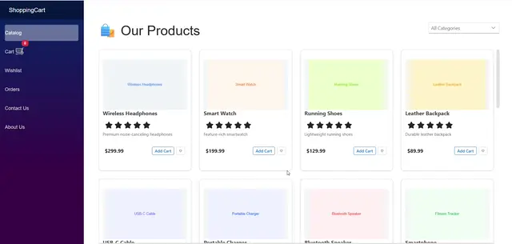

# Creating a Shopping Cart with Blazor Components

This article explains how to build a shopping cart workflow in a Blazor application using [Blazor components](https://www.syncfusion.com/blazor-components). It covers product listing, cart operations, checkout, and order confirmation, along with managing cart state through dependency injection.

## Prerequisites

* [.NET 8 SDK or later](https://dotnet.microsoft.com/en-us/download/dotnet)
* [Visual Studio](https://visualstudio.microsoft.com/downloads/) 2022 or later, or [Visual Studio Code](https://code.visualstudio.com/) with [C# Dev Kit extension](https://marketplace.visualstudio.com/items?itemName=ms-dotnettools.csdevkit) 

## Create the Blazor project

To create a Blazor server application, follow the [Blazor Web App getting started guide](https://blazor.syncfusion.com/documentation/getting-started/blazor-web-app).

## Install required packages

Install required packages in your project using the NuGet Package Manager in Visual Studio (*Tools → NuGet Package Manager → Manage NuGet Packages for Solution*), or the integrated terminal in Visual Studio Code (`dotnet add package`), or the .NET CLI.

| Component | Package |
|----------------|---------|
| Button     | [Syncfusion.Blazor.Buttons](https://www.nuget.org/packages/Syncfusion.Blazor.Buttons) |
| Card           | [Syncfusion.Blazor.Cards](https://www.nuget.org/packages/Syncfusion.Blazor.Cards) |
| ComboBox    | [Syncfusion.Blazor.DropDowns](https://www.nuget.org/packages/Syncfusion.Blazor.DropDowns) |
| DataGrid       | [Syncfusion.Blazor.Grid](https://www.nuget.org/packages/Syncfusion.Blazor.Grid) |
| TextBox, MaskedTextBox, Rating    | [Syncfusion.Blazor.Inputs](https://www.nuget.org/packages/Syncfusion.Blazor.Inputs) |
| Spinner        | [Syncfusion.Blazor.Spinner](https://www.nuget.org/packages/Syncfusion.Blazor.Spinner) |
| Themes         | [Syncfusion.Blazor.Themes](https://www.nuget.org/packages/Syncfusion.Blazor.Themes) |

## Add required namespaces

Open the `Components/_Imports.razor` file and import the following Blazor components, shopping cart models, and services namespaces.




@using ShoppingCart.Models
@using ShoppingCart.Services
@using Syncfusion.Blazor
@using Syncfusion.Blazor.Buttons
@using Syncfusion.Blazor.Cards
@using Syncfusion.Blazor.DropDowns
@using Syncfusion.Blazor.Grids
@using Syncfusion.Blazor.Inputs
@using Syncfusion.Blazor.Spinner




## Register Blazor service

Add the Blazor service to the `~/Program.cs` file to enable Blazor components in the application.




using Syncfusion.Blazor;
...
builder.Services.AddSyncfusionBlazor();
...




## Add stylesheets and script resources

Add the Blazor theme CSS and required scripts to the `~/Components/App.razor` file. 




<head>
    ...
    <!-- Blazor theme stylesheet -->
    <link href="_content/Syncfusion.Blazor.Themes/fluent2.css" rel="stylesheet" />
    ...
</head>
<body>
    ...
    <!-- Blazor core script (required for UI components) -->
    <script src="_content/Syncfusion.Blazor.Core/scripts/syncfusion-blazor.min.js"></script>
    ...
</body>




## Project structure

Organize the application using the following folder structure to maintain a clear and modular architecture.

```text
ShoppingCart/
├── Components/
│   ├── Pages/          // Routable pages (Home, Catalog, Cart, Checkout, etc.)
│   ├── Layout/         // Layout components (MainLayout, NavMenu)
│   ├── _Imports.razor  // Namespace imports
│   ├── App.razor       // Root component
│   ├── ProductCard.razor   // Reusable component
│   └── CartBadge.razor     // Reusable component
├── Models/             // Data models (Product, CartItem, Order, etc.)
├── Services/           // Application services (CartService, OrderService, etc.)
├── Data/               // Sample or in-memory data (ProductData)
├── wwwroot/            // Static files (CSS, images)
├── Properties/
│   └── launchSettings.json
├── appsettings.json
└── Program.cs
```

This organization improves code readability and modularity, enabling easier maintenance and scalability as the application evolves.

## Define data models

The application uses the following data models to represent products, cart items, and order details.

### Product model

Represents a product in the catalog, including its basic details, pricing, and availability.




namespace ShoppingCart.Models
{
    public class Product
    {
        public int Id { get; set; }
        public string Name { get; set; } = string.Empty;
        public string Description { get; set; } = string.Empty;
        public decimal Price { get; set; }
        public string ImageUrl { get; set; } = string.Empty;
        public string Category { get; set; } = string.Empty;
        public double Rating { get; set; }
        public int ReviewCount { get; set; }
        public bool IsInStock { get; set; } = true;
    }
}




### Cart item model

Represents a product added to the cart along with quantity and calculated subtotal.




namespace ShoppingCart.Models
{
    public class CartItem
    {
        public int ProductId { get; set; }
        public string ProductName { get; set; } = string.Empty;
        public decimal UnitPrice { get; set; }
        public int Quantity { get; set; }
        public string ImageUrl { get; set; } = string.Empty;
        public decimal Subtotal => UnitPrice * Quantity;
    }
}




### Order model

Represents an order, including selected items, total amount, and associated shipping and payment details.




using System.ComponentModel.DataAnnotations;

namespace ShoppingCart.Models
{
    public class Order
    {
        public int OrderId { get; set; }
        public List<CartItem> Items { get; set; } = new();
        public decimal TotalAmount { get; set; }
        public DateTime OrderDate { get; set; }
        public string Status { get; set; } = "Pending";
        public ShippingInfo Shipping { get; set; } = new();
        public PaymentInfo Payment { get; set; } = new();
    }
    
    public class ShippingInfo
    {
        [Required(ErrorMessage = "Full name is required")]
        public string FullName { get; set; } = string.Empty;
        
        [Required(ErrorMessage = "Address is required")]
        public string Address { get; set; } = string.Empty;
        
        [Required(ErrorMessage = "City is required")]
        public string City { get; set; } = string.Empty;
        
        [Required(ErrorMessage = "State is required")]
        public string State { get; set; } = string.Empty;
        
        [Required(ErrorMessage = "ZIP code is required")]
        [RegularExpression(@"^\d{5}(-\d{4})?$", ErrorMessage = "Enter a valid ZIP code")]
        public string ZipCode { get; set; } = string.Empty;
        
        [Required(ErrorMessage = "Country is required")]
        public string Country { get; set; } = string.Empty;
        
        [Required(ErrorMessage = "Phone is required")]
        [Phone(ErrorMessage = "Enter a valid phone number")]
        public string Phone { get; set; } = string.Empty;
    }
    
    public class PaymentInfo
    {
        [Required(ErrorMessage = "Card number is required")]
        [RegularExpression(@"^\d{16}$", ErrorMessage = "Card number must be 16 digits")]
        public string CardNumber { get; set; } = string.Empty;
        
        [Required(ErrorMessage = "Card holder name is required")]
        public string CardHolder { get; set; } = string.Empty;
        
        [Required(ErrorMessage = "Expiry date is required")]
        [RegularExpression(@"^(0[1-9]|1[0-2])\/\d{2}$", ErrorMessage = "Use MM/YY format")]
        public string ExpiryDate { get; set; } = string.Empty;
        
        [Required(ErrorMessage = "CVV is required")]
        [RegularExpression(@"^\d{3,4}$", ErrorMessage = "CVV must be 3 or 4 digits")]
        public string CVV { get; set; } = string.Empty;
    }
}




## Create the data source

This section defines the sample product data used in the application for demonstration purposes.




using ShoppingCart.Models;

namespace ShoppingCart.Data
{
    public static class ProductData
    {
        public static List<Product> Products => new()
        {
            new() { Id = 1, Name = "Wireless Headphones", Description = "Premium noise-canceling headphones", Price = 299.99m, Category = "Electronics", ImageUrl = "images/product1.svg", Rating = 4.8, ReviewCount = 256, IsInStock = true },
            new() { Id = 2, Name = "Smart Watch", Description = "Feature-rich smartwatch", Price = 199.99m, Category = "Electronics", ImageUrl = "images/product2.svg", Rating = 4.6, ReviewCount = 189, IsInStock = true },
            new() { Id = 3, Name = "Running Shoes", Description = "Lightweight running shoes", Price = 129.99m, Category = "Footwear", ImageUrl = "images/product3.svg", Rating = 4.7, ReviewCount = 423, IsInStock = true },
            new() { Id = 4, Name = "Leather Backpack", Description = "Durable leather backpack", Price = 89.99m, Category = "Accessories", ImageUrl = "images/product4.svg", Rating = 4.5, ReviewCount = 156, IsInStock = true },
            new() { Id = 5, Name = "USB-C Cable", Description = "High-speed USB-C charging cable", Price = 19.99m, Category = "Accessories", ImageUrl = "images/product5.svg", Rating = 4.4, ReviewCount = 512, IsInStock = true },
            new() { Id = 6, Name = "Portable Charger", Description = "20000mAh portable power bank", Price = 49.99m, Category = "Electronics", ImageUrl = "images/product6.svg", Rating = 4.7, ReviewCount = 301, IsInStock = true },
            new() { Id = 7, Name = "Bluetooth Speaker", Description = "Loud portable speaker", Price = 39.99m, Category = "Electronics", ImageUrl = "images/product7.svg", Rating = 4.5, ReviewCount = 210, IsInStock = true },
            new() { Id = 8, Name = "Smartphone", Description = "Latest model smartphone", Price = 499.99m, Category = "Electronics", ImageUrl = "images/product8.svg", Rating = 4.6, ReviewCount = 320, IsInStock = true },
            new() { Id = 9, Name = "Wireless Mouse", Description = "Ergonomic wireless mouse", Price = 29.99m, Category = "Accessories", ImageUrl = "images/product5.svg", Rating = 4.3, ReviewCount = 110, IsInStock = true },
            new() { Id = 10, Name = "Mechanical Keyboard", Description = "Tactile mechanical keyboard", Price = 89.99m, Category = "Accessories", ImageUrl = "images/product6.svg", Rating = 4.7, ReviewCount = 89, IsInStock = true },
            new() { Id = 11, Name = "Action Camera", Description = "Waterproof action camera", Price = 149.99m, Category = "Electronics", ImageUrl = "images/product7.svg", Rating = 4.2, ReviewCount = 67, IsInStock = true },
            new() { Id = 12, Name = "Noise Cancelling Earbuds", Description = "Compact true wireless earbuds", Price = 129.99m, Category = "Electronics", ImageUrl = "images/product1.svg", Rating = 4.4, ReviewCount = 240, IsInStock = true },
            new() { Id = 13, Name = "Gaming Headset", Description = "Surround sound gaming headset", Price = 79.99m, Category = "Electronics", ImageUrl = "images/product2.svg", Rating = 4.1, ReviewCount = 98, IsInStock = true },
            new() { Id = 14, Name = "4K Monitor", Description = "Ultra HD 4K monitor", Price = 349.99m, Category = "Electronics", ImageUrl = "images/product3.svg", Rating = 4.6, ReviewCount = 45, IsInStock = true },
            new() { Id = 15, Name = "Fitness Band", Description = "Track your activity and sleep", Price = 59.99m, Category = "Electronics", ImageUrl = "images/product8.svg", Rating = 4.0, ReviewCount = 75, IsInStock = true },
            new() { Id = 16, Name = "Portable SSD", Description = "Fast external SSD drive", Price = 119.99m, Category = "Storage", ImageUrl = "images/product5.svg", Rating = 4.8, ReviewCount = 53, IsInStock = true },
            new() { Id = 17, Name = "Wireless Charger", Description = "Fast wireless charging pad", Price = 24.99m, Category = "Accessories", ImageUrl = "images/product6.svg", Rating = 4.2, ReviewCount = 33, IsInStock = true },
            new() { Id = 18, Name = "Tripod", Description = "Lightweight camera tripod", Price = 34.99m, Category = "Accessories", ImageUrl = "images/product7.svg", Rating = 4.1, ReviewCount = 22, IsInStock = true },
            new() { Id = 19, Name = "Desk Lamp", Description = "LED desk lamp with dimmer", Price = 39.99m, Category = "Home", ImageUrl = "images/product4.svg", Rating = 4.3, ReviewCount = 18, IsInStock = true },
            new() { Id = 20, Name = "Backpack Cover", Description = "Waterproof backpack cover", Price = 14.99m, Category = "Accessories", ImageUrl = "images/product4.svg", Rating = 4.0, ReviewCount = 12, IsInStock = true },
        };

        private static List<string>? _categories;
        public static List<string> Categories => 
            _categories ??= Products
                .Select(p => p.Category)
                .Distinct()
                .OrderBy(c => c)
                .ToList();
    }
}




N> Ensure the image files are available in the `wwwroot/images/` folder or update the `ImageUrl` property values to point to valid image sources.

This static data source provides a predefined set of products and categories, enabling the application to run without a backend service.

## Create the services

Services manage business logic and share data across components. In Blazor, they are registered with dependency injection to provide consistent access throughout the application.

### Cart service

Handles cart operations such as adding, removing, and updating items, while tracking the current cart state.




using ShoppingCart.Models;

namespace ShoppingCart.Services
{
    public interface ICartService
    {
        event Action? OnCartChanged;
        List<CartItem> Items { get; }
        int ItemCount { get; }
        decimal Total { get; }
        
        void AddItem(Product product);
        void RemoveItem(int productId);
        void UpdateQuantity(int productId, int quantity);
        void ClearCart();
    }
}





using ShoppingCart.Models;

namespace ShoppingCart.Services
{
    public class CartService : ICartService
    {
        private List<CartItem> _items = new();
        public event Action? OnCartChanged;
        public List<CartItem> Items => _items;
        public int ItemCount => _items.Sum(i => i.Quantity);
        public decimal Total => _items.Sum(i => i.Subtotal);

        public void AddItem(Product product)
        {
            var existingItem = _items.FirstOrDefault(i => i.ProductId == product.Id);
            
            if (existingItem != null)
            {
                existingItem.Quantity++;
            }
            else
            {
                _items.Add(new CartItem
                {
                    ProductId = product.Id,
                    ProductName = product.Name,
                    UnitPrice = product.Price,
                    Quantity = 1,
                    ImageUrl = product.ImageUrl
                });
            }
            OnCartChanged?.Invoke();
        }

        public void RemoveItem(int productId)
        {
            _items.RemoveAll(i => i.ProductId == productId);
            OnCartChanged?.Invoke();
        }

        public void UpdateQuantity(int productId, int quantity)
        {
            var item = _items.FirstOrDefault(i => i.ProductId == productId);
            if (item != null)
            {
                if (quantity <= 0)
                    RemoveItem(productId);
                else
                    item.Quantity = quantity;
                OnCartChanged?.Invoke();
            }
        }

        public void ClearCart()
        {
            _items.Clear();
            OnCartChanged?.Invoke();
        }
    }
}




The service stores cart items in memory and updates totals automatically. It also triggers events to keep the UI updated when the cart changes.

### Order service

Manages order creation and retrieval within the application.




using ShoppingCart.Models;

namespace ShoppingCart.Services
{
    public interface IOrderService
    {
        Task<Order> PlaceOrderAsync(Order order);
        Task<List<Order>> GetOrdersAsync();
        Task<Order?> GetOrderByIdAsync(int orderId);
    }
}





using ShoppingCart.Models;

namespace ShoppingCart.Services
{
    public class OrderService : IOrderService
    {
        private readonly List<Order> _orders = new();
        
        public Task<Order> PlaceOrderAsync(Order order)
        {
            order.OrderId = _orders.Count + 1;
            order.Status = "Confirmed";
            _orders.Add(order);
            return Task.FromResult(order);
        }

        public Task<List<Order>> GetOrdersAsync() => Task.FromResult(_orders);

        public Task<Order?> GetOrderByIdAsync(int orderId)
        {
            var order = _orders.FirstOrDefault(o => o.OrderId == orderId);
            return Task.FromResult(order);
        }
    }
}




The service maintains orders in memory and assigns unique identifiers. Asynchronous methods are used to represent real-world operations.

### Product service

Provides access to product and category data used in the application.




using ShoppingCart.Models;

namespace ShoppingCart.Services
{
    public interface IProductService
    {
        Task<List<Product>> GetProductsAsync();
        Task<List<Product>> GetProductsByCategoryAsync(string category);
        Task<Product?> GetProductByIdAsync(int id);
        Task<List<string>> GetCategoriesAsync();
    }
}





using ShoppingCart.Models;
using ShoppingCart.Data;

namespace ShoppingCart.Services
{
    public class ProductService : IProductService
    {
        public Task<List<Product>> GetProductsAsync()
        {
            return Task.FromResult(ProductData.Products);
        }

        public Task<List<Product>> GetProductsByCategoryAsync(string category)
        {
            var products = ProductData.Products
                .Where(p => p.Category.Equals(category, StringComparison.OrdinalIgnoreCase))
                .ToList();
            return Task.FromResult(products);
        }

        public Task<Product?> GetProductByIdAsync(int id)
        {
            var product = ProductData.Products.FirstOrDefault(p => p.Id == id);
            return Task.FromResult(product);
        }

        public Task<List<string>> GetCategoriesAsync()
        {
            return Task.FromResult(ProductData.Categories);
        }
    }
}




This service retrieves product data from a shared data source. It supports listing, filtering, and retrieving product details.

### Wishlist service

Manages wishlist items for the current user session.




using ShoppingCart.Models;

namespace ShoppingCart.Services
{
    public interface IWishlistService
    {
        event Action? OnChange;
        void Toggle(Product product);
        bool Contains(Product product);
        IReadOnlyList<Product> GetItems();
        void Remove(Product product);
    }
}





using ShoppingCart.Models;

namespace ShoppingCart.Services
{
    public class WishlistService : IWishlistService
    {
        private readonly List<Product> _items = new();
        public event Action? OnChange;

        public void Toggle(Product product)
        {
            if (Contains(product))
                _items.RemoveAll(p => p.Id == product.Id);
            else
                _items.Add(product);

            OnChange?.Invoke();
        }

        public bool Contains(Product product)
            => _items.Any(p => p.Id == product.Id);

        public IReadOnlyList<Product> GetItems()
            => _items.AsReadOnly();

        public void Remove(Product product)
        {
            _items.RemoveAll(p => p.Id == product.Id);
            OnChange?.Invoke();
        }
    }
}




This service keeps track of wishlist items in memory. It updates components whenever items are added or removed.

## Register services

Register the application services in `Program.cs` so they can be accessed throughout the Blazor application using dependency injection. 




using ShoppingCart.Services;
...
var builder = WebApplication.CreateBuilder(args);
// Blazor service
builder.Services.AddSyncfusionBlazor();
...
// Application services
builder.Services.AddScoped<ICartService, CartService>();
builder.Services.AddScoped<IProductService, ProductService>();
builder.Services.AddScoped<IOrderService, OrderService>();
builder.Services.AddScoped<IWishlistService, WishlistService>();
...




## Create reusable components

Reusable components help create a consistent user interface and promote code reusability. They encapsulate common UI elements and logic that can be shared across multiple pages.

### Create the ProductCard component

Displays product details and provides actions for adding items to the cart and managing the wishlist.




@inject IWishlistService WishlistService

<SfCard CssClass="product-card">

    <CardContent>
        <div class="product-image">
            
        </div>
        <h6 class="fw-bold">@Item.Name</h6>

        <SfRating Value="@Item.Rating" ReadOnly="true" />

        <p class="small text-muted">
            @Item.Description
        </p>
    </CardContent>

    <CardFooter>
        <div class="footer-row">
            <!-- LEFT: Price -->
            <span class="price">
                @Item.Price.ToString("C")
            </span>

            <!-- RIGHT: Actions -->
            <div class="footer-actions">
                <SfButton Content="Add to Cart"
                          CssClass="e-outline e-primary e-small"
                          Disabled="@(!Item.IsInStock)"
                          OnClick="AddToCart" />

                <!-- ❤️ Wishlist Heart -->
                <SfButton CssClass="e-outline e-small wishlist-btn"
                          Content="@HeartIcon"
                          OnClick="ToggleWishlist" />
            </div>
        </div>
    </CardFooter>
</SfCard>
@code {
    [Parameter] public Product Item { get; set; } = default!;
    [Parameter] public EventCallback<Product> OnAddToCart { get; set; }

    private string HeartIcon =>
        WishlistService.Contains(Item) ? "❤️" : "♡";

    private void ToggleWishlist()
        => WishlistService.Toggle(Item);

    private Task AddToCart()
    {
        return OnAddToCart.InvokeAsync(Item);
    }
}
<style>
    .product-card {
        border-radius: 10px;
        transition: box-shadow 0.2s ease;
        width: 100%;
        min-height: 360px;
        box-sizing: border-box;
    }

    .product-card:hover {
        box-shadow: 0 6px 16px rgba(0,0,0,0.08);
    }

    .product-image {
        height: 150px;
        background: #f4f6f8;
        display: flex;
        align-items: center;
        justify-content: center;
    }

    .card-img {
        max-height: 100%;
        max-width: 100%;
        object-fit: contain;
    }

    @@media (max-width: 576px) {
        .product-card {
            border-radius: 8px;
            padding: 10px;
        }

        .product-image {
            height: 120px;
        }

        .price {
            font-size: 0.95rem;
        }

        .wishlist-btn {
            font-size: 20px;
        }
    }

    .footer-row {
        display: flex;
        justify-content: space-between;
        align-items: center;
    }

    .footer-actions {
        display: flex;
        gap: 6px;
    }

    .price {
        font-weight: 700;
    }

    .wishlist-btn {
        font-size: 25px;
        color: crimson;
    }
</style>




This component accepts product data as a parameter and renders a structured card layout. It uses [Blazor Card](https://www.syncfusion.com/blazor-components/blazor-card), [Blazor Button](https://www.syncfusion.com/blazor-components/blazor-button), and [Blazor Rating](https://www.syncfusion.com/blazor-components/blazor-rating) to build the UI. It also uses event callbacks for cart actions and integrates with the wishlist service to maintain the current state.

### Create the CartBadge component

Displays a cart icon with a badge that indicates the current number of items in the cart.




@using ShoppingCart.Services
@implements IDisposable

<a href="/cart" class="position-relative text-decoration-none">
    <span class="badge bg-danger position-absolute top-0 start-100 translate-middle">
        @CartService.ItemCount
    </span>
   <span style="font-size: 1.5rem;" aria-hidden="true">🛒</span>
</a>

@code {
    [Inject] ICartService CartService { get; set; } = null!;

    protected override void OnInitialized()
    {
        CartService.OnCartChanged += OnCartChanged;
    }

    private void OnCartChanged() => StateHasChanged();

    public void Dispose()
    {
        CartService.OnCartChanged -= OnCartChanged;
    }
}




This component reads the cart item count from the cart service and updates automatically when changes occur. It can be placed in a layout or header to provide global visibility of the cart state alongside navigation elements.

## Create pages for catalog & cart

Pages define the main user interface of the application. Each page handles a specific part of the shopping workflow, such as browsing products, managing the cart, and completing checkout.

### Create the Home page

Serves as the landing page and provides quick navigation to key sections of the application.




@page "/"

@using Syncfusion.Blazor.Cards
@inject NavigationManager Nav

<div class="home-container">

    <!-- HERO SECTION -->
    <SfCard CssClass="hero-card">
        <CardContent>
            <h2>Welcome to Syncfusion Blazor Shopping Cart</h2>
            <p>Discover amazing products, add to wishlist, and shop smarter.</p>
           
        </CardContent>
    </SfCard>

    <!-- NAVIGATION CARDS -->
    <div class="nav-card-container">

        <!-- Catalog Card -->
        <SfCard CssClass="nav-card" 
                @onclick="@(() => Nav.NavigateTo("/catalog"))">
            <CardContent>
                
            </CardContent>
        </SfCard>

        <!-- Wishlist Card -->
        <SfCard CssClass="nav-card"
                @onclick="@(() => Nav.NavigateTo("/wishlist"))">
            <CardContent>
                
            </CardContent>
        </SfCard>

    </div>
</div>

<style>
    /* PAGE LAYOUT */
    .home-container {
        max-width: 1000px;
        margin: auto;
        padding: 30px;
    }

    /* HERO CARD */
    .hero-card {
        border-radius: 20px;
        overflow: hidden;
        box-shadow: 0 10px 40px rgba(0,0,0,0.12);
        margin-bottom: 40px;
    }
    .content {
        text-align: center;
    }
    .hero-image {
        width: 100%;
        height: auto;
    
    }

    .hero-card h2 {
        margin-top: 15px;
        font-size: 26px;
        text-align: center;
    }

    .hero-card p {
        color: #666;
        font-size: 16px;
        text-align: center;
    }

    /* NAV CARDS */
    .nav-card-container {
        display: grid;
        grid-template-columns: repeat(auto-fit, minmax(260px, 1fr));
        gap: 28px;
    }

    .nav-card {
        cursor: pointer;
        text-align: center;
    }

    .nav-card img {
        width: 130px;
        margin-bottom: 15px;
    }

    .nav-card h3 {
        margin-bottom: 5px;
    }

    .nav-card p {
        color: #666;
        font-size: 14px;
    }

</style>




This page uses the [Blazor Card](https://www.syncfusion.com/blazor-components/blazor-card) component to present a hero section and navigation cards. It enables users to quickly navigate to the catalog and wishlist pages.

### Create the product catalog page

Displays available products and provides filtering and cart actions.




@page "/catalog"

@using ShoppingCart.Services
@inject IProductService ProductService
@inject ICartService CartService

<PageTitle>Product Catalog</PageTitle>

<div class="container-fluid py-5">
    <div class="row mb-4">
        <div class="col">
            <h1>🛍️ Our Products</h1>
        </div>
        <div class="col-auto">
            <div class="input-group">
                <SfComboBox T="string" 
                           Placeholder="All Categories"
                           DataSource="@categories"
                           AllowFiltering="true"
                           @bind-Value="selectedCategory" />
            </div>
        </div>
    </div>

    @if (products == null)
    {
         <SfSpinner Visible="true"></SfSpinner>
    }
    else if (!filteredProducts.Any())
    {
        <div class="alert alert-info">
            No products found. <a href="/catalog" @onclick="ClearFilter">Clear filter</a>
        </div>
    }
    else
    {
        <div class="catalog-scroll">
            <div class="row g-4">
                @foreach (var product in filteredProducts)
                {
                    <div class="col-12 col-sm-6 col-md-4 col-lg-3">
                        <ProductCard Item="product" OnAddToCart="HandleAddToCart" />
                    </div>
                }
            </div>
        </div>
    }
</div>

@code {
    private List<Product>? products;
    private List<string> categories = new();
    private string? selectedCategory;
    
    private List<Product> filteredProducts =>
    (string.IsNullOrEmpty(selectedCategory) || selectedCategory == "All Categories")
        ? products ?? new List<Product>()
        : products?.Where(p => p.Category == selectedCategory).ToList()
            ?? new List<Product>();

    protected override async Task OnInitializedAsync()
    {
        products = await ProductService.GetProductsAsync();
        categories = await ProductService.GetCategoriesAsync();
        categories.Insert(0, "All Categories");
    }

    private void HandleAddToCart(Product product)
    {
        CartService.AddItem(product);
    }

    private void ClearFilter()
    {
        selectedCategory = "All Categories";
    }
}

<style>
   
    /* Show ~8 product cards before internal scrolling; adjust height if needed */
    /* Prevent the page body from scrolling — keep scroll inside the catalog area */
    article.content {
        /* ensure the page content area does not create a browser scrollbar */
        overflow: hidden;
    }

    .catalog-scroll {
        /* use viewport height minus header/sidebar spacing so only this container scrolls */
        max-height: calc(100vh - 140px);
        overflow-y: auto;
        padding-right: 8px; /* avoid content hiding behind scrollbar */
    }

    .catalog-scroll::-webkit-scrollbar { width: 10px; }
    .catalog-scroll::-webkit-scrollbar-thumb { background: rgba(0,0,0,0.12); border-radius: 6px; }

    @@media (max-width: 768px) {
        /* mobile: increase internal viewport so two columns fit visibly */
        .catalog-scroll { max-height: calc(100vh - 160px); }
    }
</style>




This page uses [Blazor ComboBox](https://www.syncfusion.com/blazor-components/blazor-combobox) for category filtering and [Spinner](https://www.syncfusion.com/blazor-components/blazor-spinner) for loading states. It integrates the [reusable ProductCard component](#create-the-productcard-component) and interacts with services to manage product data and cart actions.

### Create the shopping cart page

Displays selected items and allows users to update quantities or remove items.




@page "/cart"

@implements IDisposable
@inject ICartService CartService
@inject NavigationManager NavigationManager

<PageTitle>Shopping Cart</PageTitle>

<div class="container-fluid py-4">
    <div class="row">
        <div class="col-lg-8">
            <h3 class="mb-3">🛒 Shopping Cart</h3>

            @if (!CartService.Items.Any())
            {
                <div class="empty-cart-wrapper">
                    <SfCard CssClass="empty-cart-card">
                        <CardContent>
                            <div class="text-center py-4">
                                <div class="empty-icon" aria-hidden="true">🛒</div>
                                <h4 class="mt-2">Your cart is empty</h4>
                                <p class="text-muted mb-3">Looks like you haven't added anything yet. Browse products and start shopping.</p>
                                <div>
                                    <SfButton CssClass="e-primary" OnClick="@(() => NavigateToCatalog())">
                                        Browse Catalog
                                    </SfButton>
                                    <SfButton CssClass="e-outline ms-2" OnClick="@(() => NavigateToWishlist())">
                                        View Wishlist
                                    </SfButton>
                                </div>
                            </div>
                        </CardContent>
                    </SfCard>
                </div>
            }
            else
            {
                <div class="table-responsive">
                    <SfGrid @ref="cartGrid" TItem="CartItem"
                        DataSource="@CartService.Items"
                        AllowPaging="false"
                    >

                    <GridColumns>
                        <!-- Product -->
                        <GridColumn HeaderText="Item" Width="250px">
                            <Template Context="context">
                                @{
                                    var item = (CartItem)context;
                                }
                                <div style="display:flex;align-items:center;gap:10px">
                                    
                                    <span>@item.ProductName</span>
                                </div>
                            </Template>
                        </GridColumn>

                        <!-- Price -->
                        <GridColumn HeaderText="Price">
                            <Template Context="context">
                                @{
                                    var item = (CartItem)context;
                                }
                                @item.UnitPrice.ToString("C")
                            </Template>
                        </GridColumn>

                        <!-- Quantity -->
                        <GridColumn HeaderText="Qty">
                            <Template Context="context">
                                @{
                                    var item = (CartItem)context;
                                }
                                <div style="display:flex;align-items:center;gap:5px">
                                    <SfButton Content="−" 
                                              CssClass="e-outline e-small"
                                              OnClick="@(() => Decrease(item))" />
                                    <span style="min-width:25px;text-align:center">
                                        @item.Quantity
                                    </span>
                                    <SfButton Content="+"
                                              CssClass="e-outline e-small"
                                              OnClick="@(() => Increase(item))" />
                                </div>
                            </Template>
                        </GridColumn>

                        <!-- Subtotal -->
                        <GridColumn HeaderText="Subtotal">
                            <Template Context="context">
                                @{
                                    var item = (CartItem)context;
                                }
                                <strong>@item.Subtotal.ToString("C")</strong>
                            </Template>
                        </GridColumn>

                        <!-- Remove -->
                        <GridColumn HeaderText="">
                            <Template Context="context">
                                @{
                                    var item = (CartItem)context;
                                }
                                <SfButton Content="Remove"
                                          CssClass="e-outline e-danger e-small"
                                          OnClick="@(() => Remove(item))" />
                            </Template>
                        </GridColumn>

                    </GridColumns>
                </SfGrid>
            </div>
            }
        </div>

        @if (CartService.Items.Any())
        {
            <!-- Order Summary -->
            <div class="col-lg-4">
                <SfCard CssClass="order-summary-card">
                    <CardHeader>
                        <div class="order-summary-header">
                            <div>
                                <h5 class="mb-0">Order Summary</h5>
                                <p>Review your items before checkout</p>
                            </div>
                            <div class="order-total">@CartService.Total.ToString("C")</div>
                        </div>
                    </CardHeader>

                    <CardContent>
                        <div class="summary-top d-flex justify-content-between align-items-center mb-3">
                            <div class="summary-items">Items <span class="badge bg-light text-muted">(@CartService.ItemCount)</span></div>
                        </div>

                        <div class="summary-list">
                            @foreach (var item in CartService.Items)
                            {
                                <div class="summary-item d-flex align-items-center mb-2">
                                    
                                    <div>
                                        <div class="fw-semibold">@item.ProductName</div>
                                        <div class="text-muted small">@item.Quantity x @item.UnitPrice.ToString("C")</div>
                                    </div>
                                </div>
                            }
                        </div>
                    </CardContent>

                    <CardFooter>
                        <div class="d-flex gap-2">
                            <SfButton CssClass="e-primary e-block w-100" OnClick="@(() => NavigateToCheckout())">Checkout</SfButton>
                            <SfButton CssClass="e-outline w-100" OnClick="@(() => NavigateToCatalog())">Continue Shopping</SfButton>
                        </div>
                    </CardFooter>
                </SfCard>
            </div>
        }
    </div>
</div>

@code {
    private Syncfusion.Blazor.Grids.SfGrid<CartItem>? cartGrid;
    private void Increase(CartItem item)
        => CartService.UpdateQuantity(item.ProductId, item.Quantity + 1);

    private void Decrease(CartItem item)
        => CartService.UpdateQuantity(item.ProductId, item.Quantity - 1);

    private void Remove(CartItem item)
        => CartService.RemoveItem(item.ProductId);
        
  protected override void OnInitialized()
    {
        CartService.OnCartChanged += CartChanged;
    }

    // Refresh the grid when the cart changes so rows reflect removals/updates
    private async void CartChanged()
    {
        await InvokeAsync(async () =>
        {
            if (cartGrid is not null)
            {
                try
                {
                    await cartGrid.Refresh();
                }
                catch
                {
                    // If Refresh isn't available for some reason, fall back to re-render
                }
            }
            StateHasChanged();
        });
    }

    public void Dispose()
    {
        CartService.OnCartChanged -= CartChanged;
    }

    private void NavigateToCatalog() => NavigationManager.NavigateTo("/catalog");

    private void NavigateToWishlist() => NavigationManager.NavigateTo("/wishlist");

    private void NavigateToCheckout() => NavigationManager.NavigateTo("/checkout");
}

<style>
    .e-card {
        border: 0px;
        box-shadow: none;
    }
    .empty-cart-wrapper {
        display: flex;
        align-items: center;
        justify-content: center;
        padding: 3rem 1rem;
    }

    .empty-cart-card {
        max-width: 640px;
        width: 100%;
        border-radius: 12px;
    }

    .empty-icon {
        font-size: 48px;
        background: #f1f7ff;
        width: 84px;
        height: 84px;
        display: inline-flex;
        align-items: center;
        justify-content: center;
        border-radius: 50%;
    }

    @@media (max-width: 576px) {
        .empty-cart-card { padding: 1rem; }
        .empty-icon { width: 64px; height:64px; font-size:36px; }
    }

    /* Order summary styles */
    .order-summary-card { border-radius: 12px; overflow: hidden; }

    .order-summary-header {
        display:flex;
        justify-content:space-between;
        align-items:center;
        gap:10px;
        padding: 0.75rem 1rem;
        background: rgb(15, 108, 189);
        border: rgb(15, 108, 189);
        color: white;
    }

    .order-summary-header small {
        color: rgba(255,255,255,0.95);
        opacity: 0.95;
        display: block;
    }

    .order-total { font-weight:700; font-size:1.1rem; }

    .summary-thumb { width:42px; height:42px; object-fit:cover; border-radius:6px; background:#fff; }

    .summary-item .fw-semibold { font-size:0.95rem; }
    .summary-items  {     font-size: large;
    font-weight: bold; }
    @@media (max-width: 576px) {
        .empty-cart-card { padding: 1rem; }
        .empty-icon { width: 64px; height:64px; font-size:36px; }
        .order-summary-header { padding:0.6rem; }
    }

    .summary-list {
        max-height: 320px;
        overflow-y: auto;
        padding-right: 6px;
    }

    .summary-list::-webkit-scrollbar { width: 8px; }
    .summary-list::-webkit-scrollbar-thumb { background: rgba(0,0,0,0.12); border-radius: 6px; }
</style>




This page uses the [Blazor Grid](https://www.syncfusion.com/blazor-components/blazor-datagrid) to display cart items and [Blazor Card](https://www.syncfusion.com/blazor-components/blazor-card) and [Blazor Button](https://www.syncfusion.com/blazor-components/blazor-button) components for layout and actions. It updates dynamically based on cart changes.

### Create the checkout page

Collects user details and processes the order.




@page "/checkout"
@inject ICartService CartService
@inject IOrderService OrderService
@inject NavigationManager NavigationManager

<PageTitle>Checkout</PageTitle>

<div class="container-fluid py-5">
    <h1>📦 Checkout</h1>
    
    @if (!CartService.Items.Any())
    {
        <div class="alert alert-warning">
            Your cart is empty. <a href="/catalog">Continue shopping</a>
        </div>
    }
    else
    {
    <EditForm Model="@order" OnValidSubmit="ProcessOrder">
        <DataAnnotationsValidator />
        <ValidationSummary />
        <div class="row">
            <div class="col-md-7">
                <!-- Shipping Information -->
                <div class="card mb-4">
                    <div class="card-header">
                        <h4>📍 Shipping Information</h4>
                    </div>
                    <div class="card-body">
                        <div class="row g-3">
                            <div class="col-12">
                                <label class="form-label">Full Name *</label>
                                <SfTextBox Placeholder="Full name" @bind-Value="order.Shipping.FullName" />
                            </div>
                            <div class="col-12">
                                <label class="form-label">Address *</label>
                                <SfTextBox Placeholder="Street address" @bind-Value="order.Shipping.Address" />
                            </div>
                            <div class="col-md-6">
                                <label class="form-label">City *</label>
                                <SfTextBox Placeholder="City" @bind-Value="order.Shipping.City" />
                            </div>
                            <div class="col-md-6">
                                <label class="form-label">State *</label>
                                <SfTextBox Placeholder="State" @bind-Value="order.Shipping.State" />
                            </div>
                            <div class="col-md-6">
                                <label class="form-label">ZIP Code *</label>
                                <SfTextBox Placeholder="ZIP code" @bind-Value="order.Shipping.ZipCode" />
                            </div>
                            <div class="col-md-6">
                                <label class="form-label">Country *</label>
                                <SfTextBox Placeholder="Country" @bind-Value="order.Shipping.Country" />
                            </div>
                            <div class="col-12">
                                <label class="form-label">Phone *</label>
                                <SfMaskedTextBox Mask="(000) 000-0000" Placeholder="(555) 555-5555" @bind-Value="order.Shipping.Phone" />
                            </div>
                        </div>
                    </div>
                </div>

                <!-- Payment Information -->
                <div class="card mb-4">
                    <div class="card-header">
                        <h4>💳 Payment Information</h4>
                    </div>
                    <div class="card-body">
                        <div class="row g-3">
                            <div class="col-12">
                                <label class="form-label">Card Number *</label>
                                <SfMaskedTextBox Mask="0000 0000 0000 0000"
                                                Placeholder="4111 1111 1111 1111"
                                                @bind-Value="order.Payment.CardNumber" />
                            </div>
                            <div class="col-12">
                                <label class="form-label">Card Holder Name *</label>
                                <SfTextBox Placeholder="JOHN DOE" @bind-Value="order.Payment.CardHolder" />
                            </div>
                            <div class="col-md-6">
                                <label class="form-label">Expiry Date (MM/YY) *</label>
                                <SfMaskedTextBox Mask="00/00" Placeholder="MM/YY" @bind-Value="order.Payment.ExpiryDate" />
                            </div>
                            <div class="col-md-6">
                                <label class="form-label">CVV *</label>
                                <SfMaskedTextBox Mask="000" Placeholder="123" @bind-Value="order.Payment.CVV" HtmlAttributes="@cvvAttributes" />
                            </div>
                        </div>
                    </div>
                </div>

                <SfButton Content="Place Order" 
                        Type="ButtonType.Submit"
                        CssClass="e-primary e-block mb-3" />
            </div>

            <div class="col-md-5">
                <div class="card sticky-top" style="top: 20px;">
                    <div class="card-header bg-success text-white">
                        <h4 class="mb-0">Order Summary</h4>
                    </div>
                    <div class="card-body">
                        @foreach (var item in CartService.Items)
                        {
                            <div class="d-flex justify-content-between mb-2">
                                <span>@item.ProductName x @item.Quantity</span>
                                <span>@item.Subtotal.ToString("C")</span>
                            </div>
                        }
                        <hr />
                        <div class="d-flex justify-content-between fw-bold">
                            <span>Subtotal:</span>
                            <span>@CartService.Total.ToString("C")</span>
                        </div>
                        <div class="d-flex justify-content-between mb-3">
                            <span>Shipping:</span>
                            <span>$0.00</span>
                        </div>
                        <div class="d-flex justify-content-between fs-5 fw-bold text-success">
                            <span>Total:</span>
                            <span>@CartService.Total.ToString("C")</span>
                        </div>
                    </div>
                </div>
            </div>
        </div>
    </EditForm>
    }
</div>

@code {
    private Order order = new();
    private readonly Dictionary<string, object> cvvAttributes = new Dictionary<string, object> { { "type", "password" } };

    private async Task ProcessOrder()
    {
        order.Items = CartService.Items.ToList();
        order.TotalAmount = CartService.Total;
        order.OrderDate = DateTime.Now;
        
        await OrderService.PlaceOrderAsync(order);
        CartService.ClearCart();
        NavigationManager.NavigateTo($"/order-confirmation/{order.OrderId}");
    }
}




N> The payment form in this sample is for **demonstration purposes only** and is **NOT secure for production use**. 

This page uses Blazor input components, including [Blazor TextBox](https://www.syncfusion.com/blazor-components/blazor-textbox) and [Blazor MaskedTextBox](https://www.syncfusion.com/blazor-components/blazor-input-mask) to capture user input. It validates data and submits the order using the [order service](#order-service).

### Create the OrderConfirmation page

This page displays the order confirmation details after a successful checkout and allows the user to review the order summary and shipping information.




@page "/order-confirmation/{OrderId:int}"
@inject IOrderService OrderService
@inject NavigationManager NavigationManager

<PageTitle>Order Confirmation</PageTitle>

<div class="container-fluid py-5">
    @if (order == null)
    {
        <div class="alert alert-danger">Order not found</div>
    }
    else
    {
        <div class="row">
            <div class="col-md-8 mx-auto">
                <div class="card text-center mb-4">
                    <div class="card-body py-5">
                        <h1 class="text-success mb-3">✅ Order Confirmed!</h1>
                        <p class="fs-5">Thank you for your purchase.</p>
                        <h3 class="text-primary">Order #@order.OrderId</h3>
                    </div>
                </div>

                <div class="card mb-4">
                    <div class="card-header">
                        <h5>📦 Order Items</h5>
                    </div>
                    <div class="card-body">
                        @foreach (var item in order.Items)
                        {
                            <div class="d-flex justify-content-between pb-2 border-bottom">
                                <span>@item.ProductName x @item.Quantity</span>
                                <span>@item.Subtotal.ToString("C")</span>
                            </div>
                        }
                        <div class="d-flex justify-content-between fw-bold mt-3">
                            <span>Total:</span>
                            <span class="text-success fs-5">@order.TotalAmount.ToString("C")</span>
                        </div>
                    </div>
                </div>

                <div class="card mb-4">
                    <div class="card-header">
                        <h5>📍 Shipping Address</h5>
                    </div>
                    <div class="card-body">
                        <p>@order.Shipping.FullName<br/>
                           @order.Shipping.Address<br/>
                           @order.Shipping.City, @order.Shipping.State @order.Shipping.ZipCode<br/>
                           @order.Shipping.Country<br/>
                           @order.Shipping.Phone</p>
                    </div>
                </div>

                <div class="d-grid gap-2">
                   <SfButton Content="Continue Shopping"
          CssClass="e-outline e-block w-100"
          OnClick="NavigateToCatalog" />
                </div>
            </div>
        </div>
    }
</div>

@code {
    [Parameter] public int OrderId { get; set; }
    private Order? order;

    protected override async Task OnInitializedAsync()
    {
        order = await OrderService.GetOrderByIdAsync(OrderId);
    }
    
    private void NavigateToCatalog() =>
        NavigationManager.NavigateTo("/catalog");
}




This page retrieves order data using the order service and presents a confirmation summary, along with navigation to continue shopping.

### Create the OrderHistory page

This page displays a list of previously placed orders and allows users to review order details and status.




@page "/orders"
@inject IOrderService OrderService
@inject NavigationManager NavigationManager

<PageTitle>Order History</PageTitle>

<div class="container py-5">
    <h2>Order History</h2>

    @if (orders == null)
    {
        <SfSpinner Visible="true"></SfSpinner>
    }
    else if (!orders.Any())
    {
        <div class="card p-4 text-center">
            <h4>No orders yet</h4>
            <p class="text-muted">You haven't placed any orders. Start shopping now!</p>
            <SfButton CssClass="e-primary" OnClick="@(() => NavigationManager.NavigateTo("/catalog"))">Browse Catalog</SfButton>
        </div>
    }
    else
    {
        <div class="row g-4">
            @foreach (var o in orders)
            {
                <div class="col-12">
                    <div class="card p-3">
                        <div class="d-flex justify-content-between align-items-start">
                            <div>
                                <h5>Order #@o.OrderId</h5>
                                <div class="text-muted">@o.OrderDate.ToString("MMM d, yyyy") — @o.Status</div>
                            </div>
                            <div class="text-end">
                                <div class="fw-bold">@o.TotalAmount.ToString("C")</div>
                                 <SfButton CssClass="e-outline e-small mt-2"
                                      OnClick="@(() => NavigationManager.NavigateTo($"/order-confirmation/{o.OrderId}"))">
                                View
                            </SfButton>
                            </div>
                        </div>
                        <hr />
                        <div class="small text-muted">Items:</div>
                        <ul>
                            @foreach (var it in o.Items)
                            {
                                <li>@it.ProductName — @it.Quantity x @it.UnitPrice.ToString("C")</li>
                            }
                        </ul>
                    </div>
                </div>
            }
        </div>
    }
</div>

@code {
    private List<Order>? orders;

    protected override async Task OnInitializedAsync()
    {
        // OrderService may return empty list in sample app
        orders = await OrderService.GetOrdersAsync();
    }
}




This page uses [Blazor Spinner](https://www.syncfusion.com/blazor-components/blazor-spinner) for loading indication and [Blazor Button](https://www.syncfusion.com/blazor-components/blazor-button) for navigation. It presents order summaries and allows users to view details.

### Create the Wishlist page

This page allows users to view and manage products they have saved for future reference.




@page "/wishlist"
@inject IWishlistService WishlistService
@inject NavigationManager NavigationManager

<PageTitle>Wishlist</PageTitle>

<h3 class="mb-3">My Wishlist</h3>

@if (!WishlistService.GetItems().Any())
{
    <div class="empty-wishlist-wrapper">
        <SfCard CssClass="empty-wishlist-card">
            <CardContent>
                <div class="text-center py-4">
                    <div class="wishlist-icon">♡</div>
                    <h4 class="mt-2">Your wishlist is empty</h4>
                    <p class="text-muted mb-3">Save products you like to come back to them later.</p>
                    <div class="d-flex justify-content-center gap-2">
                        <SfButton CssClass="e-primary" OnClick="@(() => NavigateToCatalog())">Browse Catalog</SfButton>
                        <SfButton CssClass="e-outline" OnClick="@(() => NavigateToPopular())">Popular Picks</SfButton>
                    </div>
                </div>
            </CardContent>
        </SfCard>
    </div>
}
else
{
    <div class="row g-4">
        @foreach (var product in WishlistService.GetItems())
        {
            <div class="col-12 col-md-4 col-lg-3">
                <SfCard CssClass="h-100">
                    <CardContent>
                        <h6>@product.Name</h6>
                        <p class="small text-muted">@product.Description</p>

                        <strong>
                            @product.Price.ToString("C")
                        </strong>
                    </CardContent>

                    <CardFooter>
                        <SfButton Content="Remove"
                                  CssClass="e-outline e-danger e-small"
                                  OnClick="() => WishlistService.Remove(product)" />
                    </CardFooter>
                </SfCard>
            </div>
        }
    </div>
}

<style>
    .e-card.empty-wishlist-card {
        border: 0px;
        box-shadow: none;
    }
    .empty-wishlist-wrapper { display:flex; justify-content:center; padding:3rem 1rem; }
    .empty-wishlist-card { max-width:700px; width:100%; border-radius:12px; }
    .wishlist-icon { font-size:48px; width:84px; height:84px; display:inline-flex; align-items:center; justify-content:center; border-radius:50%; background:#fff6fb; color:#d6336c; margin:auto; }
    @@media (max-width:576px){ .empty-wishlist-card{ padding:1rem } .wishlist-icon{ width:64px;height:64px;font-size:36px }}
</style>

@code {
    private void NavigateToCatalog() => NavigationManager.NavigateTo("/catalog");

    private void NavigateToPopular() => NavigationManager.NavigateTo("/catalog");
}




This page uses [Blazor Card](https://www.syncfusion.com/blazor-components/blazor-card) and [Blazor Button](https://www.syncfusion.com/blazor-components/blazor-button) components to present wishlist items. It interacts with the wishlist service to update and manage items dynamically.

## Run the application

Press <kbd>Ctrl</kbd>+<kbd>F5</kbd> (Windows) or <kbd>⌘</kbd>+<kbd>F5</kbd> (macOS) to launch the application. 

**Expected behavior**

* The application loads and displays the home page with navigation options for the product catalog and wishlist.
* The product catalog presents items using Blazor components, and adding products updates the cart badge in real time.
* The cart page displays selected items and supports updating quantities or removing items, with totals recalculated automatically.
* The checkout page collects required details, processes the order, and clears the cart after successful submission.
* The order confirmation and order history pages display accurate order information and status.
* The wishlist page allows users to add or remove items, with selections preserved during navigation.

**Output**



## See also

* [Getting started with Blazor Server app](https://blazor.syncfusion.com/documentation/getting-started/blazor-server-side-visual-studio)
* [Getting started with Blazor DataGrid](https://blazor.syncfusion.com/documentation/datagrid/getting-started-with-server-app)
* [Getting started with Blazor Card](https://blazor.syncfusion.com/documentation/card/getting-started-with-server-app)
* [Getting started with Blazor Button](https://blazor.syncfusion.com/documentation/button/getting-started-with-server-app)
* [Getting started with Blazor ComboBox](https://blazor.syncfusion.com/documentation/combobox/getting-started-with-server-app)
* [Getting started with Blazor Rating](https://blazor.syncfusion.com/documentation/rating/getting-started-webapp)
* [Getting started with Blazor Spinner](https://blazor.syncfusion.com/documentation/spinner/getting-started-webapp)
* [Configure dependency injection in Blazor applications](https://learn.microsoft.com/en-us/aspnet/core/blazor/dependency-injection)
