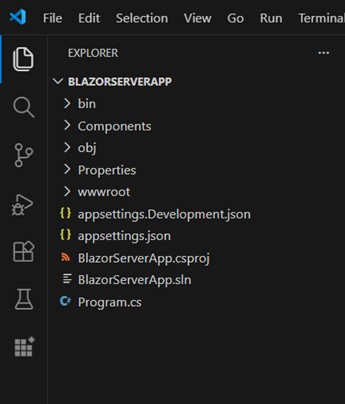
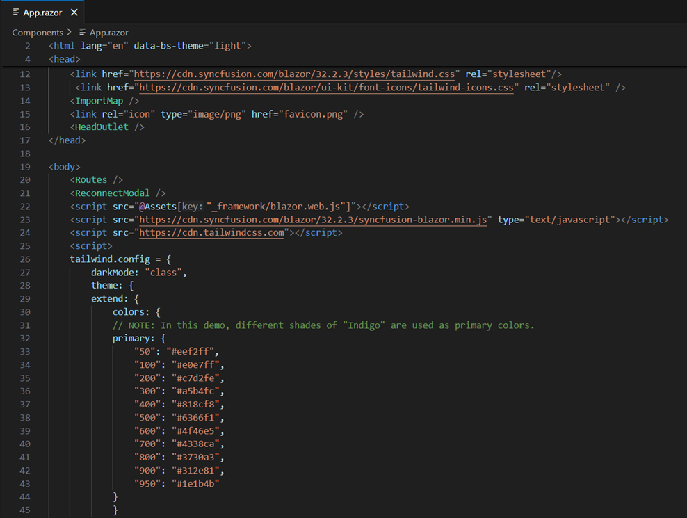
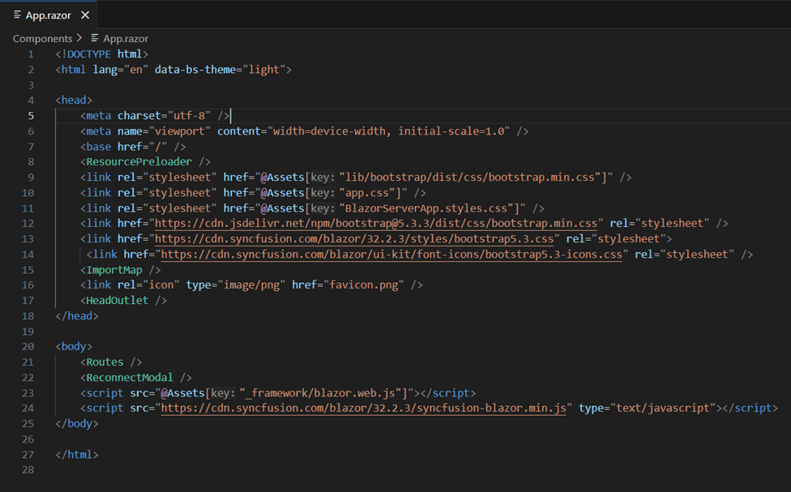
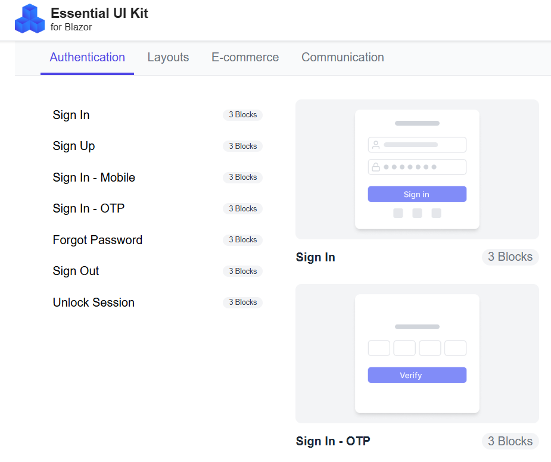
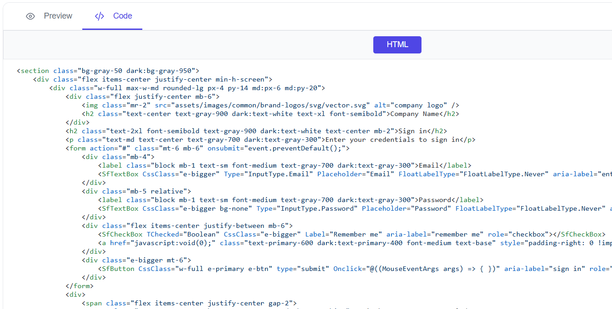
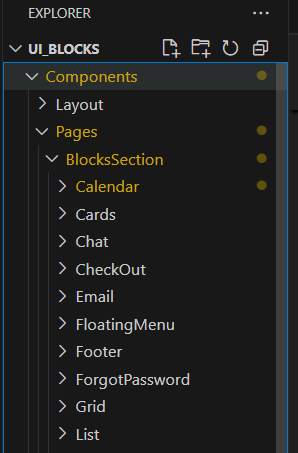
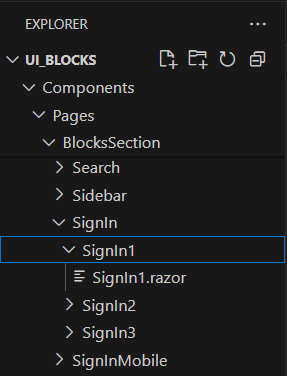
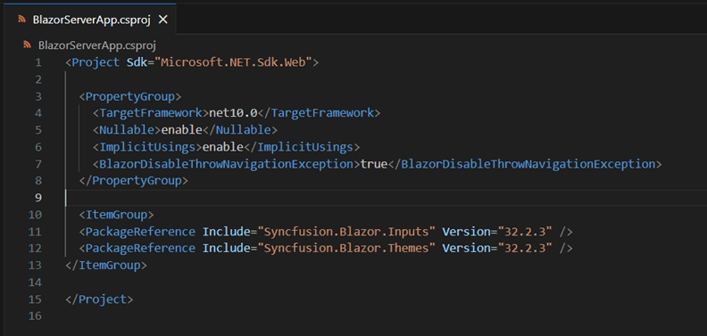
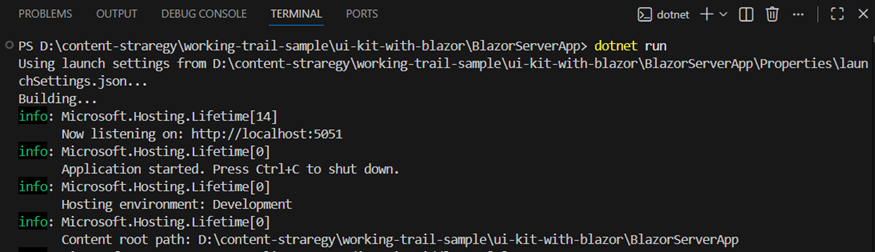

# Build your first Blazor App with UI Kit blocks

This tutorial guides you through building a Blazor Web App using blocks from the Syncfusion Essential UI Kit for Blazor. It demonstrates how to create a new project, choose Tailwind CSS or Bootstrap 5.3 themes, and add a Sign in block. The goal is to help developers quickly build responsive, modern web apps using pre-built blocks with minimal effort.

## Create a new Blazor App

Create a new Blazor Web App using [Microsoft's Blazor setup](https://learn.microsoft.com/en-us/training/modules/build-your-first-blazor-web-app/3-exercise-configure-environment?pivots=vscode) or [Syncfusion Blazor setup](https://sfblazor.azurewebsites.net/staging/documentation/getting-started/blazor-server-side-visual-studio?tabcontent=visual-studio-code) guide. This tutorial demonstrates how to add a simple Sign‑in block to the newly created app `BlazorServerApp`.

N> This tutorial target Blazor Server(server-side rendering). When creating the project, select **Server** as the render mode. For more information about render modes, see this [UG link](https://blazor.syncfusion.com/documentation/common/interactive-render-mode).



## Set up Tailwind CSS or Bootstrap 5.3 theme

After creating the new Blazor app named **BlazorServerApp**, open it in Visual Studio Code (which will be used throughout this walkthrough). The next step is to choose a theme, either Tailwind CSS or Bootstrap 5.3, in either light or dark mode, and configure the app accordingly.

### Tailwind CSS Configuration

If the **Tailwind CSS** theme is selected, follow these steps to configure it.

1. In the **App.razor** file, add the following code for the desired theme in the `<html>` tag.

    * For **light mode**:

    ```html
    <html lang="en" data-bs-theme="light">
    ```

    * For **dark mode**:

    ```html
    <html lang="en" data-bs-theme="dark">
    ```

2. In the **App.razor** file, add the following scripts in the `<head>` tag. These scripts generate Tailwind CSS classes at runtime based on the styles used in the application and replace the primary color with a custom indigo palette. This CDN approach is suitable for development and demos; for production builds, integrate Tailwind via a build pipeline.

    ```html
    <script src="https://cdn.tailwindcss.com"></script>
    <script>
      tailwind.config = {
        darkMode: "class",
        theme: {
          extend: {
            colors: {
              // NOTE: In this demo, different shades of "Indigo" are used as primary colors.
              primary: {
                "50": "#eef2ff",
                "100": "#e0e7ff",
                "200": "#c7d2fe",
                "300": "#a5b4fc",
                "400": "#818cf8",
                "500": "#6366f1",
                "600": "#4f46e5",
                "700": "#4338ca",
                "800": "#3730a3",
                "900": "#312e81",
                "950": "#1e1b4b"
              }
            }
          }
        }
      }
    </script>
    ```

    N> Syncfusion<sup style="font-size:70%">&reg;</sup> Blazor components use **Indigo** for light mode and **Cyan** for dark mode. To maintain a uniform appearance, adjust the primary color accordingly.

3. In the **App.razor** file, add the theme stylesheet CDN link for Syncfusion<sup style="font-size:70%">&reg;</sup> Blazor components in the `<head>` tag.

   * For **light mode**:

     ```html
     <link href="https://cdn.syncfusion.com/blazor/{{ site.releaseversion }}/styles/tailwind.css" rel="stylesheet" />
     ```

   * For **dark mode**:

     ```html
     <link href="https://cdn.syncfusion.com/blazor/{{ site.releaseversion }}/styles/tailwind-dark.css" rel="stylesheet" />
     ```

4. **Optional:** To use font icons prepared for **Tailwind CSS**, include the following CDN link:

    ```html
    <link href="https://cdn.syncfusion.com/blazor/ui-kit/font-icons/tailwind-icons.css" rel="stylesheet" />
    ```

Refer to the consolidated screenshot below for more details.



Now that **Tailwind CSS** is configured for the selected light or dark mode, the app is ready for the next steps.

### Bootstrap 5.3 Configuration

If the **Bootstrap 5.3** theme is selected, follow these steps to configure it.

1. In the **App.razor** file, add the following code for the desired theme in the `<html>` tag.

    - For **light mode**:

    ```html
    <html lang="en" data-bs-theme="light">
    ```

    - For **dark mode**:

    ```html
    <html lang="en" data-bs-theme="dark">
    ```

2. In the **App.razor** file, add the CDN link for **Bootstrap 5.3** stylesheet in the `<head>` tag:

     ```html
     <link href="https://cdn.jsdelivr.net/npm/bootstrap@5.3.3/dist/css/bootstrap.min.css" rel="stylesheet" />
     ```

3. In the **App.razor** file, add the theme stylesheet CDN link for Syncfusion<sup style="font-size:70%">&reg;</sup> Blazor components in the `<head>` tag.

   - For **light mode**:

     ```html
     <link href="https://cdn.syncfusion.com/blazor/{{ site.releaseversion }}/styles/bootstrap5.3.css" rel="stylesheet" />
     ```

   - For **dark mode**:

     ```html
     <link href="https://cdn.syncfusion.com/blazor/{{ site.releaseversion }}/styles/bootstrap5.3-dark.css" rel="stylesheet" />
     ```

4. **Optional:** To use font icons prepared for **Bootstrap 5.3**, include the following CDN link:

    ```html
    <link href="https://cdn.syncfusion.com/blazor/ui-kit/font-icons/bootstrap5.3-icons.css" rel="stylesheet" />
    ```

Refer to the consolidated screenshot below for more details.



Now that **Bootstrap 5.3** is configured for the selected light or dark mode, the app is ready for the next steps.

## Steps to explore and copy block code snippets

Now that **BlazorServerApp** is set up with the desired theme configuration, the next step is to copy and paste the pre-built simple sign-in block code into the app for quick development. Here are a couple of ways to achieve this.

### Steps to explore and copy block code snippets from the online demo

1. In the [online demo](https://blazor.syncfusion.com/essential-ui-kit), navigate to the **Authentication** category and select the **Sign in** block. This opens the corresponding demo page.

    

2. On the demo page, open the first demo, which showcases a simple Sign in block. Choose the desired theme, then switch from the **Preview** tab to the **Code** tab.

    

3. In the **Code** tab, copy the Razor (HTML) code using the **Copy to Clipboard** option and paste it into the **Components -> Pages -> Home.razor** file, replacing the default "Hello, world!" content.

    

  N>  Ensure that you do not remove the `@page` directive and `<PageTitle>` element while replacing the content. These are essential for routing and setting the page title.

4. If CSS is provided, copy the CSS code, create a new file **Components -> Pages -> Home.razor.css**, and paste the code into it. If C# code is provided, create a new file **Components -> Pages -> Home.razor.cs** and paste the code into it. Otherwise, ignore this step.

### Steps to explore and copy block code snippets from the GitHub source

1. After [downloading](https://github.com/syncfusion/essential-ui-kit-for-blazor) and opening the source in Visual Studio Code, navigate to **Components -> Pages -> BlocksSection**.

    

2. Inside, a list of folders is shown, each corresponding to a specific block. Open the **SignIn** block folder to view the demo arranged sequentially.

3. Open **Components/Pages/BlocksSection/SignIn/SignIn1** and access the Razor (HTML) file for the simple sign-in block. Copy the code directly from that file.

    

> **Note:**
> 1. In the Razor file, the **Tailwind CSS** and **Bootstrap 5.3** design code is placed in their respective if-else statements. Copy the required block into the project as needed.
> 2. Ignore the code within the **"SB Code - Start"** and **"SB Code - End"** comments, as it is intended solely for sample browser purposes.

## Steps to Install and Configure Syncfusion<sup style="font-size:70%">&reg;</sup> Blazor Components

The Simple Sign in block uses Syncfusion<sup style="font-size:70%">&reg;</sup> components like TextBox, CheckBox, and Button. Follow these steps to add the required packages:

1. Open the **BlazorServerApp.csproj** file and add the required nuget packages: Syncfusion.Blazor.Buttons and Syncfusion.Blazor.Inputs. For more details about other Syncfusion® Blazor component packages, refer to this [link](https://www.nuget.org/packages?q=Syncfusion.Blazor).

  

2. Run the following command in the terminal to restore the packages:

    ```bash
    dotnet restore
    ```

3. Import the required namespaces in the **_Imports.razor** file (located in the Components folder):

    ```razor
    @using Syncfusion.Blazor
    @using Syncfusion.Blazor.Buttons
    @using Syncfusion.Blazor.Inputs
    ```

4. Now, copy the required Razor (HTML) code for the Sign in block from the [online demo](https://blazor.syncfusion.com/essential-ui-kit) or [GitHub repository](https://github.com/syncfusion/essential-ui-kit-for-blazor) into your app as outlined in the previous section.

## Steps to Download and Add Assets to the App

The UI Kit blocks may include images, icons, and other static assets. Follow these steps to add them to your app:

1. Download the **assets** folder from the [GitHub repository](https://github.com/syncfusion/essential-ui-kit-for-blazor/tree/master/UI_Blocks/wwwroot/assets).

2. Copy the entire `assets` folder into the project's **wwwroot** directory:

![]

## Steps to Run the App

With **BlazorServerApp** set up with Razor markup, CSS (if applicable), C# (if applicable), and assets (optional), build and run the app. Run the following command in the terminal:

```bash
dotnet run
```

The Blazor development server will compile your application and provide a localhost URL (typically `https://localhost:5001` or similar).



To view the app in a browser, copy the localhost URL and paste it into your browser address bar (or **Ctrl+click**/**Cmd+click** the link in the terminal). This opens the app in your default browser and displays the simple Sign in block.


