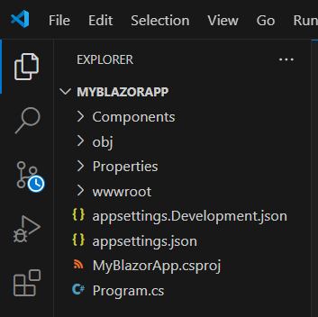
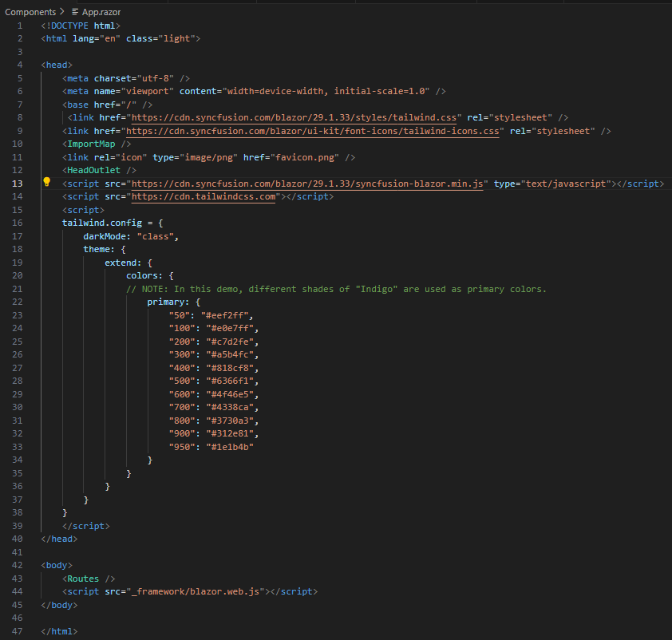
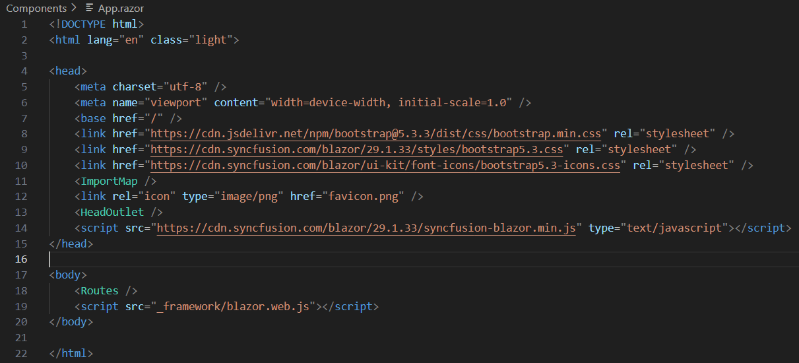
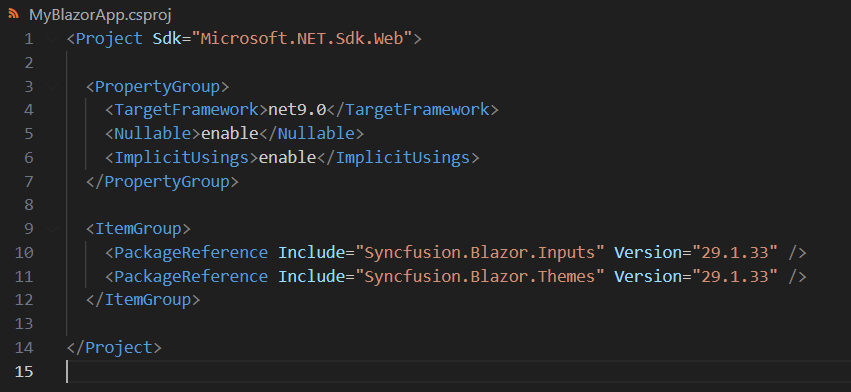
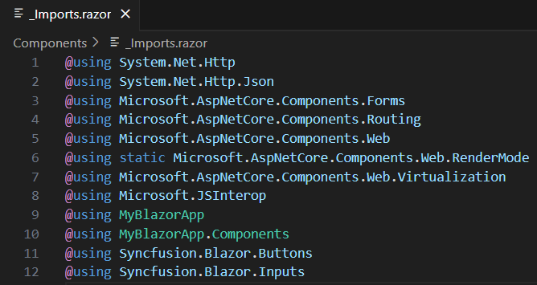
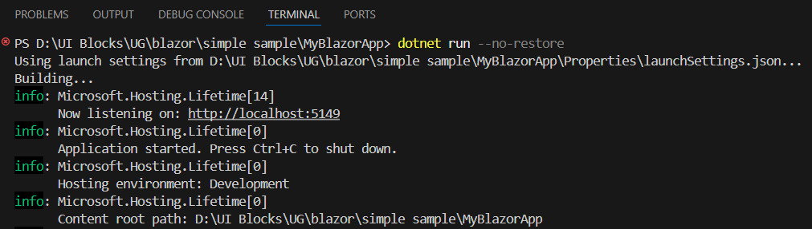

# Build your first Blazor App with UI Kit blocks

This tutorial guides you through building a Blazor Web App using blocks from the Syncfusion Essential UI Kit for Blazor. It demonstrates how to create a new project, choose Tailwind CSS or Bootstrap 5.3 themes, and add a Sign in block. The goal is to help developers quickly build responsive, modern web apps using pre-built blocks with minimal effort.

## Create a new Blazor App
A Blazor Web App is used for this example. To create a new app, follow the Microsoft setup guide [here](https://learn.microsoft.com/en-us/training/modules/build-your-first-blazor-web-app/3-exercise-configure-environment?pivots=vscode). This tutorial then walks through adding a simple Sign in block to the newly created app named **MyBlazorApp**.

> This tutorial focuses on using Blazor Server rendering mode rather than Blazor WebAssembly.



## Set up Tailwind CSS or Bootstrap 5.3 theme

After creating the new Blazor app named **MyBlazorApp**, open it in Visual Studio Code (which will be used throughout this walkthrough). The next step is to choose a theme, either Tailwind CSS or Bootstrap 5.3, in either light or dark mode, and configure the app accordingly.

### Tailwind CSS configuration

If the **Tailwind CSS** theme is selected, follow these steps to configure it.

1. In **Components -> App.razor** file, add the following code for light mode (`class="light"`) and dark mode (`class="dark"`) in the `<html>` tag.

    - For **light mode**:

    ```html
    <html lang="en" class="light">
    ```

    - For **dark mode**:

    ```html
    <html lang="en" class="dark">
    ```

2. In the **Components -> App.razor** file, add the following scripts in the `<head>` tag. These scripts generate Tailwind CSS classes at runtime based on the styles used in the application and replace the primary color with a custom indigo palette. This CDN approach is suitable for demos; for production builds, integrate Tailwind via a build pipeline.

    ```html
    <script src="https://cdn.tailwindcss.com"></script>
    <script>
      tailwind.config = {
        darkMode: "class",
        theme: {
          extend: {
            colors: {
              // NOTE: In this demo, different shades of "Indigo" are used as primary colors.
              primary: {
                "50": "#eef2ff",
                "100": "#e0e7ff",
                "200": "#c7d2fe",
                "300": "#a5b4fc",
                "400": "#818cf8",
                "500": "#6366f1",
                "600": "#4f46e5",
                "700": "#4338ca",
                "800": "#3730a3",
                "900": "#312e81",
                "950": "#1e1b4b"
              }
            }
          }
        }
      }
    </script>
    ```
    > Syncfusion<sup style="font-size:70%">&reg;</sup> Blazor components use **Indigo** for light mode and **Cyan** for dark mode. To maintain a uniform appearance, adjust the primary color accordingly.

3. In the **Components -> App.razor** file, add the theme stylesheet CDN link for Syncfusion<sup style="font-size:70%">&reg;</sup> Blazor components in the `<head>` tag.

   - For **light mode**:

     ```html
     <link href="https://cdn.syncfusion.com/blazor/{{ site.blazorversion }}/styles/tailwind.css" rel="stylesheet"/>
     ```

   - For **dark mode**:

     ```html
     <link href="https://cdn.syncfusion.com/blazor/{{ site.blazorversion }}/styles/tailwind.css" rel="stylesheet" />
     ```

4. **Optional**: To use the font icons prepared for **Tailwind CSS**, include the following CDN link:

    ```html
    <link href="https://cdn.syncfusion.com/blazor/ui-kit/font-icons/tailwind-icons.css" rel="stylesheet" />
    ```
     
You can refer to the consolidated screenshot below for more details.



Now that the **Tailwind CSS** theme is configured for either light or dark mode of your choice, the app is ready for the next set of processes.

### Bootstrap 5.3 configuration

If the **Bootstrap 5.3** theme is selected, follow these steps to configure it.

1. In **Components -> App.razor** file, add the following code for light mode (`data-bs-theme="light"`) and dark mode (`data-bs-theme="dark"`) in the `<html>` tag.

    - For **light mode**:

    ```html
    <html lang="en" data-bs-theme="light">
    ```

    - For **dark mode**:

    ```html
    <html lang="en" data-bs-theme="dark">
    ```

2. In the **Components -> App.razor** file, add the CDN link for the **Bootstrap 5.3** theme stylesheet in the `<head>` tag.

     ```html
     <link href="https://cdn.jsdelivr.net/npm/bootstrap@5.3.3/dist/css/bootstrap.min.css" rel="stylesheet" />
     ```

3. In the **Components -> App.razor** file, add the theme stylesheet CDN link for Syncfusion<sup style="font-size:70%">&reg;</sup> Blazor components in the `<head>` tag.

   - For **light mode**:

     ```html
     <link href="https://cdn.syncfusion.com/blazor/{{ site.blazorversion }}/styles/bootstrap5.3.css" rel="stylesheet">
     ```

   - For **dark mode**:

     ```html
     <link href="https://cdn.syncfusion.com/blazor/{{ site.blazorversion }}/styles/bootstrap5.3-dark.css" rel="stylesheet" />
     ```

4. **Optional**: To use the font icons prepared for **Bootstrap 5.3**, include the following CDN link:

    ```html
    <link href="https://cdn.syncfusion.com/blazor/ui-kit/font-icons/bootstrap5.3-icons.css" rel="stylesheet" />
    ```

You can refer to the consolidated screenshot below for more details.



Now that the **Bootstrap 5.3** theme is configured for either light or dark mode of your choice, the app is ready for the next set of processes.

## Steps to explore and copy block code snippets

Now that **MyBlazorApp** is set up with the desired theme configuration, the next step is to copy and paste the pre-built simple sign-in block code into the app for quick development. Here are a couple of ways to achieve this.

### Steps to explore and copy block code snippets from the online demo

1. In the [online demo](https://blazor.syncfusion.com/essential-ui-kit), navigate to the **Authentication** category and select the **Sign in** block. This opens the corresponding demo page.

    

2. On the demo page, open the first demo, which showcases a simple Sign in block. Choose the desired theme, then switch from the **Preview** tab to the **Code** tab.

    

3. In the **Code** tab, copy the Razor (HTML) code using the **Copy to Clipboard** option and paste it into the **Components -> Pages -> Home.razor** file, replacing the default "Hello, world!" content.

    

>  Ensure that you do not remove the `@page` directive and `<PageTitle>` element while replacing the content. These are essential for routing and setting the page title.

4. If CSS is provided, copy the CSS code, create a new file **Components -> Pages -> Home.razor.css**, and paste the code into it. If C# code is provided, create a new file **Components -> Pages -> Home.razor.cs** and paste the code into it. Otherwise, ignore this step.

### Steps to explore and copy block code snippets from the GitHub source

1. After [downloading](https://github.com/syncfusion/essential-ui-kit-for-blazor) and opening the source in Visual Studio Code, navigate to **Components -> Pages -> BlocksSection**.

    

2. Inside, you'll find a list of folders, each corresponding to a specific block. Open the **SignIn** block folder, where you'll see the demo arranged sequentially.

3. Go to the first folder, **Components/Pages/BlocksSection/SignIn/SignIn1**, where you'll find the Razor (HTML) file of the simple sign-in block. You can copy the code directly from this file.

    

> **Note:**
> 1. In the Razor file, the **Tailwind CSS** and **Bootstrap 5.3** design code is placed in their respective if-else statements. You can copy and paste as per your requirement.
> 2. Ignore the code within the **"SB Code - Start"** and **"SB Code - End"** comments, as it is intended solely for sample browser purposes.

## Steps to install and configure Syncfusion<sup style="font-size:70%">&reg;</sup> Blazor components

While copying and pasting the Razor code, note that Syncfusion<sup style="font-size:70%">&reg;</sup> Blazor components are used. To incorporate them into **MyBlazorApp**, install the necessary packages and import the corresponding namespaces in **Components -> _Imports.razor** so the app can compile and run.

In the simple sign-in block, components such as textbox, checkbox and button are used. After copying and pasting Razor (HTML) code into the Razor file, open the **MyBlazorApp.csproj** file and add the required nuget packages: `Syncfusion.Blazor.Buttons` and `Syncfusion.Blazor.Inputs`. For more details about other Syncfusion<sup style="font-size:70%">&reg;</sup> Blazor component packages, refer to this [link](https://www.nuget.org/packages?q=Syncfusion.Blazor)



After the packages are added, run the following command in the terminal to install them.

```bash
dotnet restore
```

After restoring the packages, import the required namespaces `Syncfusion.Blazor.Buttons` and `Syncfusion.Blazor.Inputs` in **Components -> _Imports.razor** to enable Syncfusion<sup style="font-size:70%">&reg;</sup> components in the application.



Finally, revisit the [online demo](https://blazor.syncfusion.com/essential-ui-kit) or the [GitHub repository](https://github.com/syncfusion/essential-ui-kit-for-blazor) and copy the required Razor (HTML) code for the simple Sign in block into your app as outlined above.

## Steps to download and add assets to the app

To use the images from the design, download the **assets** folder from the [GitHub repository](https://github.com/syncfusion/essential-ui-kit-for-blazor/tree/master/UI_Blocks/wwwroot/assets), place it inside the **wwwroot** folder of **MyBlazorApp**, and update image URLs in the Razor (HTML) file if necessary.

## Steps to run the app

With **MyBlazorApp** set up—including Razor markup, CSS (if applicable), C# (if applicable), and and assets (optional) — you can build and run the app. Run the following command in the terminal; a localhost URL will be provided by the Blazor development server.

```bash
dotnet run
```



To view the app in a browser, **Ctrl+click** (or **Cmd+click** on macOS) the localhost URL displayed in the terminal. This opens the app in the default browser and displays the simple Sign in block.


