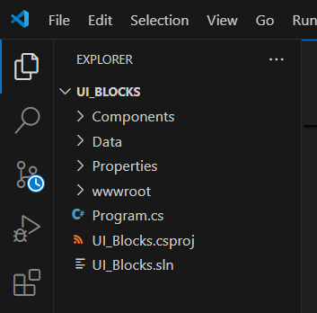
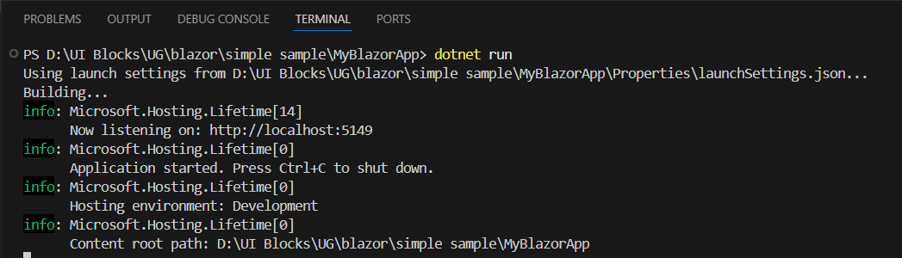

# Getting started with the Essential UI Kit for Blazor

Use either of the following options to explore the Essential UI Kit for Blazor:

- **Download the App from GitHub**: Get the full free source code and run the app locally to explore the blocks.
- **View the Online Demo**: Alternatively, you can try out the blocks directly through the online demo to see them in action without needing to download anything.

## Get started by downloading the app from GitHub

### Step 1: Download and Open the App in Visual Studio Code

Download the app from the GitHub [link](https://github.com/syncfusion/essential-ui-kit-for-blazor), and then open the same in Visual Studio Code to start working with it.



### Step 2: Open a new terminal

In Visual Studio Code, go to the **Terminal** menu and select **New Terminal** to open the integrated terminal.


### Step 3: Install Dependencies and Run the App

Run the following commands in the terminal (PowerShell on Windows):

1. Restore dependencies

```bash
dotnet restore
```

Restores the packages referenced in the project file. Note: dotnet run also performs an implicit restore if needed.

2. Serve the app locally

Once the dependencies are installed, you can run the app locally by starting the Blazor development server. To do so, run the following command.

```bash
dotnet run
```

This command will start the local development server, and you'll see an output in the terminal indicating the app is running. Typically, it will display a local host URL like this:



To view the app in your browser, simply **Ctrl + Click** (or **Cmd + Click** on macOS) on the local host URL displayed in the terminal. This will open the app in your default browser, allowing you to interact with the blocks.

### Step 4: License key requirement

The blocks include several Syncfusion<sup style="font-size:70%">&reg;</sup> Blazor components that require an active license key for proper display and usage. To activate the license, refer to the topics below:

#### How to Obtain the License Key
To obtain the license key, visit the following page: [Syncfusion<sup style="font-size:70%">&reg;</sup> License](https://blazor.syncfusion.com/documentation/getting-started/license-key/how-to-generate).

#### How to Register the License Key in the App
Once you have your license key, register it in the Blazor app through any one of the following methods suggested in this [link](https://blazor.syncfusion.com/documentation/getting-started/license-key/how-to-register-in-an-application).

By adding the license key, you ensure seamless browsing and usage of the blocks, making them fully functional and free from licensing issues.

## Get started by viewing the online demo

If you prefer a quick demo instead of downloading the app, you can explore the blocks directly through the online demo. Simply visit the official [Essential UI Kit for Blazor](https://blazor.syncfusion.com/essential-ui-kit) website to interact with the blocks.
