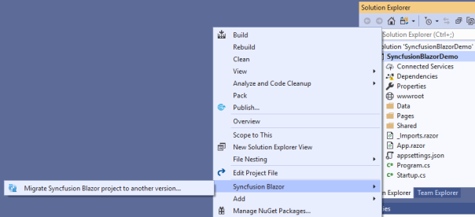
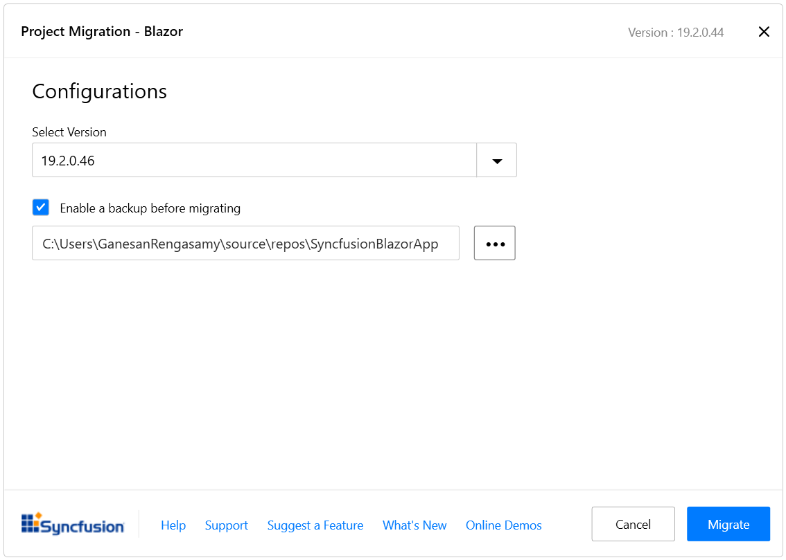

# Upgrade Syncfusion® Blazor components to the latest version

The Syncfusion&reg; Blazor migration add-in for Visual Studio updates an existing Syncfusion Blazor application from one Essential Studio&reg; version to another. This reduces the amount of manual work required when migrating the Syncfusion&reg; version.

Use the following steps to upgrade the Syncfusion&reg; version in a Syncfusion&reg; Blazor application using Visual Studio 2022:

N> Before use the Syncfusion&reg; Blazor Project Migration, check whether the Syncfusion&reg; Blazor Template Studio Extension installed or not in Visual Studio Extension Manager by clicking on the Extensions -> Manage Extensions -> Installed. If this extension not installed, install the extension by follow the steps from the [download and installation](https://blazor.syncfusion.com/documentation/visual-studio-integration/download-and-installation) help topic.

1. Open the Syncfusion&reg; Blazor application that uses Syncfusion&reg; components.

2. In Solution Explorer, right-click the project, choose **Syncfusion Blazor**, and then select **Migrate Syncfusion Blazor project from another version...** to open the Migration Wizard.

    

3. In the Syncfusion&reg; Project Migration window, select the required Syncfusion&reg; Blazor version to migrate to.

    N> Versions are loaded from Syncfusion&reg; Blazor NuGet packages on [NuGet.org](https://www.nuget.org/packages?q=Tags%3A%22blazor%22syncfusion) and require internet connectivity.

    

4. Select **Migrate**. The Syncfusion&reg; Blazor NuGet packages are updated to the chosen version in the project.

5. If you installed the trial setup or NuGet packages from nuget.org you must register the Syncfusion&reg; license key to your application since Syncfusion&reg; introduced the licensing system from 2018 Volume 2 (v16.2.0.41) Essential Studio&reg; release. Navigate to the [help topic](https://help.syncfusion.com/common/essential-studio/licensing/overview#how-to-generate-syncfusion-license-key) to generate and register the Syncfusion&reg; license key to your application. Refer to this [blog](https://www.syncfusion.com/blogs/post/whats-new-in-2018-volume-2.aspx?_ga=2.11237684.1233358434.1587355730-230058891.1567654773) post for understanding the licensing changes introduced in Essential Studio&reg;.