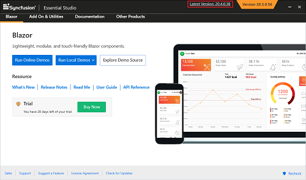

# Upgrading Syncfusion® Blazor installer to a latest version

Every three months, Syncfusion&reg; delivers volume releases with new features and improvements. Typically, one Service Pack release follows each volume release to deliver important bug fixes.

Upgrading to the latest version is supported from any installed Syncfusion&reg; version.

See the Blazor [Upgrade Guide](https://help.syncfusion.com/upgrade-guide/blazor-components) for details about breaking changes, bug fixes, features, and known issues between your current version and the target version.

## Upgrading to the latest version

The most recent version of Syncfusion&reg; Blazor can be downloaded and installed by selecting the “Latest Version: {Version}” link at the top of the Syncfusion&reg; Blazor Control Panel.

You can also upgrade by downloading and installing the required products directly from the Latest version downloads [page](https://www.syncfusion.com/downloads/latest-version). Uninstalling existing versions is not required.

It is not necessary to install a volume release before installing a Service Pack. Volume and Service Pack releases are independent; install the latest Service Pack directly to receive the most recent fixes.

## Upgrade from trial version to license version

To upgrade from a trial version:

* If using Syncfusion&reg; packages from [NuGet](https://www.nuget.org/packages?q=Tags%3A%22blazor%22syncfusion), replace the trial license key with a paid license key generated from the [License & Downloads](https://www.syncfusion.com/account/downloads) portal. For instructions on registering the license in an application, see Register the Syncfusion Blazor [license key](https://blazor.syncfusion.com/documentation/getting-started/license-key/how-to-register-in-an-application).

N> Starting with 2022 Volume 1 (v20.1.0.47), all Syncfusion&reg; customers (evaluators and paid customers) who use Syncfusion&reg; installers or NuGet packages from [nuget.org](https://www.nuget.org/packages?q=Tags%3A%22blazor%22syncfusion) must generate and register a valid platform- and version-specific license key in their projects. 
For more information, see [License key overview](https://blazor.syncfusion.com/documentation/getting-started/license-key/overview).
