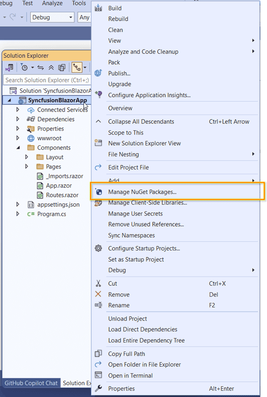
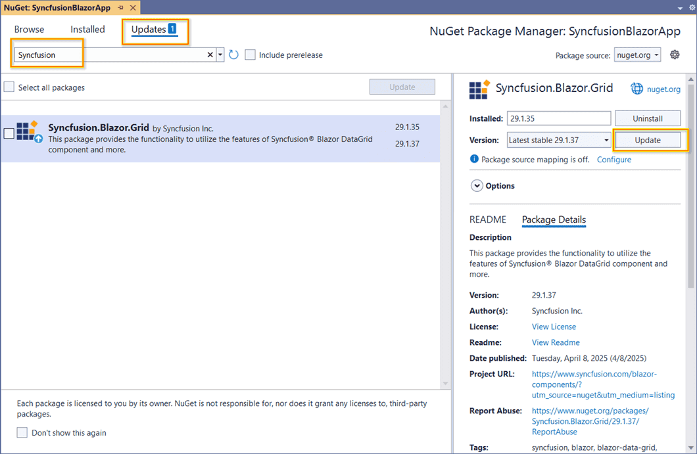
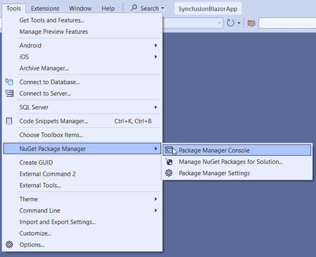
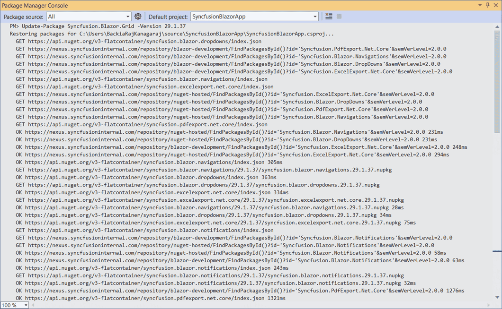

# Upgrading Syncfusion® Blazor NuGet packages to a latest version

Every three months, Syncfusion<sup style="font-size:70%">&reg;</sup> delivers volume releases with new features and improvements. For each volume, there are weekly NuGet updates and a subsequent service pack to deliver cumulative fixes. Syncfusion<sup style="font-size:70%">&reg;</sup> Blazor NuGet packages are also published weekly to address critical fixes.

Upgrading to the latest version is supported from any currently installed Syncfusion<sup style="font-size:70%">&reg;</sup> Blazor NuGet package version.

## Upgrade NuGet packages through Package Manager UI

The NuGet Package Manager UI in Visual Studio allows you install, uninstall, and update packages for projects and solutions. Use the following steps to find and upgrade Syncfusion<sup style="font-size:70%">&reg;</sup> Blazor NuGet packages to the latest or a specific version in a Blazor project or solution:

1. Right-click on the Blazor application or solution in the Solution Explorer tab, and choose **Manage NuGet Packages...**

    

    As an alternative, after opening the Blazor application in Visual Studio, go to the **Tools** menu and after hovering **NuGet Package Manager**, select **Manage NuGet Packages for Solution...**

2. The Manage NuGet Packages window will open. Navigate to the **Updates** tab, then search for the Syncfusion<sup style="font-size:70%">&reg;</sup> Blazor NuGet packages using a term like **"Syncfusion"** and select the appropriate Syncfusion<sup style="font-size:70%">&reg;</sup> Blazor NuGet package for your application.

    N> The [nuget.org](https://api.nuget.org/v3/index.json) package source is selected by default in the Package source drop-down. If Visual Studio does not have nuget.org configured, follow the guidance in [Microsoft documents](https://learn.microsoft.com/en-us/nuget/consume-packages/install-use-packages-visual-studio#package-sources) to add the nuget.org feed URL.

3. By default, the latest version is selected. Optionally choose a specific version, then select **Update** and accept the license terms. The package will be upgraded in the selected Blazor project.

    

    To update multiple packages, select the corresponding checkboxes and choose **Update** to upgrade multiple Syncfusion<sup style="font-size:70%">&reg;</sup> NuGet packages in the application.

    

## Upgrade NuGet packages through Dotnet (.NET) CLI

There is no distinct update command in the .NET CLI. When you run dotnet add package without specifying a version, the CLI installs the latest version of the Syncfusion<sup style="font-size:70%">&reg;</sup> Blazor NuGet package.

To specify a version, add the -v parameter:

```dotnet add package Syncfusion.Blazor.Grid -v 19.2.0.44.```

## Upgrade NuGet packages through Package Manager Console

The **Package Manager Console** saves NuGet packages upgrade time since you don't have to search for the package you want to update, and you can just type the command to update the appropriate Syncfusion<sup style="font-size:70%">&reg;</sup> Blazor NuGet package. Follow the steps below to upgrade the installed Syncfusion<sup style="font-size:70%">&reg;</sup> NuGet packages using the Package Manager Console in your Blazor application.

1. To show the Package Manager Console, open your Blazor application in Visual Studio and navigate to **Tools** in the Visual Studio menu and after hovering **NuGet Package Manager**, select **Package Manager Console**.

    

2. The Package Manager Console opens at the bottom of Visual Studio. Run the following NuGet update commands to update Syncfusion Blazor NuGet packages.

    ***Update specified Syncfusion<sup style="font-size:70%">&reg;</sup> Blazor NuGet package***

    The following command updates a Syncfusion<sup style="font-size:70%">&reg;</sup> Blazor NuGet package in the default project

    ```Update-Package <Package Name>```

    **For example:** Update-Package Syncfusion.Blazor.Grid

    ***Update specified Syncfusion<sup style="font-size:70%">&reg;</sup> Blazor NuGet package in specified Blazor application***

    The following command updates a Syncfusion<sup style="font-size:70%">&reg;</sup> Blazor NuGet package in the specified Blazor project only

    ```Update-Package <Package Name> -ProjectName <Project Name>```

    **For example:** Update-Package Syncfusion.Blazor.Grid -ProjectName BlazorApplication

3. By default, the latest version is installed. To install a specific version, use the -Version parameter as shown below.

    ```Update-Package Syncfusion.Blazor.Grid -Version 19.2.0.44```

    

4. The NuGet Package Manager updates the Syncfusion<sup style="font-size:70%">&reg;</sup> Blazor NuGet package and any required dependencies.
