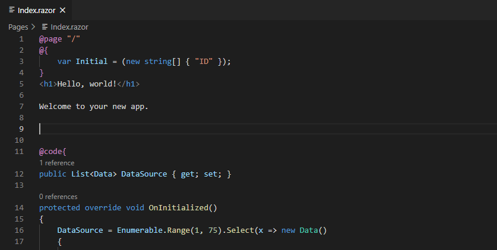
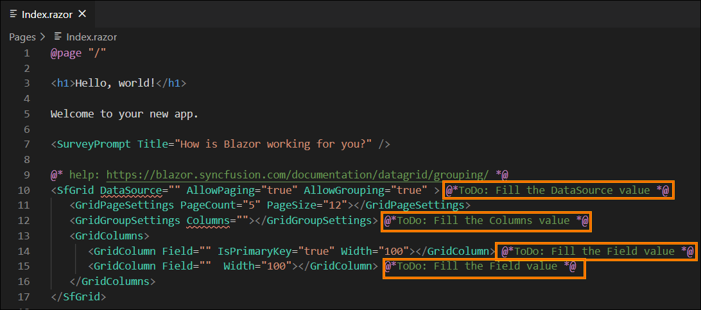
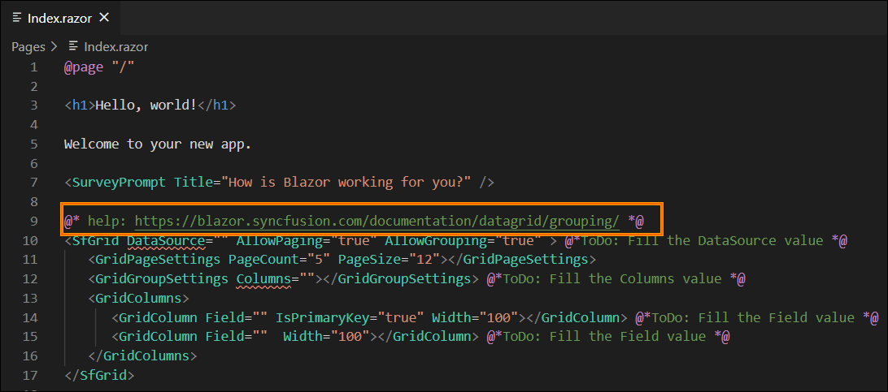
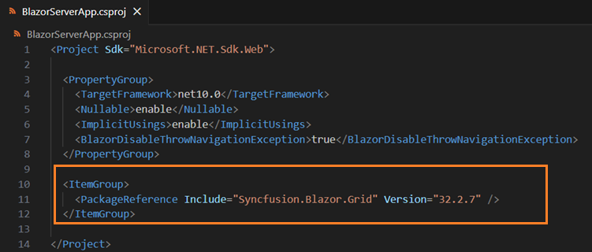
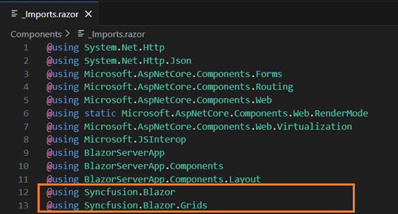
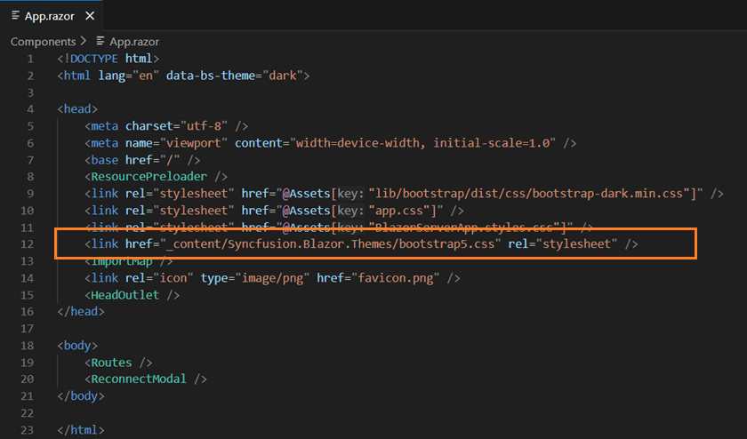
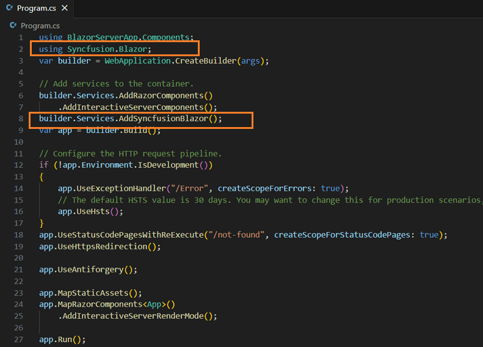

# Add Syncfusion® Blazor component in the Blazor application

The Syncfusion<sup style="font-size:70%">&reg;</sup> Blazor code snippet utility for Visual Studio Code provides snippets to insert Syncfusion<sup style="font-size:70%">&reg;</sup> Blazor components with common features into a Blazor application's Razor code editor.

   N> The Syncfusion<sup style="font-size:70%">&reg;</sup> Blazor code snippet feature is available from Essential Studio<sup style="font-size:70%">&reg;</sup> 2021 Volume 1 (`v19.1.0.54`).

## Add a Syncfusion® Blazor component

The following steps describe how to use the Syncfusion<sup style="font-size:70%">&reg;</sup> Blazor code snippets in a Blazor application.

1. In Visual Studio Code, open an existing Blazor application or create a new one.

2. Open the required Razor file and place the cursor where the Syncfusion<sup style="font-size:70%">&reg;</sup> component should be inserted.

3. Type the prefix **sf** and use the following format to discover component snippets and features.

    ```
    sf<Syncfusion component name>-<Syncfusion component feature>
    For example, sfgrid-grouping
    ```
4. Select the desired Syncfusion component and press **Enter** or **Tab**. The corresponding component markup is inserted into the Razor file.

    

5. After inserting the Syncfusion<sup style="font-size:70%">&reg;</sup> Blazor component, use the Tab key to navigate placeholders and provide the required values. Review the inline comments in the snippet to identify which values are required.

    

6. A Syncfusion<sup style="font-size:70%">&reg;</sup> help link is included at the top of the snippet to learn more about the inserted component or feature.

    

## Configure Blazor application with Syncfusion

The Syncfusion<sup style="font-size:70%">&reg;</sup> Blazor snippet only inserts code into the Razor file. Configure the Blazor application by adding the required NuGet packages, namespaces, themes, and registering the Syncfusion<sup style="font-size:70%">&reg;</sup> Blazor service. Follow these steps:

1. Open the Blazor application file and manually add the required Syncfusion® Blazor individual NuGet package(s) for the Syncfusion® Blazor components as a package reference. Refer to [this section](https://blazor.syncfusion.com/documentation/nuget-packages#benefits-of-using-individual-nuget-packages) to learn about the advantages of the individual NuGet packages. This NuGet package will be automatically restored when building the application.

    

    N> Starting with Volume 4, 2020 (v18.4.0.30) release, Syncfusion® provides [individual NuGet packages](https://blazor.syncfusion.com/documentation/nuget-packages) for our Syncfusion® Blazor components. We highly recommend this new standard for your Blazor production applications.

2. To render Syncfusion<sup style="font-size:70%">&reg;</sup> components, open **~/_Imports.razor** and add the required Syncfusion<sup style="font-size:70%">&reg;</sup> Blazor namespace entries.

    

3. Add a Syncfusion<sup style="font-size:70%">&reg;</sup> Blazor [theme](https://blazor.syncfusion.com/documentation/appearance/themes) in the `<head>` element of **~/Components/App.razor** for Blazor Web App, in **~/Pages/_Host.cshtml** for Blazor Server, and in **~/wwwroot/index.html** for a Blazor WebAssembly (client) application.

    

4. Open the relevant **~/Program.cs** file(s) for Web App and server application and client application and register the Syncfusion<sup style="font-size:70%">&reg;</sup> Blazor service.

If the Blazor Web App uses an interactive render mode of `WebAssembly` or `Auto`, register the Syncfusion<sup style="font-size:70%">&reg;</sup> Blazor service in both **~/Program.cs** files of the Blazor Web App.



5. If you installed the trial setup or NuGet packages from nuget.org you must register the Syncfusion® license key to your application since Syncfusion® introduced the licensing system from 2018 Volume 2 (v16.2.0.41) Essential Studio® release. Navigate to the [help topic](https://help.syncfusion.com/common/essential-studio/licensing/overview#how-to-generate-syncfusion-license-key) to generate and register the Syncfusion® license key to your application. Refer to this [UG](https://blazor.syncfusion.com/documentation/getting-started/license-key/overview) topic for understanding the licensing details in Essential Studio® for Blazor.