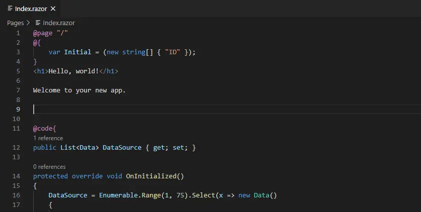
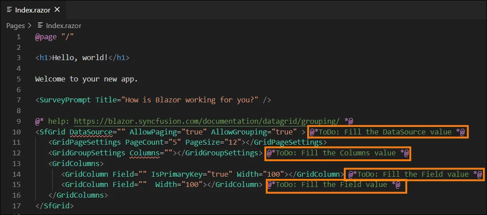
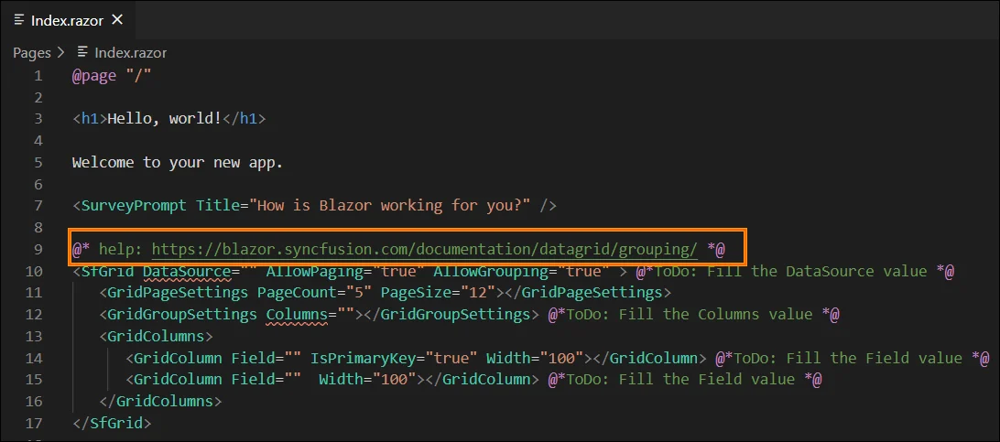
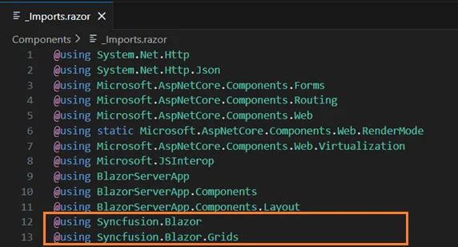
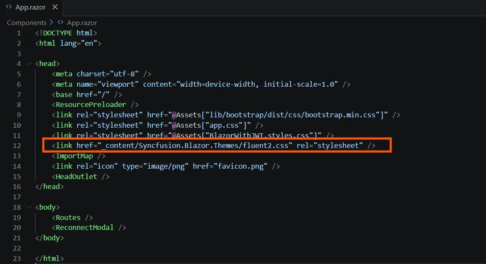
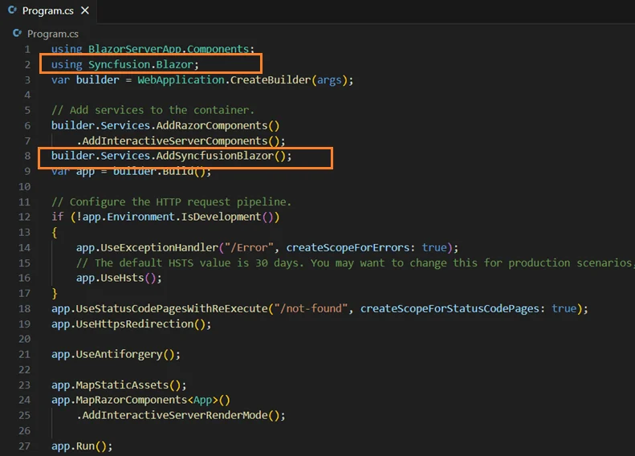

# Add Syncfusion® Blazor component in the Blazor application

The Syncfusion® Blazor extension for Visual Studio Code speeds up component insertion by providing ready-to-use Razor markup and placeholders for common features.

   N> The Syncfusion<sup style="font-size:70%">&reg;</sup> Blazor code snippet feature is available from Essential Studio<sup style="font-size:70%">&reg;</sup> 2021 Volume 1 (`v19.1.0.54`).

## Quick start

1. Open your Blazor project in Visual Studio Code and the target Razor file.
2. Position the cursor where you want the component markup inserted.
3. Type the `sf` prefix using the convention:

    ```
    sf<Syncfusion component name>-<feature>
    Example: sfgrid-grouping
    ```
4. Choose the snippet from the suggestions and press Enter or Tab. The component markup is inserted with editable placeholders.

    

5. Use Tab to navigate placeholders and fill required values. Inline comments in the snippet highlight required fields.

    

6. Each snippet includes a help link at the top so you can quickly access the relevant documentation for the inserted component or feature.

    

## After inserting a snippet — project configuration checklist

The snippet only adds Razor markup. To render Syncfusion® components correctly, ensure the project is configured as follows:

- Add the required Syncfusion® NuGet package(s) (individual packages are recommended).Refer to this [section](https://blazor.syncfusion.com/documentation/nuget-packages#benefits-of-using-individual-nuget-packages) to learn about the advantages of the individual NuGet packages.

    

- Import Syncfusion® namespaces in `~/_Imports.razor`.

    

- Include a Syncfusion® [theme](https://blazor.syncfusion.com/documentation/appearance/themes) stylesheet in the page head: `~/Components/App.razor` (Blazor Web App), `~/Pages/_Host.cshtml` (Blazor Server), or `~/wwwroot/index.html` (Blazor WebAssembly).

    

- Register the Syncfusion® Blazor service in the appropriate `Program.cs` files. For interactive Web App render modes `WebAssembly` or `Auto`, register in both `Program.cs` files when applicable.

    

5. If you installed the trial setup or NuGet packages from nuget.org you must register the Syncfusion® license key to your application since Syncfusion® introduced the licensing system from 2018 Volume 2 (v16.2.0.41) Essential Studio® release. Navigate to the [help topic](https://help.syncfusion.com/common/essential-studio/licensing/overview#how-to-generate-syncfusion-license-key) to generate and register the Syncfusion® license key to your application. Refer to this [UG](https://blazor.syncfusion.com/documentation/getting-started/license-key/overview) topic for understanding the licensing details in Essential Studio® for Blazor.