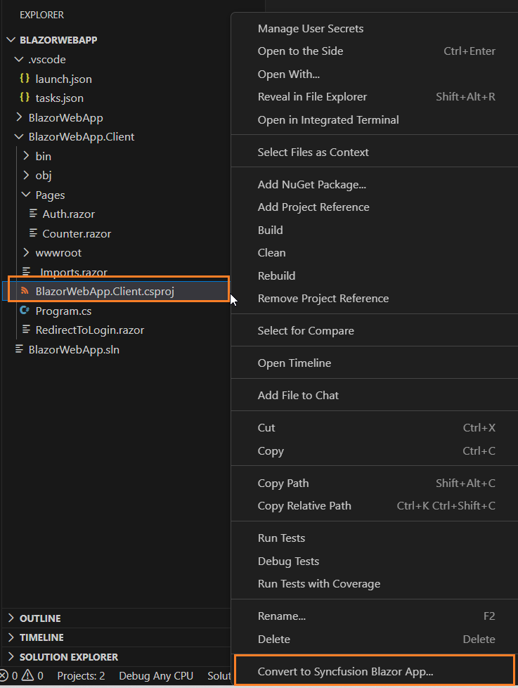
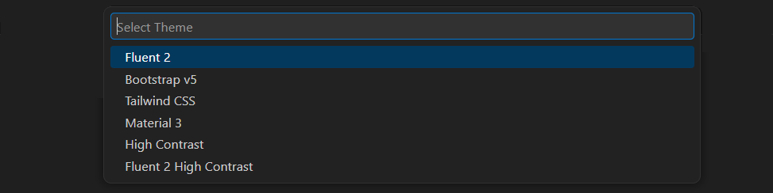

# Converting Blazor Extension for Visual Studio Code

The Syncfusion&reg; Blazor conversion add-in for Visual Studio Code converts an existing Blazor application into a Syncfusion&reg; Blazor web application by adding the required NuGet packages and themes.

N> The Syncfusion® Blazor Web Application Project Conversion utility is available from `v17.4.0.39`.

Use the following steps to run the Syncfusion&reg; project conversion in an existing Blazor Web application:

1. In Visual Studio Code, open an existing Blazor Web application or create a new Blazor Web application.

2. In Explorer (Workspace), right-click the project file and select **Convert to Syncfusion Blazor Application...** from the context menu. Refer the screenshot below.

    

3. From the Command Palette, choose **Select Blazor Version** (version published on `nuget.org`).

    

4. From the palette, choose the desired Syncfusion theme.

    

5. The application is configured with the required Syncfusion&reg; Blazor NuGet packages and themes.

6. If you installed the trial setup or NuGet packages from nuget.org you must register the Syncfusion® license key to your application since Syncfusion® introduced the licensing system from 2018 Volume 2 (v16.2.0.41) Essential Studio® release. Navigate to the [help topic](https://help.syncfusion.com/common/essential-studio/licensing/overview#how-to-generate-syncfusion-license-key) to generate and register the Syncfusion® license key to your application. Refer to this [UG](https://blazor.syncfusion.com/documentation/getting-started/license-key/overview) topic for understanding the licensing details in Essential Studio® for Blazor.

## NuGet Packages

Based on the application type, the following NuGet packages are added as dependencies.

| Syncfusion&reg; Blazor NuGet packages  | Application type  |
|---|---|
| `Syncfusion.Blazor`  | Syncfusion&reg; Blazor Web App   Syncfusion&reg; Blazor Server App   Syncfusion&reg; Blazor WebAssembly App   Syncfusion&reg; Blazor WebAssembly App (ASPNET Core hosted)   Syncfusion&reg; Blazor WebAssembly App (Progressive Web Application)|
| `Syncfusion.Blazor.PdfViewerServer.Windows`  | Syncfusion&reg; Blazor Server App  |
| `Syncfusion.Blazor.WordProcessor`  | Syncfusion&reg; Blazor Server App   Syncfusion&reg; Blazor WebAssembly App   Syncfusion&reg; Blazor WebAssembly App (ASPNET Core hosted)   Syncfusion&reg; Blazor WebAssembly App (Progressive Web Application)|

The packages are added to the application as shown below.

## Theme links

During conversion, the selected Syncfusion&reg; Blazor theme is added in the following locations based on the application type.

| Application type  | File location  |
|---|---|
| Syncfusion&reg; Blazor Web App | ~/Components/App.razor |
| Syncfusion&reg; Blazor Server App | {Project location}/Pages/_Host.cshtml |
| Syncfusion&reg; Blazor WebAssembly App (ASPNET Core hosted)   Syncfusion&reg; Blazor WebAssembly App (Progressive Web Application)| {Client Project location}/wwwroot/index.html  |
| Syncfusion&reg; Blazor WebAssembly App  | {Project location}/wwwroot/index.html|

