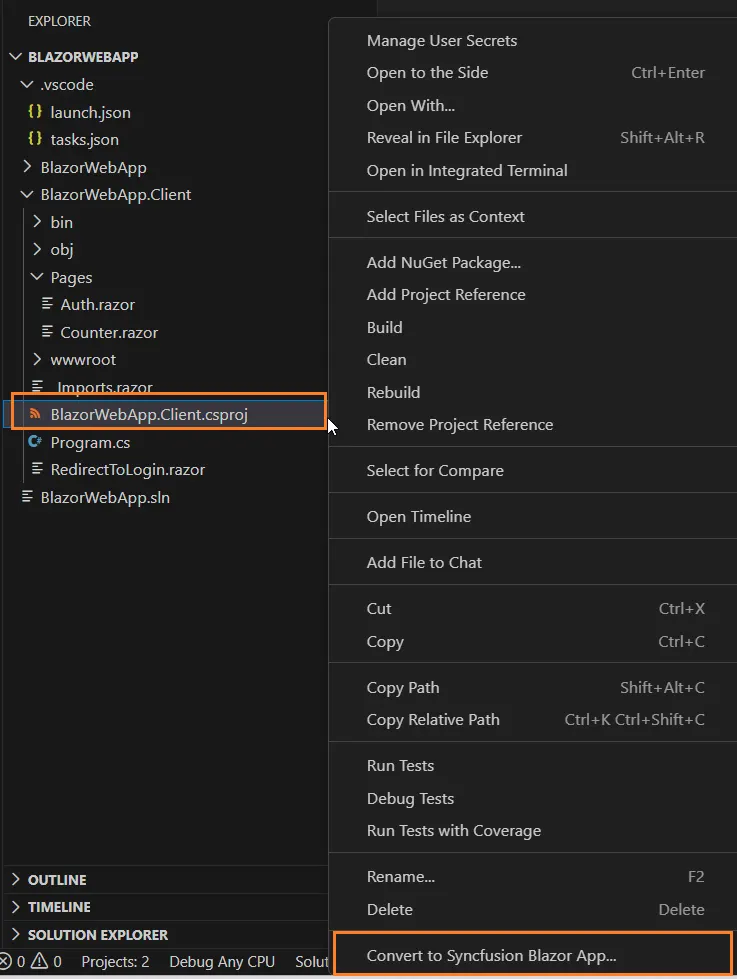
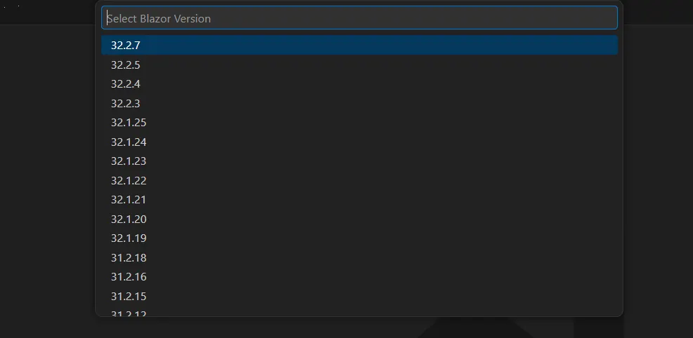
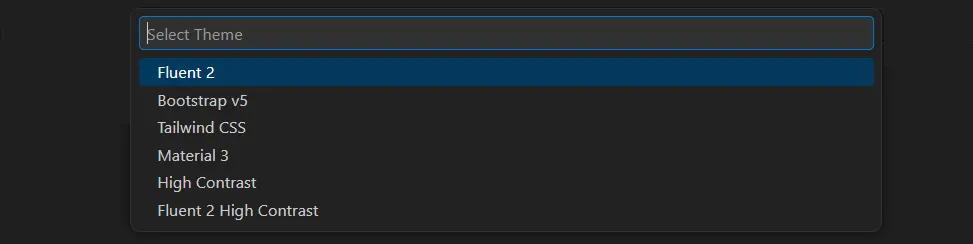
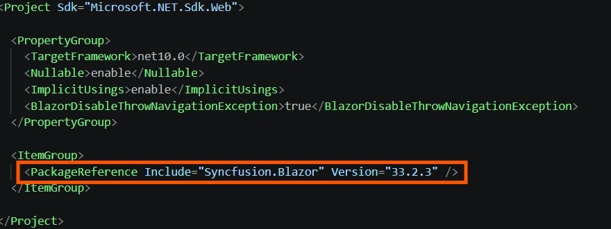

# Convert a Blazor Project to Syncfusion® Blazor

The Syncfusion&reg; Blazor conversion extension for Visual Studio Code converts an existing Blazor application into a Syncfusion&reg; Blazor Web application by automatically adding required NuGet packages and configuring themes.

## Steps to Convert the Application

Use the following steps to convert an existing Blazor application to a Syncfusion&reg; Blazor application:

1. In Visual Studio Code, open an existing Blazor application or create a new Blazor application.

   Supported application types:
   - Blazor Web App (Server or WebAssembly rendering)
   - Blazor Server App
   - Blazor WebAssembly App (standalone or ASP.NET Core hosted)
   - Blazor WebAssembly App (Progressive Web Application)

2. In the Explorer panel, right-click the project file (`.csproj`) and select **Convert to Syncfusion Blazor App...** from the context menu.

    

3. In the Command Palette, select **Select Blazor Version** and choose the desired Syncfusion&reg; Blazor version from the dropdown list (displays versions available on `nuget.org`).

    

4. After version selection, the Command Palette will display available themes. Select the preferred theme (e.g., Material, Bootstrap, Tailwind, Fluent and HighContrast).

    

   N> The conversion process will run automatically. This may take a few moments as NuGet packages are downloaded and the project is configured.

5. After conversion completes, the application is configured with the required Syncfusion&reg; Blazor NuGet packages and the selected theme stylesheet.

6. If the trial setup or NuGet packages from `nuget.org`, register the Syncfusion® license key in the application. Syncfusion® introduced the licensing system in the 2018 Volume 2 (v16.2.0.41) Essential Studio® release. Navigate to the [help topic](https://help.syncfusion.com/common/essential-studio/licensing/overview#how-to-generate-syncfusion-license-key) to generate and register the Syncfusion® license key to the application. Refer to this [UG](https://blazor.syncfusion.com/documentation/getting-started/license-key/overview) topic for understanding the licensing details in Essential Studio® for Blazor.

## NuGet Packages

During conversion, the required NuGet packages are automatically added to the application based on the application type.

| NuGet Packages | Application Types |
|---------|---------|
| `Syncfusion.Blazor` | Blazor Web App (Server or WebAssembly),    Blazor WebAssembly App (all variants) |

The packages are added to the application's `.csproj` file as shown below:

## Theme Configuration

During conversion, the selected Syncfusion&reg; theme stylesheet is automatically added in the following locations based on the application type.

| Application Type | Theme File Location |
|---|---|
| Blazor Web App (Server or WebAssembly) | `Components/App.razor` |
| Blazor WebAssembly (standalone) | `wwwroot/index.html` |
| Blazor WebAssembly (ASP.NET Core hosted) | **Client project:** `wwwroot/index.html` |
| Blazor WebAssembly (Progressive Web Application) | `wwwroot/index.html` |

