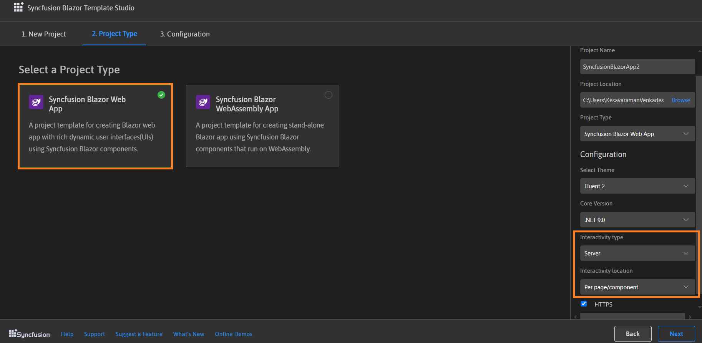

# Creating a Syncfusion&reg; Blazor application

Syncfusion&reg; provides **Visual Studio Code project templates** for creating Syncfusion&reg; Blazor application. Syncfusion&reg; Blazor generates application that include the necessary Syncfusion&reg; NuGet packages, namespaces, and component render code for the Calendar, Button, and DataGrid components, as well as the style for making Syncfusion&reg; component development easier.

N> Blazor project templates from `v17.4.0.39` are supported by the Syncfusion&reg; Visual Studio Code project template.

The instructions below assist you in creating **Syncfusion&reg; Blazor Applications** using **Visual Studio Code**:

1. To create a Syncfusion&reg; Blazor application in Visual Studio Code, open the command palette by pressing **Ctrl+Shift+P**. Search for the word **Syncfusion** in the Visual Studio Code palette to get the templates provided by Syncfusion.

    

2. Select **Syncfusion&reg; Blazor Template Studio: Launch**, then press **Enter** key. The Template Studio wizard for configuring the Syncfusion&reg; Blazor app will be launched. Provide the Project Name and Project Path.

    

N> Refer to the .NET SDK support for Syncfusion&reg; Blazor Components [here](https://blazor.syncfusion.com/documentation/system-requirements#net-sdk).

3. Select either **Next** or the **Project Type** tab. Syncfusion&reg; Blazor project types will be displayed. Choose one of the following Syncfusion&reg; Blazor project types based on the version of the .NET SDK you are using.

    | .NET SDK version | Supported Syncfusion&reg; Blazor Application Type |
    | ---------------- | -------------------------------------------- |
    | [.NET 9.0](https://dotnet.microsoft.com/en-us/download/dotnet/9.0), [.NET 8.0](https://dotnet.microsoft.com/en-us/download/dotnet/8.0) | Syncfusion&reg; Blazor Web App |
    | [.NET 9.0](https://dotnet.microsoft.com/en-us/download/dotnet/9.0), [.NET 8.0](https://dotnet.microsoft.com/en-us/download/dotnet/8.0), [.NET 7.0](https://dotnet.microsoft.com/en-us/download/dotnet/7.0), [.NET 6.0](https://dotnet.microsoft.com/en-us/download/dotnet/6.0) | Syncfusion&reg; Blazor WebAssembly App |
    | [.NET 7.0](https://dotnet.microsoft.com/en-us/download/dotnet/7.0), [.NET 6.0](https://dotnet.microsoft.com/en-us/download/dotnet/6.0) | Syncfusion&reg; Blazor Server App |

    In the **Syncfusion&reg; Blazor Web App** application type, you can configure the following options:

    <table>
    <tbody>
    <tr>
    <td>
    <a href="https://learn.microsoft.com/en-us/aspnet/core/blazor/components/render-modes?view=aspnetcore-8.0#render-modes" rel="nofollow">Interactivity type</a>
    </td>
    <td>
    Server, WebAssembly, Auto (Server and WebAssembly)
    </td>
    </tr>
    <tr>
    <td>
    <a href="https://learn.microsoft.com/en-us/aspnet/core/blazor/tooling?view=aspnetcore-8.0&pivots=windows" rel="nofollow">Interactivity location</a>
    </td>
    <td>
    Global, Per page/component
    </td>
    </tr>
    </tbody>
    </table>

    

     In the **Syncfusion&reg; Blazor WebAssembly App** application type, you can choose ASP.NET Core hosted, Progressive Web Application, or both.

     

4. The Configuration section will be displayed when you click either **Next** or the **Configuration** tab. Here, you have the option for selecting the required .NET Core version, themes, https configuration, and Blazor Web Assembly project types (ASP.NET Core hosted and Progressive Web Application).

    

    N> ASP.NET Core hosted and Progressive Web Application options are only visible if Blazor Web Assembly App project type is selected.

5. Click the **Create** button. The Syncfusion&reg; Blazor application has been created. The created Syncfusion&reg; Blazor app has the Syncfusion&reg; NuGet packages, styles, and the component render code for the Syncfusion&reg; component added to the Index, Counter, and FetchData pages.

6. You can run the application to see the Syncfusion&reg; components. Click **F5** or go to **Run>Start Debugging**.

    

7. If you installed the trial setup or NuGet packages from nuget.org you must register the Syncfusion&reg; license key to your application since Syncfusion&reg; introduced the licensing system from 2018 Volume 2 (v16.2.0.41) Essential Studio&reg; release. Navigate to the [help topic](https://help.syncfusion.com/common/essential-studio/licensing/license-key#how-to-generate-syncfusion-license-key) to generate and register the Syncfusion&reg; license key to your application. Refer to this [UG](https://blazor.syncfusion.com/documentation/getting-started/license-key/overview) topic for understanding the licensing details in Essential Studio&reg; for Blazor.

## Syncfusion&reg; integration

The Syncfusion&reg; Blazor application configures with latest Syncfusion&reg; Blazor NuGet packages, styles, namespaces, and component render code for Syncfusion&reg; components are added in the created application.

### NuGet Packages

The `Syncfusion.Blazor` NuGet package will be added as NuGet references for all application types.

### Style

The selected theme is added from Syncfusion&reg; NuGet and its reference at these applications locations in Blazor.

| Application type  | File location  |
|---|---|
| Syncfusion&reg; Blazor Web App | ~/Components/App.razor |
| Syncfusion&reg; Blazor Server App | {Project location}/Pages//_Host.cshtml |
| Syncfusion&reg; Blazor WebAssembly App (ASPNET Core hosted)   Syncfusion&reg; Blazor WebAssembly App (Progressive Web Application) | {Client Project location}/wwwroot/index.html  |
| Syncfusion&reg; Blazor WebAssembly App  | {Project location}/wwwroot/index.html|

### Namespaces

The Syncfusion&reg; Blazor namespaces are added in the **`_imports.razor`** file.

### Component render code

The Syncfusion&reg; Blazor Calendar, Button, and DataGrid component render code is in the Razor files in the pages folder. The render code is updated in these Razor files.

| File name  | Code snippet added |
|---|---|
| `~/Pages/Home.razor or Index.razor`  |  |
| `~/Pages/Counter.razor` |  |
| `~/Pages/FetchData.razor`  |  |