# Create a Syncfusion Blazor application

The **Syncfusion® Blazor Template Studio** for Visual Studio Code scaffolds a Blazor application preconfigured with Syncfusion® NuGet packages, namespaces, themes, and sample component render code. Use the guided wizard to quickly create an application tailored to your platform and selected controls.

N> Blazor project templates require Essential Studio `v17.4.0.39` and later are supported by the Syncfusion® Visual Studio Code project template.

Use the following steps to create Syncfusion® Blazor applications in Visual Studio Code:

1. Open the Command Palette (`Ctrl+Shift+P`) and search for **Syncfusion** to list available commands.

    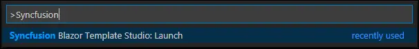

2. Choose **Syncfusion Blazor Template Studio: Launch** and provide the project name and path in the wizard.

    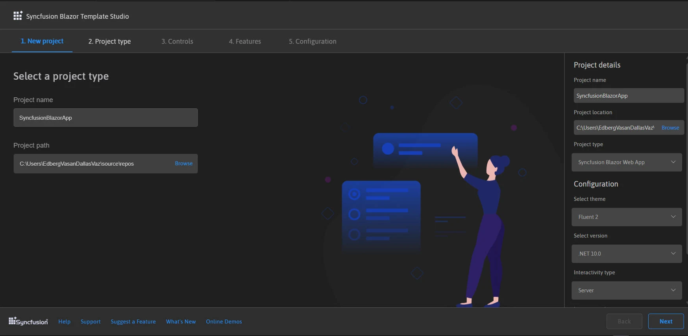

3. On the **Project type** tab, select the application type that matches your installed .NET SDK.

    Supported .NET SDKs and application types:

    | Application Type | Supported .NET SDK Versions |
    | --- | --- |
    | Blazor Web App | .NET 8.0, 9.0, 10.0 |
    | Blazor WebAssembly App | .NET 8.0, 9.0, 10.0 |

    In the Blazor Web App type you can choose interactivity (Server, WebAssembly, Auto) and interactivity location (global or per page/component).

    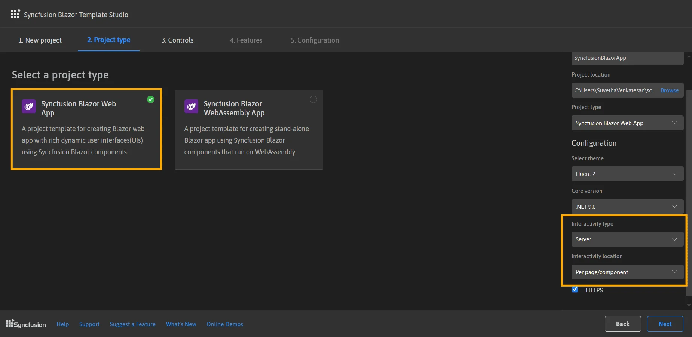

    For WebAssembly projects, you can opt into Progressive Web Application (PWA) support.

    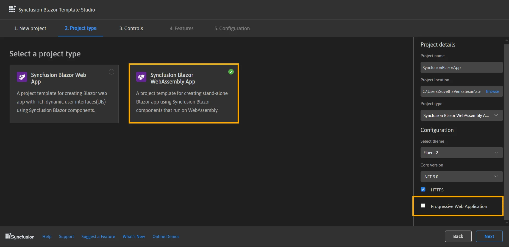

4. On the **Controls** tab, pick the [Blazor components](https://www.syncfusion.com/blazor-components) to include in the project by selecting their tiles.

    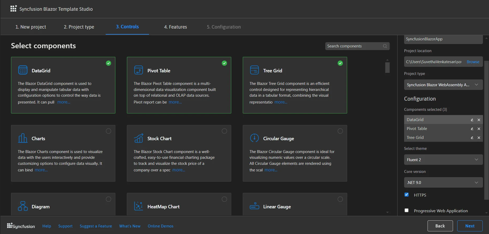

    N> Select at least one control to enable the **Features** and **Configuration** tabs.

5. On the **Features** tab, choose per-control features you want included in the scaffolded pages.

    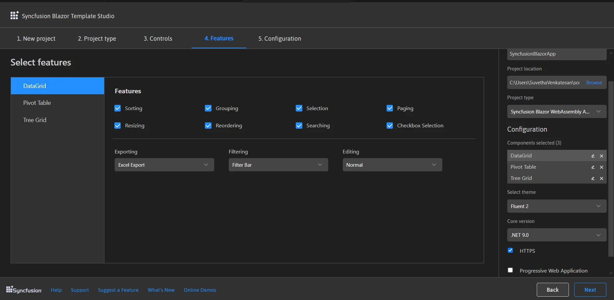

6. On the **Configuration** tab, set .NET target version, theme, HTTPS, localization, authentication type, and other app-specific options.

    Authentication options vary by application type:

    | Application type | Authentication |
    | --- | --- |
    | Blazor Web App | None, Individual Accounts |
    | Blazor WebAssembly App | None, Individual Accounts, Microsoft Identity Platform |

    Configure interactivity options for Blazor Web App and PWA settings for WebAssembly as needed.

    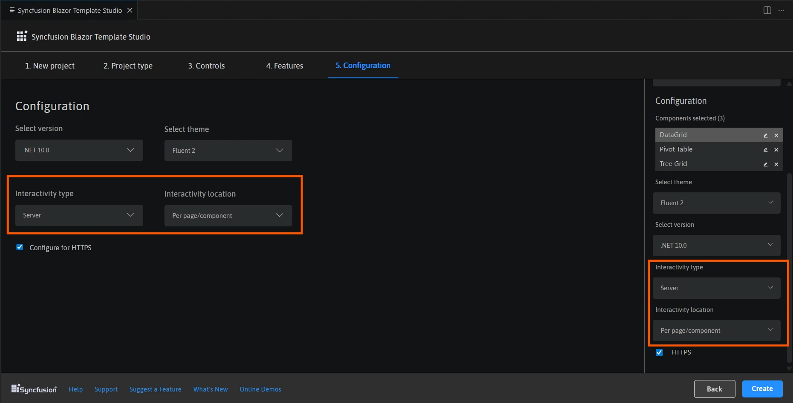

    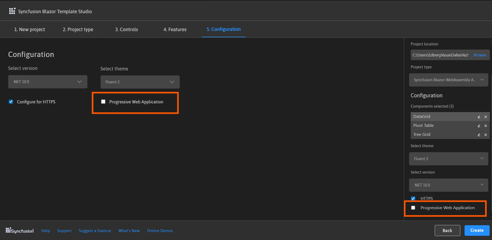

    Use the **Project details** panel to review selections, remove controls, or change the app configuration before creating the project.

    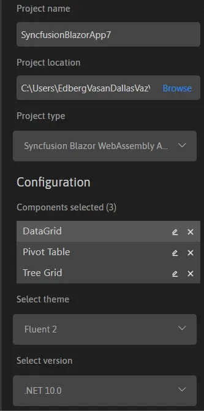

7. Click **Create**. The Template Studio generates the project with the selected NuGet packages, theme references, namespaces, and component render code.

8. Run the project using the terminal command or the debugger:




dotnet run




Alternatively, press **F5** or go to **Run > Start Debugging** to launch the application.

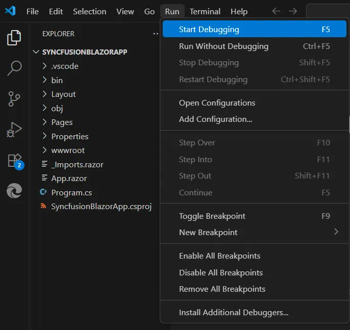

## What Template Studio configures for you

- NuGet: Adds the [Syncfusion.Blazor](https://www.nuget.org/packages/Syncfusion.Blazor) package (and individual packages when applicable).

    

- Theme: Adds the chosen theme reference to the appropriate location (`~/Components/App.razor` for Blazor Web App, or `wwwroot/index.html` for WebAssembly projects).

    

- Namespaces: Inserts namespaces into `_Imports.razor`.

    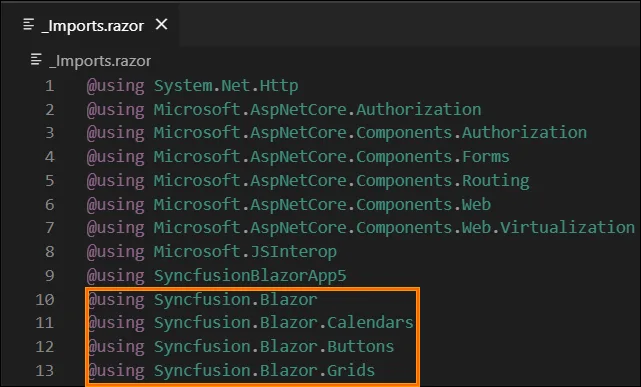

- Component render code: Adds sample usage (Calendar, Button, DataGrid) into the Pages folder (Index/Counter/FetchData).

    

N> If you installed the trial setup or NuGet packages from [nuget.org](https://www.nuget.org), you must register the license key. Refer to the [licensing overview](https://blazor.syncfusion.com/documentation/getting-started/license-key/overview) for details on generating and registering your license key.    

## See also

- [Overview of Blazor Extension for Visual Studio Code](overview.md)
- [Download and Installation for Visual Studio Code](download-and-installation.md)
- [Code Snippets for Visual Studio Code](code-snippet.md)
- [Convert Project for Visual Studio Code](convert-project.md)
- [Upgrade Project for Visual Studio Code](upgrade-project.md)
- [Scaffolding for Visual Studio Code](scaffolding.md)
