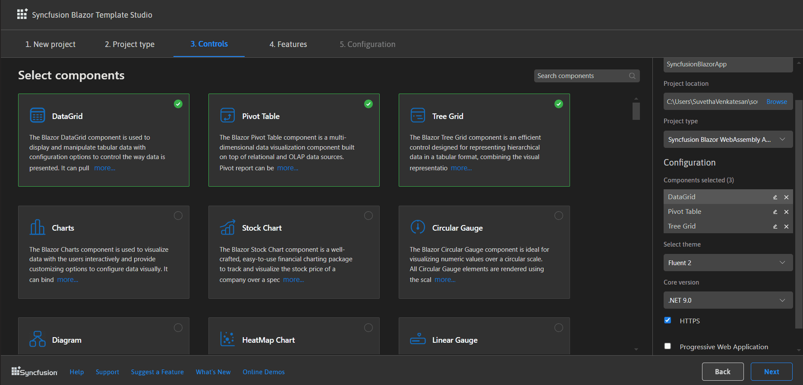

# Create a Syncfusion® Blazor application

Syncfusion&reg; provides the Blazor Template Studio for Visual Studio Code, which scaffolds a Syncfusion&reg; Blazor application preconfigured with Syncfusion&reg; NuGet packages, namespaces, themes, and component render code. The Template Studio offers a guided wizard to create an application with Syncfusion&reg; components.

N> Blazor project templates from version `v17.4.0.39` and later are supported by the Syncfusion Visual Studio Code project template.

Use the following steps to create Syncfusion&reg; Blazor applications in Visual Studio Code:

1. To create a Syncfusion&reg; Blazor application in Visual Studio Code, open the Command Palette with **Ctrl+Shift+P**. Search for the word **Syncfusion&reg;** in the Visual Studio Code palette to get the templates provided by Syncfusion&reg;.

    

2. Select **Syncfusion Blazor Template Studio: Launch**, and press **Enter**. The Template Studio wizard opens to configure the Syncfusion&reg; Blazor app. Enter the project name and project path.

    

    N> For supported .NET SDK versions, see the .NET SDK support for Syncfusion Blazor components in the system requirements [documentation](https://blazor.syncfusion.com/documentation/system-requirements#net-sdk).

3. Select **Next** or the **Project type** tab. The available Syncfusion&reg; Blazor project types are displayed. Choose one based on the .NET SDK version in use.

    | .NET SDK version | Supported Syncfusion&reg; Blazor Application Type |
    | ---------------- | -------------------------------------------- |
    | [.NET 9.0](https://dotnet.microsoft.com/en-us/download/dotnet/9.0), [.NET 8.0](https://dotnet.microsoft.com/en-us/download/dotnet/8.0) | Syncfusion&reg; Blazor Web App |
    | [.NET 9.0](https://dotnet.microsoft.com/en-us/download/dotnet/9.0), [.NET 8.0](https://dotnet.microsoft.com/en-us/download/dotnet/8.0) | Syncfusion&reg; Blazor WebAssembly App |
    
    In the **Syncfusion&reg; Blazor Web App** application type, the following options are available:

    <table>
    <tbody>
    <tr>
    <td>
    <a href="https://learn.microsoft.com/en-us/aspnet/core/blazor/components/render-modes?view=aspnetcore-8.0#render-modes">Interactivity type</a>
    </td>
    <td>
    Server, WebAssembly, Auto (Server and WebAssembly)
    </td>
    </tr>
    <tr>
    <td>
    <a href="https://learn.microsoft.com/en-us/aspnet/core/blazor/tooling?view=aspnetcore-8.0&pivots=windows">Interactivity location</a>
    </td>
    <td>
    Global, Per page/component
    </td>
    </tr>
    </tbody>
    </table>

    

     In the **Syncfusion Blazor WebAssembly App** project type, choose Progressive Web Application (PWA).

     

4. Select **Next** or the **Controls** tab, and then choose the Syncfusion&reg; Blazor components to include in the application.

     

     Choose the required control(s) by selecting the corresponding control tiles.

     To unselect added control(s), use one of the following options:

     **Option 1:** Click the corresponding selected control box.

     **Option 2:** In **Project Details**, click the ‘x’ next to the corresponding control in the selected controls list.

     N> Choose at least one control to enable the Features and Configuration tabs.

5. Select **Next** or the **Features** tab to view the available features for the selected controls, and choose the required options.

    

6. Select **Next** or the **Configuration** tab to open the Configuration section. Configure the target .NET version (.NET 9.0 or .NET 8.0), theme, HTTPS configuration, localization, authentication type, and options specific to Blazor Web App or Blazor WebAssembly App types.

     Depending on the selected Syncfusion&reg; Blazor application type, the following authentication options are supported:

     | Syncfusion&reg; Blazor Application Type | Supported Authentication Types |
     | ------------- | ------------- |
     | Syncfusion&reg; Blazor Web App | None, Individual Accounts |
     | Syncfusion&reg; Blazor WebAssembly App | None, Individual Accounts, Microsoft Identity Platform |

     For the **Blazor Web App** application type, Interactivity type and Interactivity location can be customized.

     

     For the **Blazor WebAssembly App** appllication type, the Progressive Web Application option can be enabled or disabled.

     

     **Project details section**

     Use the Project Details section to change the application type, remove selected control(s), or update configuration options.

    

7. Click **Create**. The Syncfusion&reg; Blazor application is created with the required Syncfusion&reg; NuGet packages, styles, and the render code for the selected Syncfusion&reg; components.

    
8. Run the application to view the Syncfusion&reg; components. Press **F5** or select **Run > Start Debugging**.

     

9. The Syncfusion® Blazor application configures with most recent Syncfusion® Blazor NuGet packages version, selected style, namespaces, selected authentication, and component render code for Syncfusion® components.

10. If you installed the trial setup or NuGet packages from nuget.org you must register the Syncfusion® license key to your application since Syncfusion® introduced the licensing system from 2018 Volume 2 (v16.2.0.41) Essential Studio® release. Navigate to the [help topic](https://help.syncfusion.com/common/essential-studio/licensing/license-key#how-to-generate-syncfusion-license-key) to generate and register the Syncfusion® license key to your application. Refer to this [UG](https://blazor.syncfusion.com/documentation/getting-started/license-key/overview) topic for understanding the licensing details in Essential Studio® for Blazor.

## Syncfusion&reg; integration

The Syncfusion® Blazor application configures with latest Syncfusion® Blazor NuGet packages, styles, namespaces, and component render code for Syncfusion® components are added in the created application.

### NuGet packages

The `Syncfusion.Blazor` package is added as a dependency for all project types.

### Style

The selected theme is added from the Syncfusion&reg; NuGet package and referenced at the following locations.

| Application type  | File location  |
|---|---|
| Syncfusion&reg; Blazor Web App | ~/Components/App.razor |
| Syncfusion&reg; Blazor WebAssembly App (ASP.NET Core hosted)   Syncfusion&reg; Blazor WebAssembly App (Progressive Web Application) | {Client Project location}/wwwroot/index.html  |
| Syncfusion&reg; Blazor WebAssembly App  | {Project location}/wwwroot/index.html|

### Namespaces

The Syncfusion&reg; Blazor namespaces are added in the **`_imports.razor`** file.

### Component render code

The Syncfusion Blazor Calendar, Button, and DataGrid component render code is added to the Razor files in the Pages folder.

| File name  | Code snippet added |
|---|---|
| `~/Pages/Home.razor or Index.razor`  |  |
| `~/Pages/Counter.razor` |  |
| `~/Pages/FetchData.razor`  |  |
