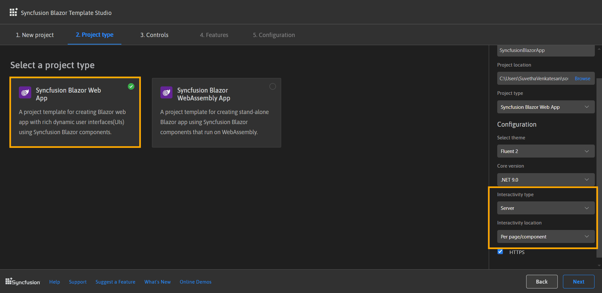
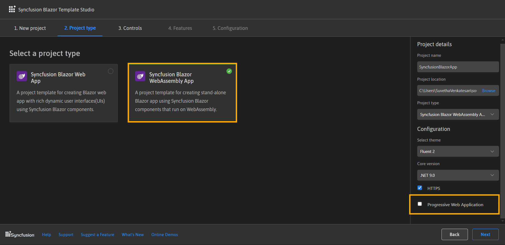
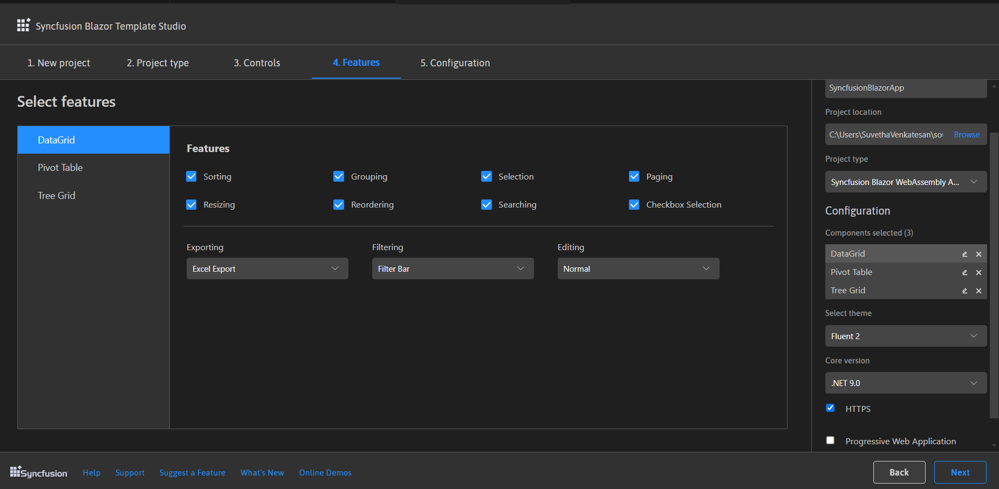
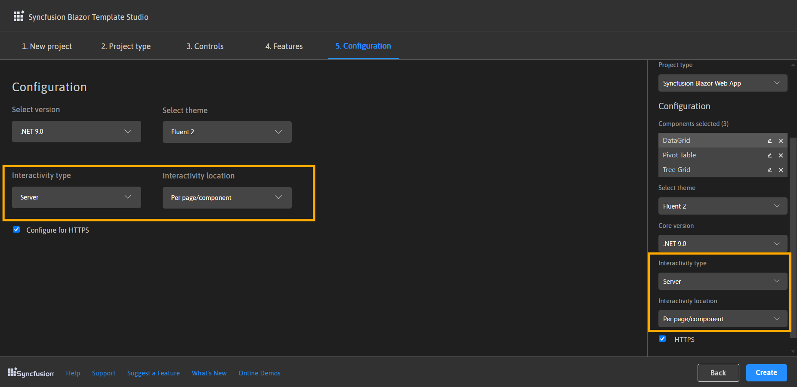
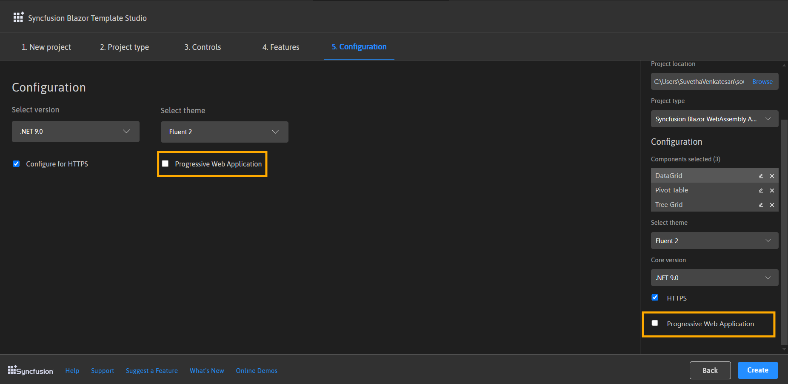
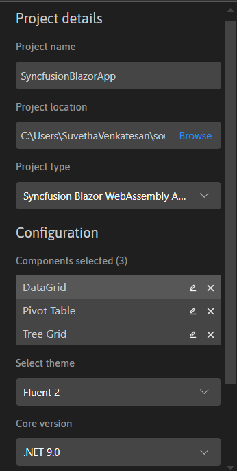

# Creating a Syncfusion® Blazor application

Syncfusion® provides the Blazor Template Studio in Visual Studio Code, which allows you to create a Syncfusion® Blazor application with Syncfusion® components. The Syncfusion® Blazor app is created with the required component Syncfusion® NuGet references, namespaces, styles, and component render code. The Template Studio provides an easy-to-use project wizard that walks you through the process of creating an application with Syncfusion® components.

N> Blazor project templates from `v17.4.0.39` are supported by the Syncfusion® Visual Studio Code project template.

The instructions below assist you in creating **Syncfusion&reg; Blazor Applications** using **Visual Studio Code**:

1. To create a Syncfusion® Blazor application in Visual Studio Code, open the command palette by pressing **Ctrl+Shift+P**. Search for the word **Syncfusion&reg;** in the Visual Studio Code palette to get the templates provided by Syncfusion®.

    

2. Select **Syncfusion&reg; Blazor Template Studio: Launch**, then press **Enter** key. The Template Studio wizard for configuring the Syncfusion® Blazor app will be launched. Provide the Project name and Project path.

    

    N> Refer to the .NET SDK support for Syncfusion® Blazor Components [here](https://blazor.syncfusion.com/documentation/system-requirements#net-sdk).

3. Select either **Next** or the **Project type** tab. Syncfusion® Blazor project types will be displayed. Choose one of the following Syncfusion® Blazor project types based on the version of the .NET SDK you are using.

    | .NET SDK version | Supported Syncfusion&reg; Blazor Application Type |
    | ---------------- | -------------------------------------------- |
    | [.NET 9.0](https://dotnet.microsoft.com/en-us/download/dotnet/9.0), [.NET 8.0](https://dotnet.microsoft.com/en-us/download/dotnet/8.0) | Syncfusion&reg; Blazor Web App |
    | [.NET 9.0](https://dotnet.microsoft.com/en-us/download/dotnet/9.0), [.NET 8.0](https://dotnet.microsoft.com/en-us/download/dotnet/8.0) | Syncfusion&reg; Blazor WebAssembly App |
    
    In the **Syncfusion&reg; Blazor Web App** application type, you can configure the following options:

    <table>
    <tbody>
    <tr>
    <td>
    <a href="https://learn.microsoft.com/en-us/aspnet/core/blazor/components/render-modes?view=aspnetcore-8.0#render-modes">Interactivity type</a>
    </td>
    <td>
    Server, WebAssembly, Auto (Server and WebAssembly)
    </td>
    </tr>
    <tr>
    <td>
    <a href="https://learn.microsoft.com/en-us/aspnet/core/blazor/tooling?view=aspnetcore-8.0&pivots=windows">Interactivity location</a>
    </td>
    <td>
    Global, Per page/component
    </td>
    </tr>
    </tbody>
    </table>

    

     In the **Syncfusion&reg; Blazor WebAssembly App** application type, you can choose Progressive Web Application.

     

4. Click either **Next** or the **Controls** tab and select the Syncfusion Blazor components you want to add to your application.

     

     Choose the required control(s) by clicking the corresponding control box.

     To unselect the added control(s), use either one of the following options:

     **Option 1:** Click the corresponding selected control box.

     **Option 2:** Click ‘x’ button for corresponding control in the control list from **Project Details**.

     N> **Note:** Choose at least one control to enable the Features and Configuration tab.

5. Click either **Next** or the **Features** tab, and you will see the features listed for the selected controls. You can choose the required features.

    

6. Click **Next** or the **Configuration** tab to load the Configuration section. You can choose the required (.NET 9.0 and .NET 8.0), themes, https configuration, localization option, authentication type, Blazor Web App, and Blazor Web Assembly application types.

     Depending on your Syncfusion&reg; Blazor Application Type, refer to the table below for supported authentication types.

     | Syncfusion&reg; Blazor Application Type | Supported Authentication Types |
     | ------------- | ------------- |
     | Syncfusion&reg; Blazor Web App | None and Individual Accounts |
     | Syncfusion&reg; Blazor WebAssembly App | None, Individual Accounts and Microsoft Identity Platform |

     If you choose the **Blazor Web App** application type, you can customize the Interactivity type and Interactivity location options.

     

     If you choose the **Blazor Web Assembly App** application type, you can customize the Progressive Web Application option.

     

     **Project details section**

     You can change the configuration details below in the Project Details section to change the application type, remove control(s) from the selected controls, or change the configurations.

    

7. Click **Create** button. The Syncfusion&reg; Blazor application has been created. The created Syncfusion® Blazor app has the Syncfusion&reg; NuGet packages, styles, and the render code for the selected Syncfusion® component.

    
8. You can run the application to see the Syncfusion® components. Click **F5** or go to **Run>Start Debugging**.

     

9. The Syncfusion® Blazor application configures with most recent Syncfusion® Blazor NuGet packages version, selected style, namespaces, selected authentication, and component render code for Syncfusion® components.

10. If you installed the trial setup or NuGet packages from nuget.org you must register the Syncfusion® license key to your application since Syncfusion® introduced the licensing system from 2018 Volume 2 (v16.2.0.41) Essential Studio® release. Navigate to the [help topic](https://help.syncfusion.com/common/essential-studio/licensing/license-key#how-to-generate-syncfusion-license-key) to generate and register the Syncfusion® license key to your application. Refer to this [UG](https://blazor.syncfusion.com/documentation/getting-started/license-key/overview) topic for understanding the licensing details in Essential Studio® for Blazor.

## Syncfusion® integration

The Syncfusion® Blazor application configures with latest Syncfusion® Blazor NuGet packages, styles, namespaces, and component render code for Syncfusion® components are added in the created application.

### NuGet Packages

The `Syncfusion.Blazor` NuGet package will be added as NuGet references for all application types.

### Style

The selected theme is added from Syncfusion® NuGet and its reference at these applications locations in Blazor.

| Application type  | File location  |
|---|---|
| Syncfusion&reg; Blazor Web App | ~/Components/App.razor |
| Syncfusion&reg; Blazor WebAssembly App (ASPNET Core hosted)   Syncfusion&reg; Blazor WebAssembly App (Progressive Web Application) | {Client Project location}/wwwroot/index.html  |
| Syncfusion&reg; Blazor WebAssembly App  | {Project location}/wwwroot/index.html|

### Namespaces

The Syncfusion® Blazor namespaces are added in the **`_imports.razor`** file.

### Component render code

The Syncfusion® Blazor Calendar, Button, and DataGrid component render code is in the Razor files in the pages folder. The render code is updated in these Razor files.

| File name  | Code snippet added |
|---|---|
| `~/Pages/Home.razor or Index.razor`  |  |
| `~/Pages/Counter.razor` |  |
| `~/Pages/FetchData.razor`  |  |