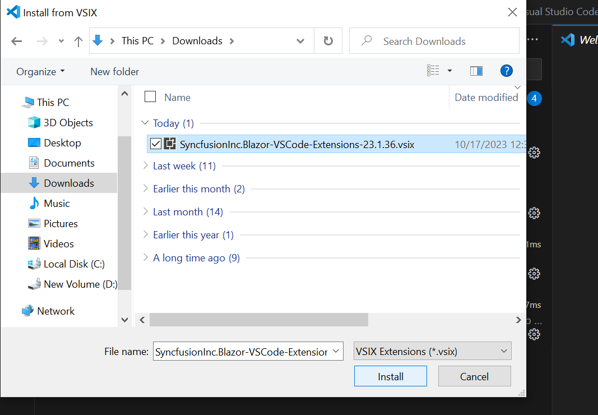

# Download and Installation in VS Code Extension

Syncfusion&reg; publishes the Visual Studio Code extension in the [Visual Studio Code Marketplace](https://marketplace.visualstudio.com/items?itemName=SyncfusionInc.Blazor-VSCode-Extensions). Install it directly from Visual Studio Code or download it from the Marketplace and install locally.

## Prerequisites

Install the following prerequisites to install the Syncfusion&reg; Blazor extension and to create, convert, and upgrade Syncfusion&reg; Blazor applications.

- [Visual Studio Code 1.29.0 or later](https://code.visualstudio.com/download)
- [Visual Studio 2022 ](https://visualstudio.microsoft.com/vs/) or later
- [.NET SDK 8.0 or 9.0](https://dotnet.microsoft.com/en-us/download)
- [C# extension]((https://marketplace.visualstudio.com/items?itemName=ms-dotnettools.csharp)).

## Install through the Visual Studio Code Extensions

The steps below describe how to install the Syncfusion&reg; Blazor extension from the Extensions view in Visual Studio Code.

1. Open Visual Studio Code.
2. Navigate to **View > Extensions**, and the Manage Extensions option will appear on the left side of the window.
3. In the search box, enter Syncfusion Blazor to find the Syncfusion Blazor extension in the Marketplace.

     

4. Select **Blazor VSCode Extensions - Syncfusion**, and click **Install**.
5. Reload Visual Studio Code after installation by using the **Reload Window** command from the Command Palette. Open the Command Palette with **Ctrl+Shift+P**, then run Reload Window.

     

6. Now, you can create a new Syncfusion® Blazor application by using the Syncfusion® Blazor extensions from the Visual Studio Code Palette Find the **Syncfusion&reg; Blazor Template Studio: Launch** from Visual Studio Code commands to open the Syncfusion&reg; Blazor Template Studio wizard.

     

## Install from the Visual Studio Code Marketplace

The steps below describe how to download and install the extension from the Visual Studio Code Marketplace website.

1. Open the [Syncfusion&reg; Blazor VS Code Extensions](https://marketplace.visualstudio.com/items?itemName=SyncfusionInc.Blazor-VSCode-Extensions) page in the Marketplace.
2. Click Install from Visual Studio Code Marketplace. The browser displays a popup window with information such as **"Open Visual Studio Code"**. When you click Open Visual Studio Code, the [Syncfusion® Blazor Extension](https://marketplace.visualstudio.com/items?itemName=SyncfusionInc.Blazor-VSCode-Extensions) will launch in Visual Studio Code.
3. In Visual Studio Code, click **Install** on the **Blazor VSCode Extensions - Syncfusion** page.
4. Reload Visual Studio Code after installation by using the **Reload Window** command from the Command Palette. Open the Command Palette with **Ctrl+Shift+P**, then run Reload Window.

     

5. Now, you can create a new Syncfusion® Blazor application by using the Syncfusion® Blazor extensions from the Visual Studio Code Palette Find the **Syncfusion&reg; Blazor Template Studio: Launch** from Visual Studio Code commands to open the Syncfusion&reg; Blazor Template Studio wizard.

     

## Manually Installing an Extension in Visual Studio Code

The steps below describe how to install the Syncfusion Blazor extension manually in Visual Studio Code.

1. Download the SyncfusionInc.Blazor-VSCode-Extensions.vsix file from the [Visual Studio Code Marketplace](https://marketplace.visualstudio.com/items?itemName=SyncfusionInc.Blazor-VSCode-Extensions).
2. In Visual Studio Code, open the Extensions view by clicking the Extensions icon in the Activity Bar.

      

3. Click the More Actions (ellipsis) button in the top-right of the Extensions view, and select Install from VSIX.

      

4. Browse to the downloaded SyncfusionInc.Blazor-VSCode-Extensions.vsix file and complete the installation.

      