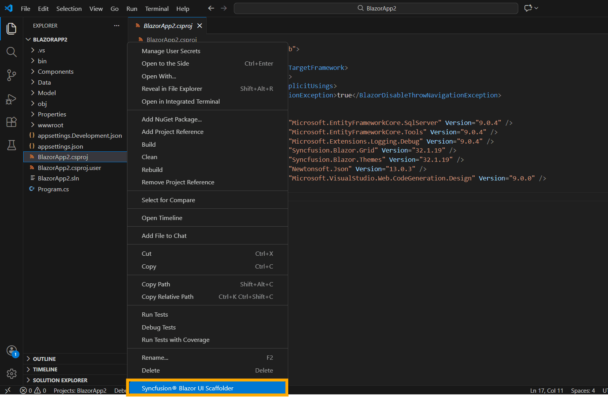
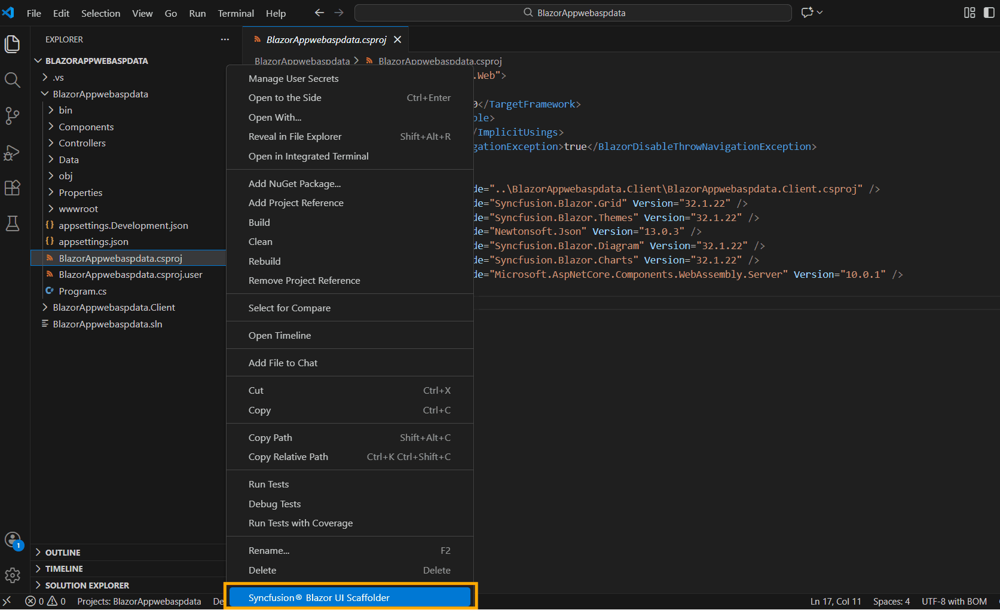
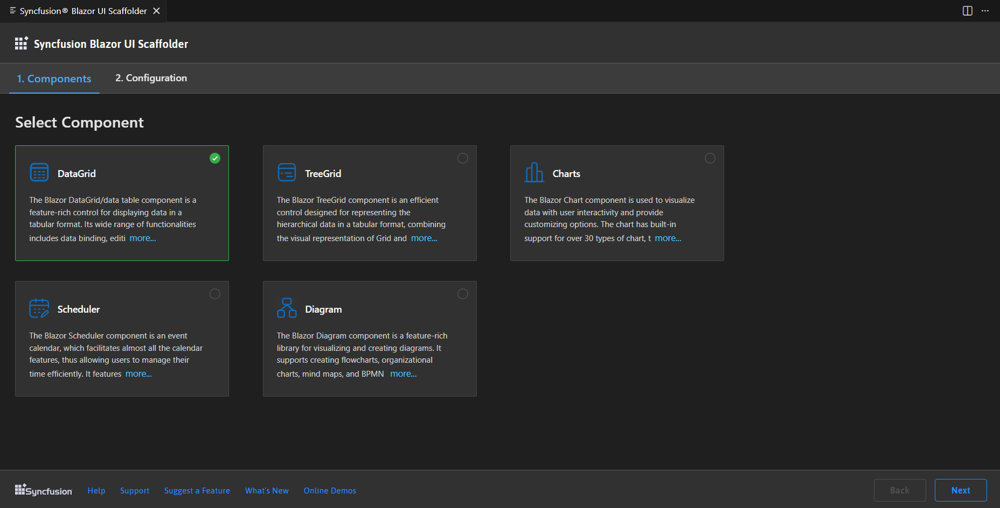
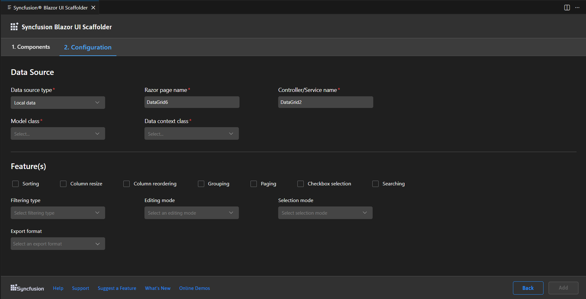
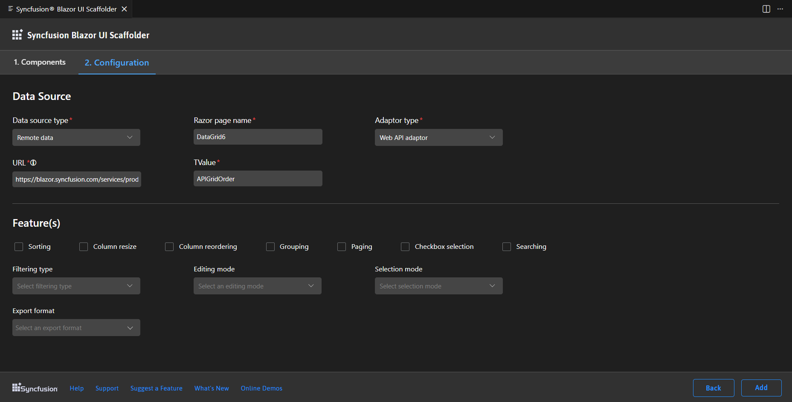
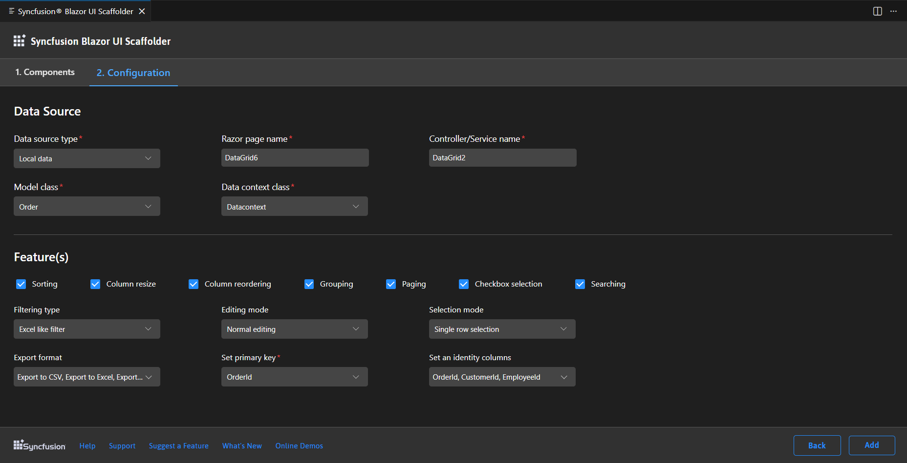
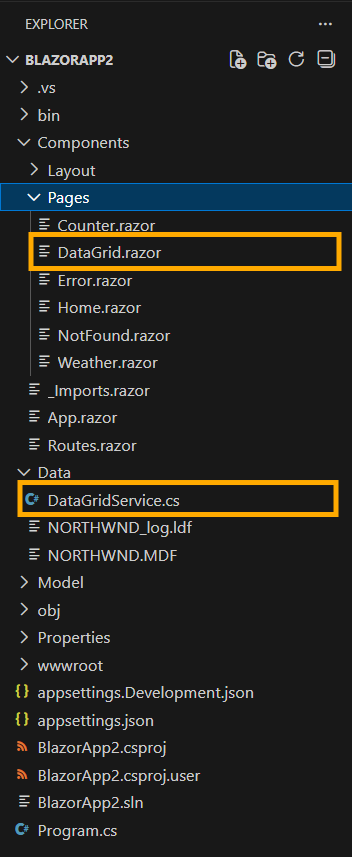
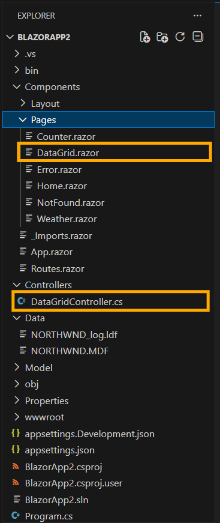
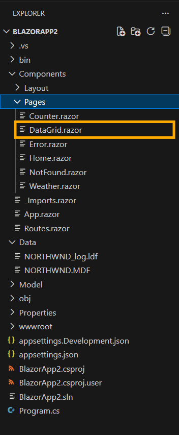

# Syncfusion® Blazor Scaffolder

Syncfusion® provides **Blazor UI Scaffolder** in Visual Studio Code for Blazor applications, allowing you to quickly add code that interacts with data models, reducing the time required for developing data operations in your application. Scaffolding simplifies the creation of Razor pages and Controller action methods for Syncfusion® Blazor controls such as **DataGrid, Tree Grid, Charts, Scheduler and Diagram**.
The scaffolding UI allows you to select the type of data source binding, Syncfusion® component features and data fields for a selected control, significantly reducing the time required to develop standard operations.

N> Check that at least one Entity Framework model exists, and the application has been compiled once. If no Entity Framework model exists in your application, refer to this [documentation](https://www.freecodecamp.org/news/how-to-create-an-application-using-blazor-and-entity-framework-core-1c1679d87c7e/) to generate the Entity Framework model. After the model file has been added, check that the required DBContext and properties are added. Now, build the application, and try scaffolding. If any changes made in the model properties, rebuild the application once before perform scaffolding.

N> The Syncfusion® Blazor Scaffolder is available from `v17.4.0.39`

## Add a scaffolded item

The steps below assist you to how to add a scaffolded item to your Blazor application.

N> Before use the Syncfusion® Blazor Scaffolder, check whether the **Syncfusion® Blazor Scaffolder Extension** installed or not in Visual Studio Extension Manager by clicking on the Extensions -> Manage Extensions -> Installed. If this extension not installed, install the extension by follow the steps from the [download and installation](download-and-installation) help topic.

1. If the application type is **Blazor ServerSide**, In the File Explorer section right click the project's **.csproj** file and then click **Syncfusion® Blazor UI Scaffolder**.

    

    If the application type is **Blazor Hosted**, right-click the **.csproj** file from **{Project Name}.Server** application in the File Explorer, click **Syncfusion® Blazor UI Scaffolder**.

    

2. Syncfusion® Blazor Scaffolder UI will be launched, select the desired control to perform scaffolding, and then click **Next**.

    

3. The Configurations for the selected control will be displayed in the configurations Tab. As per the application requirements, follow these steps to set up your application.

    **Select Data Source Type**
    
    1. Local Data (default selection)

        To set up your application with local data, first enter the **Controller/Service name** and then enter the **Razor page name**. Next, select the required **Model class** for the active application and choose the relevant **Data context class**.

        

    2. Remote Data

        To set up your application with remote data, first enter the **Razor page name**, choose the **Adaptor type**, and then enter the valid **URL**. Next, enter the **TValue**.

        N> In the DataGrid and TreeGrid controls, when selecting the **URL adaptor** in the **Adaptor type**, an additional **Remote service** option will appear. You need to select either the **Localhost URL** or **API URL**. If you select the Localhost URL, enter the **Controller/Service** name. Then, select the required Model class for the active application and choose the relevant **Data context class**. If you select the **API URL**, enter the valid **URL**. Next, enter the **TValue**.

        

        When using adaptor types in Blazor scaffolding, it's important to note that we provide default adaptor links for sample purposes only. These default links are intended to help you understand how the adaptors work, but they do not perform CRUD (Add, Edit, Update, Delete) operations. Instead, these default links act as placeholders to demonstrate the integration process.

        If you wish to perform CRUD operations, you need to provide a valid link that handles these operations. This link should point to an endpoint or service capable of managing the database operations required by your application. By providing this link, you ensure that your application can effectively interact with the back-end service to perform CRUD operations.

4. In the Syncfusion® Blazor Scaffolder, Choose the required features, update the necessary data fields, and then click **Add**.

    

5. With the selected features of the Syncfusion control, the **Controller/Service** file and the corresponding **Razor** files are generated.

    If you select **Local Data**, the service file and razor file will be added to the application.

    

    If you select **Remote Data with Localhost URL**, the controller file and razor file will be added to the application.

    

    If you choose **Remote Data with Web API adaptor types**, the razor file will be added to the application.

    

6. Then, add navigation to the created razor file based on your requirement to open on the webpage.

7. If you installed the trial setup or NuGet packages from nuget.org you must register the Syncfusion® license key to your application since Syncfusion® introduced the licensing system from 2018 Volume 2 (v16.2.0.41) Essential Studio® release. Navigate to the [help topic](https://help.syncfusion.com/common/essential-studio/licensing/overview#how-to-generate-syncfusion-license-key) to generate and register the Syncfusion® license key to your application. Refer to this [blog](https://www.syncfusion.com/blogs/post/whats-new-in-2018-volume-2.aspx?_ga=2.11237684.1233358434.1587355730-230058891.1567654773) post for understanding the licensing changes introduced in Essential Studio®.