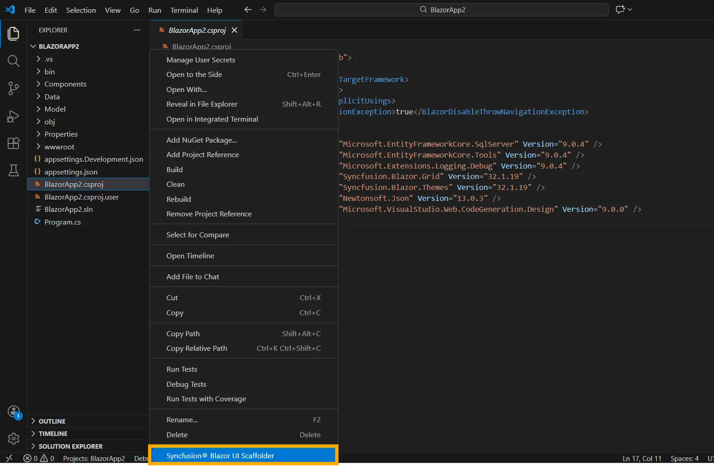
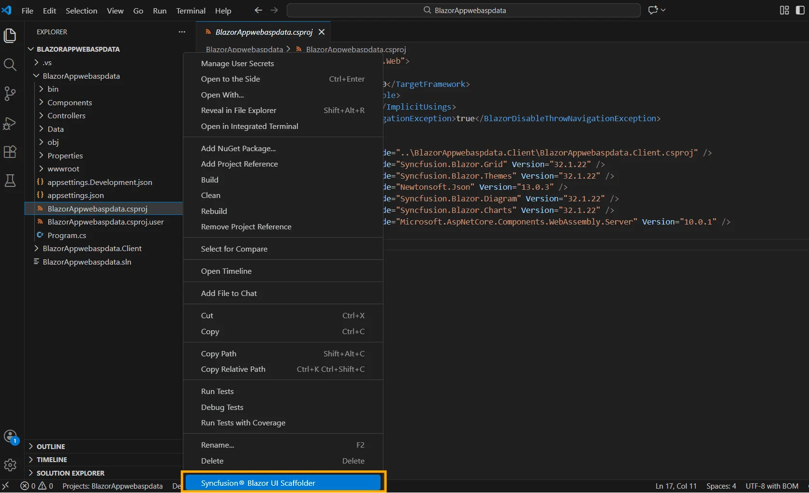
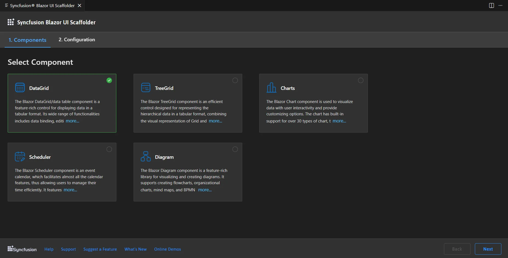
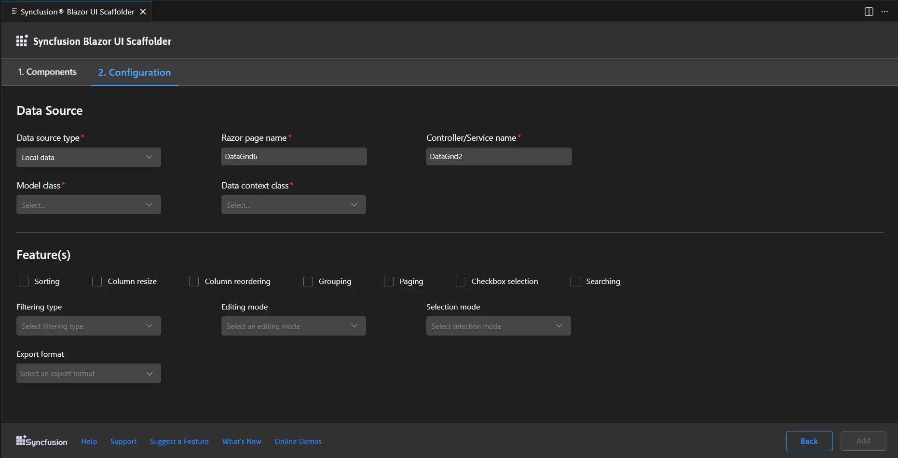
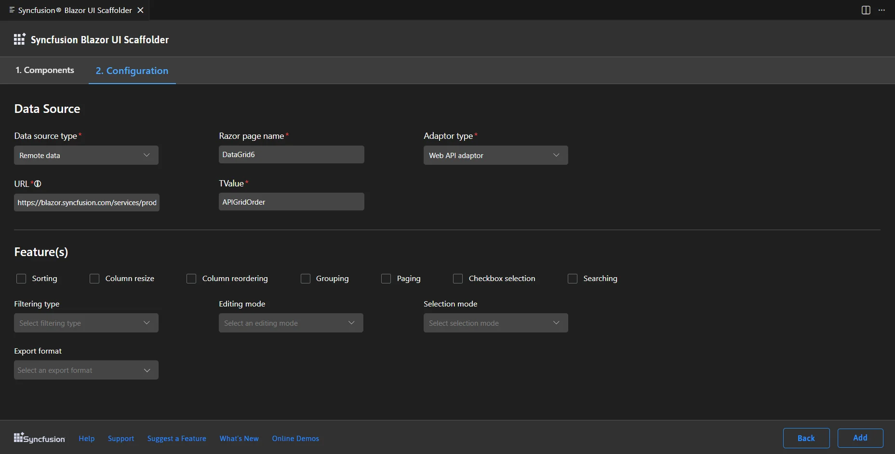
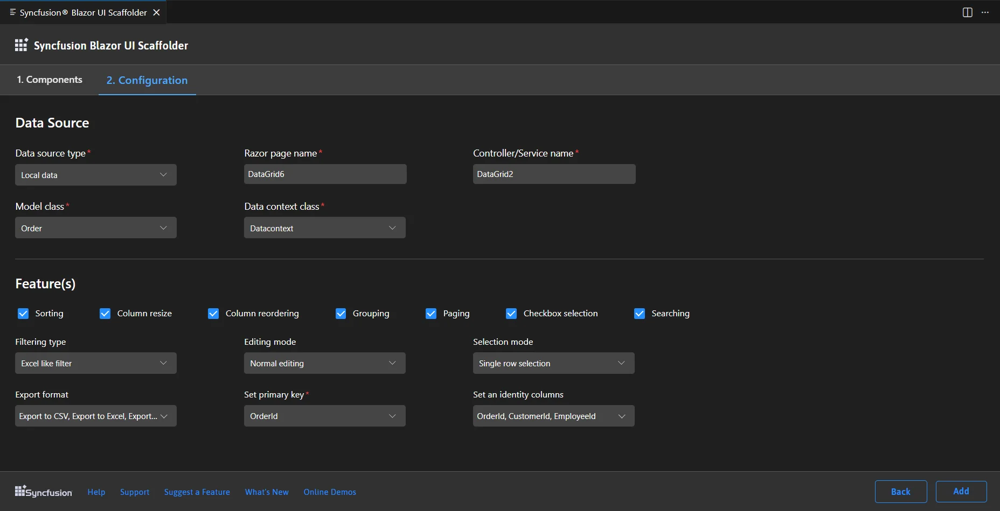
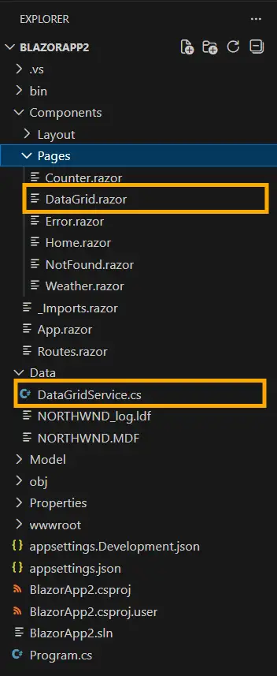
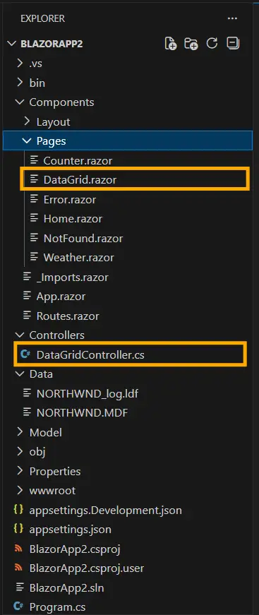
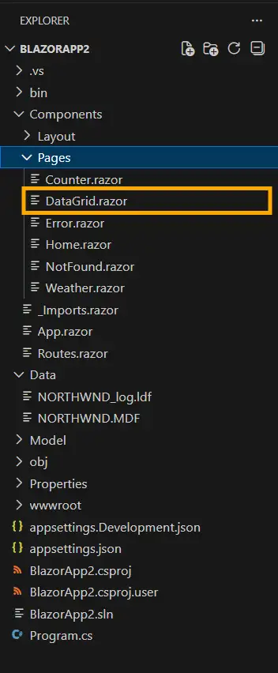

# Syncfusion® Blazor Scaffolder

The Syncfusion® Blazor Scaffolder in Visual Studio Code helps you generate Razor pages and controller/service code that interact with your data models. It accelerates common data workflows for controls like DataGrid, TreeGrid, Charts, Scheduler, and Diagram by scaffolding CRUD-ready files and UI markup.

N> Check that at least one Entity Framework model exists, and the application has been compiled once. If no Entity Framework model exists in your application, refer to this [documentation](https://www.freecodecamp.org/news/how-to-create-an-application-using-blazor-and-entity-framework-core-1c1679d87c7e/) to generate the Entity Framework model. After the model file has been added, check that the required DBContext and properties are added. Now, build the application, and try scaffolding. If any changes made in the model properties, rebuild the application once before perform scaffolding.

N> The Syncfusion® Blazor Scaffolder is available from `v32.2.3`

## Add a scaffolded item

Before starting, confirm the **Syncfusion Blazor Scaffolder Extension** is installed (Extensions -> Manage Extensions -> Installed). If not installed, follow the steps in the [download and installation](download-and-installation) help topic.

1. In Solution Explorer, right-click the project `.csproj` you want to scaffold and choose **Syncfusion® Blazor UI Scaffolder**.

    For Blazor Server: right-click the app project `.csproj`.

    

    For Blazor Hosted: right-click the `{ProjectName}.Server` `.csproj`.

    

2. The Scaffolder UI launches. Select the target control and click **Next**.

    

3. Configure the control and data source.

    Select Data Source Type:

    - Local Data (default): Enter the **Controller/Service name**, **Razor page name**, pick the **Model class**, and choose the **DbContext**.

      

    - Remote Data: Enter the **Razor page name**, choose the **Adaptor type**, provide the **URL**, and set the `TValue`.

      - For DataGrid/TreeGrid using the **URL adaptor**, choose between **Localhost URL** (requires a Controller/Service name and model/DbContext) or **API URL** (use a valid API endpoint).

        

      Note: Example adaptor links in the UI are placeholders for demonstration and do not perform full CRUD. To enable real CRUD operations, supply a valid back-end endpoint that supports the required operations.

4. On the features screen, choose the control features and map data fields as needed, then click **Add**.

    

5. Scaffolding will generate the Controller/Service and Razor files according to your selections:

    - Local Data: Adds service and Razor files.

      

    - Remote Data (Localhost URL): Adds controller and Razor files.

      

    - Remote Data (API adaptor): Adds Razor files integrated with the chosen adaptor.

      

6. Add a navigation entry to your app to access the newly created Razor page.

7. If you installed the trial setup or NuGet packages from nuget.org you must register the Syncfusion® license key to your application since Syncfusion® introduced the licensing system from 2018 Volume 2 (v16.2.0.41) Essential Studio® release. Navigate to the [help topic](https://help.syncfusion.com/common/essential-studio/licensing/overview#how-to-generate-syncfusion-license-key) to generate and register the Syncfusion® license key to your application. Refer to this [blog](https://www.syncfusion.com/blogs/post/whats-new-in-2018-volume-2.aspx?_ga=2.11237684.1233358434.1587355730-230058891.1567654773) post for understanding the licensing changes introduced in Essential Studio®.