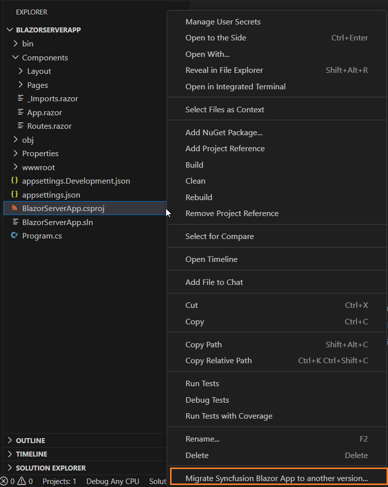
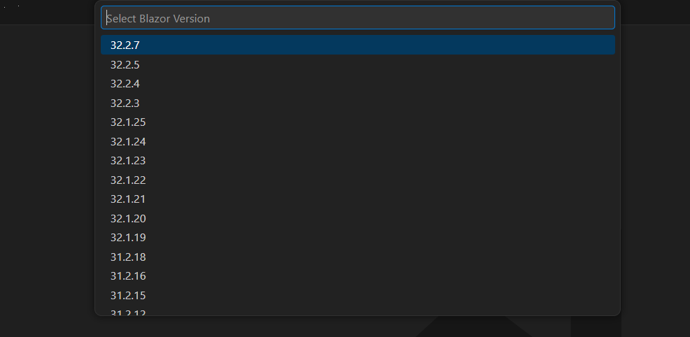

# Upgrading Syncfusion® Blazor application to latest version

The Syncfusion&reg; Blazor migration add-in for Visual Studio Code enables upgrading an existing Syncfusion&reg; Blazor web application from one Essential Studio&reg; version to another.

N> The Syncfusion Blazor Web Application project migration utility is available from version `v17.4.0.39`.

Use the following steps to migrate an existing Syncfusion&reg; Blazor Web Application.

1. In Visual Studio Code, open an existing Syncfusion&reg; Blazor Web Application or create a new one.

2. In Explorer (Workspace), right-click the project file and select **Migrate Syncfusion® Blazor Application to another version...** from the context menu. Refer to the screenshot below.

    

    N> The Migration option is available only when the application already references Syncfusion&reg; Blazor packages.

3. From the Command Palette, choose **Select Blazor Version** and pick the required Syncfusion&reg; Blazor package version published on `nuget.org`.

    

4. The Syncfusion&reg; Blazor NuGet package references and theme links are updated to the selected version in the application.

    

    

5. If you installed the trial setup or NuGet packages from nuget.org you must register the Syncfusion® license key to your application since Syncfusion® introduced the licensing system from 2018 Volume 2 (v16.2.0.41) Essential Studio® release. Navigate to the [help topic](https://help.syncfusion.com/common/essential-studio/licensing/overview#how-to-generate-syncfusion-license-key) to generate and register the Syncfusion® license key to your application. Refer to this [UG](https://blazor.syncfusion.com/documentation/getting-started/license-key/overview) topic for understanding the licensing details in Essential Studio® for Blazor.