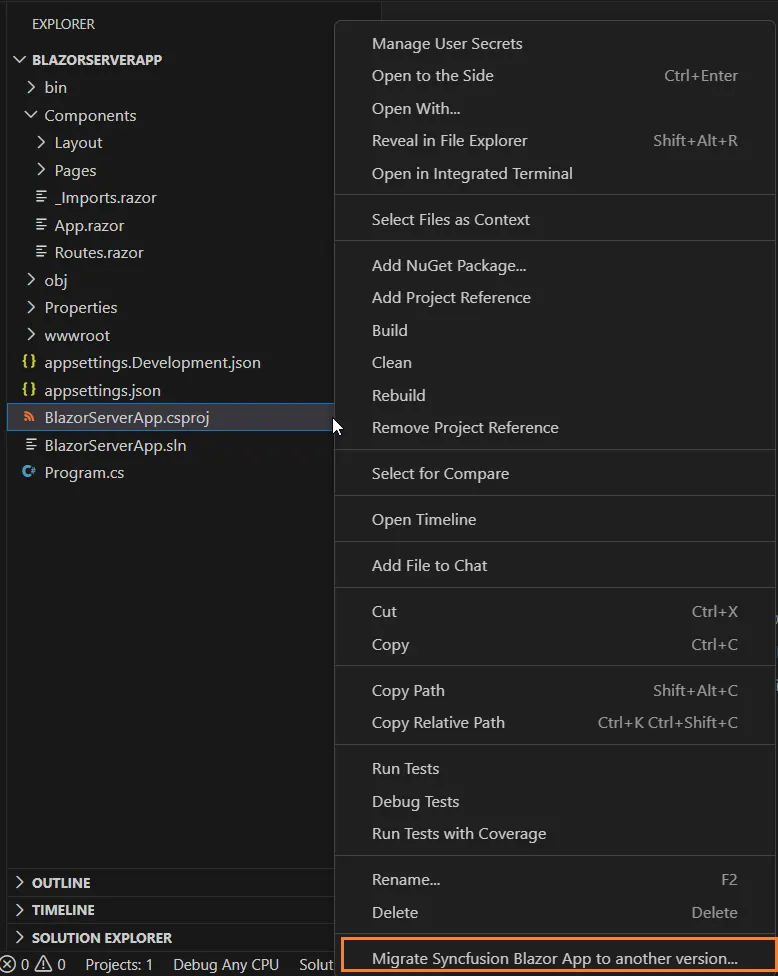

# Upgrade a Project to the latest Syncfusion® Version

The Syncfusion&reg; Blazor migration extension for Visual Studio Code enables upgrading an existing Syncfusion&reg; Blazor application to a newer Essential Studio&reg; release by updating NuGet package references and theme links automatically.

## Steps to migrate the project

1. in Visual Studio Code, open an existing Syncfusion&reg; Blazor application or create a new Blazor application.

   Supported application types:
   - Blazor Web App (Server or WebAssembly rendering)
   - Blazor Server App
   - Blazor WebAssembly App (standalone or ASP.NET Core hosted)
   - Blazor WebAssembly App (Progressive Web Application)

2. In the Explorer panel, right-click the project file (`.csproj`) and select **Migrate Syncfusion Blazor Application to another version** from the context menu.

    

    N> The Migration option becomes available only after the project references the Syncfusion&reg; Blazor NuGet packages.

3. In the Command Palette, select **Select Blazor Version** and choose the desired Syncfusion&reg; Blazor version from the list (displays versions available on `nuget.org`).

    

4. After conversion completes, the Syncfusion&reg; Blazor NuGet package references is updated to the selected version in the application.

    

5. If the trial setup or NuGet packages from `nuget.org`, register the Syncfusion® license key in the application. Syncfusion® introduced the licensing system in the 2018 Volume 2 (v16.2.0.41) Essential Studio® release. Navigate to the [help topic](https://help.syncfusion.com/common/essential-studio/licensing/overview#how-to-generate-syncfusion-license-key) to generate and register the Syncfusion® license key to the application. Refer to this [UG](https://blazor.syncfusion.com/documentation/getting-started/license-key/overview) topic for understanding the licensing details in Essential Studio® for Blazor.