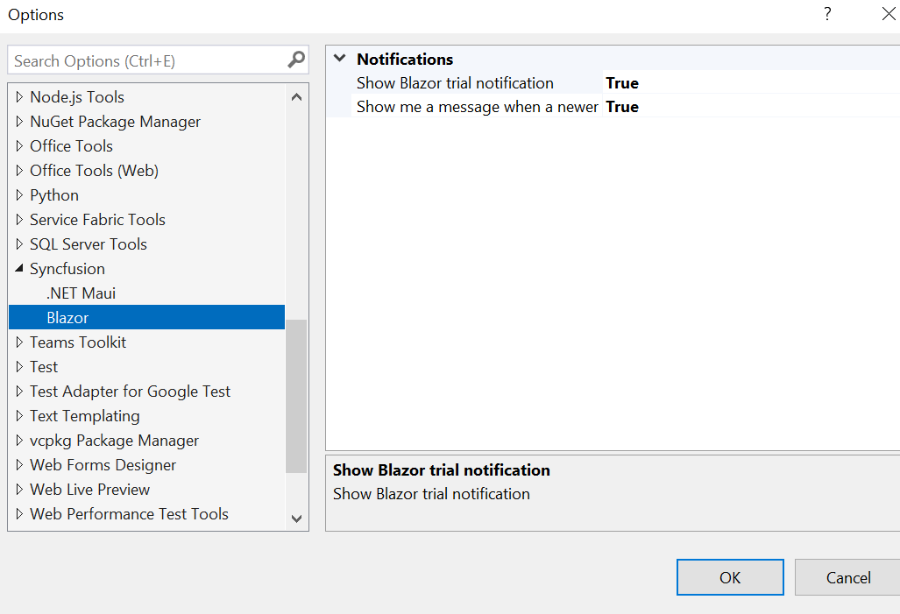
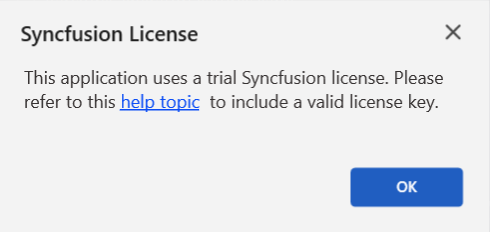
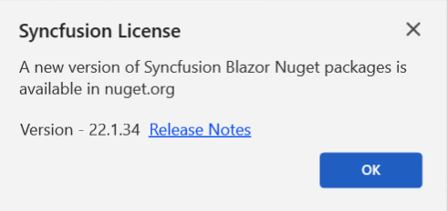
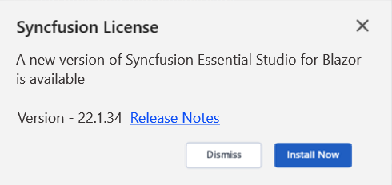
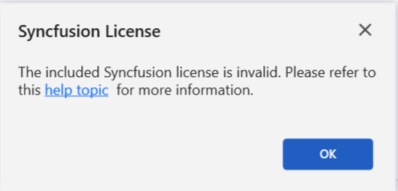

# Syncfusion® notifications

Syncfusion® enhances the user experience in Blazor applications through notification messages. These notifications cover various aspects, including alerts for trial applications when using Syncfusion® trial assemblies, updates about the availability of the latest Syncfusion&reg; NuGet package, and notifications about newer releases of Essential Studio®. By keeping users informed, Syncfusion® ensures that developers stay up to date with the latest features and enhancements.

N> The Syncfusion® notifications feature is available starting with Essential Studio® v22.1.34.

## Notification configuration

Notification behavior is configured in Visual Studio on the Syncfusion® Options page. Use the toggles to true or false trial and newer version notifications.

To access the settings, go to **Tools -> Options -> Syncfusion -> Blazor**.

   

## Notification types

**1. Syncfusion® trial application notification**

When trial licensing is detected in a Blazor application, a message is shown: **This application uses a trial Syncfusion&reg; license.** This notification encourages you to obtain a valid license key, enabling you to fully explore and experience the extensive features and capabilities offered by Syncfusion®.

   

**2. Newer Syncfusion&reg; NuGet package notification**

If older Syncfusion&reg; NuGet packages are referenced, a notification indicates that newer versions are available on NuGet.org. Upgrading provides access to new features, performance improvements, and bug fixes.

   

**3. Newer Essential Studio® build notification**

When using older Essential Studio® assemblies or NuGet packages, a notification announces the availability of a newer Essential Studio® build for Blazor. Updating to the newest version ensures access to recent features, enhancements, and important updates, maximizing the capabilities of Syncfusion® in your Blazor development projects.

   

**4. Invalid license key notification**

If you have mistakenly used an incorrect license key or a license from another version or platform in your Blazor application, Syncfusion® will display a notification message stating, **The provided Syncfusion&reg; license key is invalid**. This message serves as a reminder to obtain a valid license key and ensure proper licensing for Syncfusion&reg; components.

   

  

