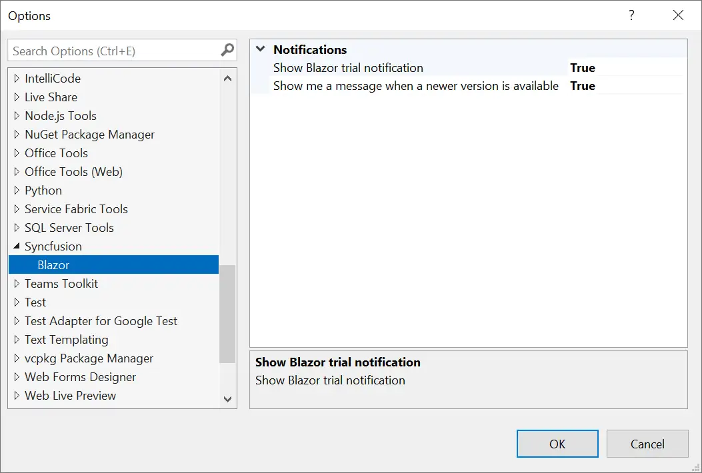
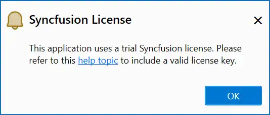
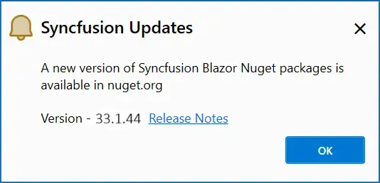
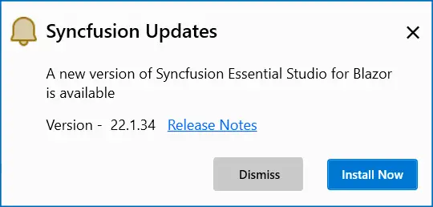
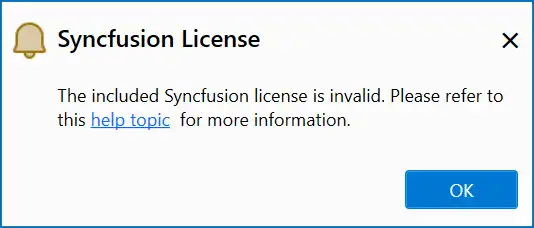

# Syncfusion® notifications

Syncfusion® enhances the user experience in Blazor applications through notification messages. These notifications cover various aspects, including alerts for trial applications when using Syncfusion® trial assemblies, updates about the availability of the latest Syncfusion<sup style="font-size:70%">&reg;</sup> NuGet packages, and notifications about newer releases of Essential Studio®. By keeping users informed, Syncfusion® ensures that developers stay up to date with the latest features and enhancements.

N> The Syncfusion® notifications feature is available starting with Essential Studio® v22.1.34.

## Notification configuration

Notification behavior is configured in Visual Studio on the Syncfusion® Options page.

1. In Visual Studio, go to **Tools → Options → Syncfusion → Blazor**.

   

2. Use the toggles to enable or disable the trial and newer version notifications. The available toggles and their default values are:

   | Toggle | Default | Description |
   |--------|---------|-------------|
   | Show trial application notification | Enabled | Displays an in-app banner when the project uses a trial Syncfusion® license. |
   | Show newer NuGet package notification | Enabled | Displays a notification when newer Syncfusion® Blazor NuGet packages are available on NuGet.org. |
   | Show newer Essential Studio® build notification | Enabled | Displays a notification when a newer Essential Studio® build is available for Blazor. |

3. Click **OK** to save the changes. Rebuild the project for the changes to take effect.

## Notification types

### 1. Syncfusion® trial application notification

When trial licensing is detected in a Blazor application, an in-app banner is shown: **This application uses a trial Syncfusion<sup style="font-size:70%">&reg;</sup> license.** This notification encourages you to obtain a valid license key, enabling you to fully explore the features and capabilities offered by Syncfusion®.

   

To obtain a valid license key, see the [Syncfusion® licensing help topic](https://help.syncfusion.com/common/essential-studio/licensing/overview#how-to-generate-syncfusion-license-key).

### 2. Newer Syncfusion<sup style="font-size:70%">&reg;</sup> NuGet package notification

If older Syncfusion<sup style="font-size:70%">&reg;</sup> NuGet packages are referenced, a notification in the Visual Studio Error List indicates that newer versions are available on NuGet.org. Upgrade to the latest packages to access new features, performance improvements, and bug fixes.

   

To update the packages, right-click the project in Solution Explorer and choose **Manage NuGet Packages**, then select the **Updates** tab.

### 3. Newer Essential Studio® build notification

When using older Essential Studio® assemblies or NuGet packages, a notification in the Visual Studio Error List announces the availability of a newer Essential Studio® build for Blazor. Update to the newest version to access recent features, enhancements, and important updates, maximizing the capabilities of Syncfusion® in your Blazor development projects.

   

### 4. Invalid license key notification

If you have used an incorrect license key or a license from another version or platform in your Blazor application, Syncfusion® displays a notification message: **The provided Syncfusion<sup style="font-size:70%">&reg;</sup> license key is invalid**. This message serves as a reminder to obtain a valid license key and ensure proper licensing for Syncfusion<sup style="font-size:70%">&reg;</sup> components.

   

## Disable notifications globally

If your organization needs to disable notifications across all developers, set the following registry key (Windows) to `1` to suppress Syncfusion® notifications:

```
HKCU\Software\Syncfusion\SyncfusionNotification\Disabled = 1
```

Restart Visual Studio for the change to take effect. To re-enable notifications, delete the value or set it to `0`.

## Troubleshooting

- **Notifications do not appear**: Verify the toggles in **Tools → Options → Syncfusion → Blazor** are enabled, then rebuild the project.
- **Trial notification appears after registering a license**: Confirm that the license key is registered in `Program.cs` (`Syncfusion.Licensing.SyncfusionLicenseProvider.RegisterLicense("your-key")`) and rebuild.
- **Invalid license key notification persists**: Confirm that the license key matches the version and platform of the Syncfusion® Blazor NuGet package referenced by the project.

## See also

- [Syncfusion® licensing overview](https://help.syncfusion.com/common/essential-studio/licensing/overview)
- [Template Studio](template-studio)

  


