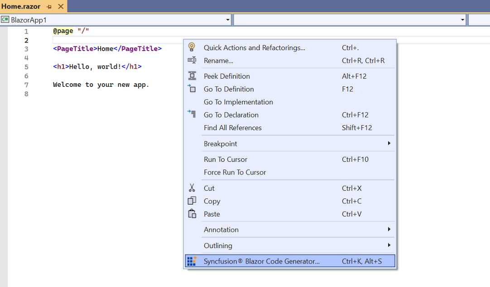
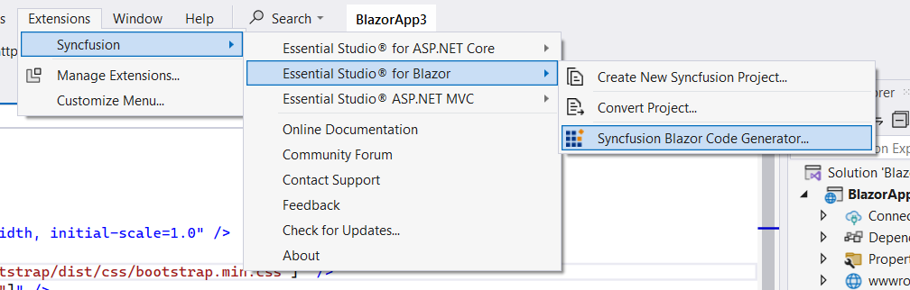
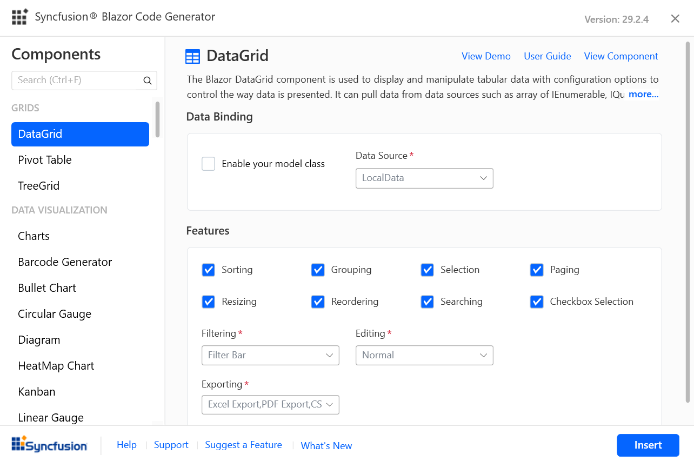
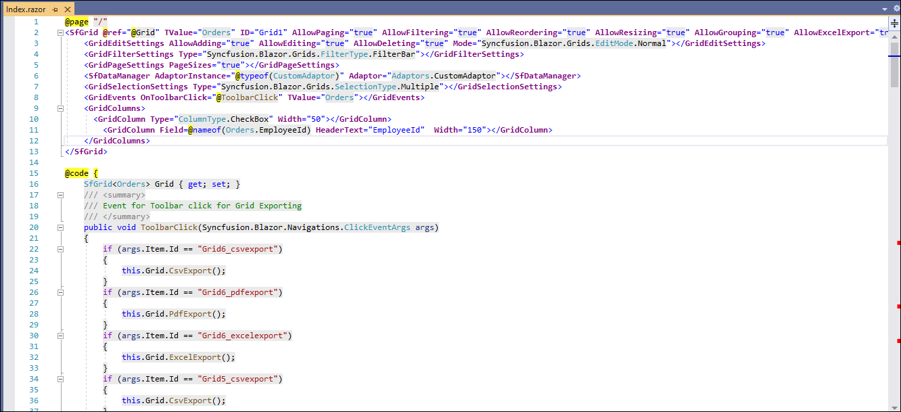

# Add Syncfusion® Blazor component code

Syncfusion® provides a Code Generator component for the Blazor platform, allowing you to quickly insert component code into the desired location within a Razor file. The Syncfusion® extension automatically adds the necessary Syncfusion® components along with the required namespaces, styles, and NuGet references. The Code Generator is a simple wizard that interacts with data models and integrates Syncfusion® components with the required features into your application.

Use the following steps to add Syncfusion&reg; components to a Blazor application in **Visual Studio 2022**:

N> Before using the Syncfusion&reg; Blazor Code Generator, verify that the Syncfusion&reg; Blazor extension is installed in Visual Studio (Extensions -> Manage Extensions -> Installed). If it is not installed, follow the steps in the [download and installation](download-and-installation) topic.

1. Open an existing Blazor application or create a new one in Visual Studio 2022.

2. To open the Syncfusion&reg; Blazor Code Generator wizard from a Razor file, use one of the following options:

    **Option 1:**

    To generate a specific component code, right-click in the Razor editor at the desired line and select **Syncfusion&reg; Blazor Code Generator...**

    

    **Option 2:**

    Place the cursor at the required line in the .razor file, then choose **Extensions -> Syncfusion -> Essential Studio for Blazor -> Syncfusion Blazor Code Generator…** from the Visual Studio menu.

    

3. The Syncfusion&reg; Blazor Code Generator wizard opens. Choose the required component.

    

    **Data Binding:** Data operation fields will be visible if the selected component has data. The data will be listed from your application. It interacts with data models and reduces the amount of time spent developing your application. You can choose the required Data Model Class, Data Source, Id, and more from your application.

    **Features:** Lists available features for the selected component. Choose the required options.

    **Component requirements:** Contains the required inputs for the selected component. Provide values to complete the generated markup. You can provide the required value for those fields to add the component code.

    Click **Insert** to generate the selected component render mode and insert it at the cursor location.

    

4. In the Output window, select **Syncfusion Blazor Code Generator** from the **Show output from** list to review the changes applied to the application.

    

5. The selected Syncfusion® Blazor component code is inserted into the active Razor file, and the application is configured with the latest NuGet package, styles, and namespaces required for the selected component.

6. If you have installed the trial setup or NuGet packages from nuget.org, you must register the Syncfusion® license key to your application as Syncfusion® has introduced the licensing system from 2018 Volume 2 (v16.2.0.41) Essential Studio® release. Navigate to the [help topic](https://help.syncfusion.com/common/essential-studio/licensing/overview#how-to-generate-syncfusion-license-key) to generate and register the Syncfusion® license key to your application. Refer to this [blog](https://www.syncfusion.com/blogs/post/whats-new-in-2018-volume-2) post to know more about the licensing changes introduced in Essential Studio®.
