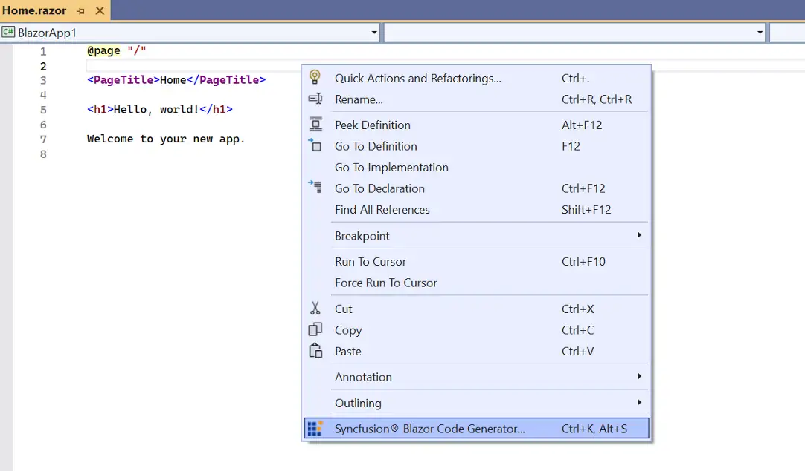
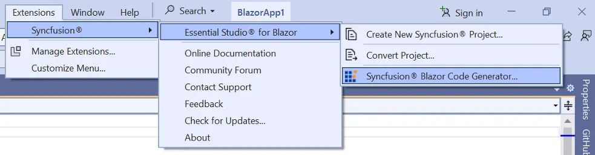
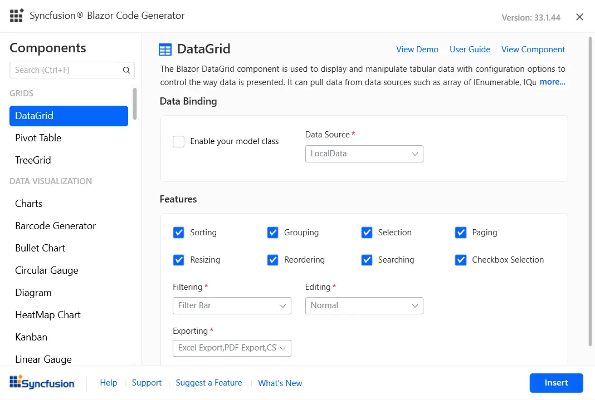
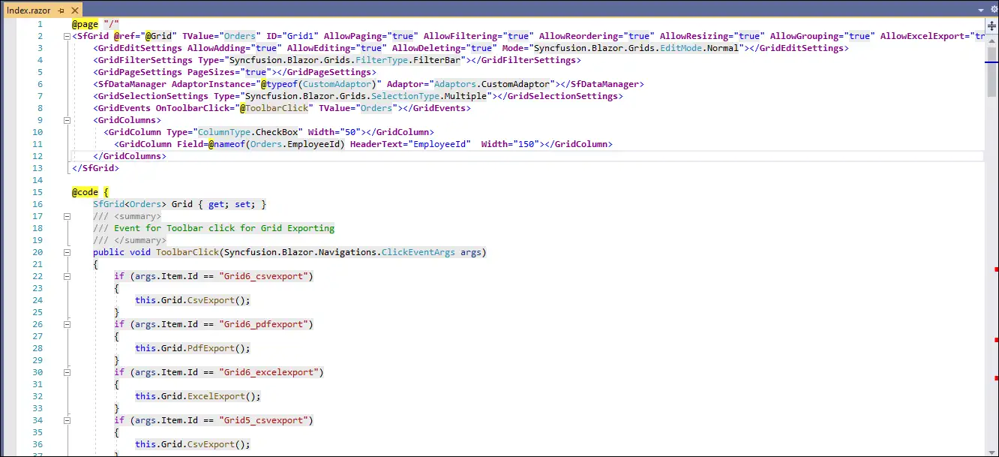
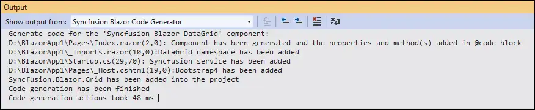

# Add Syncfusion® Blazor component code

This topic explains how to use the Syncfusion® Blazor Code Generator to insert component markup into a Razor file and automatically configure the project with required packages, styles, and namespaces. The Code Generator is a wizard that reads your project's data models and inserts ready-to-use component markup.

N> Ensure the Syncfusion&reg; Blazor extension is installed in Visual Studio (Extensions → Manage Extensions → Installed). If it is not installed, follow the steps in the [download and installation](download-and-installation) topic.

Steps

1. Open your Blazor application or create a new one in Visual Studio.

2. Open the Syncfusion&reg; Blazor Code Generator from a Razor file using one of these options:

    Option 1 — Editor context menu

    - Right-click at the insertion point in the Razor editor and choose **Syncfusion&reg; Blazor Code Generator...**

        

    Option 2 — Visual Studio menu

    - Place the cursor in the .razor file, then choose **Extensions → Syncfusion → Essential Studio for Blazor → Syncfusion Blazor Code Generator…**

        

3. In the Code Generator wizard, select the component you want to add.

    - Data Binding: If the component supports data, the wizard lists models and data sources from your project so you can bind quickly.
    - Features: Choose the features you need for the component.
    - Component requirements: Provide any required inputs to complete the generated markup.
    
    

    Click **Insert** to add the generated markup at the cursor location.

    

4. Review the changes in the Visual Studio Output window. Select **Syncfusion Blazor Code Generator** from the **Show output from** list.The Code Generator will insert component markup into the active Razor file and add or update NuGet package references, required styles, and using statements.

    

5. If you have installed the trial setup or NuGet packages from nuget.org, you must register the Syncfusion® license key to your application as Syncfusion® has introduced the licensing system from 2018 Volume 2 (v16.2.0.41) Essential Studio® release. Navigate to the [help topic](https://help.syncfusion.com/common/essential-studio/licensing/overview#how-to-generate-syncfusion-license-key) to generate and register the Syncfusion® license key to your application. Refer to this [blog](https://www.syncfusion.com/blogs/post/whats-new-in-2018-volume-2) post to know more about the licensing changes introduced in Essential Studio®.
