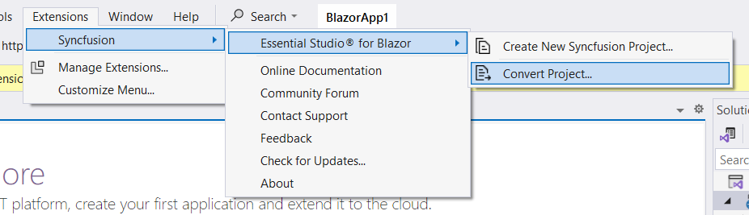
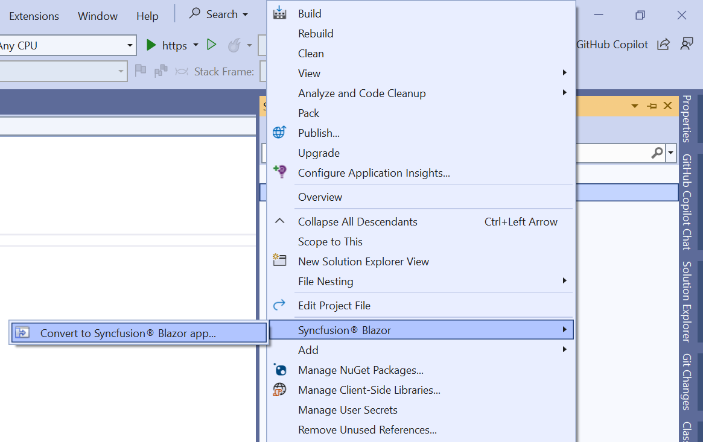
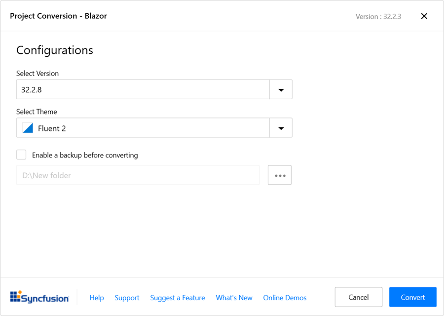
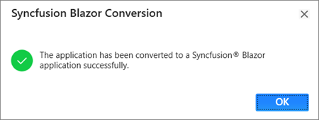

# Converting Blazor application to Syncfusion® Blazor application

The Syncfusion® Blazor project conversion is a Visual Studio add-in that transforms an existing Blazor application into a Syncfusion® Blazor application by installing the required NuGet packages and adding the corresponding theme styles to the layout.

The steps below describe how to convert a Blazor application to a Syncfusion® Blazor application using Visual Studio 2022.

N> Before using the Syncfusion® Blazor Project Conversion, verify that the Syncfusion® Blazor Template Studio extension is installed in Visual Studio (Extensions -> Manage Extensions -> Installed). If the extension is not installed, install it by following the instructions in the [download and installation](download-and-installation) help topic.

1. Open the existing Blazor application or create a new Blazor application in Visual Studio 2022.

2. Open the Syncfusion® Project Conversion wizard using one of the following options:

    **Option 1:**

    Choose **Extensions -> Syncfusion® -> Essential Studio® for Blazor -> Convert Project...** from the Visual Studio menu.

    

    **Option 2:**

    In **Solution Explorer**, right-click the project, select **Syncfusion® Blazor**, and then choose **Convert to Syncfusion® Blazor application...**

    

3. In the Syncfusion® Blazor Project Conversion window, select the required Syncfusion® Blazor version and theme to apply to the application.

    

    N> Versions are loaded from the Syncfusion® Blazor NuGet packages available on NuGet.org and require an active internet connection.

4. Select the **Enable a backup before converting** checkbox to create a project backup, and then choose the backup location.

5. After the conversion completes, a confirmation message is displayed.

    

    If a backup was enabled, the original project is saved to the specified backup path after conversion, as shown below.

    

6. The selected Blazor application is converted to a Syncfusion® Blazor application by installing the appropriate Syncfusion® Blazor NuGet packages for the chosen version and adding the selected theme styles to the project’s layout file. Static web assets are used where applicable.

7. If using a trial setup or packages from NuGet.org, a Syncfusion® license key must be registered with the application. Syncfusion® introduced license registration starting with the 2018 Volume 2 (v16.2.0.41) Essential Studio® release. Refer to the [licensing overview and key generation guide](https://help.syncfusion.com/common/essential-studio/licensing/overview#how-to-generate-syncfusion-license-key) to generate and register the Syncfusion® license key. For details about the licensing changes introduced in Essential Studio®, see the [2018 Volume 2 announcement](https://www.syncfusion.com/blogs/post/whats-new-in-2018-volume-2).