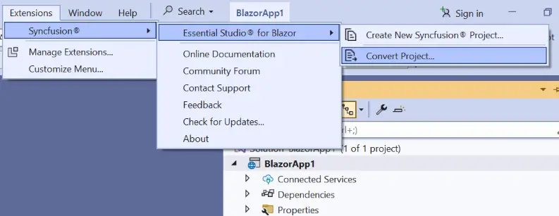
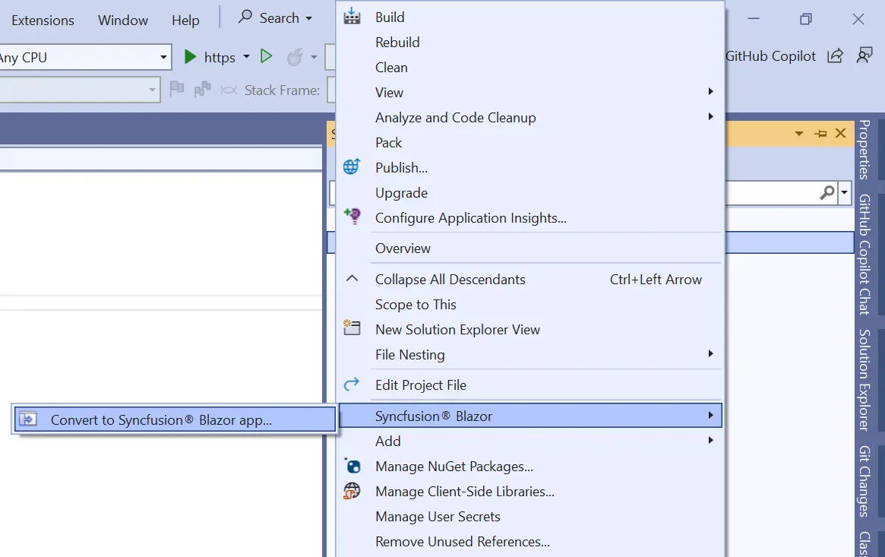
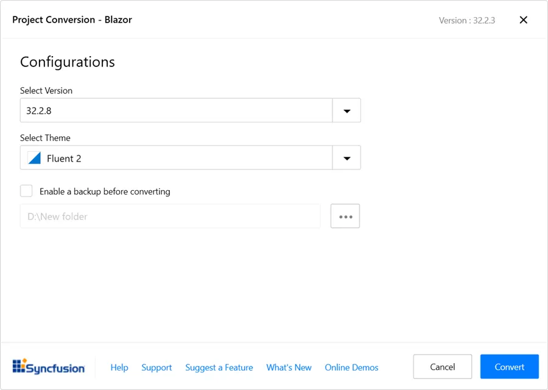
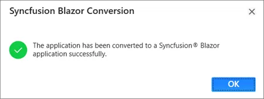
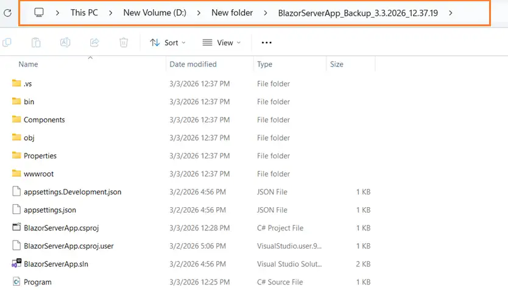

# Convert a Blazor Application to Syncfusion® Blazor

The Syncfusion&reg; Blazor conversion is a **Visual Studio** add-in that converts an existing Blazor application into a Syncfusion&reg; Blazor application by installing the required NuGet packages and adding the selected theme stylesheet to the project layout.

## Steps to Convert the Application

Use the following steps to convert an existing Blazor application to a Syncfusion&reg; Blazor application in **Visual Studio 2022** or **Visual Studio 2026**:

N> Before using the Syncfusion® Blazor Project Conversion, verify that the Syncfusion® Blazor Template Studio extension is installed in Visual Studio (Extensions -> Manage Extensions -> Installed). If the extension is not installed, install it by following the instructions in the [download and installation](https://blazor.syncfusion.com/documentation/visual-studio-integration/download-and-installation) help topic.

1. Open the existing Blazor application or create a new Blazor application in **Visual Studio 2022** or **Visual Studio 2026**.

    Supported application types:
    - Blazor Web App (Server or WebAssembly rendering)
    - Blazor Server App
    - Blazor WebAssembly App (standalone or ASP.NET Core hosted)
    - Blazor WebAssembly App (Progressive Web Application)

2. Open the Syncfusion® Project Conversion wizard using one of the following options:

    **Option 1:**

    Choose **Extensions -> Syncfusion® -> Essential Studio® for Blazor -> Convert Project...** from the Visual Studio menu.

    

    **Option 2:**

    In Solution Explorer, right-click the project, select **Syncfusion® Blazor**, then choose **Convert to Syncfusion® Blazor application...**

    

3. In the Syncfusion® Blazor Project Conversion window, select the desired Syncfusion® Blazor version and the preferred theme to apply to the application.

     

     N> Versions are loaded from the Syncfusion® Blazor NuGet packages available on [NuGet.org](https://www.nuget.org/) and require an active internet connection.

4. (Optional) Select **Enable a backup before converting** to create a backup of the original project and choose a backup location.

5. After conversion completes, a confirmation message is displayed.

    

    If a backup was created, the original project will be saved to the specified backup path.

    

6. After conversion completes, the application is configured with the required Syncfusion® Blazor NuGet packages and the selected theme stylesheet.

7. If using trial setup or NuGet packages from `nuGet.org`, register the Syncfusion® license key in the application. Syncfusion® introduced license registration in the 2018 Volume 2 (v16.2.0.41) Essential Studio® release. See the [licensing overview and key generation guide](https://help.syncfusion.com/common/essential-studio/licensing/overview#how-to-generate-syncfusion-license-key) to generate and register Syncfusion® license key. For details about the licensing changes introduced in Essential Studio®, see the [2018 Volume 2 announcement](https://www.syncfusion.com/blogs/post/whats-new-in-2018-volume-2).