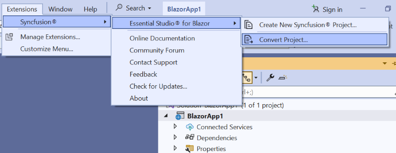

# Converting Blazor application to Syncfusion® Blazor application

The Syncfusion® Blazor conversion is a Visual Studio add-in that transforms an existing Blazor application into a Syncfusion® Blazor application by adding the necessary assemblies and theme files.

The steps below help you to convert the **Blazor application** to the **Syncfusion® Blazor application** via the **Visual Studio 2022**:

N> Before use the Syncfusion® Blazor Project Conversion, check whether the Syncfusion® Blazor Template Studio Extension installed or not in Visual Studio Extension Manager by clicking on the Extensions -> Manage Extensions -> Installed. If this extension not installed, install the extension by follow the steps from the [download and installation](download-and-installation) help topic.

1. Open your existing Blazor application or create a new Blazor application in Visual Studio 2022.

2. To open the Syncfusion® Project Conversion Wizard, follow either one of the options below:

    **Option 1:**

    Choose **Extensions -> Syncfusion® -> Essential Studio® for Blazor -> Convert Project...** in the Visual Studio menu.

    

    **Option 2:**

    Right-click the application from the **Solution Explorer** and select the **Syncfusion® Blazor** and choose the **Convert to Syncfusion® Blazor application...**

    

3. The Syncfusion® Blazor Project Conversion window will appear. You can choose the required version of Syncfusion® Blazor and Themes to convert the application.

    

    N> The versions are loaded from the Syncfusion® Blazor NuGet packages published in [`NuGet.org`](https://www.nuget.org/packages?q=Tags%3A%22blazor%22syncfusion) and it requires internet connectivity.

4. Check the **“Enable a backup before converting”** checkbox if you want to take the project backup and choose the location.

5. Once the conversion process has been completed, you will get a successful message window.

    

    If you enabled project backup before converting, the old application was saved in the specified backup path location, as shown below once the conversion process completed.

    

6. The selected Blazor application is converted into a Syncfusion® Blazor application by installing the appropriate Syncfusion&reg; Blazor NuGet packages with the selected version and adding the chosen styles to the corresponding layout file.

7. If you installed the trial setup or NuGet packages from nuget.org you must register the Syncfusion® license key to your application since Syncfusion® introduced the licensing system from 2018 Volume 2 (v16.2.0.41) Essential Studio® release. Navigate to the [help topic](https://help.syncfusion.com/common/essential-studio/licensing/overview#how-to-generate-syncfusion-license-key) to generate and register the Syncfusion® license key to your application. Refer to this [blog](https://www.syncfusion.com/blogs/post/whats-new-in-2018-volume-2) post for understanding the licensing changes introduced in Essential Studio®.