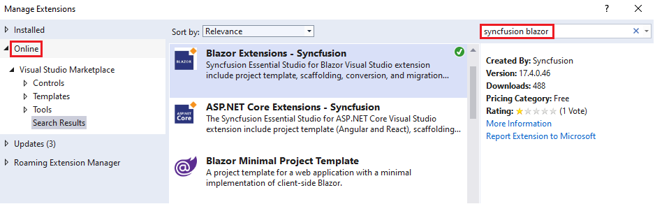
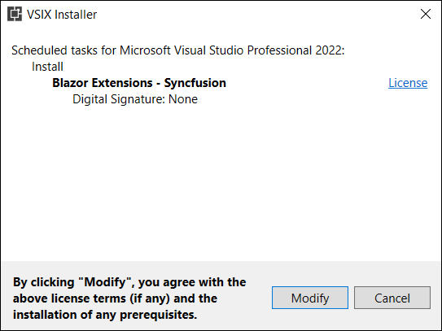
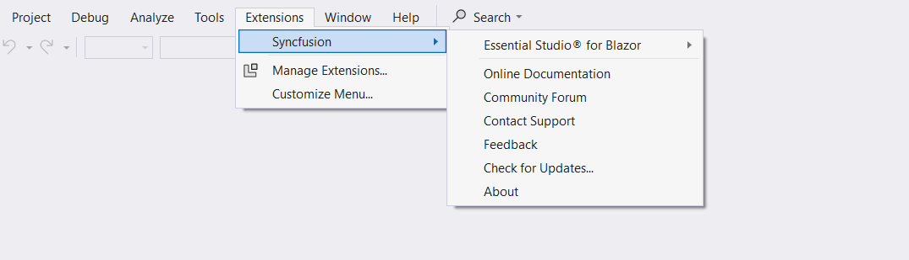
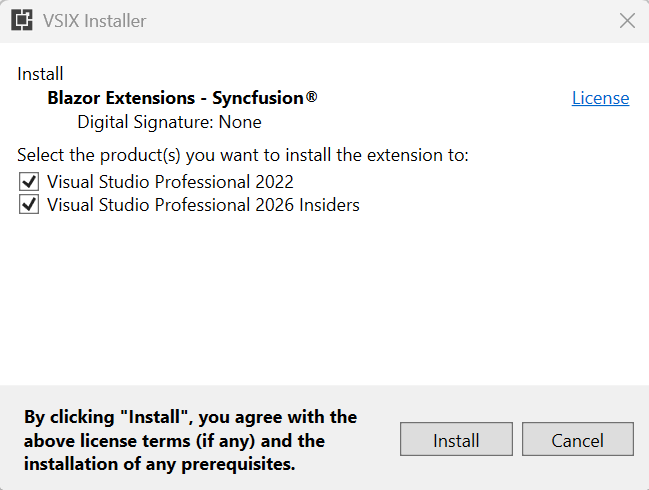

# Download and installation

Syncfusion&reg; publishes the Visual Studio extension in the Visual Studio Marketplace. Install it directly from Visual Studio or download and install it from the Visual Studio Marketplace.

[Download the Visual Studio 2026 extension](https://marketplace.visualstudio.com/items?itemName=SyncfusionInc.BlazorVSExtension)

## Prerequisites

The following software is required to install the Syncfusion&reg; Blazor extension and to create projects, add snippets, convert, and upgrade Syncfusion&reg; Blazor applications.

* [Visual Studio 2026](https://visualstudio.microsoft.com/downloads/).

* [.NET 10.0 SDK](https://dotnet.microsoft.com/en-us/download/dotnet).

* [.NET 9.0 SDK](https://dotnet.microsoft.com/en-us/download/dotnet).

* [.NET 8.0 SDK](https://dotnet.microsoft.com/en-us/download/dotnet).

## Install through Visual Studio Manage Extensions

The following steps describe how to install the Syncfusion&reg; Blazor extension from **Manage Extensions** in Visual Studio.

1. Open Visual Studio 2026.

2. Navigate to **Extensions -> Manage Extensions** to open the Manage Extensions window.

3. In the **Online** tab, search for **Syncfusion Blazor**.

    

4. Click **Download** for the **Syncfusion Blazor Template Studio** extension.

5. Close all Visual Studio instances to begin the installation process. A VSIX installation prompt appears.

    

6. Click **Modify**.

7. After the installation is complete, open Visual Studio.

8. In the **Extensions** menu, access the Syncfusion&reg; extensions in Visual Studio.

    

## Install from the Visual Studio Marketplace

The following steps illustrate how to download and install the Syncfusion&reg; Blazor extension from the Visual Studio Marketplace.

1. Download the Syncfusion&reg; Blazor extension from the Visual Studio Marketplace.

   [Download the Visual Studio 2026 extension](https://marketplace.visualstudio.com/items?itemName=SyncfusionInc.BlazorVSExtension)

2. Close all Visual Studio instances running, if any.

3. Double-click the downloaded VSIX file to install. In the VSIX Installer, select the Visual Studio instance(s) to install the extension.

    

4. Click the **Modify** button.

5. After installation completes, open Visual Studio. The Syncfusion&reg; extensions are available under the **Extensions** menu.

     
