# Syncfusion® Blazor scaffolding

Use the Syncfusion<sup style="font-size:70%">&reg;</sup> Scaffolder to quickly create data-driven pages and services for Blazor. The Scaffolder generates controller/service classes and Razor pages wired to your project's data model and Syncfusion<sup style="font-size:70%">&reg;</sup> Blazor components saving time on routine tasks like data binding, CRUD wiring, and component configuration.

## Prerequisites

- Visual Studio 2022 or 2026 with the Syncfusion<sup style="font-size:70%">&reg;</sup> Blazor Template Studio extension installed. See [download and installation](download-and-installation) if it is not installed.
- .NET 8.0, .NET 9.0, or .NET 10.0 SDK.
- A Blazor project that targets a Syncfusion<sup style="font-size:70%">&reg;</sup> Blazor NuGet package version compatible with the current Visual Studio extension.

N> Ensure your project includes at least one Entity Framework Core model and that the solution builds successfully. If you do not have a model, see [Microsoft's EF Core documentation](https://learn.microsoft.com/en-us/ef/core/) for creating models. After adding or modifying model properties, rebuild the project before running scaffolding.

N> The Syncfusion<sup style="font-size:70%">&reg;</sup> Blazor Scaffolder requires Essential Studio<sup style="font-size:70%">&reg;</sup> v17.4.0.39 or later for Blazor Server projects and v18.4.0.39 or later for Blazor WebAssembly (client) projects.

## Add a scaffolded item

Follow these steps to add a scaffolded item to a Blazor application using the Visual Studio extension.

N> Verify that the Syncfusion<sup style="font-size:70%">&reg;</sup> Blazor Template Studio extension is installed in Visual Studio (Extensions → Manage Extensions → Installed). See the [download and installation](download-and-installation) topic if it is not installed.

1. Open the appropriate folder for your project type in Solution Explorer, right-click it, and choose **Add → New Scaffolded Item...**:

     - **Blazor Web App**: right-click the **Components/Pages** folder.
     - **Blazor Server App**: right-click the **Pages** folder.

     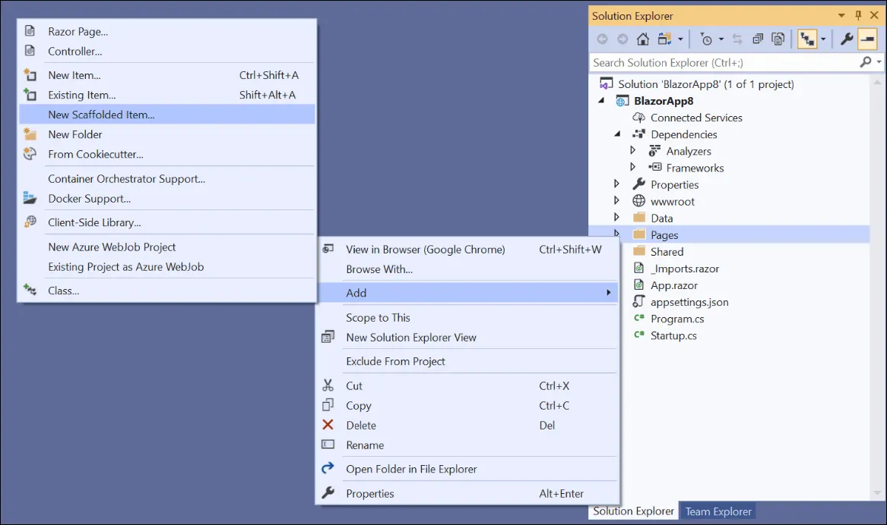

     - **Blazor Hosted (ASP.NET Core) WebAssembly App**: right-click the **Controllers** folder under **{Project Name}.Server**.

     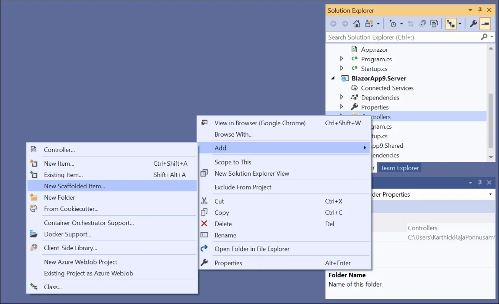

2. In the **Add New Scaffolded Item** dialog, choose **Syncfusion Blazor Scaffolder** and click **Add**.

     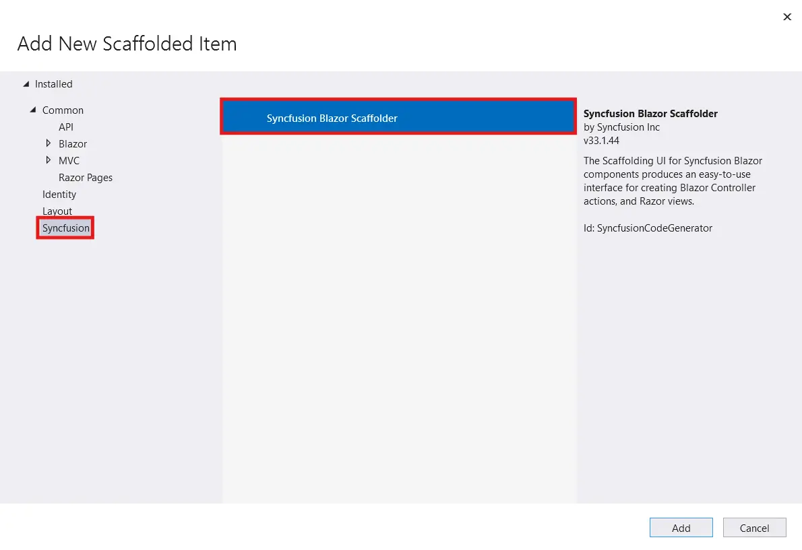

3. In the Syncfusion<sup style="font-size:70%">&reg;</sup> UI Scaffolder dialog, pick the control you want to scaffold and click **Next**.

     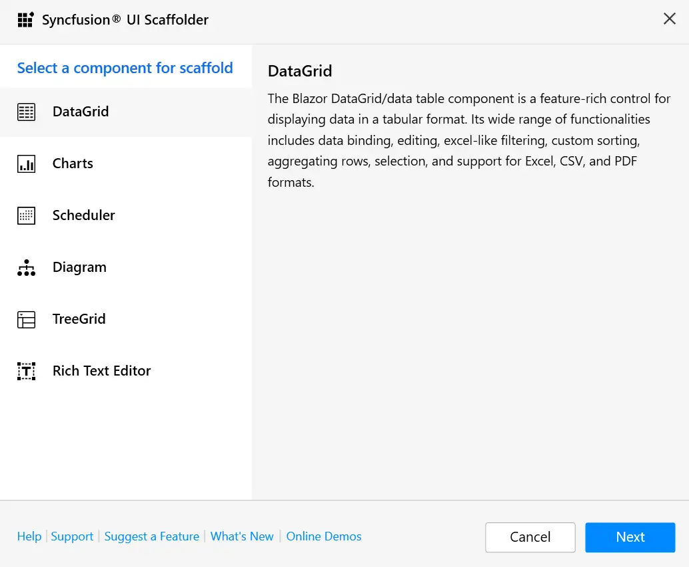

4. Configure the data source and code generation options.

     Select Data Source Type:

     - Local data (default)

         Enter **Controller/Service name** and **Razor page name**, then select the **Model class** and **DbContext**. Click **Next** to continue.

         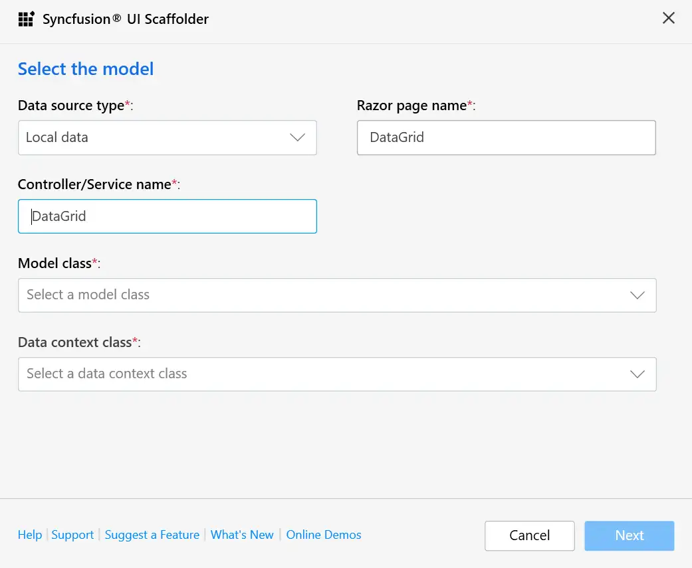

        N> Adaptor types are available in Blazor scaffolding for remote data.

     - Remote data

         - Enter the **Razor page name**.
         - Choose an **Adaptor type** (for example, `UrlAdaptor`, `WebApiAdaptor`, `ODataAdaptor`).
         - Provide a valid **URL** to your data endpoint.
         - Specify the **TValue** (the model type, for example `Order`).
         - Click **Next** to continue.

         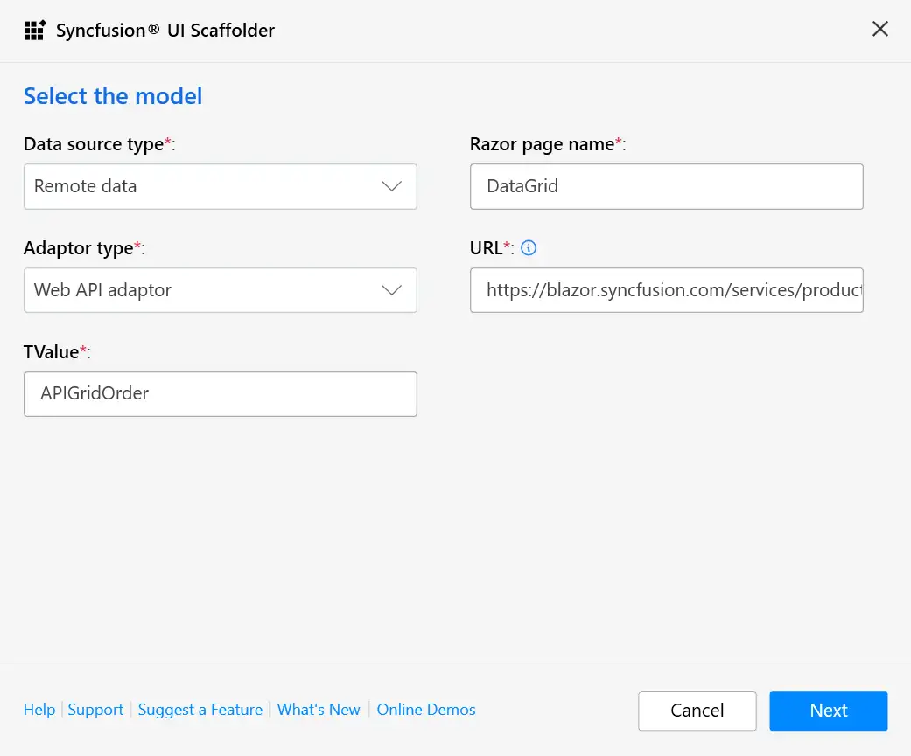

         When you choose the URL adaptor for DataGrid or TreeGrid, a **Remote service** option appears. Select either:

         - **Localhost URL** — provide a controller or service name and a model and DbContext.
         - **API URL** — enter a valid endpoint and `TValue`.

         The Scaffolder provides sample adaptor links for demonstration only; these placeholders do not perform CRUD operations. To enable real CRUD, supply a working backend endpoint that implements the required operations.

5. In the feature dialog for the selected control, choose the fields and options you want, then click **Add**. The available fields and options vary by control; refer to the control-specific user guide for details.

     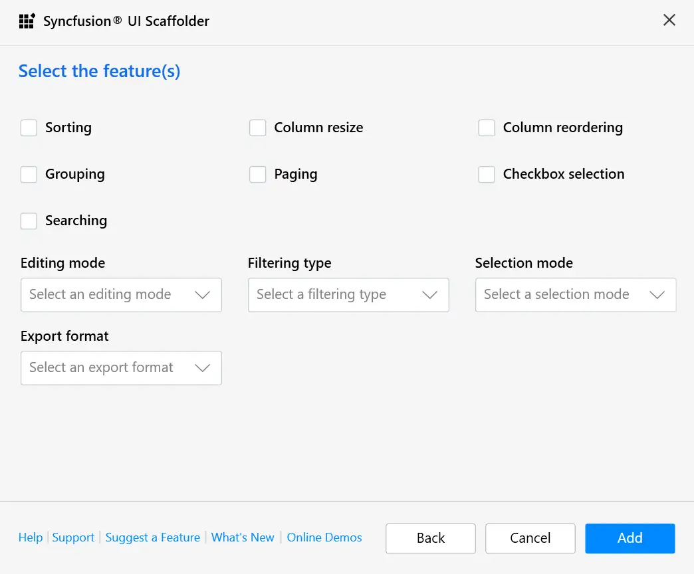

6. The Scaffolder generates the controller or service and the corresponding Razor files based on your selections.

     - For Local data, both service and Razor files are added:

         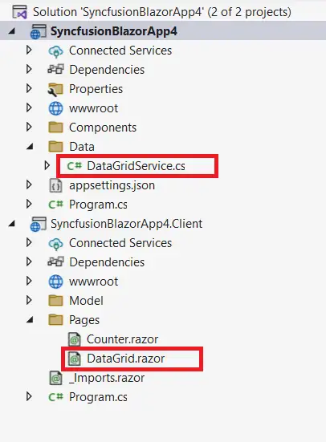

     - For Remote data using Localhost URL, the controller and Razor files are added:

         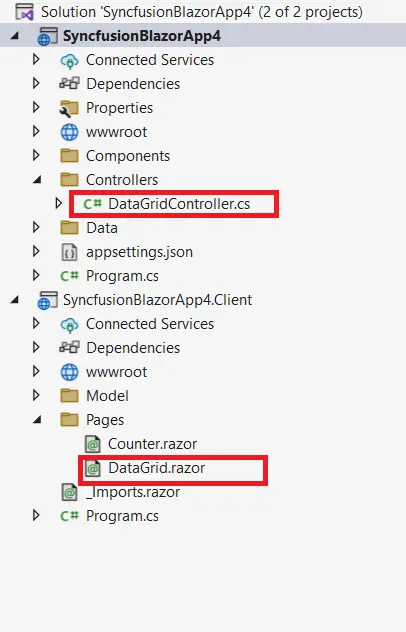

     - For Remote data with a Web API adaptor, the Razor page is added (the API must be present to enable full CRUD):

         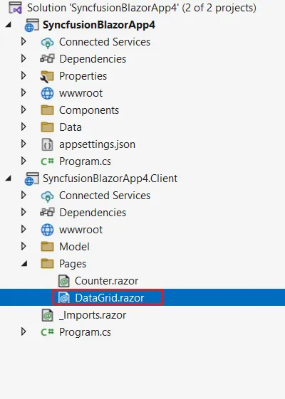

7. Add navigation to the generated Razor page so it is reachable from your app's UI. For example, open `NavMenu.razor` (Blazor Server/Web App) or `NavMenu.razor` in the **Layout** folder (Blazor WebAssembly) and add a `<NavLink>` entry that points to the new page route.

8. Licensing: If you used trial installers or NuGet packages from nuget.org, register your Syncfusion® license key. Licensing was introduced in Essential Studio® 2018 Volume 2 (v16.2.0.41). See the [help topic](https://help.syncfusion.com/common/essential-studio/licensing/overview#how-to-generate-syncfusion-license-key) to generate and register the key. For background on the licensing change, see this [blog post](https://www.syncfusion.com/blogs/post/whats-new-in-2018-volume-2).

## Syncfusion<sup style="font-size:70%">&reg;</sup> Blazor command-line scaffolding

The Syncfusion<sup style="font-size:70%">&reg;</sup> Blazor command-line scaffolding helps quickly add code that interacts with data models, reducing the time required to develop data operations. It simplifies creating view files and controller action methods for Syncfusion<sup style="font-size:70%">&reg;</sup> Blazor components such as DataGrid, Charts, Scheduler, Diagram, Tree Grid, Rich Text Editor, Document Editor, and PDF Viewer.

### Prerequisites

- .NET 8.0, .NET 9.0, or .NET 10.0 SDK installed.
- A Blazor project with a Syncfusion<sup style="font-size:70%">&reg;</sup> Blazor NuGet package referenced.

N> Verify that at least one Entity Framework model exists. If your application lacks an Entity Framework model, see [Microsoft's EF Core documentation](https://learn.microsoft.com/en-us/ef/core/) to create one. After you add the model file, double-check that the necessary DbContext and properties are present. Build the application before running scaffolding. If you change model properties, rebuild the application before performing scaffolding.

## Install command-line scaffolding

Install the **syncfusion.scaffolding** tool globally using the following command.

   ```dotnet tool install -g syncfusion.scaffolding```

Verify the installation by running `dotnet tool list -g` and confirming that `syncfusion.scaffolding` appears in the list.

## Update command-line scaffolding

Update the **syncfusion.scaffolding** tool globally using the following command.

   ```dotnet tool update -g syncfusion.scaffolding```

## Add a scaffolded item from the command line

The following steps describe how to add a scaffolded item from the command line to a Blazor application.

N> Before adding a scaffolded item from the command line, verify that the **dotnet-aspnet-codegenerator** tool is installed by running `dotnet tool list -g`. If it is not installed, install it globally with `dotnet tool install -g dotnet-aspnet-codegenerator`.

1. After installing the syncfusion.scaffolding tool, run the `syncfusion_scaffold` command to view available components.

    **syncfusion_scaffold**

    

2. To add a scaffolded item from the command line, use the following syntax.

    **syncfusion_scaffold [control][arguments]**

    | Parameter                         | Description                                                                   | Control             |
    |-----------------------------------|-------------------------------------------------------------------------------|---------------------|
    | -p&#124;--project                 | Path to .csproj file in the project.                                          |  All Controls       |
    | -cname&#124;--controller-filename | Name of controller file to be added in project.                               | All controls        |
    | -vname&#124;--view-filename       | Name of view file to be added in project.                                     | All Controls        |
    | -m&#124;--model                   | Database model name with namespace (example: WebApplication1.Models.Tasks).   | All Controls        |
    | -dc&#124;--db-context             | DbContext name with namespace (example: WebApplication1.Models.TasksContext). | All Controls        |
    | -pkey&#124;--primary-key          | Name of the column to use as the primary key (for example, `TaskId`).         | Data Grid/Tree Grid |
    | -tid&#124;--treegrid-id           | Name of the column that uniquely identifies a node (for example, `TaskId`).   | Tree Grid           |
    | -pid&#124;--parent-id             | Name of the column that holds the parent reference (for example, `ParentId`). | Tree Grid/Diagram   |
    | -x&#124;--x-axis                  | X-axis of Chart                                                               | Charts              |
    | -Y&#124;--Y-axis                  | Y-axis of Chart                                                               | Charts              |
    | -sid&#124;--scheduler-id          | Id of Scheduler Event.                                                        | Scheduler           |
    | -stime&#124;--start-time          | Start Time of Scheduler Event.                                                | Scheduler           |
    | -etime&#124;--end-time            | End Time of Scheduler Event.                                                  | Scheduler           |
    | --is-all-day                      | Set IsALLDay for Scheduler Event.                                             | Scheduler           |
    | -did&#124;--diagram-id            | Id of Diagram layout.                                                         | Diagram             |

3. Running `syncfusion_scaffold [control]` displays the available parameters for the specified component.

    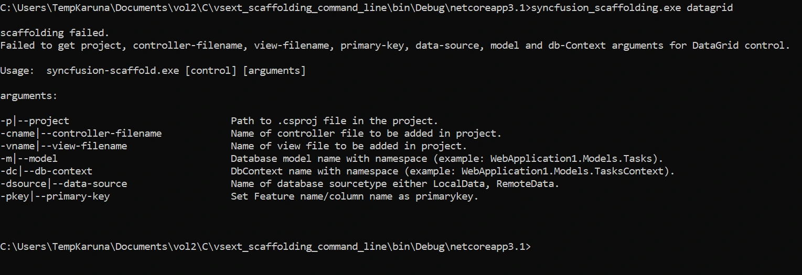

4. Run the following command to generate controller and view files from the command line by passing the required arguments for the specified component.

    ```syncfusion_scaffold {controlName} --project "{projectFileNamewithPath}" --model {model} -dc {dbContext} -cname {controllerName} -vname {viewName} [controlMandatoryParameter] [controlMandatoryParameterValue]```

    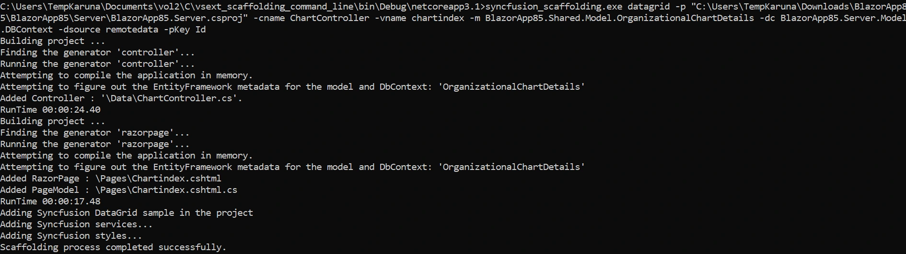

5. After generation, the controller and view files are created successfully, and the required Syncfusion<sup style="font-size:70%">&reg;</sup> NuGet packages and styles are added to render the component.

    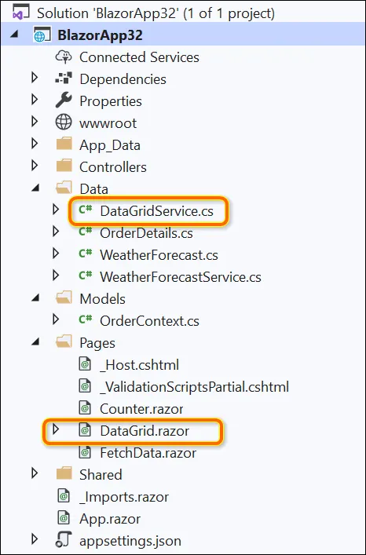

    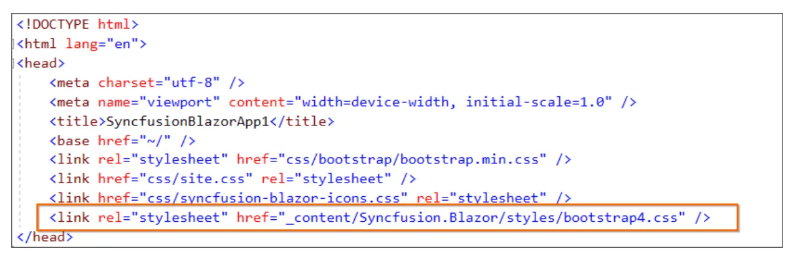

## How to render a Syncfusion<sup style="font-size:70%">&reg;</sup> component

<!-- markdownlint-disable MD026 -->

Refer to the following user guide links to render a Syncfusion<sup style="font-size:70%">&reg;</sup> component after scaffolding:

- Blazor WebAssembly App: [Configure Blazor components using the Syncfusion<sup style="font-size:70%">&reg;</sup> Blazor component NuGet package](https://blazor.syncfusion.com/documentation/getting-started/blazor-webassembly-visual-studio)
- Blazor Server App: [Configure Blazor components using the Syncfusion<sup style="font-size:70%">&reg;</sup> Blazor component NuGet package](https://blazor.syncfusion.com/documentation/getting-started/blazor-server-side-visual-studio)
- Blazor Web App: [Configure Blazor components using the Syncfusion<sup style="font-size:70%">&reg;</sup> Blazor component NuGet package](https://blazor.syncfusion.com/documentation/getting-started/blazor-web-app)
