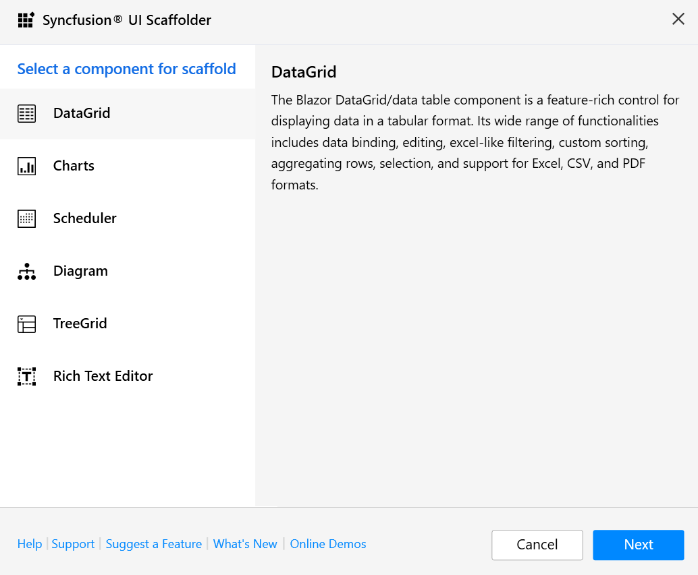
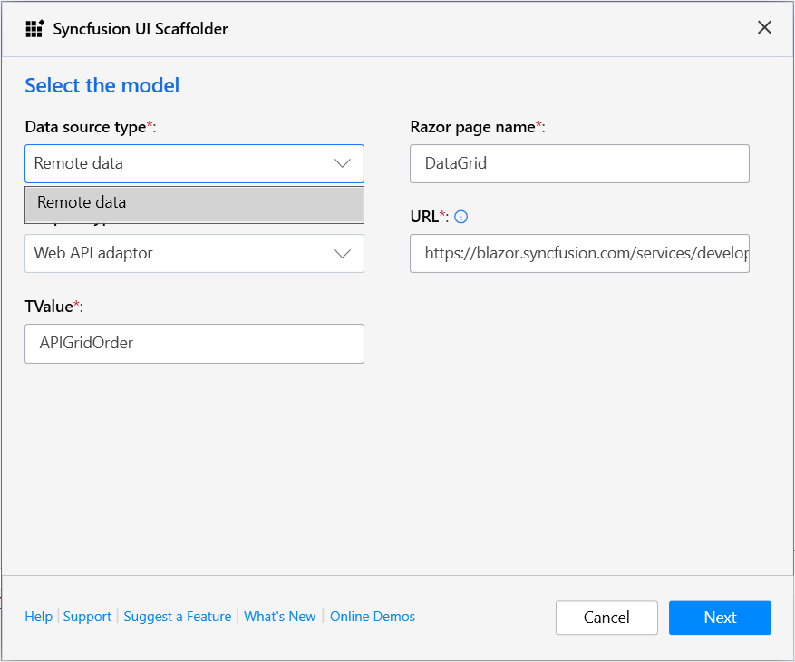

# Syncfusion® Blazor scaffolding

Syncfusion<sup style="font-size:70%">&reg;</sup> provides Visual Studio scaffolding for the Syncfusion<sup style="font-size:70%">&reg;</sup> Blazor platform to quickly add code that interacts with data models, reducing development time for data operations. Scaffolding simplifies creating Razor pages and controller action methods for Syncfusion<sup style="font-size:70%">&reg;</sup> Blazor components such as DataGrid, Charts, Scheduler, Diagram, Tree Grid, Rich Text Editor, Document Editor, and PDF Viewer.

N> Ensure that at least one Entity Framework Core model exists and that the application has been built once. If a model does not exist, see the Microsoft documentation for creating an [Entity Framework Core model](https://learn.microsoft.com/en-us/ef/core/modeling/). After adding the model, verify that the required DbContext and properties are present. Build the application before running scaffolding. If model properties change, rebuild the application before scaffolding again.

<!-- markdownlint-disable MD026 -->

N> The Syncfusion<sup style="font-size:70%">&reg;</sup> Blazor Scaffolder is available from `v17.4.0.39` for Blazor Server applications and includes support for Blazor WebAssembly (client) applications starting with `v18.4.0.39`.

## Add a scaffolded item

The following steps describe how to add a scaffolded item to a Blazor application.

N> Before using the Syncfusion<sup style="font-size:70%">&reg;</sup> Blazor scaffolding, verify that the Syncfusion<sup style="font-size:70%">&reg;</sup> Blazor Template Studio extension is installed in Visual Studio (Extensions -> Manage Extensions -> Installed). If it is not installed, follow the steps in the [download and installation](download-and-installation) topic.

1. For a **Blazor Server** application, right-click the **Pages** folder in Solution Explorer, select **Add**, and then choose **New Scaffolded Item...**

    

    If the application type is **Blazor Hosted**, right-click the **Controllers** folder from **{Project Name}.Server** application in the Solution Explorer, click **Add**, and then select **New Scaffolded Item...**.

    

2. In the **Add New Scaffolded Item** dialog, select **Syncfusion Blazor Scaffolder** and then click **Add**.

    

3. In the Syncfusion<sup style="font-size:70%">&reg;</sup> UI Scaffolder dialog, select the desired component to scaffold, and then click **Next**.

    

4. The Syncfusion<sup style="font-size:70%">&reg;</sup> UI Scaffolder dialog for the selected component appears. Follow these steps to configure the application.

    **Select Data Source Type**
    
    1. Local data (default)

        To use local data, enter the **Controller/Service name** and the **Razor page name**. Then select the required **Model class** and the corresponding **Data context class**. Click **Next** to continue.

        

        N> Adaptor types are available in Blazor scaffolding for remote data.

    2. Remote data

        To use remote data, enter the **Razor page name**, choose an **Adaptor type**, and provide a valid **URL**. Then specify the **TValue**. Click **Next** to continue.

        N> In the DataGrid and TreeGrid controls, when selecting the **URL adaptor** in the **Adaptor type**, an additional **Remote service** option will appear. You need to select either the **Localhost URL** or **API URL**. If you select the Localhost URL, enter the **Controller/Service** name. Then, select the required Model class for the active application and choose the relevant **Data context class**. Finally, click **Next** to continue. If you select the **API URL**, enter the valid **URL**. Next, enter the **TValue**. Finally, click **Next** to continue.

        

        When using adaptor types in Blazor scaffolding, it's important to note that we provide default adaptor links for sample purposes only. These default links are intended to help you understand how the adaptors work, but they do not perform CRUD (Add, Edit, Update, Delete) operations. Instead, these default links act as placeholders to demonstrate the integration process.

        To help you implement CRUD operations, we will provide sample code for reference. This code will guide you through the necessary steps to enable CRUD functionality in your application. You can modify and integrate this sample code to fit your specific requirements.

        However, if you wish to perform CRUD operations, you need to provide a valid link that handles these operations. This link should point to an endpoint or service capable of managing the database operations required by your application. By providing this link, you ensure that your application can effectively interact with the back-end service to perform CRUD operations.

    For a **Blazor Server** application, both local data and remote data types are available.

    

    For a **Hosted Application**, only the remote data type is available.

    

5. In the Syncfusion<sup style="font-size:70%">&reg;</sup> UI Scaffolder, the dialog for the selected component features opens. Choose the required features, update the necessary data fields, and then click **Add**.

    

6. Based on the selected features, the **Controller/Service** file and the corresponding **Razor** files are generated.

    If **Local data** is selected, the service file and Razor file are added to the application.

    

    If **Remote data with Localhost URL** is selected, the controller file and Razor file are added to the application.

    

    If **Remote data with Web API adaptor** is selected, the Razor file is added to the application.

    

7. Then, add navigation to the created razor file based on your requirement to open on the webpage.

8. If you installed the trial setup or NuGet packages from nuget.org you must register the Syncfusion® license key to your application since Syncfusion® introduced the licensing system from 2018 Volume 2 (v16.2.0.41) Essential Studio® release. Navigate to the [help topic](https://help.syncfusion.com/common/essential-studio/licensing/overview#how-to-generate-syncfusion-license-key) to generate and register the Syncfusion® license key to your application. Refer to this [blog](https://www.syncfusion.com/blogs/post/whats-new-in-2018-volume-2) post for understanding the licensing changes introduced in Essential Studio®.

## Syncfusion<sup style="font-size:70%">&reg;</sup> Blazor command-line scaffolding

The Syncfusion<sup style="font-size:70%">&reg;</sup> Blazor command-line scaffolding helps quickly add code that interacts with data models, reducing the time required to develop data operations. It simplifies creating view files and controller action methods for Syncfusion<sup style="font-size:70%">&reg;</sup> Blazor components such as DataGrid, Charts, Scheduler, Diagram, Tree Grid, Rich Text Editor, Document Editor, and PDF Viewer.

N> Verify that at least one Entity Framework model exists. If your application lacks an Entity Framework model, use this [documentation](https://www.freecodecamp.org/news/how-to-create-an-application-using-blazor-and-entity-framework-core-1c1679d87c7e/) to create one. After you've added the model file, double-check that the necessary DBContext and properties have been added. Now, build the application and experiment with scaffolding. If any changes made in the model properties, rebuild the application once before perform scaffolding.

## Install command-line scaffolding

Install the **syncfusion.scaffolding** tool globally using the following command.

   ```dotnet tool install -g syncfusion.scaffolding```

## Update command-line scaffolding

Update the **syncfusion.scaffolding** tool globally using the following command.

   ```dotnet tool update -g syncfusion.scaffolding```

## Add a scaffolded item from the command line

The following steps describe how to add a scaffolded item from the command line to a Blazor application.

N> Before adding a scaffolded item from the command line, verify that the **dotnet-aspnet-codegenerator** tool is installed by running `dotnet tool list -g`. If it is not installed, install it globally with `dotnet tool install -g dotnet-aspnet-codegenerator`.

1. After installing the syncfusion.scaffolding tool, run the `syncfusion_scaffold` command to view available components.

    **syncfusion_scaffold**

    

2. To add a scaffolded item from the command line, use the following syntax.

    **syncfusion_scaffold [control][arguments]**

    | Parameter                         | Description                                                                   | Control             |
    |-----------------------------------|-------------------------------------------------------------------------------|---------------------|
    | -p&#124;--project                 | Path to .csproj file in the project.                                          |  All Controls       |
    | -cname&#124;--controller-filename | Name of controller file to be added in project.                               | All controls        |
    | -vname&#124;--view-filename       | Name of view file to be added in project.                                     | All Controls        |
    | -m&#124;--model                   | Database model name with namespace (example: WebApplication1.Models.Tasks).   | All Controls        |
    | -dc&#124;--db-context             | DbContext name with namespace (example: WebApplication1.Models.TasksContext). | All Controls        |
    | -pkey&#124;--primary-key          | Set Feature name/column name as primary key.                                  | Data Grid/Tree Grid |
    | -tid&#124;--treegrid-id           | Id of Tasks.                                                                  | Tree Grid           |
    | -pid&#124;--parent-id             | Parent Id value                                                               | Tree Grid/Diagram   |
    | -x&#124;--x-axis                  | X-axis of Chart                                                               | Charts              |
    | -Y&#124;--Y-axis                  | Y-axis of Chart                                                               | Charts              |
    | -sid&#124;--scheduler-id          | Id of Scheduler Event.                                                        | Scheduler           |
    | -stime&#124;--start-time          | Start Time of Scheduler Event.                                                | Scheduler           |
    | -etime&#124;--end-time            | End Time of Scheduler Event.                                                  | Scheduler           |
    | --is-all-day                      | Set IsALLDay for Scheduler Event.                                             | Scheduler           |
    | -did&#124;--diagram-id            | Id of Diagram layout.                                                         | Diagram             |

3. Running `syncfusion_scaffold [control]` displays the available parameters for the specified component.

    

4. Run the following command to generate controller and view files from the command line by passing the required arguments for the specified component.

    ```syncfusion_scaffold {controlName} --project "{projectFileNamewithPath}" --model {model} -dc {dbContext} -cname {controllerName} -vname {viewName} [controlMantoryParameter] [controlMantatoryParameterValue]```

    

5. After generation, the controller and view files are created successfully, and the required Syncfusion<sup style="font-size:70%">&reg;</sup> NuGet packages and styles are added to render the component.

    

    

<!-- markdownlint-disable MD026 -->

## How to render a Syncfusion<sup style="font-size:70%">&reg;</sup> component

Refer to the following user guide links to render a Syncfusion<sup style="font-size:70%">&reg;</sup> component after scaffolding:

Blazor WebAssembly App: [Configure Blazor components using the Syncfusion<sup style="font-size:70%">&reg;</sup> Blazor component NuGet package](https://blazor.syncfusion.com/documentation/getting-started/blazor-webassembly-visual-studio)

Blazor Server App: [Configure Blazor components using the Syncfusion<sup style="font-size:70%">&reg;</sup> Blazor component NuGet package](https://blazor.syncfusion.com/documentation/getting-started/blazor-server-side-visual-studio)
