# Syncfusion® Blazor Template Studio

The Syncfusion<sup style="font-size:70%">&reg;</sup> Blazor Template Studio creates a new Syncfusion<sup style="font-size:70%">&reg;</sup> Blazor project preconfigured with required NuGet packages, theme styles, namespaces, and initial render code for the components you select. The Template Studio uses a step-by-step wizard so you can quickly scaffold an application with your choices for runtime, theme, authentication, and sample data.

N> The Syncfusion<sup style="font-size:70%">&reg;</sup> Blazor extensions for Visual Studio require Essential Studio<sup style="font-size:70%">&reg;</sup> versions 31.2.10 or later.

Quick start

1. Open Visual Studio 2022 or 2026.

2. Create a new Syncfusion Blazor project using one of these options:

    - Extension: **Extension → Syncfusion® → Essential Studio® for Blazor → Create New Syncfusion Project...**

      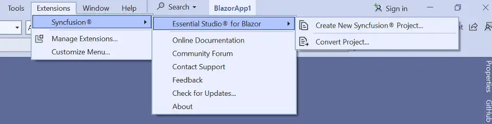

    - File: **File → New → Project**. In the New Project dialog, filter by **Syncfusion** or search for "Syncfusion" to find the Blazor templates.

      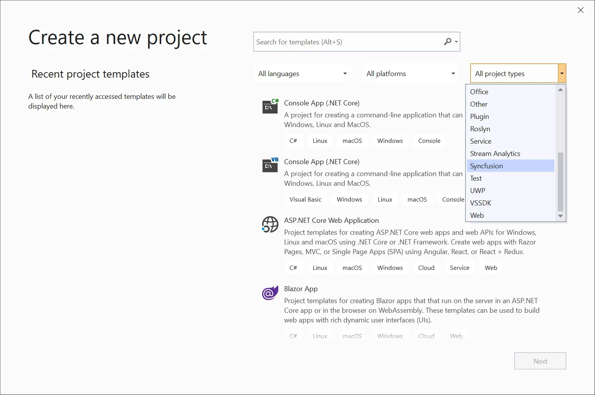

3. Select **Syncfusion® Blazor Template Studio** and click **Next**.

    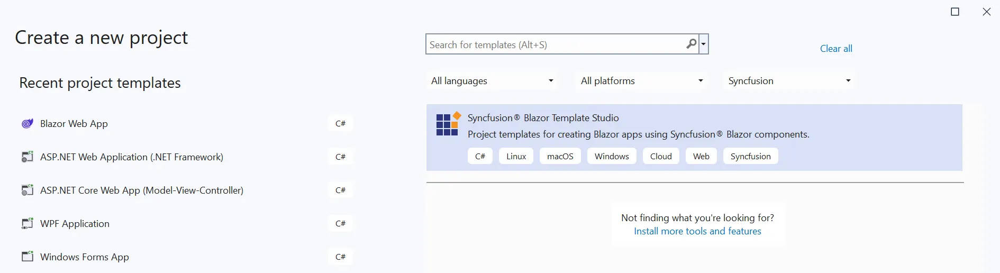

4. The Template Studio wizard opens. It guides you through Project Type, Controls, Features, and Configuration.

    > **Note:** Refer to the .NET SDK support for Syncfusion<sup style="font-size:70%">&reg;</sup> Blazor Components [here](https://blazor.syncfusion.com/documentation/system-requirements#net-sdk).

    Project type - choose a template that matches your installed .NET SDK.

    | .NET SDK version | Application type |
    | ---------------- | ---------------- |
    | [.NET 10.0](https://dotnet.microsoft.com/en-us/download/dotnet/10.0), [.NET 9.0](https://dotnet.microsoft.com/en-us/download/dotnet/9.0), [.NET 8.0](https://dotnet.microsoft.com/en-us/download/dotnet/8.0) | Syncfusion<sup style="font-size:70%">&reg;</sup> Blazor Web App |
    | [.NET 10.0](https://dotnet.microsoft.com/en-us/download/dotnet/10.0), [.NET 9.0](https://dotnet.microsoft.com/en-us/download/dotnet/9.0), [.NET 8.0](https://dotnet.microsoft.com/en-us/download/dotnet/8.0) | Syncfusion<sup style="font-size:70%">&reg;</sup> Blazor WebAssembly App |

    For the Blazor Web App type you can set Interactivity type (Server, WebAssembly, Auto) and Interactivity location (Global or per page/component).

    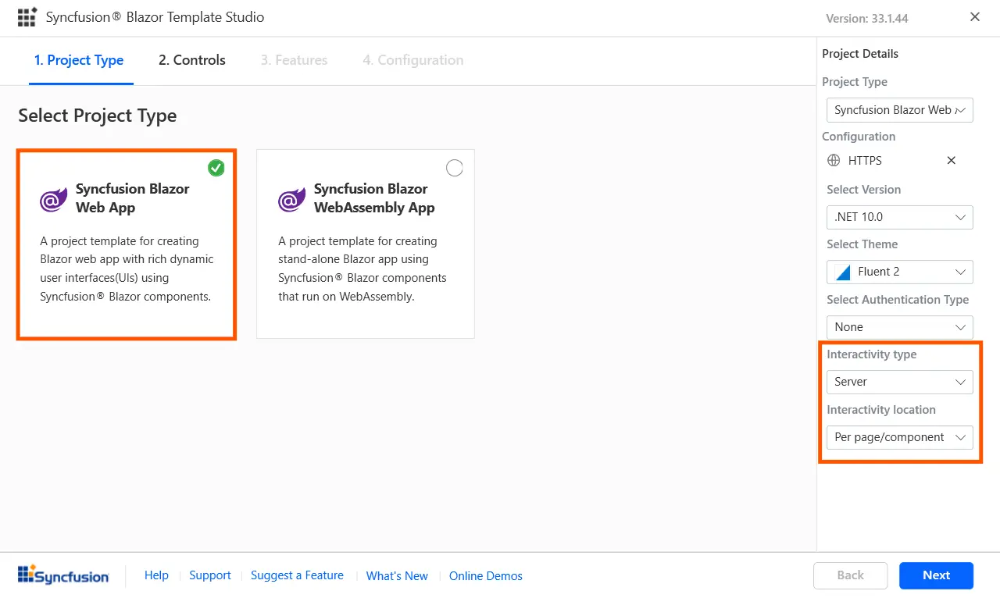

    For Blazor WebAssembly projects you can enable Progressive Web Application (PWA) where supported.

    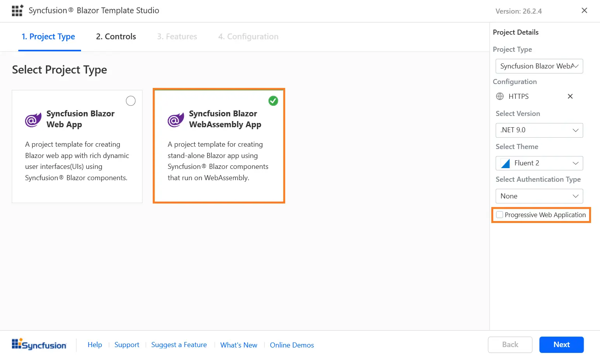

5. Click **Next** or open the **Controls** tab to pick the Syncfusion components to include in the project.

    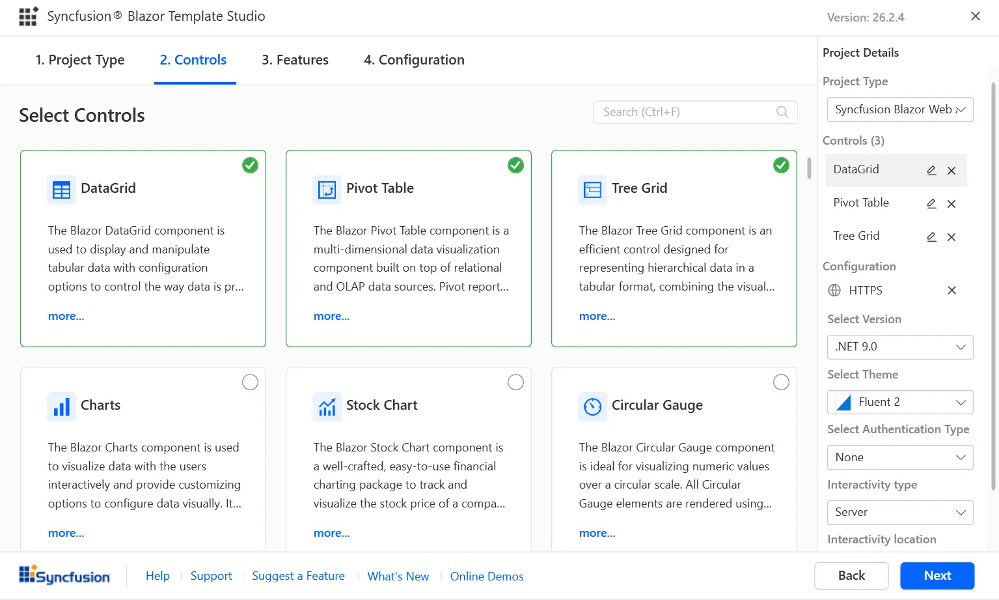

    Select at least one control to enable Features and Configuration options.

6. Use the **Features** tab to choose component features, and the **Configuration** tab to set target .NET, theme, HTTPS, localization, and authentication options.

    Supported authentication types depend on the application type:

    | Application type | Supported authentication types |
    | ---------------- | ------------------------------ |
    | Syncfusion<sup style="font-size:70%">&reg;</sup> Blazor Web App | None, Individual Accounts |
    | Syncfusion<sup style="font-size:70%">&reg;</sup> Blazor WebAssembly App | None, Individual Accounts, Microsoft Identity Platform |

    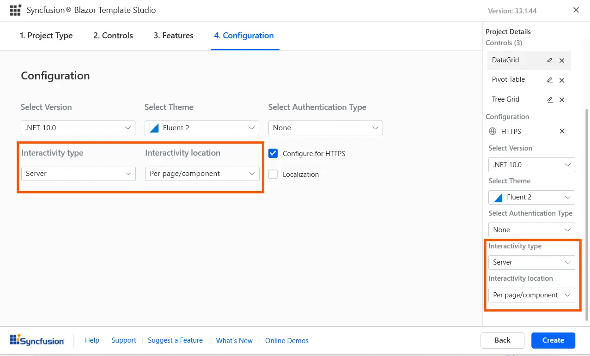
    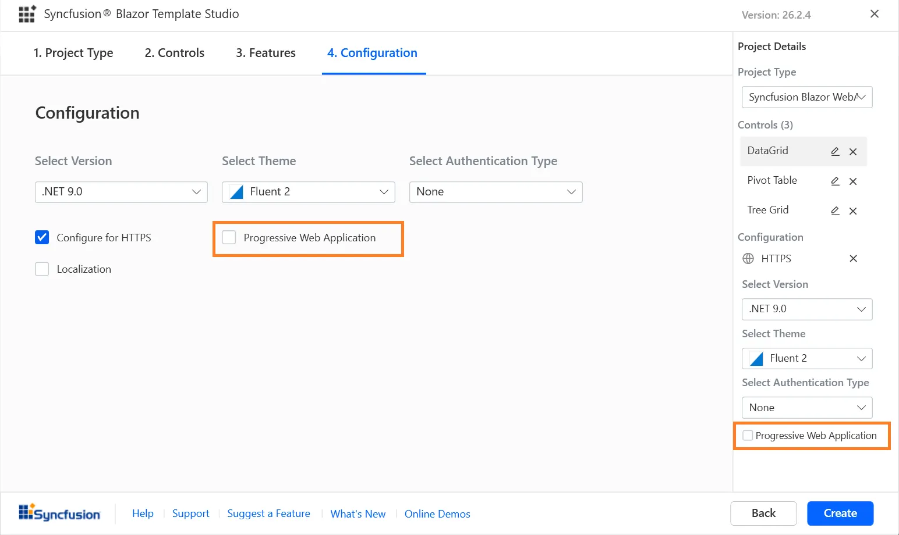

7. Review the **Project details** panel to modify selected controls or change configuration values.

    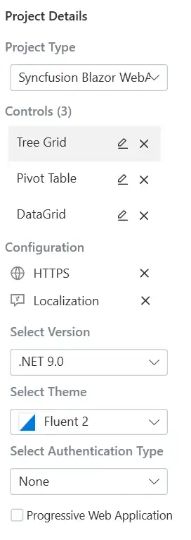

8. Click **Create**. Template Studio generates the project with the required Syncfusion NuGet packages, styles, namespaces, and initial component render code.

    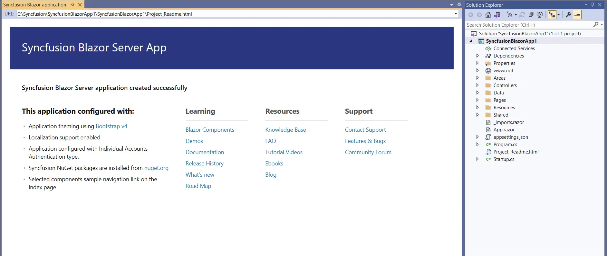

9. The created project contains the selected theme, package versions, authentication settings, and sample render code for the components you chose.

10. If you installed the trial setup or NuGet packages from nuget.org you must register the Syncfusion® license key to your application since Syncfusion® introduced the licensing system from 2018 Volume 2 (v16.2.0.41) Essential Studio® release. Navigate to the [help topic](https://help.syncfusion.com/common/essential-studio/licensing/overview#how-to-generate-syncfusion-license-key) to generate and register the Syncfusion® license key to your application. Refer to this [blog](https://www.syncfusion.com/blogs/post/whats-new-in-2018-volume-2.aspx) post for understanding the licensing changes introduced in Essential Studio®.

## Authentication Configuration

We need to register the created application in the Google API Console for Individual Accounts and in Azure Active Directory for the Microsoft Identity Platform. From the Google API Console registration, we can obtain the client ID for Individual Accounts. From the Azure Active Directory registration, we can obtain the tenant ID and application client ID for the Microsoft Identity Platform. We need to configure these ID values in the created applications; only then will the application run correctly with authentication support.

### Individual Accounts Authentication

#### Web Application and Progressive Web Application

1. Go to below credentials page for the Google cloud platform API console.

    <https://console.cloud.google.com/apis/credentials?project=aerobic-furnace-244104&pli=1>

2. Click Create Credentials and OAuth Client Id.

    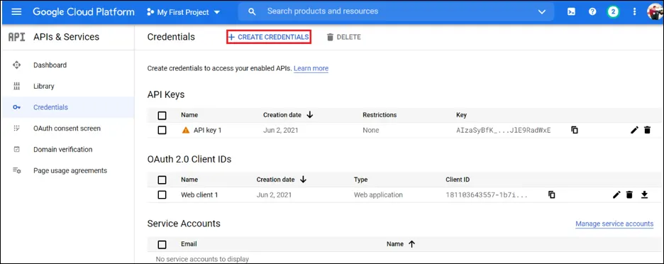

    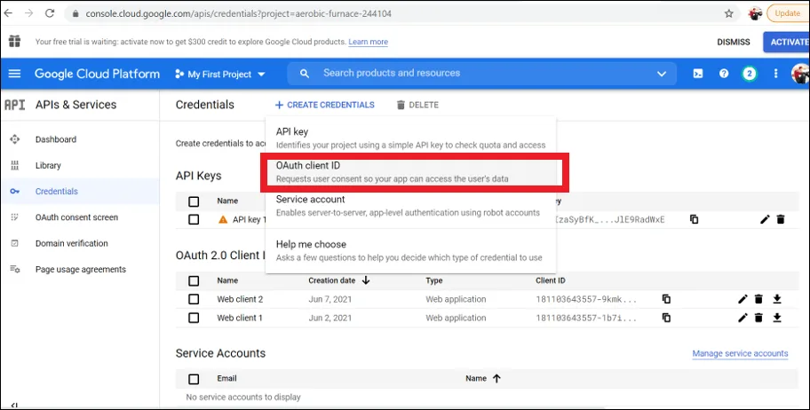

3. Select Application type as Web Application in client Id creation.

    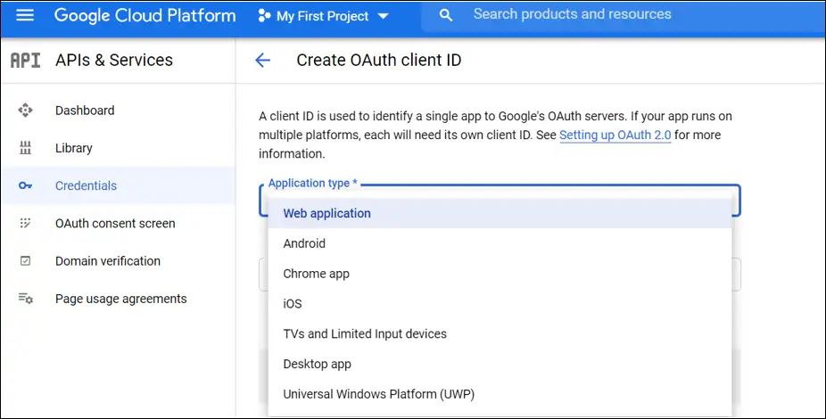

4. Add your publish URL link as an Authorized URI and login URL as Redirected URI.

    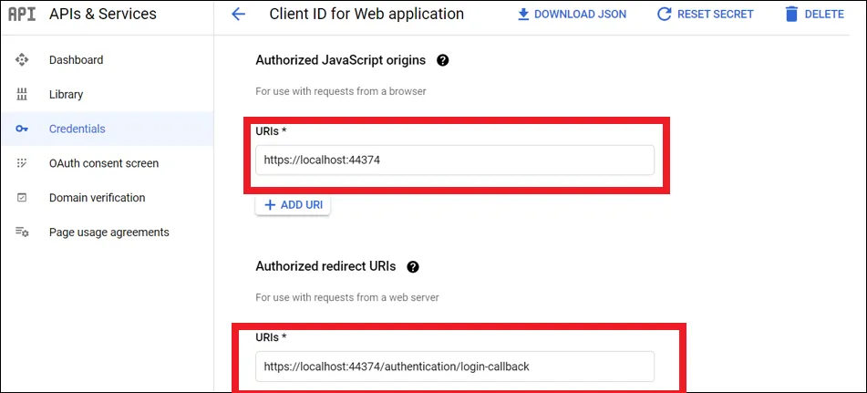

5. Click save then OAuth client id will be created and copy that credential.

    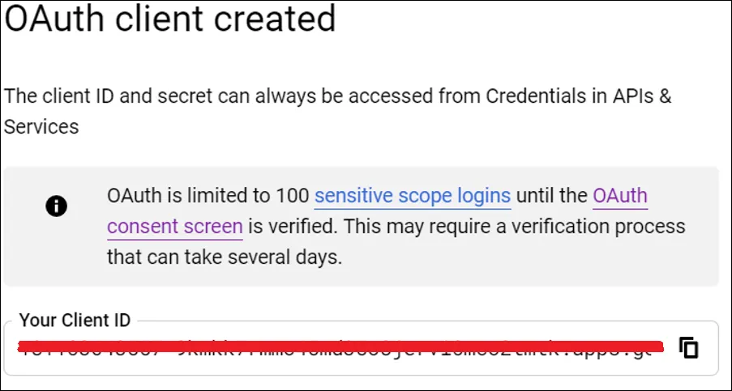

6. Add that Client Id, and RedirectUri in appsettings.json file of your application.

    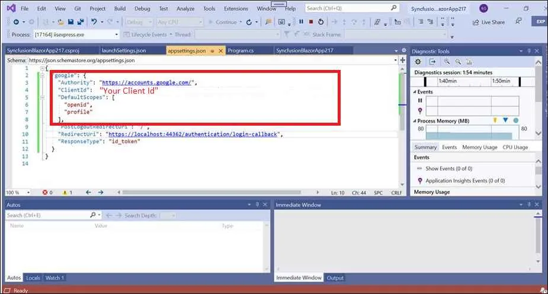

7. Change the build configuration bind as google from Local in program.cs file.

    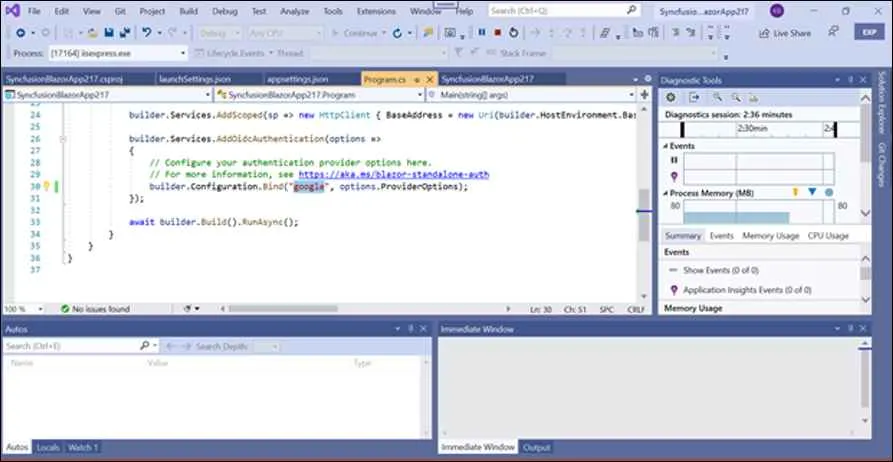

### Microsoft Identity Platform Authentication

#### Server Application

1. Go to below Azure Active Directory App Registration page.

    <https://portal.azure.com/#view/Microsoft_AAD_IAM/ActiveDirectoryMenuBlade/~/RegisteredApps>

2. Click New Registration in App Registration page.

    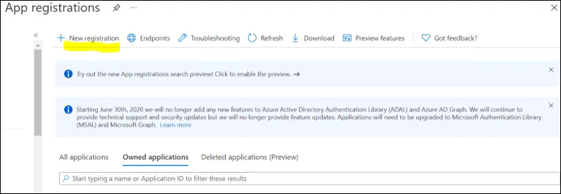

3. Give name of the application and selected supported type as single tenant.

    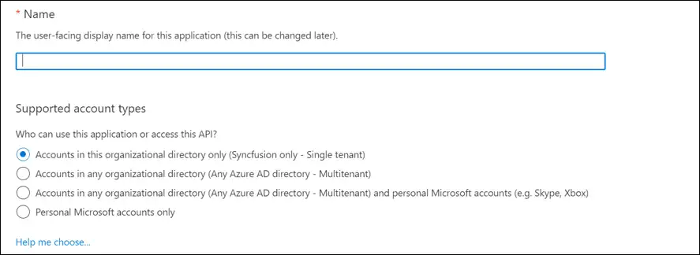

4. Dropdown the page, select platform as web and give your application Redirect URI like {Redirect URI}/signin-oidc and click Register.

    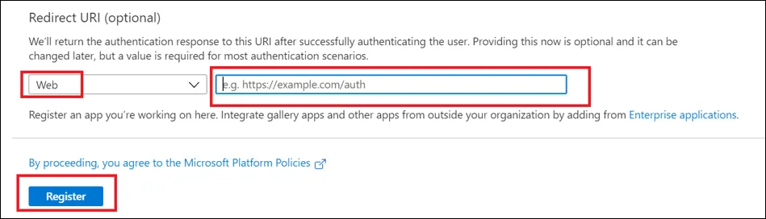

5. App will be registered, go to the Authentication page and tick Id token check box.

    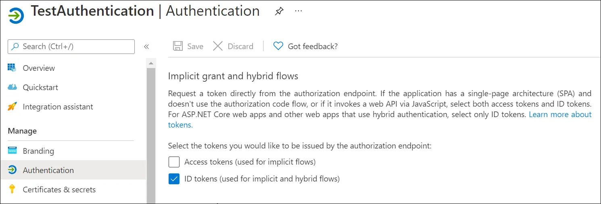

6. Get client tenant id and application id form overview page.

    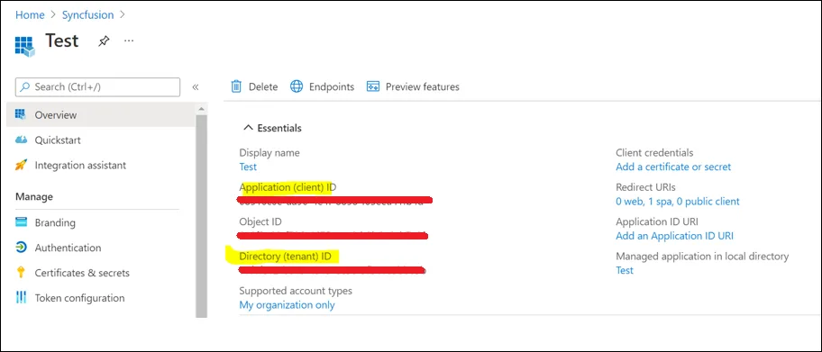

7. Configure those client tenant id, application id, and domain in your application appsettings.json file.

    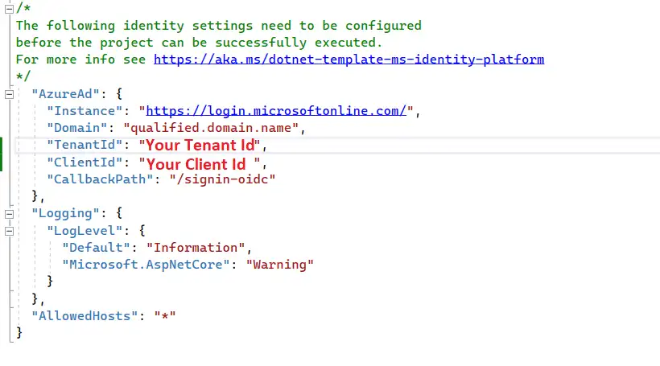

#### Web Application and Progressive Web Application

1. Go to below Azure Active Directory App Registration page.

    <https://portal.azure.com/#view/Microsoft_AAD_IAM/ActiveDirectoryMenuBlade/~/RegisteredApps>

2. Click New Registration in App Registration page.

    

3. Give name of the application and selected supported type as single tenant.

    

4. Dropdown the page, select platform as web and give your application Redirect URI and click Register.

    

5. App will be registered, go to the Authentication page and tick Access token an Id token check box.

    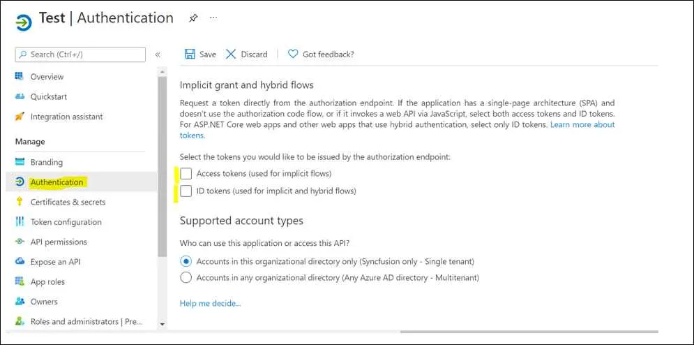

6. Migrate the API by clicking the highlighted arrow like in below image.

    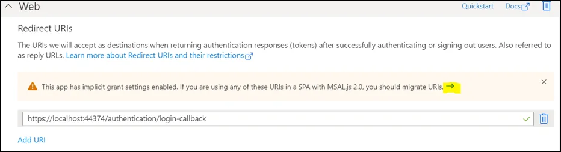

    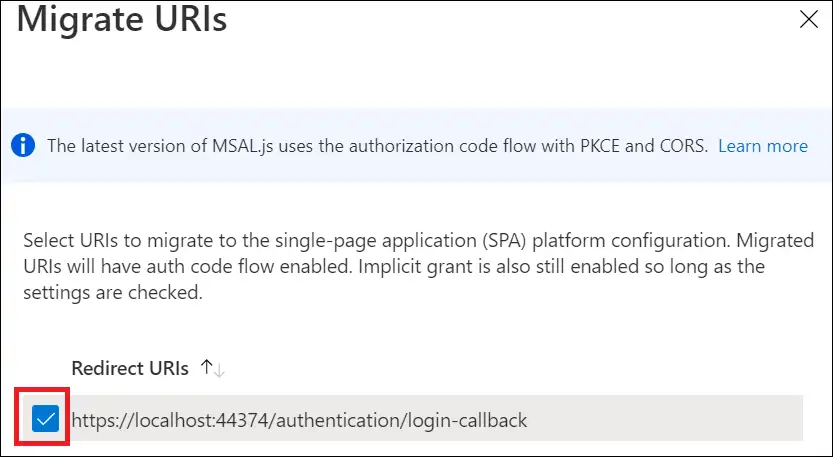

7. Get client tenant id and application id form overview page.

    

8. Configure those client tenant id and application id in your application appsettings.json file.

    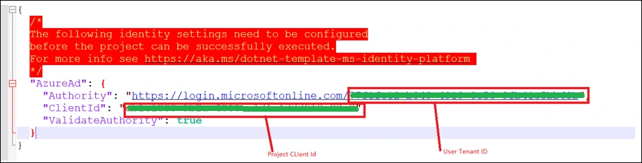

#### ASP.NET Core Hosted Web Application, and ASP.NET Core Hosted with Progressive Web Application

##### Client project Registration and Configuration

1. Go to below Azure Active Directory App Registration page.

    <https://portal.azure.com/#view/Microsoft_AAD_IAM/ActiveDirectoryMenuBlade/~/RegisteredApps>

2. Click New Registration in App Registration page.

    

3. Give name of the application and selected supported type as single tenant.

    

4. Dropdown the page, select platform as web and give your application Redirect URI and click Register.

    

5. App will be registered, go to the Authentication page and tick Access token an Id token check box.

    

6. Migrate the API by clicking the highlighted arrow like in below image.

    

    

7. Get client tenant id and application id form overview page.

    

8. Configure those client tenant id and application id in your application appsettings.json file.

    

##### Server project Registration and configuration

1. Go to below Azure Active Directory App Registration page.

    <https://portal.azure.com/#view/Microsoft_AAD_IAM/ActiveDirectoryMenuBlade/~/RegisteredApps>

2. Click New Registration in App Registration page.

    

3. Give name of the application and selected supported type as single tenant.

    

4. Dropdown the page, select platform as web and give your application Redirect URI and click Register.

    

5. App will be registered, go to the Authentication page and tick Access token an Id token check box.

    

6. Migrate the API by clicking the highlighted arrow like in below image.

    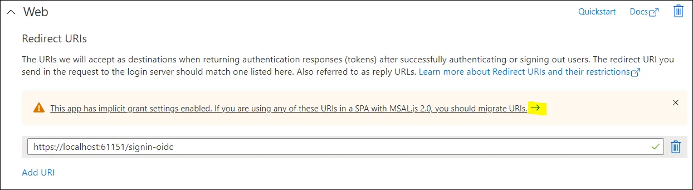

    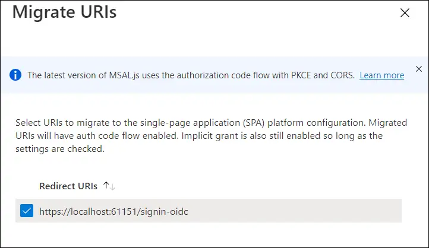

7. Add a scope API in Expose an API page.

    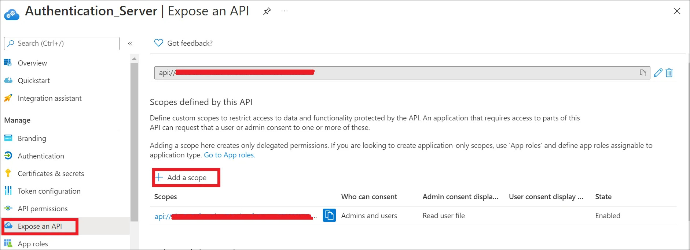

8. Give scope name, admin consent display name, and admin consent description and click Add scope. Scope API will be created, copy those scope API Value.

    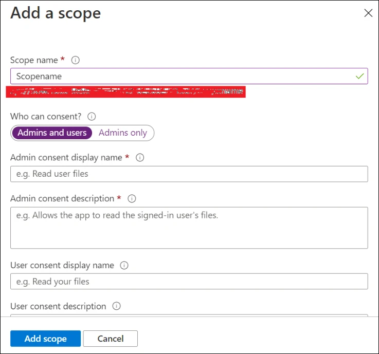

9. Get client tenant id and application id form overview page.

    

10. Configure those client tenant id, application id, added scope api id, and domain in your application appsettings.json file.

    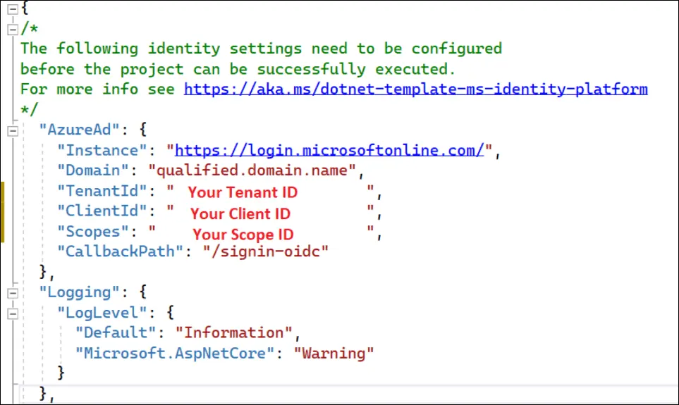

11. Configure the scope API in client application program.cs file below highlighted place.

    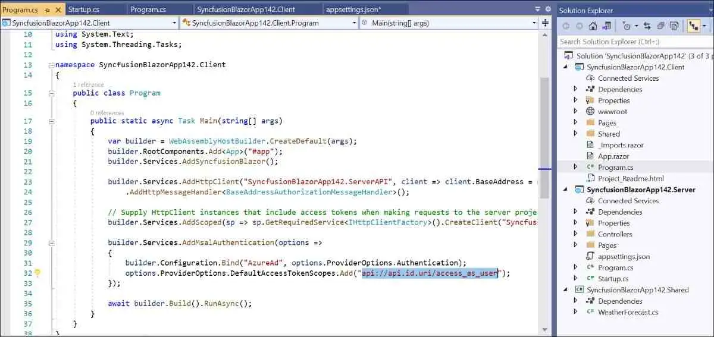

### Run application

You can run the application and see the Syncfusion® components you selected. Select a component to see component output.

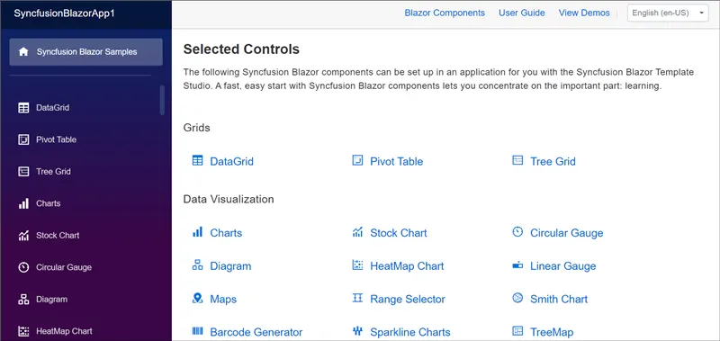

You can select a culture language in combo box at top right on the output page to apply the culture in the application.

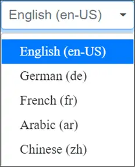

N> **Note:** Above culture combo box will be enabled in sample output if localization option is selected in configuration window from Syncfusion<sup style="font-size:70%">&reg;</sup> Blazor Template Studio wizard.

## Register and Login Application

### Individual Authentication

#### Blazor Web App

##### Applying Database Migrations and User Registration in the .NET 8.0, .NET 9.0 and .NET 10 Blazor Web App

##### Applying Database Migrations:

In the Blazor Web App, it's essential to apply pending migrations to the database before proceeding with user registration. Choose one of the following options:

**Option 1: Using Visual Studio Package Manager Console**
 
Navigate to **View -> Other Windows -> Package Manager Console** in Visual Studio.
 
Run the following command in the Package Manager Console:

   ```Update-Database```

**Option 2: Using Command Prompt**
 
Open a command prompt in your project directory and execute the following command:

   ```dotnet ef database update```

##### User Registration:

1.	Launch the application and register by submitting your email address and creating a password.

    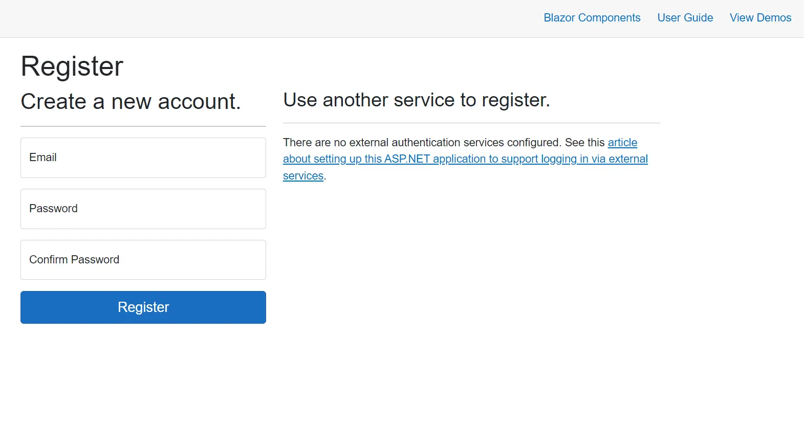

2.	Confirm your registration by clicking **Click here to confirm your account.**

    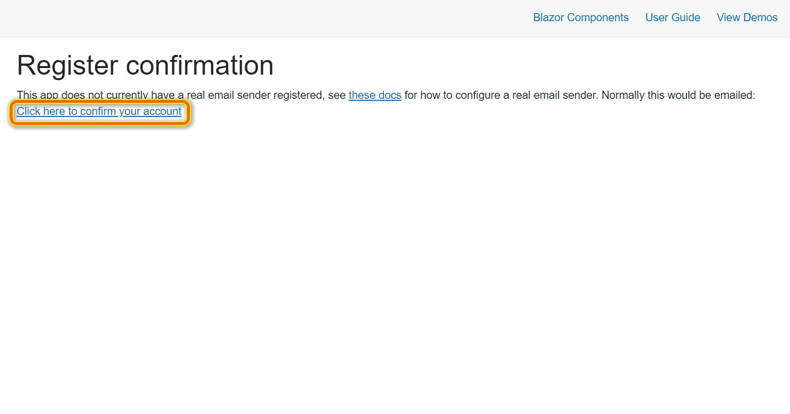

3.	Submit your registered email address and password to log in to the application.

    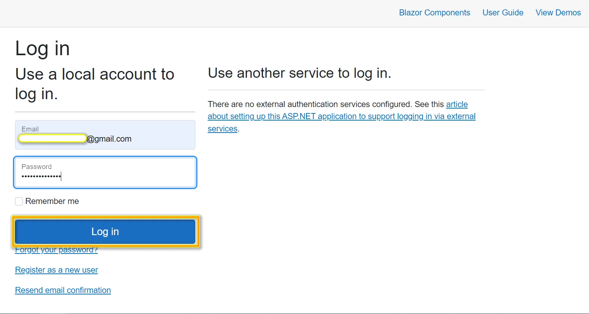

#### Server Application, ASP.NET Core hosted Web Application, and Progressive Web Application with ASP.NET Core hosted

1. For register the application, submit your email address and create a password.

    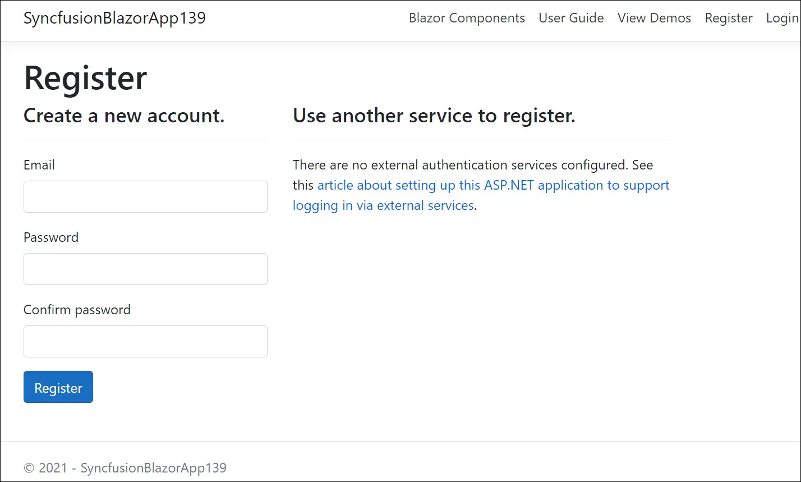

2. Confirming registration by clicking **Click here to confirm your account.**

    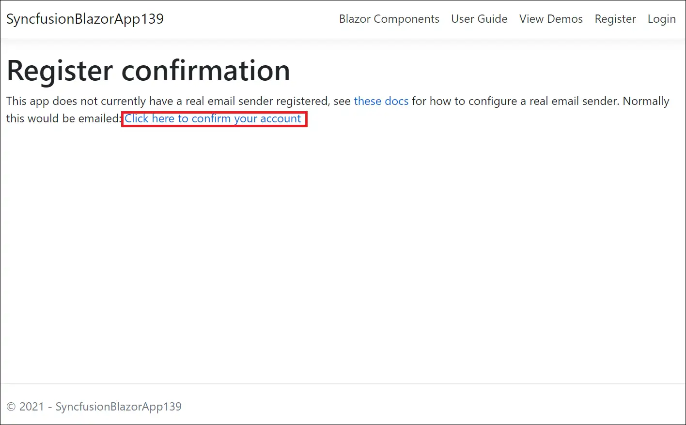

3. Submit your registered email address and password to login the application.

    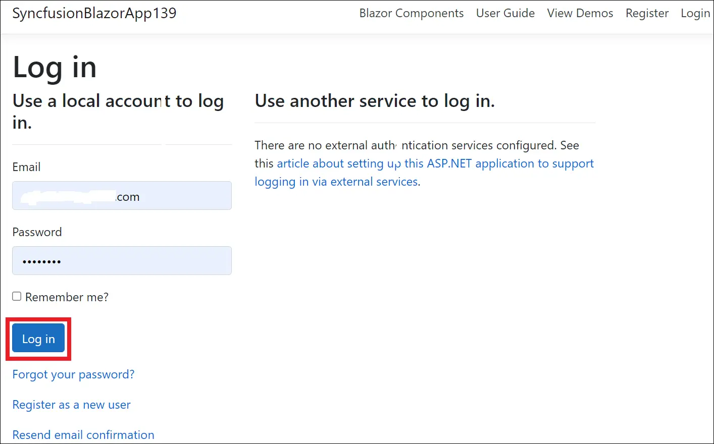

#### Web Application and Progressive Web Application

1. Login to the application using Gmail accounts.

    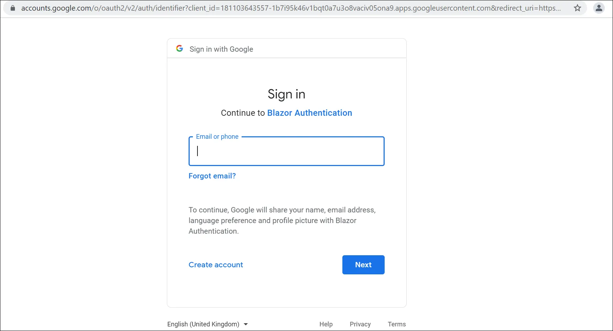

### Microsoft Identity Platform

#### Server Application, Web Application, Progressive Application, ASP.NET Core Hosted Web Application, and ASP.NET Core Hosted with Progressive Web Application

1. Login to your application using your Microsoft account.

2. Accept permission request of your application.

    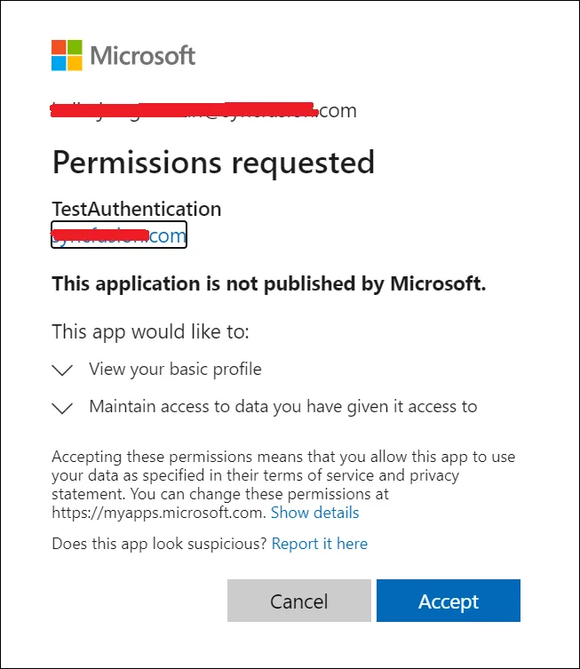

